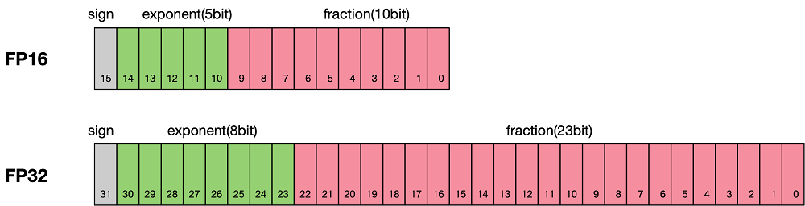

# Automatic Mixed Precision

[](https://atomgit.com/mindspore/docs/blob/master/docs/mindspore/source_en/features/amp.md)

Mixed precision training refers to an operation policy in which different numerical precisions are used for different operations of a neural network during training. In neural network operations, some operations are insensitive to numerical precision. In this case, using lower precision can achieve a significant acceleration effect (such as conv and matmul). For operations with a large difference between the input and output values, higher precision is required to ensure the correctness of the results (such as log and softmax).

## Mechanism

Floating-point data types include double-precision (FP64), single-precision (FP32), half-precision (FP16), and brain floating point (BF16). Each of them is represented by a sign bit, an exponent bit, and a floating-point bit. FP64 indicates that 8 bytes (64 bits) are used. FP32 indicates that 4 bytes (32 bits) are used. FP16 and BF16 indicate that 2 bytes (16 bits) are used. For details, see the following figure.



As shown in the figure, the storage space of FP16 is half of that of FP32. Similarly, the storage space of FP32 is half of that of FP64. Therefore, low-precision computing offers the following advantages:

- Reduced memory usage: The bit width of FP16 or BF16 is half of that of FP32. Therefore, the memory occupied by parameters such as the weight is also half of the original memory. The saved memory can be used to store larger network models or train more data.
- Higher computing efficiency: On special AI acceleration chips, such as Huawei Atlas training series products and Atlas 200/300/500 inference series products, or GPUs of the NVIDIA VOLTA architecture, FP16 and BF16 deliver faster operation performance than FP32.
- Higher communication efficiency: For distributed training, especially LLM training, the communication overhead restricts the overall performance. Using a smaller communication bit width can improve the communication performance, reduce the waiting time, and accelerate the data flow.

However, low-precision computing also encounters the following problems:

- Data overflow: The valid data range of FP16 is $[5.9\\times10^{-8},65504]$, and that of FP32 is $[1.4\\times10^{-45},1.7\\times10^{38}]$. It is evident that the valid range of FP16 is much narrower than that of FP32. Therefore, using FP16 to replace FP32 can lead to overflow or underflow. In deep learning, the gradient (first-order derivative) of a weight in a network model needs to be calculated. Therefore, the gradient is smaller than the weight value, and underflow often occurs.
- Rounding error: FP32 is sufficient for representing small backward gradients for network models. However, shifting to FP16 will result in an interval smaller than the current minimum interval, causing data overflow. For example, `0.00006666666` can be properly represented in FP32, but it will be represented as `0.000067` in FP16. Numbers beyond the minimum interval requirement of FP16 will be forcibly rounded off.

Therefore, when using mixed precision to accelerate training and save memory, you need to solve the problems introduced by low precision. Generally, mixed precision is used with loss scaling. When calculating the loss value, it scales out the loss by a certain multiple. According to the chain rule, the gradients are scaled out, and then scaled in by a corresponding multiple when the optimizer updates the weights, avoiding data underflow.

The following figure shows the typical mixed-precision computing process.


## Mixed Precision Usage Examples

```python
import mindspore
from mindspore import amp

loss_scaler = amp.DynamicLossScaler(scale_value=1024, scale_factor=2, scale_window=1000)
ori_model = Net()
# Enable automatic mixed precision.
model = amp.auto_mixed_precision(ori_model, amp_level="auto", dtype=mindspore.float16)
loss_fn = Loss()
optimizer = Optimizer()

# Build a feedforward network.
def forward_fn(data, label):
    logits = model(data)
    loss = loss_fn(logits, label)
    # Scale the loss.
    loss = loss_scaler.scale(loss)
    return loss, logits

# Generate a derivation function to calculate the feedforward propagation result and gradient of a given function.
grad_fn = mindspore.value_and_grad(forward_fn, None, model.trainable_params(), has_aux=True)

# Build a training function.
def train_step(data, label):
    (loss, _), grads = grad_fn(data, label)
    # Unscale the loss to the actual loss.
    loss = loss_scaler.unscale(loss)
    # Check whether the gradient does not overflow.
    is_finite = amp.all_finite(grads)
    if is_finite:
        # If the gradient does not overflow, unscale it to the actual gradient.
        # After unscaling the gradient, you can perform operations such as clipping and penalty on the gradient.
        grads = loss_scaler.unscale(grads)
        # Update the model parameters using the optimizer.
        optimizer(grads)
    # Dynamically update the value of loss_scaler.
    loss_scaler.adjust(is_finite)
    return loss

# Build a data iterator.
train_dataset = Dataset()
train_dataset_iter = train_dataset.create_tuple_iterator()

for epoch in range(epochs):
    for data, label in train_dataset_iter:
        # Start training and obtain the loss.
        loss = train_step(data, label)
```

For more details about automatic mixed precision, see [amp.auto_mixed_precision](https://www.mindspore.cn/docs/en/master/api_python/amp/mindspore.amp.auto_mixed_precision.html).
