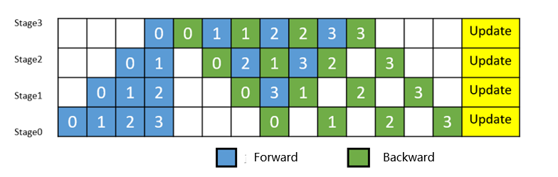
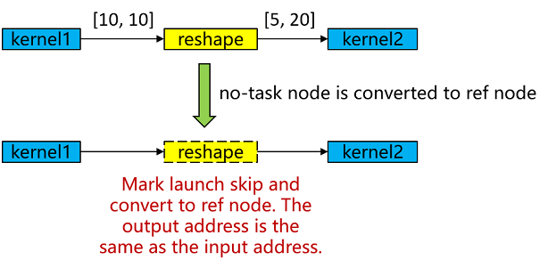
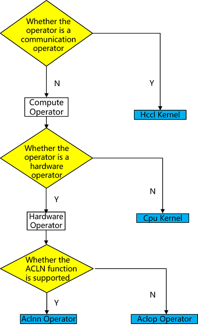

# mindspore.jit Multi-Level Compilation Optimization

[](https://gitee.com/mindspore/docs/blob/r2.7.0/docs/mindspore/source_en/features/compile/compilation_guide.md)

## MindSpore Compilation Architecture

MindSpore utilizes jit (just-in-time) for performance optimization. The jit mode converts Python code to intermediate representation graphs (IR, Intermediate Representation) through AST tree parsing, Python bytecode parsing, or code execution tracing. We name it MindIR. The compiler optimizes this IR graph to achieve code optimization and improve runtime performance. In contrast to PyNative Mode, this JIT compilation mode is called Graph Mode.

Python code written by developers runs in PyNative Mode mode by default. Functions can be decorated with the @mindspore.jit decorator to specify execution in Graph Mode. For documentation on the @mindspore.jit decorator, please refer to the [jit documentation](https://www.mindspore.cn/docs/en/r2.7.0/api_python/mindspore/mindspore.jit.html).

Graph Mode is roughly divided into 3 stages:

- Graph Capture (Graph Construction): Python code -> MindIR.
- Graph Optimization (Frontend): Hardware-independent optimization of MindIR, algebraic simplification, function inlining, redundancy elimination, etc.
- Graph Optimization (Backend): Hardware-dependent optimization of MindIR, LazyInline, operator selection, graph-operator fusion, etc.

## Graph Capture (Graph Construction)

MindSpore provides three capture methods as follows:

- AST: Converts executed functions to IR graphs through AST tree parsing
- bytecode (experimental): Parses Python bytecode to construct IR graphs as much as possible. Parts that cannot be converted to IR graphs will be executed according to dynamic graph
- trace (experimental): Constructs IR graphs by tracing the execution trajectory of Python code

Taking ast as an example: developers can choose `@mindspore.jit:(capture_mode="ast")` decorator to modify functions. Functions modified with ast mode have certain syntax restrictions. We provide two modes for developers to choose from.

- strict mode: The goal of this mode is to construct a single graph. If the developer's Python code cannot construct a graph, choosing this mode will cause an error when running the program, requiring the developer to modify the code to use graphable syntax. This is suitable for developers pursuing performance.
- lax mode: The goal of this mode is to make the developer's program runnable as much as possible. The idea is to perform Python fallback for code that cannot construct graphs in strict mode, that is, return to the Python layer for execution.

For Graph Mode constraints, please refer to [Syntax Constraints](https://www.mindspore.cn/tutorials/en/r2.7.0/compile/static_graph.html). Here's an example of how ast parses Python code and constructs graphs:

```python
@mindspore.jit
def foo(x, y):
    z = x + y
    return z
```

The corresponding abstract syntax tree is as follows:


By parsing the above abstract syntax tree, we obtain the following IR:

```text
%para1_x: <Tensor[Int64], ()>
%para2_y: <Tensor[Int64], ()>

subgraph instance: foo
subgraph @foo() {
  %0(CNode_17) = PrimFunc_Add(%para1_x, %para2_y)
      : (<Tensor[Int64], ()>, <Tensor[Int64], ()>) -> (<Tensor[Int64], ()>)
  Return(%0)
      : (<Tensor[Int64], ()>)
}
```

**Advantages of ast**:

- Using ast mode gives users stronger programming autonomy and more precise performance optimization. They can tune network performance to optimal based on function characteristics and usage experience.

**Limitations of ast**:

- Functions decorated with ast must strictly follow static graph syntax for internal programming.

**recommendations for ast mode**:

- Compared to dynamic graph execution, functions decorated with `@mindspore.jit` need to consume certain time for compilation on the first call. In subsequent calls to this function, if the original compilation result can be reused, the original compilation result will be used directly for execution. Therefore, using the `@mindspore.jit` decorator to modify functions that will be executed multiple times usually obtains more performance benefits.

- The runtime efficiency advantage of Graph Mode is reflected in its global compilation optimization of functions decorated with `@mindspore.jit`. The more operations contained in the function, the greater the optimization space. Therefore, functions decorated with `@mindspore.jit` are best large code blocks containing many operations, rather than many fragmented functions containing only a few operations separately marked with jit tags. Otherwise, it may lead to no performance benefits or even degradation.

- Most calculations and optimizations are based on optimization of Tensor calculations. It is recommended that decorated functions should be used for real data calculation functions, rather than simple scalar calculations or data structure transformations.

- For functions decorated with `@mindspore.jit`, if their inputs contain constants, changes in input values each time will cause recompilation. For the concept of variable constants, please refer to [Constants and Variables in Just-in-Time Compilation](https://www.mindspore.cn/tutorials/en/r2.7.0/compile/static_graph.html). Therefore, it is recommended that decorated functions take Tensors or data modified by Mutable as input to avoid additional performance loss caused by multiple compilations.

## Graph Optimization (Frontend)

Similar to traditional compilation optimization techniques, compilation optimization in MindSpore is also completed through individual Passes. Each Pass takes the MindIR produced by the previous Pass as input, and after optimization by this Pass, produces a new MindIR representation as output. A large Pass can contain multiple small Passes, each small Pass is only responsible for single-point compilation optimization, such as: algebraic simplification, function inlining, redundancy elimination, etc. The optimization result produced by one Pass may bring optimization opportunities for other Passes, so these Passes can be run in cycles until the produced MindIR no longer changes.

There are many frontend compilation optimization techniques, such as: algebraic simplification, function inlining, redundancy elimination, etc. Here we only introduce representative compilation optimization techniques.

### 1 Algebraic Simplification

In traditional compilers, algebraic simplification is a compiler optimization technique aimed at simplifying algebraic expressions in source code, eliminating redundant calculations, improving program execution efficiency, and reducing memory usage.

For example, in the following code snippet:

```cpp
int a = x * 1;
int b = x + 0;
int c = x * 0 + y * 1;
```

Traditional compilers perform equivalent replacement of identified expressions according to algebraic rules and identities. Common algebraic rules include associative law, commutative law, and distributive law, etc. The compiler tries to replace expressions with simpler forms as much as possible. Optimization is performed through analysis of AST (Abstract Syntax Tree) or SSA (Static Single Assignment), identifying and simplifying code to:

```cpp
a = x;
b = x;
c = y;
```

In the MindSpore compiler, the principle of algebraic simplification is different from traditional compilers. It processes computation graphs rather than traditional control flow graphs, by adjusting the execution order of operators in the computation graph, or deleting unnecessary operators, to maintain the simplicity of the computation graph and improve computational efficiency.

For example, in the following Python code snippet:

```python
import numpy as np
import mindspore

@mindspore.jit
def func(x):
    return x + 0

m = mindspore.tensor(np.array([[1, 2, 3], [4, 5, 6]]).astype(np.int32))
out = func(m)
```

The MindSpore graph compiler will convert the Python program to a computation graph, which consists of multiple subgraphs. Algebraic operations in the source program are converted to operator calls within subgraphs. You can see that the PrimFunc_Add operator is called once.

```text
%para1_x: <Tensor[Int32], (2, 3)>

subgraph @1_func_14() {
    %0(CNode_7) = PrimFunc_Add(%para1_x, Tensor(shape=[], dtype=Int32, value=0))
        : (<Tensor[int32], (2, 3)>, <Tensor[Int32], (), value=...>) -> (<Tensor[int32], (2, 3)>)

    Return(%0)
        : (<Tensor[int32], (2, 3)>)
}
```

Through algebraic simplification, the PrimFunc_Add operator can be directly deleted, simplifying the computation graph structure, and simplifying `x + 0` to `x`.

```text
%para1_x: <Tensor[Int32], (2, 3)>

subgraph @1_func_14() {
    Return(%para1_x)
        : (<Tensor[int32], (2, 3)>)
}
```

Algebraic simplification can involve more modifications to the computation graph structure. It is usually combined with other compiler optimization techniques (such as constant folding, constant propagation, etc.) to jointly improve program performance.

### 2 Function Inlining

In traditional compilers, inlining is an optimization technique that can directly replace the code of called functions at the location where the function is called, improving program execution efficiency. Suppose we have a C++ function `add` for summing two numbers:

```cpp
int add(int a, int b) {
    return a + b;
}

int main() {
    int x = add(3, 5);
    int y = add(x, 10);
    return y;
}
```

The compiler inlines the function body directly to the call site, which eliminates the overhead of function calls and creates conditions for subsequent optimizations (such as eliminating redundant calculations `3 + 5`, directly evaluating and replacing at compile time). This idea of replacing calls with code is the core of inlining.

```cpp
int main() {
    int x = 3 + 5;   // Replace first call
    int y = x + 10;  // Replace second call
    return y;
}
```

In AI framework computation graph compilers, the goal of inlining is similar, but the operation object changes from "functions" to "subgraphs". Suppose we have a Python program:

```python
from mindspore

def f2(x: mindspore.Tensor, y: mindspore.Tensor):
    return x * 0.5 + y

@mindspore.jit
def f1(a: mindspore.Tensor, b: mindspore.Tensor, c: mindspore.Tensor):
    x = f2(a, b)
    y = f2(a, c)
    return x + y

# Create 3 random value Tensors with shape=(2, 4)
a = mindspore.ops.randn(2, 4)
b = mindspore.ops.randn(2, 4)
c = mindspore.ops.randn(2, 4)
out = f1(a, b, c)
```

First, MindSpore's computation graph compiler will convert the Python program to a computation graph. Function calls in the Python program will be converted to calls between computation graphs, resulting in an original computation graph similar to the following. Among them, the main graph f1 calls the subgraph f2 twice.

```text
# Params:
%para1_a: <Tensor[Float32], (2, 4)>
%para2_b: <Tensor[Float32], (2, 4)>
%para3_c: <Tensor[Float32], (2, 4)>

subgraph @f2(%para1_x, %para2_y) {
    %0 = PrimFunc_Mul(%para1_x, Float32(0.5))

    %1 = PrimFunc_Add(%0, %para2_y)

    Return(%1)
}

subgraph @f1() {
  %0(x) = call @f2(%para1_a, %para2_b)  # Call subgraph f2

  %1(y) = call @f2(%para1_a, %para3_c)  # Call subgraph f2

  %2 = PrimFunc_Add(%0, %1)

  Return(%2)
}
```

Through inlining, the subgraph f2 can be expanded and merged into the main graph f1.

```text
subgraph @f1() {
  # First subgraph inlining
  %0 = PrimFunc_Mul(%para1_a, Float32(0.5))  # Repeated calculation step
  %1 = PrimFunc_Add(%0, %para2_b)

  # Second subgraph inlining
  %2 = PrimFunc_Mul(%para1_a, Float32(0.5))  # Repeated calculation step
  %3 = PrimFunc_Add(%2, %para3_c)

  %4 = PrimFunc_Add(%1, %3)

  Return(%4)
}
```

Before inlining expands the subgraph, the compiler may not be able to identify the repeated operations in the two calls to subgraph f2 (at this time the subgraph is usually treated as a black box). After inlining expands the subgraph, the compiler can clearly see that `x * 0.5` is calculated twice, which can trigger further optimization by the compiler: Common Subexpression Elimination (CSE), thus reducing the amount of calculation.

```text
subgraph @f1() {
  %0 = PrimFunc_Mul(%para1_a, Float32(0.5))  # CSE merges repeated calculations

  %1 = PrimFunc_Add(%0, %para2_b)

  %2 = PrimFunc_Add(%0, %para3_c)  # Directly reuse %0

  %3 = PrimFunc_Add(%1, %2)

  Return(%3)
}
```

By inlining to expand subgraphs, the compiler can more clearly identify cross-subgraph optimization opportunities. In addition to Common Subexpression Elimination (CSE), it can also trigger many optimization measures such as operator fusion and memory management. Therefore, inlining is an important optimization mechanism in computation graph compilers and the foundation for many cross-graph optimizations.

### 3 Redundancy Elimination

In traditional compilers, redundancy elimination includes various compilation optimization techniques aimed at identifying redundant parts in code during compilation and eliminating them to reduce unnecessary calculations and improve program execution efficiency.

Usually redundant code may be intentionally written by users for readability purposes, or it may just be an unintentional act during the coding process. In addition, intermediate results produced by the compilation optimization process itself through other optimization techniques (such as: algebraic simplification, inlining, common subexpression elimination, etc.) may also bring opportunities for redundancy elimination.

The purpose and techniques used in MindSpore redundancy elimination are similar to traditional compilers. The difference is that these redundancy optimizations are completed on MindIR. For example:

1. **Dead Code Elimination**

    Suppose there is Python code with redundant calculations as follows:

    ```python
    import mindspore

    @mindspore.jit
    def func(x, y):
        a = x + y
        b = x - y
        c = x * y # Dead code
        d = a / b
        return d

    x = mindspore.tensor(20, mindspore.float32)
    y = mindspore.tensor(10, mindspore.float32)
    out = func(x, y)
    ```

    The MindSpore graph compiler will convert Python code decorated with `@mindspore.jit` to MindIR representation through static analysis and eliminate the redundant calculation of c = x * y. The final generated MindIR is as follows:

      ```text
      # Params:
      %para1_x: <Tensor[Float32], ()>
      %para2_y: <Tensor[Float32], ()>

      subgraph @func_1() {
      %0(a) = PrimFunc_Add(%para1_x, %para2_y)
          : (<Tensor[Float32], ()>, <Tensor[Float32], ()>) -> (<Tensor[Float32], ()>)
      %1(b) = PrimFunc_Sub(%para1_x, %para2_y)
          : (<Tensor[Float32], ()>, <Tensor[Float32], ()>) -> (<Tensor[Float32], ()>)
      %2(d) = PrimFunc_Div(%0, %1)
          : (<Tensor[Float32], ()>, <Tensor[Float32], ()>) -> (<Tensor[Float32], ()>)
      Return(%2)
          : (<Tensor[Float32], ()>)
      }
    ```

2. **Unreachable Code Elimination**

    Suppose there is Python code with unreachable paths as follows:

    ```python
    import mindspore

    @mindspore.jit
    def func(x, y):
        a = x + y
        if 1 < 0: # Unreachable branch
            b = x + y
        else:
            b = x - y
        d = a / b
        return d

    x = mindspore.tensor(20, mindspore.float32)
    y = mindspore.tensor(10, mindspore.float32)
    out = func(x, y)
    ```

    The MindSpore graph compiler will convert Python code decorated with `@mindspore.jit` to MindIR representation through static analysis and eliminate the redundant control flow branch code of `1 < 0`. The final generated MindIR is as follows:

    ```text
    # Params:
    %para1_x: <Tensor[Float32], ()>
    %para2_y: <Tensor[Float32], ()>

    subgraph @func_1() {
    %0(a) = PrimFunc_Add(%para1_x, %para2_y)
        : (<Tensor[Float32], ()>, <Tensor[Float32], ()>) -> (<Tensor[Float32], ()>)
    %1(b) = PrimFunc_Sub(%para1_x, %para2_y)
        : (<Tensor[Float32], ()>, <Tensor[Float32], ()>) -> (<Tensor[Float32], ()>)
    %2(d) = PrimFunc_Div(%0, %1)
        : (<Tensor[Float32], ()>, <Tensor[Float32], ()>) -> (<Tensor[Float32], ()>)
    Return(%2) cnode_attrs: {checkpoint: Bool(1)}
        : (<Tensor[Float32], ()>)
    }
    ```

Redundancy elimination plays an important role in compilation optimization. Without changing the original semantics of the program, it can significantly improve program execution efficiency and save computational resources by reducing unnecessary runtime calculations. Redundancy elimination is usually combined with other compilation optimization techniques to obtain more opportunities for eliminating redundant code.

## Graph Optimization (Backend)

After the MindIR graph completes frontend optimization, it needs further optimization (including target hardware). The optimization modes are divided into O0 and O1, represented by the parameter jit_level:

- **jit_level=O0**: Only performs basic graph segmentation optimization and operator selection (hardware-related). The advantage is that it can guarantee the original structure of the IR graph and has faster compilation speed.
- **jit_level=O1**: Adds graph optimization and automatic operator fusion. Compilation performance is somewhat lost, but after the model starts training, efficiency is higher.

After this round of optimization, MindIR will be executed by the runtime module, involving multi-level pipeline concurrency and other technologies. For reference, see [Multi-Level Pipeline](https://www.mindspore.cn/docs/en/r2.7.0/features/runtime/multilevel_pipeline.html).

### jit_level=O0 Mode

O0 mode has fewer optimizations. The basic optimizations are mainly backend LazyInline and No-task node execution optimization.

- ***LazyInline**: The main idea is to postpone the overhead of function calls to when they are actually needed, which can reduce compilation overhead and improve compilation efficiency. LazyInline reuses the same subgraph structure during the graph compilation phase without expanding it in the graph, avoiding large graph scale affecting compilation performance.

  

- **No-task node Execution Optimization**: No-task nodes refer to operators such as Reshape, ExpandDims, Squeeze, Flatten, FlattenGrad, Reformat, etc. These operators have no computational logic, do not modify memory layout, and only modify shape, format and other information. At the end of graph compilation, No-task nodes are converted to ref nodes, where the output has the same address as the input, and kernel launch is skipped during execution to achieve execution performance optimization.

  

#### Operator Selection

Operators are the basic execution units in deep learning frameworks. They are responsible for performing specific computational tasks such as matrix multiplication, convolution, pooling, etc. Operator selection requires comprehensive consideration of factors such as operator type, data type, hardware platform, and operator optimization to select the optimal operator for achieving the highest model runtime efficiency.

MindSpore's operator types on Ascend hardware are aclnn kernel/aclop kernel/hccl kernel/cpu kernel. The operator selection process is shown in the following figure:



1. Operator type: First, according to the operator type, choose whether it is a computational operator or communication operator.
2. Hardware platform: If there is a corresponding operator on the hardware, the operator on the hardware is preferred, otherwise the operator on CPU is chosen (heterogeneous). For example, shape-related computational operators may only be suitable to be supported on CPU, and there is no corresponding hardware operator.
3. Operator efficiency: Due to the better performance of aclnn operators on Ascend hardware, computational operators will prefer aclnn kernel if there is a corresponding aclnn kernel, otherwise aclop kernel will be chosen.
4. If no operator is selected in any of the above 3 steps, it is an unsupported operator and operator selection fails with an error.

#### Execution Order Scheduling

Different graph traversal algorithms produce execution orders with large differences in execution performance and memory, as shown in the figure:


- **Execution order obtained by BFS**: kernel1-> kernel2-> kernel4-> kernel5-> kernel3-> kernel6, memory peaks at 5G (kernel3 can release kernel1 and kernel2 after execution, then reuse them when it's kernel6's turn to execute, so kernel6 doesn't need to request extra memory).
- **Execution order obtained by DFS**: kernel1-> kernel2-> kernel3-> kernel4-> kernel5-> kernel6, memory peaks at 4G (kernel3 can release kernel1 and kernel2 after execution, then reuse them when it's kernel4 and kernel5's turn to execute, so kernel4 and kernel5 don't need to request extra memory).

Execution order scheduling is a complex problem of solving optimal operator concurrency under certain memory constraints. It not only requires identifying and exploiting concurrency opportunities in the computational graph to improve computational efficiency, but also must consider multiple constraints simultaneously to ensure system stability and efficiency.

- First, the optimization module needs to address the complexity of solving for optimal operator concurrency. Due to the large number of operators in the computational graph and their interdependencies, finding an execution order that maximizes concurrency while maintaining the logical correctness of the computational graph is a challenging task.

- Second, memory constraints are a critical factor that cannot be ignored in execution order optimization. Increasing concurrency, while improving computational efficiency, tends to significantly increase peak memory requirements, which may lead to Out of Memory (OOM) errors, especially in resource-constrained environments. Therefore, the optimization module must weigh the relationship between concurrency and memory usage to ensure that concurrency is increased without exceeding the memory capacity of the system.
- MindSpore's execution order adjustment module combines rule-based and heuristic-based strategies to provide both bfs/dfs execution order orchestration algorithms [mindspore.jit(option={"exec_order":"bfs/dfs"})](https://www.mindspore.cn/docs/en/r2.7.0/api_python/mindspore/mindspore.jit.html) to achieve fine-grained adjustment of the execution order of the computation graph, thus effectively dealing with multiple challenges such as memory constraints and system stability while ensuring computational efficiency.

### jit_level=O1 Mode

Currently O1 mainly supports graph-operator fusion optimization. The main idea is: during the compilation phase, automatically identify neighboring fusable nodes in the computational graph, then fuse them into executable operators with larger granularity. Through graph-operator fusion, optimization effects such as increasing operator computational locality and reducing overall global memory access bandwidth overhead are achieved. Through real-world testing verification on mainstream SOTA models, O1 can achieve an average 15% performance acceleration compared to O0. Especially for memory access-intensive networks, the optimization effect of O1 is more significant.

#### Graph-Kernel Fusion

Mainstream AI computing frameworks such as MindSpore provide operators to users that are usually defined from the perspective of user understanding and ease of use. Each operator carries different amounts of computation and varies in computational complexity. However, from the hardware execution perspective, this natural, user perspective-based division of operator computation volume is not efficient and cannot fully utilize the computational power of hardware resources. This is mainly reflected in:

1. Operators with too much computation and overly complex operators usually make it difficult to generate well-split high-performance operators, thereby reducing device utilization;
2. Operators with too little computation may also cause computational latency and thus reduce device utilization, as the computation cannot effectively hide data movement overhead;
3. Hardware devices are usually multi-core, many-core architectures. When operator shapes are small or other reasons cause insufficient computational parallelism, it may cause some cores to be idle, thus reducing device utilization. Especially chips based on Domain Specific Architecture (DSA for short) are more sensitive to these factors. How to maximize hardware computational performance while making operators easy to use has always been a big challenge.

In terms of AI framework design, the current industry mainstream adopts a layered implementation approach of graph layer and operator layer. The graph layer is responsible for fusing or regrouping the computational graph, and the operator layer is responsible for compiling the fused or regrouped operators into high-performance executable operators. The graph layer usually uses Tensor-based High-Level IR for processing and optimization, while the operator layer uses computation instruction-based Low-Level IR for analysis and optimization. This artificial layered processing significantly increases the difficulty of collaborative optimization between the graph and computation layers.

MindSpore has adopted the technique of graph-operator fusion to better solve this problem in the past few years of technical practice. Typical networks in different categories such as NLP and recommendation show significant gains in training speed after enabling graph-operator fusion. One of the main reasons is the presence of a large number of small operator combinations in these networks, which have more opportunities for fusion optimization.

#### Graph-Kernel Fusion Architecture and Overall Process

The overall architecture of graph-operator fusion is shown in the figure below. The main idea in the graph layer is to expand composite operators, then perform cross-boundary aggregation and optimization, and finally perform kernel operator splitting. The main steps include:

1. Composite Expansion: Expand composite operators into basic operators and form composite subgraphs to facilitate subsequent cross-boundary optimization and operator splitting;

2. Cross-OP Aggregation: Aggregate adjacent basic operators or composite subgraphs to form larger aggregated subgraphs for subsequent cross-boundary optimization and operator splitting;

3. High-Level Optimization: Based on the aggregated subgraphs obtained in the above two steps, we can perform a large number of cross-boundary optimizations, such as algebraic simplification, common subexpression extraction (CSE), etc.;

4. Kernel Partition: Based on computational features and fusion operator performance, perform operator splitting on the aggregated computational subgraph.

The optimized computational graph is passed to MindSpore AKG as subgraphs for further backend optimization and target code generation.


Through the above steps, we can obtain two aspects of performance gains:

1. Cross-boundary performance optimization gains between different operators;
2. Through reorganization and splitting of the entire computational graph, the optimal granularity of fusion operators is obtained.

#### Fusion Operator Acceleration Optimization (MindSpore AKG)

As mentioned earlier, in scenarios such as HPC and deep neural network training, graph-operator fusion optimization can bring exponential performance improvements. However, with the increasing capability of graph-operator fusion, the development of fusion operators has become a bottleneck point for continuing to improve graph-operator fusion capability.

Automatic generation technology of fusion operators can solve the problem of high programming threshold for developing fusion operators based on DSA, allowing programmers to focus on operator implementation logic during operator development without focusing on backend optimization, greatly improving their development efficiency. Especially for scenarios with complex backend hardware architectures and the presence of complex operators and fusion operators, automatic operator generation technology is more critical.

Therefore, **MindSpore AKG accelerates optimization and automatic generation of fusion operators based on Polyhedral Compilation Technology (Polyhedral Model)**, which can help fusion operators optimized by MindSpore's graph-operator fusion module to automatically generate high-performance kernels on **heterogeneous hardware platforms**(GPU/Ascend) and improve MindSpore training performance.

- IR Normalization
    - The input of MindSpore AKG is the fusion subgraph optimized by MindSpore's graph-operator fusion module. The operators in the subgraph are expressed through various description methods such as TVM's Compute/IR Builder/Hybrid. Then the DSL is converted to [Halide](https://halide-lang.org/) IR (Halide, a common language used for developing high-performance image processing and array computation, which can be used as an intermediate representation to decouple algorithms and optimization) and IR normalization;

    - After initial simplification and optimization is completed, the Halide IR is transformed into the scheduling tree required by the Poly module;

- Poly Module Scheduling Optimization
    - Using the Pluto scheduling algorithm in polyhedral technology to achieve automatic loop fusion, automatic rearrangement and other transformations, automatically generating initial scheduling that satisfies parallelism and data locality for fusion operators;

    - To quickly adapt to different hardware backends, the optimization passes in the Poly module are divided into hardware-independent generic optimizations and hardware-related specific optimizations, which are stitched and combined according to hardware features at compilation time to achieve fast adaptation of heterogeneous hardware backends. Auto-slicing, auto-mapping, and auto-memory boosting passes will give different optimization methods according to the nature of different hardware architectures;

- Backend Optimization
    - To further improve operator performance, we developed corresponding optimization passes for different hardware backends, such as data alignment and instruction mapping in Ascend backend, vectorized access and insertion of synchronization instructions in GPU backend, and finally generate corresponding platform code.

Summary: MindSpore compilation optimizes AI model code from various dimensions such as graph capture mode, IR optimization, graph-operator fusion, etc. Many features also face certain challenges in the trade-off between usability and performance. We also plan to further layer and decouple the entire process to avoid black-box operation and increase the threshold for developer understanding.