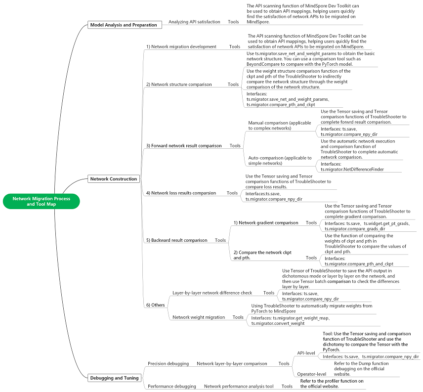

# Application Practice Guide for Network Migration Tool

[](https://gitee.com/mindspore/docs/blob/r2.2/docs/mindspore/source_en/migration_guide/migrator_with_tools.md)

## Overview

This guide describes how to apply various migration-related tools to improve the efficiency of the migration process when migrating neural networks from other machine learning frameworks to MindSpore, with a focus on describing how to tightly integrate the migration tools with the migration process.

## Description of Tools Related to Network Migration Paths

### Migration Path Tool Map



| Tools      | Tool Description         | Applications to network migration         |
| --------------------- | -------------------- | --------------------- |
| [MindSpore Dev Toolkit](https://www.mindspore.cn/devtoolkit/docs/en/r2.2/index.html) | MindSpore Dev Toolkit is a development kit supporting the cross-platform Python IDE plug-in developed by MindSpore, and provides functions such as Project creation, intelligent supplement, API search, and Document search. | With capabilities such as API search, it is possible to improve the efficiency of users network migration development.          |
| [TroubleShooter](https://gitee.com/mindspore/toolkits/tree/master/troubleshooter)   | TroubleShooter is a MindSpore web development debugging toolkit designed to provide convenient, easy-to-use debugging capabilities. | Network debugging toolset (e.g., network weight migration, accuracy comparison, code tracing, error reporting analysis, execution tracking and other functions) to help users improve migration debugging efficiency. |
| [Profiler](https://www.mindspore.cn/mindinsight/docs/en/r2.2/performance_profiling.html)     | Profiler can record information such as operator time consumption during the training process into a file, which can be viewed and analyzed by the user through a visual interface, helping the user to debug neural network performance more efficiently. | After the network migration, if the execution performance is not good, you can use Profiler to analyze the performance. Profiler provides Profiler analysis of the host execution of the framework, as well as the execution of the operator. |
| [Dump](https://www.mindspore.cn/tutorials/experts/en/r2.2/debug/dump.html)                  | The Dump function is provided to save the graphs from model training and the input and output data of the operators to a disk file. | Generally used for network migration complex problem localization (eg: operator overflow, etc.) and can dump out the operator-level data. |

## Examples of Network Migration Tool Applications

This chapter uses a network (Vision Transformer) as an example of completing a network migration and describes how various tools are applied during the critical migration process.

Note: The complete sample code for migrating the network can be found at the following link

<https://github.com/WZMIAOMIAO/deep-learning-for-image-processing/tree/master/pytorch_classification/vision_transformer>

### Network Migration Development

The API scanning function of [MindSpore Dev Toolkit](https://www.mindspore.cn/devtoolkit/docs/en/r2.2/index.html) scans the mapping between APIs in PyTorch network and MindSpore APIs. The API scanning function scans the mapping between the APIs in PyTorch network and MindSpore APIs, and opens the "Description" URL for API differences, which gives a detailed analysis of the APIs and helps users to quickly build the network code for MindSpore.


For example, the `torch.cat` interface:

The following API differences can be seen in the "Description" URL (PyTorch and MindSpore API Mapping Table).


According to the rule, refer to the following PyTorch code:

```python
x = torch.cat((cls_token, x), dim=1) # [B, 197, 768]
```

The MindSpore code is as follows:

```python
x = mindspore.ops.cat((cls_token, x), axis=1) # [B, 197, 768]
```

### Initial Verification of Network Structure

After the initial network migration is constructed, we can first perform some basic comparisons of the network structure to verify that the migrated network structure is correct. You can use the following two ways to compare the network structure respectively:

**Step 1: Obtain PyTorch ViT network structure and weight parameters (pth)**

Call the [ts.migrator.save_net_and_weight_params](https://gitee.com/mindspore/toolkits/blob/master/troubleshooter/docs/api/migrator/save_net_and_weight_params.md#) interface will save the network object to a file (the same as printing the contents of a model object with print, where model is an nn.Module object) and will save the weight parameters to a pth file as well as to a mapping file (to be used for weight comparison with MindSpore).

```python
def net_pt_vit(args):
    device = torch.device(args.device if torch.cuda.is_available() else "cpu")
    model = create_model(num_classes=args.num_classes, has_logits=False).to(device)
    ts.migrator.save_net_and_weight_params(model, path="/mindspore_model/vit/v1/temp_data/pt_net_info/")
```

The following file can be found under the configured path.

```text
-rw-r--r-- 1 root root      8709 Jul  5 20:36 torch_net_architecture.txt （Network structure information, the same as printing the contents of a model object with python print）
-rw-r--r-- 1 root root      7737 Jul  5 20:36 torch_net_map.json (parameter mapping file for weight comparison with MindSpore)
-rw-r--r-- 1 root root 343261393 Jul  5 20:36 torch_troubleshooter_create.pth (weight parameters)
```

**Step 2: Obtain MindSpore ViT network structure and weight parameters (ckpt)**

Call the [ts.migrator.save_net_and_weight_params](https://gitee.com/mindspore/toolkits/blob/master/troubleshooter/docs/api/migrator/save_net_and_weight_params.md#) interface. You can save the network object to a file (the same as printing the contents of the model object with print, where model is a Cell object), and will save the weight parameters to a ckpt file.

```python
def net_ms_vit(args):
    model = create_model(num_classes=args.num_classes, has_logits=False)
    ts.migrator.save_net_and_weight_params(model, path="/mindspore_model/vit/v1/temp_data/ms_net_info/")
```

The following file can be found under the configured path.

```text
-r-------- 1 root root 343217199 Jul  5 20:26 mindspore_troubleshooter_create.ckpt    (weight parameters)
-rw-r--r-- 1 root root     14013 Jul  5 20:26 mindspore_net_architecture.txt  （Network structure information, the same as printing the contents of a model object with python print）
```


**Step 3: Compare the network infrastructure through net_architecture.txt**

Tools such as Beyond Compare can be used to quickly compare the network structure (i.e., mindspore_net_architecture.txt vs. torch_net_architecture.txt), and the following can be used to preliminarily determine that the network structure hierarchies are basically aligned, and that there are a number of natural API as well as parameter differences, for example: Dense and Linear are in the normal range.


**Step 4: Further compare the network structure by comparing the weight parameters**

Using the files we saved in steps 1 and 2, the weight parameter structure comparison of pth and ckpt can be accomplished through TroubleShooter [ts.migrator.compare_pth_and_ckpt](https://gitee.com/mindspore/toolkits/blob/master/troubleshooter/docs/api/migrator/compare_pth_and_ckpt.md#) interface, to further verify that the network structure is correct.

```python
# weight_map_path is the parameter mapping file exported in step 1, compare_value=False means it only compares the quantity and shape information, not the parameter value.
ts.migrator.compare_pth_and_ckpt(
    weight_map_path="/mindspore_model/vit/v1/temp_data/pt_net_info/torch_net_map.json",
    pt_file_path="/mindspore_model/vit/v1/temp_data/pt_net_info/torch_troubleshooter_create.pth",
    ms_file_path="/mindspore_model/vit/v1/temp_data/ms_net_info/mindspore_troubleshooter_create.ckpt",
    compare_value=False)
```


### Network Forward Result Verification

After the migrated MindSpore network can be executed normally, the network forward result verification can be performed, which is done by comparing the PyTorch and MindSpore network forward results. Two different verification schemes are provided here, one is semi-automatic verification scheme and the other is fully-automatic verification scheme. We will introduce the two schemes applicable scenarios and usage methods respectively.

#### Three Basic Conditions for Network Comparison

> Note: This is only a brief description. For detailed steps see the example of the semi-automatic Verification scheme.

There are three conditions that need to be met before PyTorch and MindSpore network comparison can be performed:

1. Randomness fixed and identical

    You can use [ts.migrator.fix_random](https://gitee.com/mindspore/toolkits/blob/master/troubleshooter/docs/api/widget/fix_random.md#) in PyTorch and MindSpore to fix randomness, for example:

    ```python
    ts.widget.fix_random(16)
    ```

2. Consistent input data sample

    Refer to the following two steps, which can be used to save and load the same data samples (included: both data and labels can be used in this method).

    - Step 1: Use [ts.save](https://gitee.com/mindspore/toolkits/blob/master/troubleshooter/docs/api/save.md#) to save a particular data sample of the PyTorch network as npy, and [ts.save]( https://gitee.com/mindspore/toolkits/blob/master/troubleshooter/docs/api/save.md#) will be automatically numbered as `0_images.npy`

        ```python
        ts.save("/mindspore_model/vit/v1/temp_data/pt/npy/images.npy", images)
        ```

    - Step 2: Then use `np.load` to load this data into PyTorch Tenosr and MindSpore Tensor, respectively

        ```python
        images = torch.tensor(np.load('/mindspore_model/vit/v1/pytorch_org/vision_transformer/0_images.npy'))
        images = mindspore.Tensor(np.load('/mindspore_model/vit/v1/pytorch_org/vision_transformer/0_images.npy'))
        ```

3. Consistent initialization weight parameters

    Generally we will take the weights of the PyTorch network as a benchmark, convert them to MindSpore weights and load them to achieve a uniform initialization of the weight parameters. Refer to the following two steps:

    - Step 1: Save PyTorch network weights and conversion mappings for loading in MindSpore.

        Use the [ts.migrator.save_net_and_weight_params](https://gitee.com/mindspore/toolkits/blob/master/troubleshooter/docs/api/migrator/save_net_and_weight_params.md#) interface to save PyTorch network weights and transformation mappings.
        For example:

        ```python
        ts.migrator.save_net_and_weight_params(model, path="/mindspore_model/vit/v1/temp_data/pt_net_info/")
        ```

    - Step 2: Convert and load weights in the MindSpore network.

        Use [ts.migrator.convert_weight_and_load](https://gitee.com/mindspore/toolkits/blob/master/troubleshooter/docs/api/migrator/convert_weight_and_load.md#) interface to convert PyTorch weights and load them into MindSpore network. For example:

        ```python
        ts.migrator.convert_weight_and_load(weight_map_path="/mindspore_model/vit/v1/temp_data/pt_net_info/torch_net_map.json",
        pt_file_path="/mindspore_model/vit/v1/temp_data/pt_net_info/torch_troubleshooter_create.pth",net=model)
        ```

#### Semi-automatic Verification Scheme

Based on meeting the three preconditions for comparison, the semi-automatic verification scheme completes the verification of forwrd results by manually specifying the data to be saved and performing batch comparison. The advantage of the semi-automatic scheme is the strong applicability of the scenario, and the disadvantage is that it requires more manual operations.

**Step 1: Execute PyTorch network and obtain forward results**

```python
def run_pt_net(args):
    # 1) Fix randomness, call ts.widget.fix_random interface to fix randomness in PyTorch
    ts.widget.fix_random(16)
    device = torch.device(args.device if torch.cuda.is_available() else "cpu")
    model = create_model(num_classes=args.num_classes, has_logits=False).to(device)
    # 2) Load samples of the same data (samples can be kept in a .npy format with numpy.save while the PyTorch network is executed.)
    images = torch.tensor(np.load('/mindspore_model/vit/v1/pytorch_org/vision_transformer/0_images.npy'))
    # 3) Save weights and conversion mapping for loading in MindSpore
    ts.migrator.save_net_and_weight_params(model, path="/mindspore_model/vit/v1/temp_data/pt_net_info/")
    # 4) Execute the network and save the forward results, and use the ts.save interface to save the network execution results
    pred = model(images.to(device))
    ts.save("/mindspore_model/vit/v1/temp_data/pt/npy/pred.npy", pred)
```

**Step 2: Execute the MindSpore network to obtain forward results**

```python
def run_ms_net(args):
    # 1) Fix randomness, same as step 1, call the same interface ts.widget.fix_random(16)
    ts.widget.fix_random(16)
    # 2) Load the same data samples
    images = mindspore.Tensor(np.load('/mindspore_model/vit/v1/pytorch_org/vision_transformer/0_images.npy'))
    model = create_model(num_classes=args.num_classes, has_logits=False)
    # 3) Load weights output by pt to ensure consistent initialization weight parameters
    # Call the ts.migrator.convert_weight_and_load interface to convert PyTorch weight parameters to MindSpore weight parameters and load them into the MindSpore network
    ts.migrator.convert_weight_and_load(weight_map_path="/mindspore_model/vit/v1/temp_data/pt_net_info/torch_net_map.json",
                                        pt_file_path="/mindspore_model/vit/v1/temp_data/pt_net_info/torch_troubleshooter_create.pth",
                                        net=model)
    # 4) Execute the network and save the forward results
    pred = model(images)
    ts.save("/mindspore_model/vit/v1/temp_data/ms/npy/pred.npy", pred)
```

**Step 3: Make comparisons and view comparison results**

Use the [ts.migrator.compare_npy_dir](https://gitee.com/mindspore/toolkits/blob/master/troubleshooter/docs/api/migrator/compare_npy_dir.md#) interface for forward result comparison.

```python
# 5) Compare the forward output results of PyTorch and MindSpore, and call the ts.migrator.compare_npy_dir interface to complete the comparison of the saved forward results
ts.migrator.compare_npy_dir('/mindspore_model/vit/v1/temp_data/pt/npy',
                            '/mindspore_model/vit/v1/temp_data/ms/npy')
```

The following comparison results can be seen, the forward network results are all properly aligned by allclose and cosine similarity comparisons, which proves that the results are identical.

```text
The orig dir: /mnt/sdb2/mindspore_model/vit/v1/temp_data/pt/npy
The target dir: /mnt/sdb2/mindspore_model/vit/v1/temp_data/ms/npy
```


#### Fully-automatic Verification Scheme

Fully-automatic verification scheme is suitable for verification of inference network or network forward results and other migration scenarios. The difference from semi-automatic verification scheme is that the tool is used to automatically complete a variety of pre-comparison condition alignment, and the user only needs to pass in the network object. Compared to the semi-automatic scheme, it is more simple, basically can be realized with one-click comparison, but some complex scenarios the use of which may be limited. For example: the PyTorch network and the MindSpore network are not convenient to run on the same machine. For scenarios that cannot be supported by the fully-automatic verification scheme, please refer to the section on  semi-automatic verification scheme.

**Step 1: Import PyTorch model objects to complete network forward automatic comparison**

```python
def auto_run_ms_net(args):
    # 1) Import pytoch script path and import pytroch model for creating PyTorch model objects
    import sys
    sys.path.insert(0, "/mindspore_model/vit/v1/pytorch_org")
    from pytorch_org.vision_transformer.vit_model import vit_base_patch16_224_in21k as create_pt_model
    # 2) Create MindSpore model object and PyTorch model object, respectively, for passing in the auto-comparison interface
    model = create_model(num_classes=args.num_classes, has_logits=False)
    pt_model = create_pt_model(num_classes=args.num_classes, has_logits=False)
    # 3) Create a forward automatic comparison object and perform the comparison
    diff_finder = ts.migrator.NetDifferenceFinder(pt_net=pt_model,
                                                  ms_net=model)
    # auto_inputs parameter to automatically generate data samples according to shape, compare will automatically align weights, fixed randomness.
    diff_finder.compare(auto_inputs=(((8, 3, 224,224), np.float32),))
```

**Step 2: View comparison results**

After the interface is run, it prints some logs of the execution process, and finally prints the comparison results of the network forward output.


> Note: When the results are inconsistent, the API output of each layer in the network can be exported dichotomously or layer-by-layer via the [ts.save](https://gitee.com/mindspore/toolkits/blob/master/troubleshooter/docs/api/save.md#) interface and batch comparison is performed via the [ts.migrator.compare_npy_dir](https://gitee.com/mindspore/toolkits/blob/master/troubleshooter/docs/api/migrator/compare_npy_dir.md#) interface to localize to the API where the problem was introduced.

### Network Loss Result Verification

The verification scheme for loss, similar to the semi-automatic verification scheme for forward results, is based on satisfying the three preconditions for comparison by manually specifying the loss to be saved and saving them using the ts.save interface, and using [ts.migrator.compare_npy_dir](https://gitee.com/mindspore/toolkits/blob/master/troubleshooter/docs/api/migrator/compare_npy_dir.md#) for batch comparison to complete the verification of the loss results. For the specific steps, refer to the semi-automatic verification scheme of the forward results.

### Backward Result Verification (with Comparison of Gradient, Weight Parameters)

The idea of the comparison verification scheme of the gradient is also similar to that of the semi-automatic verification scheme of the forward result, but the invocation is slightly different. Refer to the following step for operation.

**Step 1: Save the output of each stage of PyTorch network training**

Similar to the semi-automatic verification scheme for forward results, we can use the [ts.save](https://gitee.com/mindspore/toolkits/blob/master/troubleshooter/docs/api/save.md#) interface for saving key data at various stages of training, for example: forward outputs, losses, grads, and weight parameters. Refer to the example below, explaining each key data saving.

```python
def train_one_step(args):
    # 1) Fix randomness
    ts.widget.fix_random(16)
    # 2) The process of creating a training network
    device = torch.device(args.device if torch.cuda.is_available() else "cpu")
    model = create_model(num_classes=args.num_classes, has_logits=False).to(device)
    loss_function = torch.nn.CrossEntropyLoss()
    pg = [p for p in model.parameters() if p.requires_grad]
    optimizer = optim.SGD(pg, lr=args.lr, momentum=0.9, weight_decay=5E-5)
    model.train()
    optimizer.zero_grad()
    # 3) Unify data samples and labels
    images = torch.tensor(np.load('/mindspore_model/vit/v1/'
                                  'pytorch_org/vision_transformer/1_None.npy'))
    labels = torch.tensor(np.load('/mindspore_model/vit/v1/'
                                  'pytorch_org/vision_transformer/0_None.npy'))
    # 4) Save weights and conversion mappings for loading in MindSpore
    ts.migrator.save_net_and_weight_params(model, path="/mindspore_model/vit/v1/temp_data/pt_net_info/")
    # 5) Implement the training process
    pred = model(images.to(device))
    loss = loss_function(pred, labels.to(device))
    loss.backward()
    # 6) Preserve the gradient
    # The ts.widget.get_pt_grads interface encapsulates PyTorch method for saving grads, which can be called directly and saved using ts.save.
    # Because the gradient is a Tensor list, ts.save will save the gradient in multiple files and automatically number them. It is recommended to create a separate directory to save the gradient list
    ts.save("/mindspore_model/vit/v1/temp_data/pt/grads/grads.npy", ts.widget.get_pt_grads(model))
    optimizer.step()
    # 7) Save the weight parameter pth, set the weight_params_filename name, do not use the default value to avoid overwriting the initialized weights
    ts.migrator.save_net_and_weight_params(model, path="/mindspore_model/vit/v1/temp_data/pt_net_info/",
                                           weight_params_filename='result_pt.pth')

```

**Step 2: Save the output of each stage of MindSpore network training**

```python
def train_one_step_ms(args):
    # 1) Fix randomness
    ts.widget.fix_random(16)
    # 2) The process of creating a training network
    model = create_model(num_classes=args.num_classes, has_logits=False)
    optimizer = mindspore.nn.SGD(model.trainable_params(), learning_rate=args.lr, momentum=0.9, weight_decay=5E-5)
    loss_function = mindspore.nn.CrossEntropyLoss()
    def forward_fn(data, label):
        logits = model(data)
        loss = loss_function(logits, label)
        return loss, logits
    grad_fn = mindspore.value_and_grad(forward_fn, None, optimizer.parameters, has_aux=True)
    # 3) Load weights output by pt to ensure consistent initialization weight parameters
    # Call the ts.migrator.convert_weight_and_load interface to convert PyTorch weight parameters to MindSpore weight parameters and load them into the MindSpore network
    ts.migrator.convert_weight_and_load(weight_map_path="/mindspore_model/vit/v1/temp_data/pt_net_info/torch_net_map.json",
                                        pt_file_path="/mindspore_model/vit/v1/temp_data/pt_net_info/torch_troubleshooter_create.pth",
                                        net=model)
    # 4) Load the same data samples and labels as in PT
    data = mindspore.Tensor(np.load('/mindspore_model/vit/v1/pytorch_org/vision_transformer/1_None.npy'))
    label = mindspore.Tensor(np.load('/mindspore_model/vit/v1/pytorch_org/vision_transformer/0_None.npy'))
    # 5) Implement the training process
    (loss, pred), grads = grad_fn(data, label.astype(mstype.int32))
    # 6) Save the gradient
    ts.save("/mindspore_model/vit/v1/temp_data/ms/grads/grads.npy", grads)
    optimizer(grads)
    # 7) Save the weight parameter pth
    mindspore.save_checkpoint(model,"/mindspore_model/vit/v1/temp_data/ms/ms_result.ckpt")
```

**Step 3: Compare the gradients**

Use the [ts.migrator.compare_grads_dir](https://gitee.com/mindspore/toolkits/blob/master/troubleshooter/docs/api/migrator/compare_grads_dir.md#) interface for gradient comparison.

```python
ts.migrator.compare_grads_dir('/mindspore_model/vit/v1/temp_data/pt/grads',
                              '/mindspore_model/vit/v1/temp_data/ms/grads')
```

```text
The orig dir: /mindspore_model/vit/v1/temp_data/pt/grads
The target dir: /mindspore_model/vit/v1/temp_data/ms/grads
```


**Step 4: Compare weighting parameters**

Use the [ts.migrator.compare_pth_and_ckpt](https://gitee.com/mindspore/toolkits/blob/master/troubleshooter/docs/api/migrator/compare_pth_and_ckpt.md#) interface for weight parameter comparison.

```python
ts.migrator.compare_pth_and_ckpt(weight_map_path="/mindspore_model/vit/v1/temp_data/pt_net_info/torch_net_map.json",
                                 pt_file_path="/mindspore_model/vit/v1/temp_data/pt_net_info/result_pt.pth",
                                 ms_file_path="/mindspore_model/vit/v1/temp_data/ms/ms_result.ckpt")
```

Obtain the comparison result to the weight parameter shape.


Obtain the comparison result to the weight parameter value.


> Note: If the comparison results are inconsistent, you can go backward to see if the gradients are consistent. If the gradients are consistent, you can check if the optimizer is used correctly, and you can refer to the section on Network Layer-by-Layer Difference Check for a layer-by-layer problem delimitation and exclusion.

### Others

#### Network Layer-by-Layer Difference Check

When we need to locate the cause of the problem when comparing the network forward results or loss inconsistencies, we can take a dichotomous or layer-by-layer approach to save the API output and perform a data comparison to identify the point where the differences are introduced. This comparison also needs to fulfill the three basic conditions of comparison.

**Step 1: Save the API output of PyTorch network part**

In the network, use [ts.save](https://gitee.com/mindspore/toolkits/blob/master/troubleshooter/docs/api/save.md#) to save the output of the API for checking network differences introduction points.

> Note: [ts.save](https://gitee.com/mindspore/toolkits/blob/master/troubleshooter/docs/api/save.md#) supports saving Tensor (including mindspore.Tensor and torch.tensor), and list/tuple/dict composed by Tensor. When it is list/tuple, the number will be added sequentially, while when it is dict, the key will be added in the filename. Please refer to [troubleshooter.save](https://gitee.com/mindspore/toolkits/blob/master/troubleshooter/docs/api/save.md#) for details.

```python
class Mlp(nn.Module):
    """
    MLP as used in Vision Transformer, MLP-Mixer and related networks
    """
    def __init__(self, in_features, hidden_features=None, out_features=None, act_layer=nn.GELU, drop=0.):
        super().__init__()
        out_features = out_features or in_features
        hidden_features = hidden_features or in_features
        self.fc1 = nn.Linear(in_features, hidden_features)
        self.act = act_layer()
        self.fc2 = nn.Linear(hidden_features, out_features)
        self.drop = nn.Dropout(drop)
    def forward(self, x):
        x = self.fc1(x)
        # Save self.fc1, that is output of nn.Linear
        ts.save('/mindspore_model/vit/v1/temp_data/pt/npy/fc1.npy',  x)
        x = self.act(x)
        x = self.drop(x)
        x = self.fc2(x)
        # Save self.fc2, that is output of nn.Linear
        ts.save('/mindspore_model/vit/v1/temp_data/pt/npy/fc2.npy',  x)
        x = self.drop(x)
        return x
```

**Step 1: Save the API output of MindSpore network part**

In the network, use [ts.save](https://gitee.com/mindspore/toolkits/blob/master/troubleshooter/docs/api/save.md#) to save the output of the API for checking network differences introduction points.

```python
class Mlp(nn.Cell):
    def __init__(self, in_features, hidden_features=None, out_features=None, act_layer=nn.GELU, drop=0.):
        super().__init__()
        out_features = out_features or in_features
        hidden_features = hidden_features or in_features
        self.fc1 = nn.Dense(in_features, hidden_features)
        #self.act = act_layer(approximate=False)
        self.act = nn.GELU(approximate=False)
        self.fc2 = nn.Dense(hidden_features, out_features)
        self.drop = nn.Dropout(p=drop)

    def construct(self, x):
        x = self.fc1(x)
        # Save self.fc1, that is output of nn.Dense
        ts.save('/mindspore_model/vit/v1/temp_data/ms/npy/fc1.npy',  x)
        x = self.act(x)
        x = self.drop(x)
        x = self.fc2(x)
        # Save self.fc2, that is output of nn.Dense
        ts.save('/mindspore_model/vit/v1/temp_data/ms/npy/fc2.npy',  x)
        x = self.drop(x)
        return x
```

**Step 3: Compare API outputs to find differences**

Use the [ts.migrator.compare_npy_dir](https://gitee.com/mindspore/toolkits/blob/master/troubleshooter/docs/api/migrator/compare_npy_dir.md#) interface to compare the data saved in each layer, and the results can be used to determine where differences have been introduced for problem localization.

```python
ts.migrator.compare_npy_dir('/mindspore_model/vit/v1/temp_data/pt/npy',
                            '/mindspore_model/vit/v1/temp_data/ms/npy')
```


#### Network Weight Migration

In scenarios such as migrating inference networks or fine-tuning network training, it is often necessary to migrate weights from PyTroch to MindSpore. At this time, you can use TroubleShooter weight migration tool, first call [ts.migrator.get_weight_map](https://gitee.com/mindspore/toolkits/blob/master/troubleshooter/docs/api/migrator/get_weight_map.md#) to obtain the weight mapping json file, then call [ts.migrator.convert_weight](https://gitee.com/mindspore/toolkits/blob/master/troubleshooter/docs/api/migrator/convert_weight.md#) to complete the weight auto-migration. The following is the basic sample. For complex scenarios such as adding prefixes and custom mappings, please refer to [TroubleShooter pth to ckpt weights auto conversion](https://gitee.com/mindspore/toolkits/blob/master/troubleshooter/docs/migrator.md#%E5%BA%94%E7%94%A8%E5%9C%BA%E6%99%AF1pth%E5%88%B0ckpt%E6%9D%83%E9%87%8D%E8%87%AA%E5%8A%A8%E8%BD%AC%E6%8D%A2).

```python
import troubleshooter as ts

device = torch.device(args.device if torch.cuda.is_available() else "cpu")
# 1) Create a Torch network
model = create_model(num_classes=args.num_classes, has_logits=False).to(device)

# 2) Obtain the weight mapping json file through the Torch network
ts.migrator.get_weight_map(model, weight_map_save_path="/mindspore_model/vit/v1/temp_data/pt_net_info/torch_net_map.json")

# 3) Use the weight mapping json file obtained in 2) to perform weight conversion
ts.migrator.convert_weight(weight_map_path="/mindspore_model/vit/v1/temp_data/pt_net_info/torch_net_map.json",
                           pt_file_path="/torch_model/vit/v1/torch_net.pth",
                           ms_file_save_path='/mindspore_model/vit/v1/ms_net.ckpt')
```

When `convert_weight` is executed, detailed information about the weight conversion process will be printed, including name, conversion status, shape of parameters, etc., as shown in the figure below.


