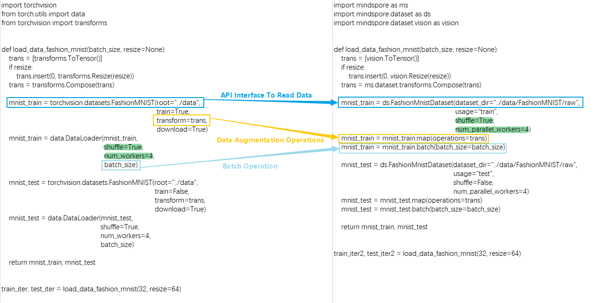
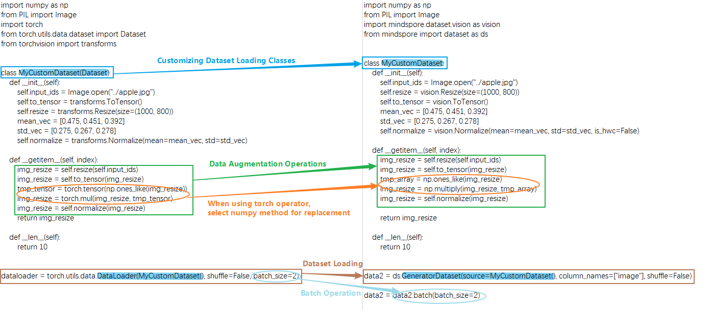

# Constructing Dataset

[](https://gitee.com/mindspore/docs/blob/r2.3/docs/mindspore/source_en/migration_guide/model_development/dataset.md)

This chapter focuses on considerations related to data processing in network migration. For basic data processing, please refer to:

[Data Processing](https://www.mindspore.cn/tutorials/en/r2.3/beginner/dataset.html)

[Auto Augmentation](https://www.mindspore.cn/tutorials/experts/en/r2.3/dataset/augment.html)

[Lightweight Data Processing](https://mindspore.cn/tutorials/en/r2.3/advanced/dataset/eager.html)

[Optimizing the Data Processing](https://www.mindspore.cn/tutorials/experts/en/r2.3/dataset/optimize.html)

## Comparison of Data Processing Differences

The basic process of data construction in MindSpore and PyTorch mainly includes two aspects: dataset loading and data augmentation.The following is a comparison of the differences between the two writing methods in terms of reading common dataset processing flow and reading customized dataset processing flow:

### Processing Common Datasets

MindSpore provides [interfaces](https://www.mindspore.cn/docs/en/r2.3/api_python/mindspore.dataset.html) for loading common datasets from many different domains.
In addition to the above commonly used datasets in the industry, MindSpore has also developed MindRecord data format to cope with efficient reading, mega data storage and reading scenarios, and you can refer to [MindRecord](https://www.mindspore.cn/tutorials/en/r2.3/advanced/dataset/record.html) . Since this article is to introduce similar APIs and the differences in the writing style, so we have selected one of the more classic dataset APIs as an example of migration comparison. For other dataset interface differences, please refer to the [torchaudio](https://www.mindspore.cn/docs/en/r2.3/note/api_mapping/pytorch_api_mapping.html#torchaudio), [torchtext](https://www.mindspore.cn/docs/en/r2.3/note/api_mapping/pytorch_api_mapping.html#torchtext), [torchvision](https://www.mindspore.cn/docs/en/r2.3/note/api_mapping/pytorch_api_mapping.html#torchvision) modules of PyTorch and MindSpore API mapping table.

Here is an example of FashionMnistDataset. The following figure shows how to use the PyTorch API (left part), and how to use the MindSpore API (right part). The main reading process is: use FashionMnist API to load the source dataset, then use transforms to transform the data content, and finally according to the batch operation on the dataset. The key parts of the code on both sides are marked with color boxes.



You can see the following differences between MindSpore and PyTorch in reading common data.

1. Different ways to get and read datasets:

   * PyTorch can download the dataset locally and pass it to the API interface for reading and parsing, or set the `download` parameter of the API interface to download the dataset and read it.

   * MindSpore needs to download the dataset locally and then pass it to the API for reading and parsing.

2. Functions such as shuffling, batch processing, and parallel loading of the dataset itself are supported in different ways:

   * PyTorch supports configuring parameters `shuffle` , `batch` , `num_workers` , etc. in the `DataLoader` to realize the corresponding functions.

   * Due to the difference of interface API design, MindSpore directly carries the functions of shuffle and parallel loading in the dataset API interface through the parameters `shuffle` and `num_parallel_workers` , and then uses the `batch` operation to merge the consecutive data of the dataset into one batch after the data augmentation is finished. For `batch` operation, please refer to [batch](https://www.mindspore.cn/docs/en/r2.3/api_python/dataset/dataset_method/batch/mindspore.dataset.Dataset.batch.html#mindspore.dataset.Dataset.batch) for more details. Due to the difference in API design, it should be noted that the parameter `drop_remainder` of `batch` operation in MindSpore has the same meaning as the parameter `drop_last` in PyTorch's DataLoader.

   Except for FashionMnist API, all dataset loading APIs have the same parameter design, and `batch` operations in the above examples are applicable to all dataset APIs. The following is an example of a dataset API that can return fake images, `FakeImageDataset` , and the related data operations:

   ```python
   import mindspore.dataset as ds

   dataset = ds.FakeImageDataset(num_images=1000, image_size=(32, 32, 3), num_classes=10, base_seed=0)\
       .batch(32, drop_remainder=True)
   print("When drop_remainder=True, the last batch will be drop, the total batch number is ", dataset.get_dataset_size())
   # 1000 // 32 = 31

   dataset = ds.FakeImageDataset(num_images=1000, image_size=(32, 32, 3), num_classes=10, base_seed=0)\
       .batch(32, drop_remainder=False)
   print("When drop_remainder=False, the last batch will not be drop, the total batch number is ", dataset.get_dataset_size())
   # ceil(1000 / 32) = 32
   ```

   Outputs:

   ```text
   When drop_remainder=True, the last batch will be drop, the total batch number is 31
   When drop_remainder=False, the last batch will not be drop, the total batch number is 32
   ```

   The batch operation can also use some augmentation operations within batch, see [YOLOv3](https://gitee.com/mindspore/models/blob/master/official/cv/YOLOv3/src/yolo_dataset.py#L177) for details.

   As mentioned above, **the dataset loading API contains the same parameters**. Here are some common ones:

   | Attributes | Introduction |
   | ---- | ---- |
   | num_samples(int) | Specify the total number of data samples |
   | shuffle(bool)  | Whether to do random disruptions to the data |
   | sampler(Sampler) | Data sampler, customizing data disruption, allocation. `sampler` setting and `num_shards`, `shard_id` mutually exclusive |
   | num_shards(int) | Used in distributed scenarios to divide data into several parts, used in conjunction with `shard_id` |
   | shard_id(int) | For distributed scenarios, taking nth data (n ranges from 0 to n-1, and n is the set `num_shards`), used in conjunction with `num_shards` |
   | num_parallel_workers(int) | Number of threads in parallel configuration |

   Here is an example of `FakeImageDataset`:

   ```python
   import mindspore.dataset as ds

   dataset = ds.FakeImageDataset(num_images=1000, image_size=(32, 32, 3), num_classes=10, base_seed=0)
   print(dataset.get_dataset_size())
   # 1000

   dataset = ds.FakeImageDataset(num_images=1000, image_size=(32, 32, 3), num_classes=10, base_seed=0, num_samples=3)
   print(dataset.get_dataset_size())
   # 3

   dataset = ds.FakeImageDataset(num_images=1000, image_size=(32, 32, 3), num_classes=10, base_seed=0,
                                 num_shards=8, shard_id=0)
   print(dataset.get_dataset_size())
   # 1000 / 8 = 125
   ```

   Outputs:

   ```text
   1000
   3
   125
   ```

3. Data augmentation operations use different:

   ```text
   # PyTorch
   trans = torchvision.transforms.Resize(...)
   mnist_train = torchvision.datasets.FashionMNIST(..., transforms=trans, ...)

   # MindSpore
   trans = mindspore.dataset.vision.Resize(...)
   mnist_train = mindspore.dataset.FashionMnistDataset(...)
   mnist_train = mnist_train.map(trans, ...)
   ```

   * PyTorch passes data augmentation operations as parameters to the API interface when reading common datasets.

   * MindSpore uses [map](https://www.mindspore.cn/docs/en/r2.3/api_python/dataset/dataset_method/operation/mindspore.dataset.Dataset.map.html) for a series of data augmentation operations. Simply put, `map` fetches data one by one from the
   previous data node and performs the specified transformations on each piece of data. The data augmentation operation passed into the `map` operation can contain the various types of data augmentation methods pre-provided by MindSpore: [audio](https://mindspore.cn/docs/en/r2.3/api_python/mindspore.dataset.transforms.html#module-mindspore.dataset.audio), [text](https://mindspore.cn/docs/en/r2.3/api_python/mindspore.dataset.transforms.html#module-mindspore.dataset.text), [vision](https://mindspore.cn/docs/en/r2.3/api_python/mindspore.dataset.transforms.html#module-mindspore.dataset.vision), and [transforms](https://www.mindspore.cn/docs/en/r2.3/api_python/mindspore.dataset.transforms.html). For more details, please refer to [Data Transforms Transforms](https://www.mindspore.cn/tutorials/en/r2.3/beginner/transforms.html). It can also be a Python function, in which you can freely use some third-party libraries or methods such as opencv, PIL, pandas and so on. Something to keep in mind:

   > The ops or nn operator of MindSpore cannot be used during dataset loading and data augmentation, or an exception will be thrown.

### Processing Custom Datasets

In addition to common datasets, when encountering scenarios that require customized loading logic, you need to use a custom dataset API, the corresponding API in MindSpore is `GeneratorDataset` , and the corresponding API in PyTorch is `DataLoader` .
The basic process of constructing custom Dataset objects in PyTorch and MindSpore requires the creation of an iterator class, such as `MyCustomDataset` below, in which `__init__` , `__getitem__` , `__len__` three methods are defined.



You can see the following differences between MindSpore and PyTorch in defining and reading custom datasets.

1. Different ways of building and reading custom dataset classes:

   * PyTorch customize a data loading class, the class needs to inherit `torch.utils.data.Dataset` , and then passed to the `DataLoader` to generate data iteration object.

   * MindSpore custom data loading class does not need to inherit from `mindspore.dataset.Dataset` and can be passed to the custom dataset interface `GeneratorDataset` to generate data iteration objects. It is important to note that when using a custom dataset `GeneratorDataset` , you need to set a column name for each output column, e.g. `column_names=["image"]` above, which means that the first output column of the iterator is called `image` . In the subsequent data augmentation and iterative data acquisition phases, different columns can be processed separately by using the data column names. For details, please refer to [Differences from torch.utils.data.DataLoader](https://www.mindspore.cn/docs/en/r2.3/note/api_mapping/pytorch_diff/DataLoader.html). The following things need to be kept in mind when customizing the data loading class:

   > You can't use MindSpore's operators in the iterator class.
   >
   > The output of the iterator needs to be a numpy array.
   >
   > When defining a randomizable dataset, you must set the `__len__` method, the returned result must be the real dataset size, if you set it too big, there will be an out-of-bounds problem when getitem fetches the value. If the dataset size is not defined, you can use an iterable dataset, see [Customize dataset](https://www.mindspore.cn/tutorials/en/r2.3/beginner/dataset.html) for details.

2. Different data types for data augmentation operations:

   * PyTorch's data augmentation input is of type `Tensor`.

   * MindSpore's data augmentation input is of type `numpy`.

   ```text
   # PyTorch
   ...
   img_resize = torchvision.transforms.Resize(...)(input_ids)
   img_resize = torchvision.transforms.ToTensor()(img_resize)

   tmp_tensor = torch.tensor(np.ones_like(img_resize))
   img_resize = torch.mul(img_resize, tmp_tensor)

   img_resize = torchvision.transforms.Normalize(...)(img_resize)
   ...

   # MindSpore
   ...
   img_resize = mindspore.dataset.vision.Resize(...)(input_ids)
   img_resize = mindspore.dataset.vision.ToTensor()(img_resize)

   tmp_array = np.ones_like(img_resize)
   img_resize = np.multiply(img_resize, tmp_array)

   img_resize = mindspore.dataset.vision.Normalize(...)(img_resize)
   ...
   ```

   When PyTorch uses the `torch` operator for data processing, MindSpore cannot directly use the corresponding `ops` operator
   (for details, please refer to [PyTorch and MindSpore API Mapping Table](https://www.mindspore.cn/docs/en/r2.3/note/api_mapping/pytorch_api_mapping.html)), which needs to be replaced with a third party library or method such as numpy, opencv, PIL, pandas, etc. Generally speaking, MindSpore's operators can find corresponding methods in numpy, if the function of the corresponding method is inconsistent, you can give feedback to [MindSpore community](https://gitee.com/mindspore/mindspore/issues).

3. Different data processing formats:

   * The data transform of `torchvision` in PyTorch processes `Tensor` data in `CHW` format by default, and processes `PIL` data in `HWC` format by default.

   * MindSpore's `vision` data transformation processing data is in `HWC` format by default.
   For details, please refer to [the difference between torchvision and dataset.vision](https://www.mindspore.cn/docs/en/r2.3/note/api_mapping/pytorch_api_mapping.html#torchvision).

   One thing to keep in mind is whether the data format should be converted from `HWC` to `CHW` in the network,
   which is determined by whether the first input format of the network structure matches the data format or not,
   and since the data processing is based on the `HWC` format, the result is usually `HWC`,
   if it is necessary to convert the data format, then call [HWC2CHW]( https://www.mindspore.cn/docs/en/r2.3/api_python/dataset_vision/mindspore.dataset.vision.HWC2CHW.html) method at the last `map` of data processing.

## Comparison of Data Iteration Differences

### Traversing Directly over dataset Objects

A common use of PyTorch's data objects is to traverse them using a for loop.

```python
import numpy as np
import torch
from torch.utils.data import DataLoader

x = np.random.randint(0, 255, size=(20, 32, 32, 3))
tensor_x = torch.Tensor(x)
dataloader = DataLoader(tensor_x, batch_size=10)
for i, data in enumerate(dataloader):
    print(i, data.shape)
```

Outputs:

```text
0 torch.Size([10, 32, 32, 3])
1 torch.Size([10, 32, 32, 3])
```

MindSpore can also traverse data objects directly.

> Note that this writing method does not `shuffle` after traversing an epoch, so it may affect the precision when used in training. The following two methods are recommended when direct data iterations are needed during training.

```python
import numpy as np
import mindspore.dataset as ds

x = np.random.randint(0, 255, size=(20, 32, 32, 3))
dataset = ds.GeneratorDataset(x, column_names=["data"])
dataset = dataset.batch(10, drop_remainder=True)

for data in dataset:
    print(data[0].shape)
```

Outputs:

```text
(10, 32, 32, 3)
(10, 32, 32, 3)
```

MindSpore data objects are obtained iteratively in the following ways.

### [create_tuple_iterator](https://www.mindspore.cn/docs/en/r2.3/api_python/dataset/dataset_method/iterator/mindspore.dataset.Dataset.create_tuple_iterator.html#mindspore.dataset.Dataset.create_tuple_iterator)

Create an iterator based on the dataset object, and output data is a list of `numpy.ndarray` data.

You can specify all column names and the order of the columns in the output by the parameter `columns` . If columns is not specified, the order of the columns will remain the same.

```python
import numpy as np
import mindspore.dataset as ds

x = np.random.randint(0, 255, size=(20, 32, 32, 3))
dataset = ds.GeneratorDataset(x, column_names=["data"])
dataset = dataset.batch(10, drop_remainder=True)
iterator = dataset.create_tuple_iterator()

for data_tuple in iterator:
    print(data_tuple[0].shape)
```

Outputs:

```text
(10, 32, 32, 3)
(10, 32, 32, 3)
```

The above two of these can be used directly when the order of data read is the same as the order required by the network.

```text
for data in dataset:
    loss = net(*data)
```

### [create_dict_iterator](https://www.mindspore.cn/docs/en/r2.3/api_python/dataset/dataset_method/iterator/mindspore.dataset.Dataset.create_dict_iterator.html#mindspore.dataset.Dataset.create_dict_iterator)

Creates an iterator based on the dataset object, and the output data is of dictionary type.

```python
import numpy as np
import mindspore.dataset as ds

x = np.random.randint(0, 255, size=(20, 32, 32, 3))
dataset = ds.GeneratorDataset(x, column_names=["data"])
dataset = dataset.batch(10, drop_remainder=True)
iterator = dataset.create_dict_iterator()

for data_dict in iterator:
    print(data_dict["data"].shape)
```

Outputs:

```text
data (10, 32, 32, 3)
data (10, 32, 32, 3)
```

## Migration Examples

The following migration examples are contributed by MindSpore developers/users in the community for reference and exchange,
and more examples are very welcome to be provided to the community.

[Migration from PyTorch to MindSpore - Data Processing](https://www.hiascend.com/forum/thread-0263137175098201010-1-1.html)

[Migrating from PyTorch to MindSpore - Data Processing (Practical)](https://www.hiascend.com/forum/thread-0283137235691918013-1-1.html)

[PyTorch migration to MindSpore records (top)](https://www.hiascend.com/forum/thread-0244128586212080089-1-1.html)

[PyTorch migration to MindSpore records (below)](https://www.hiascend.com/forum/thread-0247128586317458099-1-1.html)
