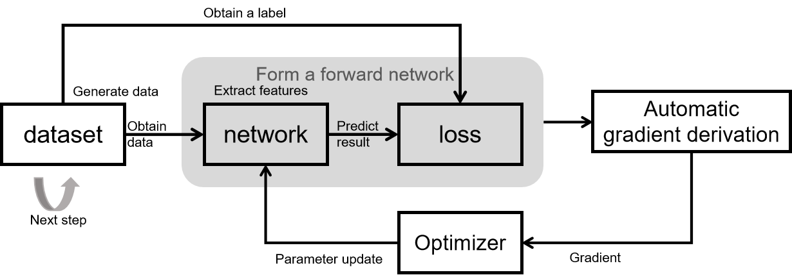
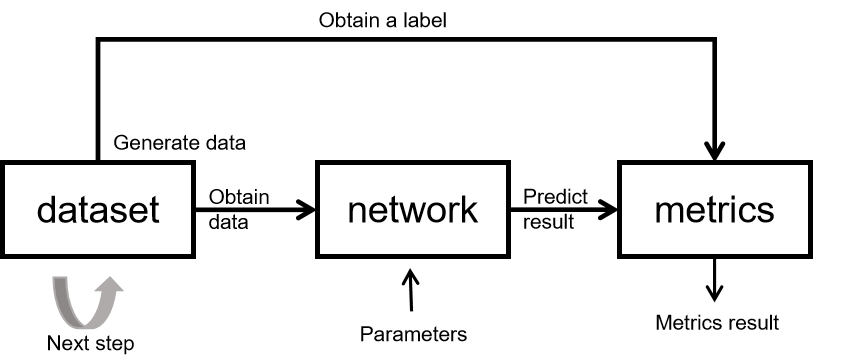

Constructing MindSpore Network
==============================

.. image:: https://mindspore-website.obs.cn-north-4.myhuaweicloud.com/website-images/r2.0.0-alpha/resource/_static/logo_source_en.png
    :target: https://gitee.com/mindspore/docs/blob/r2.0.0-alpha/docs/mindspore/source_en/migration_guide/model_development/model_development.rst

This chapter will introduce the related contents of MindSpore scripting,
including datasets, network models and loss functions, optimizers,
training processes, inference processes from the basic modules needed
for training and inference. It will include some functional techniques
commonly used in network migration, such as network writing
specifications, training and inference process templates, and dynamic
shape mitigation strategies.

Network Training Principle
--------------------------

The basic principle of network training is shown in the figure above.

The training process of the whole network consists of 5 modules:

-  dataset: for obtaining data, containing input of network and labels.
   MindSpore provides a basic `common dataset processing
   interface <https://www.mindspore.cn/docs/en/r2.0.0-alpha/api_python/mindspore.dataset.html>`__,
   and also supports constructing datasets by using python iterators.

-  network: network model implementation, typically encapsulated by
   using Cell. Declare the required modules and operators in init, and
   implement graph construction in construct.

-  loss: loss function. Used to measure the degree of difference between
   the predicted value and the true value. In deep learning, model
   training is the process of shrinking the loss function value by
   iterating continuously. Defining a good loss function can help the
   loss function value converge faster to achieve better precision.
   MindSpore provides many `common loss
   functions <https://www.mindspore.cn/docs/en/r2.0.0-alpha/api_python/mindspore.nn.html#loss-function>`__,
   but of course you can define and implement your own loss function.

-  Automatic gradient derivation: Generally, network and loss are
   encapsulated together as a forward network and the forward network is
   given to the automatic gradient derivation module for gradient
   calculation. MindSpore provides an automatic gradient derivation
   interface, which shields the user from a large number of derivation
   details and procedures and greatly reduces the threshold of
   framework. When you need to customize the gradient, MindSpore also
   provides
   `interface <https://mindspore.cn/tutorials/zh-CN/r2.0.0-alpha/advanced/modules/layer.html#自定义cell反向>`__
   to freely implement the gradient calculation.

-  Optimizer: used to calculate and update network parameters during
   model training. MindSpore provides a number of `general-purpose
   optimizers <https://www.mindspore.cn/docs/en/r2.0.0-alpha/api_python/mindspore.nn.html#optimizer>`__
   for users to choose, and also supports users to customize the
   optimizers.

Principles of Network Inference
-------------------------------

The basic principles of network inference are shown in the figure above.

The training process of the whole network consists of 3 modules:

-  dataset: used to obtain data, including the input of the network and
   labels. Since entire inference dataset needs to be inferred during
   inference process, batchsize is recommended to set to 1. If batchsize
   is not 1, note that when adding batch, add drop_remainder=False. In
   addition the inference process is a fixed process. Loading the same
   parameters every time has the same inference results, and the
   inference process should not have random data augmentation.

-  network: network model implementation, generally encapsulated by
   using Cell. The network structure during inference is generally the
   same as the network structure during training. It should be noted
   that Cell is tagged with set_train(False) for inference and
   set_train(True) for training, just like PyTorch model.eval() (model
   evaluation mode) and model.train() (model training mode).

-  metrics: When the training task is over, evaluation metrics (Metrics)
   and evaluation functions are used to assess whether the model works
   well. Commonly used evaluation metrics include Confusion Matrix,
   Accuracy, Precision, and Recall. The mindspore.nn module provides the
   common `evaluation
   functions <https://www.mindspore.cn/docs/en/r2.0.0-alpha/api_python/mindspore.train.html#evaluation-metrics>`__,
   and users can also define their own evaluation metrics as needed.
   Customized Metrics functions need to inherit train.Metric parent class
   and reimplement the clear method, update method and eval method of
   the parent class.

Constructing Network
--------------------

.. toctree::
  :maxdepth: 1

  dataset
  model_and_loss
  learning_rate_and_optimizer
  training_and_gradient
  training_and_evaluation_procession

.. note::

   When doing network migration, we recommend doing inference validation
   of the model as a priority after completing the network scripting.
   This has several benefits:

   -  Compared with training, the inference process is fixed and able to
      be compared with the reference implementation.
   -  Compared with training, the time required for inference is
      relatively short, enabling rapid verification of the correctness
      of the network structure and inference process.
   -  The trained results need to be validated through the inference
      process to verify results of the model. It is necessary that the
      correctness of the inference be ensured first, then to prove that
      the training is valid.

Considerations for MindSpore Network Authoring
----------------------------------------------

During MindSpore network implementation, there are some problem-prone
areas. When you encounter problems, please prioritize troubleshooting
for the following situations:

1. The MindSpore operator is used in data processing.
   Multi-threaded/multi-process is usually in the data processing
   process, so there is a limitation of using MindSpore operators in
   this scenario. It is recommended to use a three-party implemented
   operation as an alternative in the data processing process, such as
   numpy, opencv, pandas, PIL.
2. Control flow. For details, refer to `Flow Control
   Statements <https://www.mindspore.cn/tutorials/experts/en/r2.0.0-alpha/network/control_flow.html>`__.
   Compilation in graph mode can be slow when multiple layers of
   conditional control statements are called.
3. Slicing operation. When it comes to slicing a Tensor, note that
   whether subscript of the slice is a variable. When it is a variable,
   there will be restrictions. Please refer to `network body and loss
   building <https://www.mindspore.cn/docs/en/r2.0.0-alpha/migration_guide/model_development/model_and_loss.html>`__
   for dynamic shape mitigation.
4. Customized mixed precision conflicts with ``amp_level`` in Model, so
   don’t set ``amp_level`` in Model if you use customized mixed
   precision.
5. In Ascend environment, Conv, Sort and TopK can only be float16, and
   add `loss
   scale <https://www.mindspore.cn/tutorials/zh-CN/r2.0.0-alpha/advanced/mixed_precision.html>`__
   to avoid overflow.
6. In the Ascend environment, operators with the stride property such as
   Conv and Pooling have rules about the length of the stride, which
   needs to be mitigated.
7. In a distributed environment, seed must be added to ensure that the
   initialized parameters of multiple cards are consistent.
8. In the case of using list of Cell or list of Parameter in the
   network, please convert the list to
   `CellList <https://www.mindspore.cn/docs/en/r2.0.0-alpha/api_python/nn/mindspore.nn.CellList.html>`__,
   `SequentialCell <https://www.mindspore.cn/docs/en/r2.0.0-alpha/api_python/nn/mindspore.nn.SequentialCell.html>`__,
   and
   `ParameterTuple <https://www.mindspore.cn/docs/en/r2.0.0-alpha/api_python/mindspore/mindspore.ParameterTuple.html>`__
   in ``init``.

.. code:: python

   # Define the required layers for graph construction in init, and don't write it like this
   self.layer = [nn.Conv2d(1, 3), nn.BatchNorm(3), nn.ReLU()]

   # Need to encapsulate as CellList or SequentialCell
   self.layer = nn.CellList([nn.Conv2d(1, 3), nn.BatchNorm(3), nn.ReLU()])
   # Or
   self.layer = nn.SequentialCell([nn.Conv2d(1, 3), nn.BatchNorm(3), nn.ReLU()])
