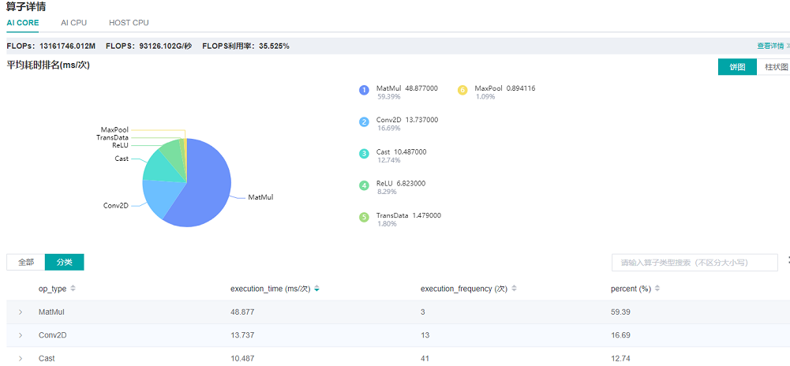

# Performance Profiling

<a href="https://gitee.com/mindspore/docs/blob/r1.7/docs/mindspore/source_en/migration_guide/performance_optimization.md" target="_blank"></a>

Profiler provides performance tuning ability for MindSpore, and provides easy-to-use and rich debugging functions in operator performance, data processing performance, etc., helping users quickly locate and solve performance problems.

This chapter introduces the common methods and cases of performance tuning, as well as the solutions of some common problems.

## Quick Start

Please refer to the tutorials for the function introduction and instructions of MindSpore Profiler.

[Performance Profiling（Ascend）](https://www.mindspore.cn/mindinsight/docs/en/r1.7/performance_profiling_ascend.html)

[Performance Profiling（GPU）](https://www.mindspore.cn/mindinsight/docs/en/r1.7/performance_profiling_gpu.html)

[Cluster Performance Profiling](https://www.mindspore.cn/mindinsight/docs/en/r1.7/performance_profiling_of_cluster.html)

This section will introduce the common use of MindSpore Profiler through three typical cases.

### Case 1: Long Step Interval

We run ResNet50 training script in MindSpore [ModelZoo](https://gitee.com/mindspore/models/tree/master ) with batch size set to 32, and we find that each step cost almost 90ms, with a poor performance.
As we observed on the MindInsight UI page, the step interval in the step trace is too long, which may indicate that data is the performance bottleneck.


*Figure 1: Long Step Interval in Step Trace*

Looking at the iteration gap tab in the data preparation details page, we observed that the data queue has more data in the early stage, and the number of later data becomes 0, because the loading and augmentment of the dataset has begun in the early stage of the graph compilation stage, and multiple pieces of data are cached in the queue.

After the normal training begins in the later stage, the data in the queue is consumed faster than the speed of production, so the data queue gradually becomes empty, indicating that the data becomes a bottleneck at this time. The same is true for observing host queues.

With comprehensive analysis, during normal training, data processing is a performance bottleneck. Therefore, you need to go to the data processing tab in the data preparation details page to see the specific issue.


*Figure 2: Data Preparation Details -- Step Interval*

By observing the `queue relationship between operators` in the Data Processing tab, we find that the queue usage of the `Queue_3` and later is low, that is, the speed `MapOp_3` of production data as a producer is slower, so we can determine that there is still room for optimization of the performance of `MapOp_3`, and try to optimize the performance of the operator.


*Figure 3: Data Preparation Details -- Data Processing*

We can refer to [Optimizing the Data Processing](https://www.mindspore.cn/tutorials/experts/en/r1.7/dataset/optimize.html ) to adjust dataset operators to improve dataset performance.

We find that the num_parallel_workers parameter of map operator is 1(default value) by observing the code part of data processing in ResNet50, and code is shown below:

```python
if do_train:
    trans = [
        C.RandomCropDecodeResize(image_size, scale=(0.08, 1.0), ratio=(0.75, 1.333)),
        C.RandomHorizontalFlip(prob=0.5),
        C.Normalize(mean=mean, std=std),
        C.HWC2CHW()
    ]
else:
    trans = [
        C.Decode(),
        C.Resize(256),
        C.CenterCrop(image_size),
        C.Normalize(mean=mean, std=std),
        C.HWC2CHW()
    ]

data_set = data_set.map(operations=trans, input_columns="image")
```

Therefore we try to increase the num_parallel_workers parameter to 12 and run training script again. Optimization code is shown below:

```python
data_set = data_set.map(operations=trans, input_columns="image", num_parallel_workers=12)
```

By observing the step trace on the MindInsight performance analysis page, you can see that the step interval is shortened from 72.8ms to 0.25ms, and each step time is shortened from 90ms to 18.07ms.


*Figure 4: Step Interval is Shorten*

### Case 2: Long Forward Propagation Interval

We run VGG16 inference script in MindSpore [ModelZoo](https://gitee.com/mindspore/models/blob/master/README.md#) , and each step cost almost 113.79ms, with a poor performance.

As we observed on the MindInsight UI page, the forward propagation in the step trace is too long, which may indicate that operators performance can be optimized. In a single card training or inference process, the forward time consumption is usually considered whether there is a operator that can be optimized for the time consumption.


*Figure 5: Long FP interval in Step Trace*

Open the details page of Operator Time Consumption Ranking, and we find that MatMul operator is time-consuming in the operator details page.



*Figure 6: Finding operators that can be optimized via the details page of Operator Time Consumption Ranking*

For Operator Time Consumption optimization, usually float16 type with the less computating amount can be used to improve operator performance if there is no difference in accuracy between float16 and float32 type. We can refer to [Enabling Mixed Precision](https://www.mindspore.cn/tutorials/experts/en/r1.7/others/mixed_precision.html ) to improve operators performance.

Optimization code is shown below:

```python
from mindspore import context
...
network = vgg16(config.num_classes, config, phase="test")
network.add_flags_recursive(fp16=True)
```

After the float16 format is set, the inference script is run. From the MindInsight performance analysis page to observe the step trace, we can see that the forward propagation interval is shorten from 82.45ms to 16.89ms and each step time consumption is shortened, which is shown as the following picture:


*Figure 7: FP interval is shorten from 82.45ms to 16.89ms*

### Case 3: Optimize The Step Tail

We run ResNet50 training script with 8 processes in MindSpore [ModelZoo](https://gitee.com/mindspore/models/blob/master/README.md#) , set batch size to 32, and each step cost about 23.6ms. We still want to improve each step time consumption.

As we observed the step trace on the MindInsight UI page, step interval and FP/BP interval can not be improved more, so we try to optimize step tail.


*Figure 8: Step Trace with Long Step Tail*

Step Tail duration contains AllReduce gradient synchronization, parameter update and other operations. Normally, AllReduce gradient synchronization waits until all the inverse operators are finished, i.e., all the gradients of all weights are computed before synchronizing the gradients of all machines at once. With AllReduce tangent, we can synchronize the gradients of some weights as soon as they are computed, so that the gradient synchronization and the gradient computation of the remaining operators can be performed in parallel, hiding this part of the AllReduce gradient synchronization time.

The tangent strategy is usually a manual attempt to find an optimal solution (supporting slicing greater than two segments). As an example, ResNet50 network has 160 weights, and [85, 160] indicates that the gradient synchronization is performed immediately after the gradient is calculated for the 0th to 85th weights, and the gradient synchronization is performed after the gradient is calculated for the 86th to 160th weights. Here there are two segments, therefore the gradient synchronization is required to perform twice.

Optimization code is shown below:

```python
from mindspore import context
from resnet50_imagenet2012_config.yaml import config
...

if config.net_name == "resnet50" or config.net_name == "se-resnet50":
    # AllReduce split
    context.set_auto_parallel_context(all_reduce_fusion_config=[85, 160])
else:
    # Another split stratety
    context.set_auto_parallel_context(all_reduce_fusion_config=[180, 313])
init()
```

We run ResNet50 8P script again after AllReduce is sliced. The step trace is observed in the MindInsight performance analysis page, and the step tail is shorten from 6.15ms to 4.20ms. The figure is shown in the following:


*Figure 9: Step Tail is shorten from 6.15ms to 4.20ms*

## FAQ

### Startup Failure

If you encounter the error of startup failure, you can check whether you encountered one of the following situations:

- There is no space left in the system, or the remaining space is too small to run profiling tool.
- Mismatched versions of MindSpore and Ascend AI processor software package.
