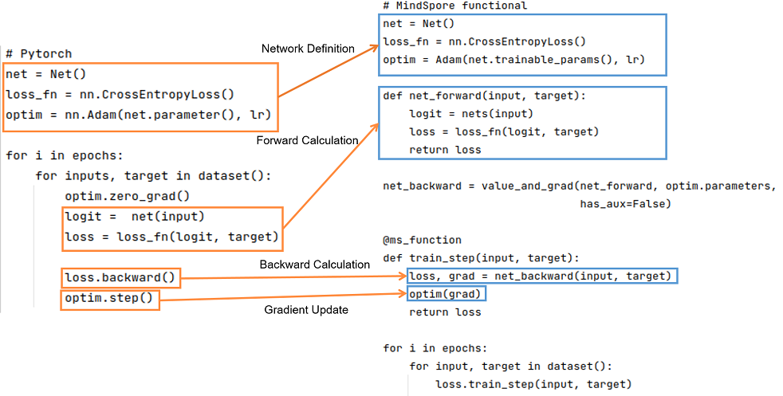

# Differences between PyTorch and MindSpore

[](https://gitee.com/mindspore/docs/blob/master/docs/mindspore/source_en/migration_guide/typical_api_comparision.md)

## Basic Logic

The basic logic of PyTorch and MindSpore is shown below:



It can be seen that PyTorch and MindSpore generally require network definition, forward computation, backward computation, and gradient update steps in the implementation process.

- Network definition: In the network definition, the desired forward network, loss function, and optimizer are generally defined. To define the forward network in Net(), PyTorch network inherits from nn.Module; similarly, MindSpore network inherits from nn.Cell. In MindSpore, the loss function and optimizers can be customized in addition to using those provided in MindSpore. You can refer to [Model Module Customization](https://mindspore.cn/tutorials/en/master/advanced/modules.html). Interfaces such as functional/nn can be used to splice the required forward networks, loss functions and optimizers. Detailed interface usage can be found in [API Comparison](#api-comparison).

- Forward computation: Run the instantiated network to get the logit, and use the logit and target as inputs to calculate the loss. It should be noted that if the forward function has more than one output, you need to pay attention to the effect of more than one output on the result when calculating the backward function.

- Backward computation: After getting the loss, we can do the backward calculation. In PyTorch the gradient can be computed using loss.backward(), and in MindSpore, the gradient can be computed by first defining the backward propagation equation net_backward using mindspore.grad(), and then passing the input into net_backward. If the forward function has more than one output, you can set has_aux to True to ensure that only the first output is involved in the derivation, and the other outputs will be returned directly in the backward calculation. For the difference in interface usage in the backward calculation, see [Automatic Differentiation](#automatic-differentiation).

- Gradient update: Update the computed gradient into the Parameters of the network. Use optim.step() in PyTorch, while in MindSpore, pass the gradient of the Parameter into the defined optim to complete the gradient update.

## API Comparison

### Tensor/Parameter

In PyTorch, there are four types of objects that can store data: `Tensor`, `Variable`, `Parameter`, and `Buffer`. The default behaviors of the four types of objects are different. When the gradient is not required, the `Tensor` and `Buffer` data objects are used. When the gradient is required, the `Variable` and `Parameter` data objects are used. When PyTorch designs the four types of data objects, the functions are redundant. (In addition, `Variable` will be discarded.)

MindSpore optimizes the data object design logic and retains only two types of data objects: `Tensor` and `Parameter`. The `Tensor` object only participates in calculation and does not need to perform gradient derivation or parameter update on it. The `Parameter` data object has the same meaning as the `Parameter` data object of PyTorch. The `requires_grad` attribute determines whether to perform gradient derivation or parameter update on the `Parameter` data object. During network migration, all data objects that are not updated in PyTorch can be declared as `Tensor` in MindSpore.

### functional APIs

For details, refer to [PyTorch and MindSpore API Mapping Table](https://www.mindspore.cn/docs/en/master/note/api_mapping/pytorch_api_mapping.html).

### nn APIs

#### nn.Module

When PyTorch is used to build a network structure, the `nn.Module` class is used. Generally, network elements are defined and initialized in the `__init__` function, and the graph structure expression of the network is defined in the `forward` function. Objects of these classes are invoked to build and train the entire model. `nn.Module` not only provides us with graph building interfaces, but also provides us with some common [APIs](https://pytorch.org/docs/stable/generated/torch.nn.Module.html) to help us execute more complex logic.

The `nn.Cell` class in MindSpore plays the same role as the `nn.Module` class in PyTorch. Both classes are used to build graph structures. MindSpore also provides various [APIs](https://www.mindspore.cn/docs/en/master/api_python/nn/mindspore.nn.Cell.html) for developers. Although the names are not the same, the mapping of common functions in `nn.Module` can be found in `nn.Cell`. `nn.Cell` is the inference mode by default. For a class that inherits `nn.Cell`, if the training and inference have different structures, the subclass performs the inference branch by default. The `nn.Module` of PyTorch is training mode by default.

The following uses several common methods as examples:

|Common Method| nn.Module|nn.Cell|
|:----|:----|:----|
|Obtain child elements.|named_children|cells_and_names|
|Add subelements.|add_module|insert_child_to_cell|
|Obtain parameters of an element.|parameters|get_parameters|

#### nn.Dropout

Dropout is often used to prevent training overfitting. It has an important probability value parameter. The meaning of this parameter in MindSpore is completely opposite to that in PyTorch and TensorFlow.

In MindSpore, the probability value corresponds to the `keep_prob` attribute of the Dropout operator, indicating the probability that the input is retained. `1-keep_prob` indicates the probability that the input is set to 0.

In PyTorch and TensorFlow, the probability values correspond to the attributes `p` and `rate` of the Dropout operator, respectively. They indicate the probability that the input is set to 0, which is opposite to the meaning of `keep_prob` in MindSpore.nn.Dropout.

In PyTorch, the network is in training mode by default, while in MindSpore, it's in inference mode by default. Therefore, by default, Dropout called by the network does not take effect and directly returns the input. Dropout can be performed only after the network is set to the training mode by using the `net.set_train()` method.

For more information, visit [MindSpore Dropout](https://www.mindspore.cn/docs/en/master/api_python/nn/mindspore.nn.Dropout.html#mindspore.nn.Dropout), [PyTorch Dropout](https://pytorch.org/docs/stable/generated/torch.nn.Dropout.html), and [TensorFlow Dropout](https://www.tensorflow.org/api_docs/python/tf/nn/dropout).

#### nn.BatchNorm2d

BatchNorm is a special regularization method in the CV field. It has different computation processes during training and inference and is usually controlled by operator attributes. BatchNorm of MindSpore and PyTorch uses two different parameter groups at this point.

- Difference 1

`torch.nn.BatchNorm2d` status under different parameters

|training|track_running_stats|Status|
|:----|:----|:--------------------------------------|
|True|True|Expected training status. `running_mean` and `running_var` trace the statistical features of the batch in the entire training process. Each group of input data is normalized based on the mean and var statistical features of the current batch, and then `running_mean` and `running_var` are updated.|
|True|False|Each group of input data is normalized based on the statistics feature of the current batch, but the `running_mean` and `running_var` parameters do not exist.|
|False|True|Expected inference status. The BN uses `running_mean` and `running_var` for normalization and does not update them.|
|False|False|The effect is the same as that of the second status. The only difference is that this is the inference status and does not learn the weight and bias parameters. Generally, this status is not used.|

`mindspore.nn.BatchNorm2d` status under different parameters

|use_batch_statistics|Status|
|:----|:--------------------------------------|
|True|Expected training status. `moving_mean` and `moving_var` trace the statistical features of the batch in the entire training process. Each group of input data is normalized based on the mean and var statistical features of the current batch, and then `moving_mean` and `moving_var` are updated.
|Fasle|Expected inference status. The BN uses `moving_mean` and `moving_var` for normalization and does not update them.
|None|`use_batch_statistics` is automatically set. For training, set `use_batch_statistics` to `True`. For inference, `set use_batch_statistics` to `False`.

Compared with `torch.nn.BatchNorm2d`, `mindspore.nn.BatchNorm2d` does not have two redundant states and retains only the most commonly used training and inference states.

- Difference 2

In PyTorch, the network is in training mode by default, while in MindSpore, it is in inference mode by default (`is_training` is False). You need to use the `net.set_train()` method in MindSpore to switch the network to training mode. In this case, the parameters `mean` and `variance` are calculated during the training. Otherwise, in inference mode, the parameters are loaded from the checkpoint.

- Difference 3

The meaning of the momentum parameter of the BatchNorm series operators in MindSpore is opposite to that in PyTorch. The relationship is as follows:

$$momentum_{pytorch} = 1 - momentum_{mindspore}$$

References: [mindspore.nn.BatchNorm2d](https://www.mindspore.cn/docs/en/master/api_python/nn/mindspore.nn.BatchNorm2d.html), [torch.nn.BatchNorm2d](https://pytorch.org/docs/stable/generated/torch.nn.BatchNorm2d.html)

### Other APIs

#### torch.device

When building a model, PyTorch usually uses torch.device to specify the device to which the model and data are bound, that is, whether the device is on the CPU or GPU. If multiple GPUs are supported, you can also specify the GPU sequence number. After binding a device, you need to deploy the model and data to the device. The code is as follows:

```python
import os
import torch
from torch import nn

# bind to the GPU 0 if GPU is available, otherwise bind to CPU
device = torch.device("cuda:0" if torch.cuda.is_available() else "cpu") # Single GPU or CPU
# deploy model to specified hardware
model.to(device)
# deploy data to specified hardware
data.to(device)

# distribute training on multiple GPUs
if torch.cuda.device_count() > 1:
    model = nn.DataParallel(model, device_ids=[0,1,2])
    model.to(device)

    # set available device
    os.environ['CUDA_VISIBLE_DEVICE']='1'
    model.cuda()
```

In MindSpore, the `device_target` parameter in context specifies the device bound to the model, and the `device_id parameter` specifies the device sequence number. Different from PyTorch, once the device is successfully set, the input data and model are copied to the specified device for execution by default. You do not need to and cannot change the type of the device where the data and model run. The sample code is as follows:

```python
import mindspore as ms
ms.set_context(device_target='Ascend', device_id=0)

# define net
Model = ..
# define dataset
dataset = ..
# training, automatically deploy to Ascend according to device_target
Model.train(1, dataset)
```

In addition, the `Tensor` returned after the network runs is copied to the CPU device by default. You can directly access and modify the `Tensor`, including converting the `Tensor` to the `numpy` format. Unlike PyTorch, you do not need to run the `tensor.cpu` command and then convert the `Tensor` to the NumPy format.

## Parameter Initialization Comparison

### Different Default Weight Initialization

We know that weight initialization is very important for network training. Generally, each nn interface has an implicit declaration weight. In different frameworks, the implicit declaration weight may be different. Even if the operator functions are the same, if the implicitly declared weight initialization mode distribution is different, the training process is affected or even cannot be converged.

Common nn interfaces that implicitly declare weights include Conv, Dense(Linear), Embedding, and LSTM. The Conv and Dense operators differ greatly. The Conv and Dense operators of MindSpore and PyTorch have the same distribution of weight and bias initialization methods for implicit declarations.

- Conv2d

    - mindspore.nn.Conv2d (weight: $\mathcal{U} (-\sqrt{k},\sqrt{k} )$, bias: $\mathcal{U} (-\sqrt{k},\sqrt{k} )$)
    - torch.nn.Conv2d (weight: $\mathcal{U} (-\sqrt{k},\sqrt{k} )$, bias: $\mathcal{U} (-\sqrt{k},\sqrt{k} )$)
    - tf.keras.Layers.Conv2D (weight: glorot_uniform, bias: zeros)

    In the preceding information, $k=\frac{groups}{c_{in}*\prod_{i}^{}{kernel\_size[i]}}$

- Dense(Linear)

    - mindspore.nn.Dense (weight: $\mathcal{U} (-\sqrt{k},\sqrt{k} )$, bias: $\mathcal{U} (-\sqrt{k},\sqrt{k} )$)
    - torch.nn.Linear (weight: $\mathcal{U} (-\sqrt{k},\sqrt{k} )$, bias: $\mathcal{U} (-\sqrt{k},\sqrt{k} )$)
    - tf.keras.Layers.Dense (weight: glorot_uniform, bias: zeros)

    In the preceding information, $k=\frac{groups}{in\_features}$

For a network without normalization, for example, a GAN network without the BatchNorm operator, the gradient is easy to explode or disappear. Therefore, weight initialization is very important. Developers should pay attention to the impact of weight initialization.

### Parameter Initializations APIs Comparison

Every API from `torch.nn.init` could correspond to MindSpore, except `torch.nn.init.calculate_gain()`. For more information, please refer to [PyTorch and MindSpore API Mapping Table](https://www.mindspore.cn/docs/en/master/note/api_mapping/pytorch_api_mapping.html).

> `gain` is used to describe the influence of the non-linearity to the standard deviation of the data. Because non-linearity will affect the standard deviation, the gradient may explode or vanish.

#### torch.nn.init

`torch.nn.init` takes a Tensor as input, and the input Tensor will be changed to the target in-place.

```python

import torch

x = torch.empty(2, 2)
torch.nn.init.uniform_(x)

```

After running the code above, x is no longer an uninitialized Tensor, and its elements will follow the uniform distribution.

#### mindspore.common.initializer

`mindspore.common.initializer` is used for delayed initialization in parallel mode. Only after calling `init_data()`, the elements will be assigned based on its `init`.
Every Tensor could only use `init_data` once.

```python

import mindspore
from mindspore.common initialzier import initializer, Uniform

x = initializer(Uniform(), [1, 2, 3], mindspore.float32)

```

After running the code above, `x` is still not fully initialized. If it is used for further calculation, 0 will be used. However, when printing the Tensor, `init_data()`
will be called automatically.

## Automatic Differentiation

Both MindSpore and PyTorch provide the automatic differentiation function. After the forward network is defined, automatic backward propagation and gradient update can be implemented through simple interface invoking. However, it should be noted that MindSpore and PyTorch use different logic to build backward graphs. This difference also brings differences in API design.

### PyTorch Automatic Differentiation

As we know, PyTorch is an automatic differentiation based on computation path tracing. After a network structure is defined, no backward graph is created. Instead, during the execution of the forward graph, `Variable` or `Parameter` records the backward function corresponding to each forward computation and generates a dynamic computational graph, it is used for subsequent gradient calculation. When `backward` is called at the final output, the chaining rule is applied to calculate the gradient from the root node to the leaf node. The nodes stored in the dynamic computational graph of PyTorch are actually `Function` objects. Each time an operation is performed on `Tensor`, a `Function` object is generated, which records necessary information in backward propagation. During backward propagation, the `autograd` engine calculates gradients in backward order by using the `backward` of the `Function`. You can view this point through the hidden attribute of the `Tensor`.

For example, run the following code:

```python
import torch
from torch.autograd import Variable
x = Variable(torch.ones(2, 2), requires_grad=True)
x = x * 2
y = x - 1
y.backward(x)
```

The gradient result of x in the process from obtaining the definition of `x` to obtaining the output `y` is automatically obtained.

Note that the backward of PyTorch is accumulated. After the update, you need to clear the optimizer.

### MindSpore Automatic Differentiation

In graph mode, MindSpore's automatic differentiation is based on the graph structure. Different from PyTorch, MindSpore does not record any information during forward computation and only executes the normal computation process (similar to PyTorch in PyNative mode). Then the question comes. If the entire forward computation is complete and MindSpore does not record any information, how does MindSpore know how backward propagation is performed?

When MindSpore performs automatic differentiation, the forward graph structure needs to be transferred. The automatic differentiation process is to obtain backward propagation information by analyzing the forward graph. The automatic differentiation result is irrelevant to the specific value in the forward computation and is related only to the forward graph structure. Through the automatic differentiation of the forward graph, the backward propagation process is obtained. The backward propagation process is expressed through a graph structure, that is, the backward graph. The backward graph is added after the user-defined forward graph to form a final computational graph. However, the backward graph and backward operators added later are not aware of and cannot be manually added. They can only be automatically added through the interface provided by MindSpore. In this way, errors are avoided during backward graph build.

Finally, not only the forward graph is executed, but also the graph structure contains both the forward operator and the backward operator added by MindSpore. That is, MindSpore adds an invisible `Cell` after the defined forward graph, the `Cell` is a backward operator derived from the forward graph.

The interface that helps us build the backward graph is [GradOperation](https://www.mindspore.cn/docs/en/master/api_python/ops/mindspore.ops.GradOperation.html).

```python
import mindspore as ms
from mindspore import nn, ops

class GradNetWrtX(nn.Cell):
    def __init__(self, net):
        super(GradNetWrtX, self).__init__()
        self.net = net
    def construct(self, x, y):
        gradient_function = ms.grad(self.net)
        return gradient_function(x, y)
```

According to the document introduction, GradOperation is not an operator. Its input and output are not tensors, but cells, that is, the defined forward graph and the backward graph obtained through automatic differentiation. Why is the input a graph structure? To construct a backward graph, you do not need to know the specific input data. You only need to know the structure of the forward graph. With the forward graph, you can calculate the structure of the backward graph. Then, you can treat the forward graph and backward graph as a new computational graph, the new computational graph is like a function. For any group of data you enter, it can calculate not only the positive output, but also the gradient of ownership weight. Because the graph structure is fixed and does not save intermediate variables, the graph structure can be invoked repeatedly.

Similarly, when we add an optimizer structure to the network, the optimizer also adds optimizer-related operators. That is, we add optimizer operators that are not perceived to the computational graph. Finally, the computational graph is built.

In MindSpore, most operations are finally converted into real operator operations and finally added to the computational graph. Therefore, the number of operators actually executed in the computational graph is far greater than the number of operators defined at the beginning.

MindSpore provides the [TrainOneStepCell](https://www.mindspore.cn/docs/en/master/api_python/nn/mindspore.nn.TrainOneStepCell.html) and [TrainOneStepWithLossScaleCell](https://www.mindspore.cn/docs/en/master/api_python/nn/mindspore.nn.TrainOneStepWithLossScaleCell.html) APIs to package the entire training process. If other operations, such as gradient cropping, specification, and intermediate variable return, are performed in addition to the common training process, you need to customize the training cell. For details, see [Inference and Training Process](https://www.mindspore.cn/docs/en/master/migration_guide/model_development/training_and_evaluation_procession.html).

### Gradient Derivation

The operator and interface differences involved in gradient derivation are mainly caused by different automatic differentiation principles of MindSpore and PyTorch.

### torch.autograd.backward

[torch.autograd.backward](https://pytorch.org/docs/stable/generated/torch.autograd.backward.html). For a scalar, calling its backward method automatically computes the gradient values of the leaf nodes according to the chaining law. For vectors and matrices, you need to define grad_tensor to compute the gradient of the matrix.
Typically after calling backward once, PyTorch automatically destroys the computation graph, so to call backward repeatedly on a variable, you need to set the return_graph parameter to True.
If you need to compute higher-order gradients, you need to set create_graph to True.
The two expressions z.backward() and torch.autograd.backward(z) are equivalent.

```python
import torch
print("=== tensor.backward ===")
x = torch.tensor(1.0, requires_grad=True)
y = torch.tensor(2.0, requires_grad=True)
z = x**2+y
print("x.grad before backward", x.grad)
print("y.grad before backward", y.grad)
z.backward()
print("z", z)
print("x.grad", x.grad)
print("y.grad", y.grad)

print("=== torch.autograd.backward ===")
x = torch.tensor(1.0, requires_grad=True)
y = torch.tensor(2.0, requires_grad=True)
z = x**2+y
torch.autograd.backward(z)
print("z", z)
print("x.grad", x.grad)
print("y.grad", y.grad)
```

```text
=== tensor.backward ===
x.grad before backward None
y.grad before backward None
z tensor(3., grad_fn=<AddBackward0>)
x.grad tensor(2.)
y.grad tensor(1.)
=== torch.autograd.backward ===
z tensor(3., grad_fn=<AddBackward0>)
x.grad tensor(2.)
y.grad tensor(1.)
```

It can be seen that before calling the backward function, x.grad and y.grad functions are empty. And after the backward calculation, x.grad and y.grad represent the values after the derivative calculation, respectively.

This interface is implemented in MindSpore using mindspore.grad. The above PyTorch use case can be transformed into:

```python
import mindspore
print("=== mindspore.grad ===")
x = mindspore.Tensor(1.0)
y = mindspore.Tensor(2.0)
def net(x, y):
    return x**2+y
out = mindspore.grad(net, grad_position=0)(x, y)
print("out", out)
out1 = mindspore.grad(net, grad_position=1)(x, y)
print("out1", out1)
```

```text
=== mindspore.grad ===
out 2.0
out1 1.0
```

If the above net has more than one output, you need to pay attention to the effect of multiple outputs of the network on finding the gradient.

```python
import mindspore
print("=== mindspore.grad multiple outputs ===")
x = mindspore.Tensor(1.0)
y = mindspore.Tensor(2.0)
def net(x, y):
    return x**2+y, x
out = mindspore.grad(net, grad_position=0)(x, y)
print("out", out)
out1 = mindspore.grad(net, grad_position=1)(x, y)
print("out1", out1)
```

```text
=== mindspore.grad multiple outputs ===
out 3.0
out1 3.0
```

PyTorch does not support such expressions:

```python
import torch
print("=== torch.autograd.backward does not support multiple outputs ===")
x = torch.tensor(1.0, requires_grad=True)
y = torch.tensor(2.0, requires_grad=True)
z = x**2+y
torch.autograd.backward(z)
print("z", z)
print("x.grad", x.grad)
print("y.grad", y.grad)
```

```text
=== torch.autograd.backward does not support multiple outputs ===
z tensor(3., grad_fn=<AddBackward0>)
x.grad tensor(2.)
y.grad tensor(1.)
```

Therefore, to find the gradient of only the first output in MindSpore, you need to use the has_aux parameter in MindSpore.

```python
import mindspore
print("=== mindspore.grad has_aux ===")
x = mindspore.Tensor(1.0)
y = mindspore.Tensor(2.0)
def net(x, y):
    return x**2+y, x
grad_fcn = mindspore.grad(net, grad_position=0, has_aux=True)
out, _ = grad_fcn(x, y)
print("out", out)
grad_fcn1 = mindspore.grad(net, grad_position=1, has_aux=True)
out, _ = grad_fcn1(x, y)
print("out", out)
```

```text
=== mindspore.grad has_aux ===
out 2.0
out 1.0
```

### torch.autograd.grad

[torch.autograd.grad](https://pytorch.org/docs/stable/generated/torch.autograd.grad.html). This interface is basically the same as torch.autograd.backward. The difference between the two is that the former modifies the grad attribute of each Tensor directly, while the latter returns a list of gradient values for the parameters. So when migrating to MindSpore, you can also refer to the above use case.

```python
import torch
print("=== torch.autograd.grad ===")
x = torch.tensor(1.0, requires_grad=True)
y = torch.tensor(2.0, requires_grad=True)
z = x**2+y
out = torch.autograd.grad(z, x)
out1 = torch.autograd.grad(z, y)
print("out", out)
print("out1", out1)
```

```text
=== torch.autograd.grad ===
out (tensor(2.),)
out1 (tensor(1.),)
```

### torch.no_grad

In PyTorch, by default, information required for backward propagation is recorded when forward computation is performed. In the inference phase or in a network where backward propagation is not required, this operation is redundant and time-consuming. Therefore, PyTorch provides `torch.no_grad` to cancel this process.

MindSpore constructs a backward graph based on the forward graph structure only when `grad` is invoked. No information is recorded during forward execution. Therefore, MindSpore does not need this interface. It can be understood that forward calculation of MindSpore is performed in `torch.no_grad` mode.

```python
import torch
print("=== torch.no_grad ===")
x = torch.tensor(1.0, requires_grad=True)
y = torch.tensor(2.0, requires_grad=True)
z = x**2+y
print("z.requires_grad", z.requires_grad)
with torch.no_grad():
    z = x**2+y
print("z.requires_grad", z.requires_grad)
```

```text
=== torch.no_grad ===
z.requires_grad True
z.requires_grad False
```

### torch.enable_grad

If PyTorch enables `torch.no_grad` to disable gradient computation, you can use this interface to enable it.

MindSpore builds the backward graph based on the forward graph structure only when `grad` is called, and no information is logged during forward execution, so MindSpore doesn't need this interface, and it can be understood that MindSpore backward computations are performed with `torch.enable_grad`.

```python
import torch
print("=== torch.enable_grad ===")
x = torch.tensor(1.0, requires_grad=True)
y = torch.tensor(2.0, requires_grad=True)
with torch.no_grad():
    z = x**2+y
print("z.requires_grad", z.requires_grad)
with torch.enable_grad():
    z = x**2+y
print("z.requires_grad", z.requires_grad)
```

```text
=== torch.enable_grad ===
z.requires_grad False
z.requires_grad True
```

### retain_graph

PyTorch is function-based automatic differentiation. Therefore, by default, the recorded information is automatically cleared after each backward propagation is performed for the next iteration. As a result, when we want to reuse the backward graph and gradient information, the information fails to be obtained because it has been deleted. Therefore, PyTorch provides `backward(retain_graph=True)` to proactively retain the information.

MindSpore does not require this function. MindSpore is an automatic differentiation based on the computational graph. The backward graph information is permanently recorded in the computational graph after `grad` is invoked. You only need to invoke the computational graph again to obtain the gradient information.

### High-order Derivatives

Automatic differentiation based on computational graphs also has an advantage that we can easily implement high-order derivation. After the `GradOperation` operation is performed on the forward graph for the first time, a first-order derivative may be obtained. In this case, the computational graph is updated to a backward graph structure of the forward graph + the first-order derivative. However, after the `GradOperation` operation is performed on the updated computational graph again, a second-order derivative may be obtained, and so on. Through automatic differentiation based on computational graph, we can easily obtain the higher order derivative of a network.

## Optimizer Comparison

### Optimizer Support Differences

A comparison of the similarities and differences between the optimizers supported by both PyTorch and MindSpore is detailed in the [API mapping table](https://mindspore.cn/docs/en/master/note/api_mapping/pytorch_api_mapping.html#torch-optim). Optimizers not supported in MindSpore at the moment: LBFGS, NAdam, RAdam.

### Optimizer Execution and Usage Differences

When PyTorch executes the optimizer in a single step, it is usually necessary to manually execute the `zero_grad()` method to set the historical gradient to 0 (or None), then use `loss.backward()` to calculate the gradient of the current training step, and finally call the `step()` method of the optimizer to update the network weights;

```python
optimizer = optim.SGD(model.parameters(), lr=0.01, momentum=0.9)
scheduler = ExponentialLR(optimizer, gamma=0.9)

for epoch in range(20):
    for input, target in dataset:
        optimizer.zero_grad()
        output = model(input)
        loss = loss_fn(output, target)
        loss.backward()
        optimizer.step()
    scheduler.step()
```

The use of the optimizer in MindSpore requires only a direct calculation of the gradients and then uses `optimizer(grads)` to perform the update of the network weights.

```python
import mindspore
from mindspore import nn

optimizer = nn.SGD(model.trainable_params(), learning_rate=0.01)
grad_fn = mindspore.value_and_grad(forward_fn, None, optimizer.parameters, has_aux=True)
def train_step(data, label):
    (loss, _), grads = grad_fn(data, label)
    optimizer(grads)
    return loss
```

### Hyperparameter Differences

#### Hyperparameter Names

Similarities and differences between network weight and learning rate parameter names:

| Parameters   | PyTorch | MindSpore | Differences    |
|------|---------| --------- |-------|
| network weight | params  | params      | The parameters are the same |
| learning rate  | lr      | learning_rate      | The parameters are different |

MindSpore:

```python
from mindspore import nn

optimizer = nn.SGD(model.trainable_params(), learning_rate=0.01)
```

PyTorch:

```python
from torch import optim

optimizer = optim.SGD(model.parameters(), lr=0.01)
```

#### Hyperparameter Configuration Methods

- The parameters are not grouped:

  The data types of the `params` different: input types in PyTorch are `iterable(Tensor)` and `iterable(dict)`, which support iterator types, while input types in MindSpore are `list(Parameter)`, `list(dict)`, which do not support iterators.

  Other hyperparameter configurations and support differences are detailed in the [API mapping table](https://mindspore.cn/docs/en/master/note/api_mapping/pytorch_api_mapping.html#torch-optim).

- The parameters are grouped:

  PyTorch supports all parameter groupings:

  ```python
  optim.SGD([
              {'params': model.base.parameters()},
              {'params': model.classifier.parameters(), 'lr': 1e-3}
          ], lr=1e-2, momentum=0.9)
  ```

  MindSpore supports certain key groupings: "params", "lr", "weight_decay", "grad_centralization", "order_params".

  ```python
  conv_params = list(filter(lambda x: 'conv' in x.name, net.trainable_params()))
  no_conv_params = list(filter(lambda x: 'conv' not in x.name, net.trainable_params()))
  group_params = [{'params': conv_params, 'weight_decay': 0.01, 'lr': 0.02},
          {'params': no_conv_params}]

  optim = nn.Momentum(group_params, learning_rate=0.1, momentum=0.9)
  ```

#### Runtime Hyperparameter Modification

PyTorch supports modifying arbitrary optimizer parameters during training, and provides `LRScheduler` for dynamically modifying the learning rate;

MindSpore currently does not support modifying optimizer parameters during training, but provides a way to modify the learning rate and weight decay. See the [Learning Rate Strategy Comparison](#learning-rate-strategy-comparison) and [Weight Decay](#weight-decay) sections for details.

### Weight Decay

Modify weight decay in PyTorch:

```python
from torch.nn import optim

optimizer = optim.SGD(param_groups, lr=0.01, weight_decay=0.1)
decay_factor = 0.1
def train_step(data, label):
    optimizer.zero_grad()
    output = model(data)
    loss = loss_fn(output, label)
    loss.backward()
    optimizer.step()
    for param_group in optimizer.param_groups:
        param_group["weight_decay"] *= decay_factor
```

Implement dynamic weight decay in MindSpore: Users can inherit the class of 'Cell' custom dynamic weight decay and pass it into the optimizer.

```python
class ExponentialWeightDecay(Cell):

    def __init__(self, weight_decay, decay_rate, decay_steps):
        super(ExponentialWeightDecay, self).__init__()
        self.weight_decay = weight_decay
        self.decay_rate = decay_rate
        self.decay_steps = decay_steps

    def construct(self, global_step):
        p = global_step / self.decay_steps
        return self.weight_decay * ops.pow(self.decay_rate, p)

weight_decay = ExponentialWeightDecay(weight_decay=0.1, decay_rate=0.1, decay_steps=10000)
optimizer = nn.SGD(net.trainable_params(), weight_decay=weight_decay)
```

### Saving and Loading Optimizer State

PyTorch optimizer module provides `state_dict()` for viewing and saving the optimizer state, and `load_state_dict` for loading the optimizer state.

- Optimizer saving. You can use `torch.save()` to save the obtained `state_dict` to a pkl file:

  ```python
  optimizer = optim.SGD(param_groups, lr=0.01)
  torch.save(optimizer.state_dict(), save_path)
  ```

- Optimizer loading. You can use `torch.load()` to load the saved `state_dict` and then use `load_state_dict` to load the obtained `state_dict` into the optimizer:

  ```python
  optimizer = optim.SGD(param_groups, lr=0.01)
  state_dict = torch.load(save_path)
  optimizer.load_state_dict(state_dict)
  ```

MindSpore optimizer module is inherited from `Cell`. The optimizer is saved and loaded in the same way as the network is saved and loaded, usually in conjunction with `save_checkpoint` and `load_checkpoint`.

- Optimizer saving. You can use `mindspore.save_checkpoint()` to save the optimizer instance to a ckpt file:

  ```python
  optimizer = nn.SGD(param_groups, lr=0.01)
  state_dict = mindspore.save_checkpoint(opt, save_path)
  ```

- Optimizer loading. You can use `mindspore.load_checkpoint()` to load the saved ckpt file, and then use `load_param_into_net` to load the obtained `param_dict` into the optimizer:

  ```python
  optimizer = nn.SGD(param_groups, lr=0.01)
  param_dict = mindspore.load_checkpoint(save_path)
  mindspore.load_param_into_net(opt, param_dict)
  ```

## Learning Rate Strategy Comparison

### Dynamic Learning Rate Differences

The `LRScheduler` class is defined in PyTorch to manage the learning rate. To use dynamic learning rates, pass an `optimizer` instance into the `LRScheduler` subclass, call `scheduler.step()` in a loop to perform learning rate modifications, and synchronize the changes to the optimizer.

```python
optimizer = optim.SGD(model.parameters(), lr=0.01, momentum=0.9)
scheduler = ExponentialLR(optimizer, gamma=0.9)

for epoch in range(20):
    for input, target in dataset:
        optimizer.zero_grad()
        output = model(input)
        loss = loss_fn(output, target)
        loss.backward()
        optimizer.step()
    scheduler.step()
```

There are two implementations of dynamic learning rates in MindSpore, `Cell` and `list`. Both types of dynamic learning rates are used in the same way and are passed into the optimizer after instantiation is complete. The former computes the learning rate at each step in the internal `construct`, while the latter pre-generates the learning rate list directly according to the computational logic, and updates the learning rate internally during the training process. Please refer to [Dynamic Learning Rate](https://mindspore.cn/docs/en/master/api_python/mindspore.nn.html#dynamic-learning-rate) for details.

```python
polynomial_decay_lr = nn.PolynomialDecayLR(learning_rate=0.1, end_learning_rate=0.01, decay_steps=4, power=0.5)
optim = nn.Momentum(params, learning_rate=polynomial_decay_lr, momentum=0.9, weight_decay=0.0)

grad_fn = mindspore.value_and_grad(forward_fn, None, optimizer.parameters, has_aux=True)
def train_step(data, label):
    (loss, _), grads = grad_fn(data, label)
    optimizer(grads)
    return loss
```

### Custom Learning Rate Differences

PyTorch dynamic learning rate module, `LRScheduler`, provides a `LambdaLR` interface for custom learning rate adjustment rules, which can be specified by passing lambda expressions or custom functions.

```python
optimizer = optim.SGD(model.parameters(), lr=0.01)
lbd = lambda epoch: epoch // 5
scheduler = optim.lr_scheduler.LambdaLR(optimizer, lr_lambda=lbd)

for epoch in range(20):
    train(...)
    validate(...)
    scheduler.step()
```

MindSpore does not provide a similar lambda interface. Custom learning rate adjustment rules can be implemented through custom functions or custom `LearningRateSchedule`.

Way 1: Define the calculation logic specified by the python function, and return a list of learning rates:

```python
def dynamic_lr(lr, total_step, step_per_epoch):
    lrs = []
    for i in range(total_step):
        current_epoch = i // step_per_epoch
        factor = current_epoch // 5
        lrs.append(lr * factor)
    return lrs

decay_lr = dynamic_lr(lr=0.01, total_step=200, step_per_epoch=10)
optim = nn.SGD(params, learning_rate=decay_lr)
```

Way 2: Inherit `LearningRateSchedule` and define the change policy in the `construct` method:

```python
class DynamicDecayLR(LearningRateSchedule):
    def __init__(self, lr, step_per_epoch):
        super(DynamicDecayLR, self).__init__()
        self.lr = lr
        self.step_per_epoch = step_per_epoch
        self.cast = P.Cast()

    def construct(self, global_step):
        current_epoch = self.cast(global_step, mstype.float32) // step_per_epoch
        return self.learning_rate * (current_epoch // 5)

decay_lr = DynamicDecayLR(lr=0.01, step_per_epoch=10)
optim = nn.SGD(params, learning_rate=decay_lr)
```

### Obatining the Learning Rate

PyTorch:

- In the fixed learning rate scenario, the learning rate is usually viewed and printed by `optimizer.state_dict()`. For example, when parameters are grouped, use `optimizer.state_dict()['param_groups'][n]['lr']` for the nth parameter group, and use `optimizer.state_dict()['param_groups'][0]['lr']` when the parameters are not grouped;

- In the dynamic learning rate scenario, you can use the `get_lr` method of the `LRScheduler` to get the current learning rate or the `print_lr` method to print the learning rate.

MindSpore:

- The interface to view the learning rate directly is not provided at present, and the problem will be fixed in the subsequent version.

### Learning Rate Update

PyTorch:

PyTorch provides the `torch.optim.lr_scheduler` package for dynamically modifying LR. When using the package, you need to explicitly call `optimizer.step()` and `scheduler.step()` to update LR. For details, see [How Do I Adjust the Learning Rate](https://pytorch.org/docs/1.12/optim.html#how-to-adjust-learning-rate).

 MindSpore:

The learning rate of MindSpore is packaged in the optimizer. Each time the optimizer is invoked, the learning rate update step is automatically updated. For details, see [Learning Rate and Optimizer](https://www.mindspore.cn/docs/en/master/migration_guide/model_development/learning_rate_and_optimizer.html).

## Random Number Strategy Comparison

### Random Number APIs Comparison

There is no difference between the APIs, except that MindSpore is missing `Tensor.random_`, because MindSpore does not support in-place manipulations.

### seed & generator

MindSpore uses `seed` to control the generation of a random number while PyTorch uses `torch.generator`.

1. There are 2 levels of random seed, graph-level and op-level. Graph-level seed is used as a global variable, and in most cases, users do not have to set the graph-level seed, they only care about the op-level seed (the parameter `seed` in the APIs, are all op-level seeds). If a program uses a random generator algorithm twice, the results are different even thought they are using the same seed. Nevertheless, if the user runs the script again, the same results should be obtained. For example:

    ```python
    # If a random op is called twice within one program, the two results will be different:
    import mindspore as ms
    from mindspore import Tensor, ops

    minval = Tensor(1.0, ms.float32)
    maxval = Tensor(2.0, ms.float32)
    print(ops.uniform((1, 4), minval, maxval, seed=1))  # generates 'A1'
    print(ops.uniform((1, 4), minval, maxval, seed=1))  # generates 'A2'
    # If the same program runs again, it repeat the results:
    print(ops.uniform((1, 4), minval, maxval, seed=1))  # generates 'A1'
    print(ops.uniform((1, 4), minval, maxval, seed=1))  # generates 'A2'
    ```

2. torch.Generator is often used as a key argument. A default generator will be used (torch.default_generator), when the user does not assign one to the function. torch.Generator.seed could be set with the following code:

    ```python
    G = torch.Generator()
    G.manual_seed(1)
    ```

    It is the same as using the default generator with seed=1. e.g.: torch.manual_seed(1).

    The state of a generator in PyTorch is a Tensor of 5056 elements with dtype=uint8. When using the same generator in the script, the state of the generator will be changed. With 2 or more generators, i.e. g1 and g2, user can set g2.set_state(g1.get_state()) to make g2 have the exact same state as g1. In other words, using g2 is the same as using the g1 of that state. If g1 and g2 have the same seed and state, the random number generated by those generator are the same.
