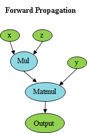
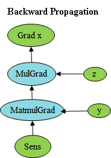

# Programming Forms Overview

## The Concept of Static and Dynamic Graphs

There are two execution modes of the mainstream deep learning frameworks, namely static graph mode and dynamic graph mode.

In static graph mode, the program firstly generates the graph structure of the neural network, then executes the computational operations involved in the graph during compilation execution. Therefore, in static graph mode, the compiler uses techniques such as graph optimization to optimize the execution graph to a greater extent, resulting in better execution performance that helps scale deployment and cross-platform operation.

In dynamic graph mode, the program is executed in the order in which the code is written, and the reverse execution graph is dynamically generated during the execution of the forward process based on the principle of backward propagation. In this mode, the compiler sends down the individual operators in the neural network for execution one by one, making it easy for the user to write and debug the neural network model.

## MindSpore Static Graph

In MindSpore, the static graph mode, also known as Graph mode, can be set to static graph mode by `set_context(mode=GRAPH_MODE)`. Static graph mode is more suitable for scenarios where the network is fixed and high performance is required. In static graph mode, the compiler can perform global optimization for the graph based on techniques such as graph optimization, whole graph offloading of computational graph. Therefore, better performance can be obtained under static graph, but the execution graph is converted from the source code. Not all Python syntax is supported under static graphs.

### Graph Mode Execution Principle

In Graph mode, MindSpore converts Python source code into IR by means of source code conversion, then performs relevant graph optimization based on this, and finally executes the optimized graph on hardware devices. MindSpore uses a functional IR based on graph representation, i.e. MindIR, by using a semantics close to the ANF functional style. The Graph mode is compiled and optimized based on MindIR. To use the Graph mode, you need to use the `nn.Cell` class and write the execution code in the `construct` function or call the `@jit` decorator.

### Graph Mode Auto-differentiation Principle

In MindSpore, the principle of auto-differentiation in Graph mode can be found in [Auto-differentiation](https://www.mindspore.cn/tutorials/en/master/beginner/autograd.html).

## MindSpore Dynamic Graph

In MindSpore, dynamic graph mode is also known as PyNative mode, which can be set to dynamic graph mode by `set_context(mode=PYNATIVE_MODE)`. In script development and network flow debugging, it is recommended to use dynamic graph mode for debugging, which supports the execution of single operators, common functions and networks, and separate gradient solving operations.

### PyNative Mode Execution Principle

In PyNative mode, users can use the full Python API. In addition, for using the API provided by MindSpore, the framework will execute the operations of the operator API on the corresponding hardware platform according to the hardware platform (Ascend, GPU, CPU) selected by the user and return the corresponding results. The overall execution process of the framework is as follows:

In this example, when the Python interface ops.add(x, y) is called, the Python interface call is called to the C++ layer of the framework via Pybind11, and converted to C++ call. Then the framework will select the corresponding hardware device according to the device_target set by the users, and execute the add operation on that hardware device.

From the above principle, we can see that in PyNative mode, Python script code will be executed according to Python syntax, and the execution process involves MindSpore's API, which will be accelerated by executing on different hardware according to user settings. Therefore, in PyNative mode, users can use Python syntax and debugging methods at will, for example, you can use common IDEs such as PyCharm and VS Code to debug code.

### PyNative Mode Auto-differentiation Principle

In the previous introduction, we can see that the execution of the forward procedure under PyNative is performed exactly according to Python syntax. Under PyNative, backward propagation is implemented based on Tensor. We record all the operations applied to Tensor during the execution of the forward process, and for each operation find its reverse, and string all the reverse processes together to form the overall backward propagation graph (reverse graph for short). Eventually, the reverse graph is executed on the device to calculate the gradient.

It can be seen that reversing the input to Mul requires backward propagation gradient values of two input and output, at which point z can be connected to MulGrad based on the actual input values. And so on, for the next operator Matmul, the MatmulGrad information is obtained accordingly, and then the contextual gradient propagation is connected according to the input and output of bprop.

Similarly for the input y derivation, the same procedure can be used for the derivation.

### Control Flow in PyNative Mode

In the PyNative mode, scripts are executed according to the Python syntax, so in MindSpore, there is no special treatment for the control flow syntax, which is directly expanded and executed according to the Python syntax, and automatic differentiation is performed on the expanded execution operator. For example, for a for loop, the statements in the for loop are continuously executed under PyNative and automatic differentiation is performed on the operators according to the specific number of loops.