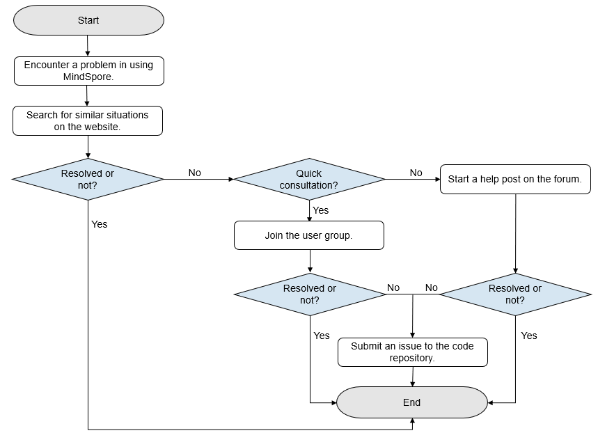

# Seeking Help and Support

This document describes how to seek help and support when you encounter problems in using MindSpore. The following flowchart shows the overall help-seeking process which starts from users encountering a problem in using MindSpore and ends with they finding a proper solution. Help-seeking methods are introduced based on the flowchart.

- Website search

    - Go to the [official search page](https://www.mindspore.cn/search/en).
    - When encountering a problem, search on the official website first, which is simple and efficient.
    - Enter a keyword in the search box and click the search icon. The related content is displayed.
    - Resolve the problem based on the search result.

- User group consultation

    - If you cannot solve the problem using the website search method and want a quick consultation. Get support by joining the [Slack group](https://mindspore.slack.com/join/shared_invite/zt-dgk65rli-3ex4xvS4wHX7UDmsQmfu8w#/ ) and start a conversation with our members.
    - Resolve the problem by asking experts or communicating with other users.

- Forum Help-Seeking

    - If you want a detailed solution, start a help post on the [Ascend forum](https://forum.huawei.com/enterprise/en/forum-100504.html).
    - After the post is sent, a forum moderator collects the question and contacts technical experts to answer the question. The question will be resolved within three working days.
    - Resolve the problem by referring to solutions provided by technical experts.

  If the expert test result shows that the MindSpore function needs to be improved, you are advised to submit an issue in the [MindSpore repository](https://gitee.com/mindspore). Issues will be resolved in later versions.
