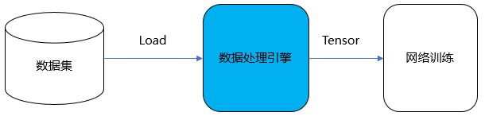
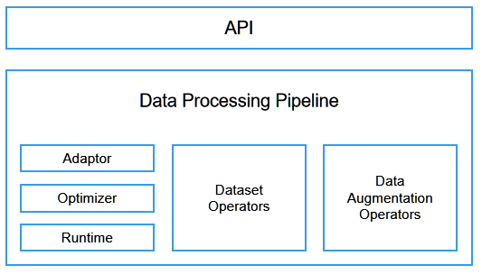
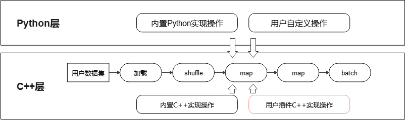
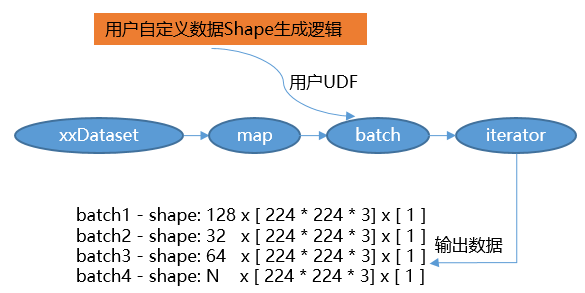
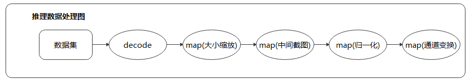
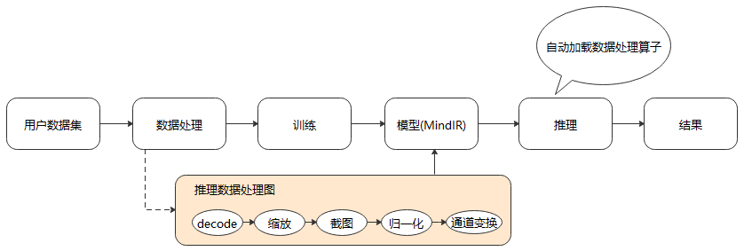
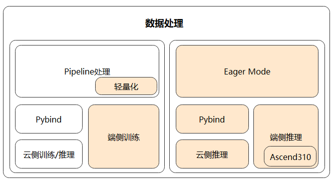

# 高性能数据处理引擎

[](https://gitee.com/mindspore/docs/blob/master/docs/mindspore/source_zh_cn/design/data_engine.md)

## 背景介绍

MindSpore训练数据处理引擎核心是将训练样本（数据集）高效、灵活的转换至Tensor，并将该Tensor提供给训练网络用于训练，其关键特性主要如下：

- 高效数据处理Pipeline，让数据在Pipeline内流动，实现高效处理能力；
- 提供常用数据集、特定格式数据集（MindRecord）、自定义数据集等多样数据加载能力，满足用户多种多样的数据集加载需求；
- 针对多种数据集，提供统一的采样能力，实现一份数据灵活输出；
- 提供大量C++层数据处理操作、Python层数据处理操作，支持用户自定义数据处理操作，方便用户开箱即用；
- 提供MindSpore数据集格式（MindRecord），方便用户将自有数据集转换后，再通过`MindDataset`实现统一高效地加载；
- 提供了自动数据增强模式，能够基于特定策略自动对图像进行数据增强处理；
- 提供单节点数据缓存能力，解决重复加载、处理数据的问题，降低数据处理开销，提升端到端训练效率。

具体用法参考：[数据处理与加载](https://www.mindspore.cn/docs/zh-CN/master/features/dataset/overview.html)



MindSpore训练数据引擎同时也在科学计算-电磁仿真、遥感大幅面图像处理等领域提供数据集的高效加载、采样能力，助力MindSpore实现全场景支持。

## 数据处理引擎设计

### 设计目标与思路

MindSpore的设计充分考虑了数据处理的高效性、灵活性以及在不同场景下的适配性。整个数据处理子系统分为以下模块：



- API：数据处理过程在MindSpore中以图的形式表示，称为数据图。MindSpore对外提供Python API来定义数据图，内部实现图优化和图执行。
- Data Processing Pipeline：数据加载和预处理多步并行流水线，又包括以下部分：

    - Adaptor：用于将上层语言（如Python）构建的数据图，转换为下层可执行的C++数据图（Execution Tree）；
    - Optimizer：数据图优化器，实现算子融合、自动参数优化等操作；
    - Runtime：运行优化后Execution tree的执行引擎；
    - 数据集操作（Dataset Operations）：Execution tree中的某个节点，对应数据处理流水线中的一步具体操作，例如从图像文件夹加载数据的`ImageFolderDataset`和`MindDataset`操作，以及数据处理中的`map`、`shuffle`、`repeat`、`concat`和`split`等操作；
    - 数据增强操作（Data Augmentation Operations）：也可称为Tensor操作，用于对Tensor执行特定变换，例如`Decode`、`Resize`、`Crop`、`Pad`等操作，它们通常被Dataset Operations中的`map`操作所调用。

数据增强后的结果，通过队列和正反向计算系统相连。

基于以上设计，数据处理引擎实现了如下的Pipeline流程：


另外，由于端侧场景资源有限，MindSpore提供了一套更加轻量化的数据处理Eager模式，能够解决云化场景数据处理Pipeline不适用于端侧的问题。用户可以直接对单张图像进行数据处理操作，然后传入模型进行推理。

### 极致的处理性能

- 多段数据处理流水线

    

    不同于TensorFlow和PyTorch，MindSpore采用多段并行流水线（Multi-stage Parallel Pipeline）的方式来构建数据处理Pipeline，可以更加细粒度地规划计算资源的使用。如上图所示，每个数据集操作都包含一个输出Connector，即由一组阻塞队列和计数器组成的保序缓冲队列。每个数据集操作都会从上游操作的Connector中取缓存数据进行处理，然后将这块缓存再推送到自身的输出Connector中，由此往后。这种机制的优势包括：

    - 数据集加载、`map`、`batch`等操作以任务调度机制来驱动，每个操作的任务互相独立，上下文之间通过Connector来实现联通；
    - 每个操作均可以实现细粒度的多线程或多进程并行加速。数据框架为用户提供调整操作线程数和控制多进程处理的接口，可以灵活控制各个节点的处理速度，进而实现整个数据处理Pipeline性能最优；
    - 支持用户对Connector大小进行设置，在一定程度上可以有效的控制内存的使用率，能够适应不同网络对数据处理性能的要求。

    在这种数据处理机制下，对输出数据进行保序处理是保证训练精度的关键。保序是指数据处理流水线运行时，输出数据的顺序和数据处理前的顺序一致。MindSpore采用轮询算法来保证多线程处理时数据的有序性。

    

    上图是一个数据处理Pipeline，保序操作发生在下游`map`操作（4并发）的取出操作中，通过单线程轮询的方式取出上游队列中的数据。Connector内部有两个计数器，`expect_consumer_`记录了已经有多少个`consumer`从`queues_`中取出了数据，`pop_from_`记录了哪个内部阻塞队列将要进行下一次取出操作。`expect_consumer_`对`consumer`取余，而`pop_from_`对`producer`取余。`expect_consumer_`再次为0时，说明所有的`local_queues_`已经处理完上一批任务，可以继续进行下一批任务的分配和处理，进而实现了上游至下游`map`操作的多并发保序处理。

- 数据处理与网络计算流水线

    数据处理流水线不断进行数据处理，并把处理后的数据发送到Device侧的缓存；在一个Step执行结束后，直接从Device的缓存中读取下一个Step的数据。

    

    - 数据处理：负责将数据集处理成网络需要的输入，并传递给发送队列中，保证数据处理的高效性；

    - 发送队列Queue：维护数据列队，保证数据处理与网络计算过程互不影响，充当桥梁的作用；

    - 网络计算：从发送队列中获取数据，进行迭代训练。

    以上三者各司其职，相互独立，构筑整个训练过程Pipeline。因此，只要数据队列不为空，模型训练就不会因为等待训练数据而产生阻塞。

- 缓存技术

    当数据集尺寸较大，无法全部加载到内存缓存中时，训练所用的部分数据需要从磁盘中读取，可能会遇到I/O瓶颈，增大每个Epoch中的缓存命中率就显得尤为关键。传统的缓存管理采用LRU策略，没有考虑深度学习数据的读取特点，即在不同的Epoch之间数据是重复读取的，而在同一个Epoch中则是随机读取。每条数据的读取概率都相同，因此哪个数据被缓存并不重要，反而是已经缓存的数据在被使用之前不被换出更加关键。针对这个特点，我们使用了一个简单高效的缓存算法，即数据一旦被缓存，就不会从缓存中被换出。

    在数据图优化的过程中，MindSpore会根据流水线结构自动生成缓存算子，既可以缓存原始数据集，也可以缓存数据增强处理后的结果。

### 灵活的定制能力

用户对数据处理的需求往往多种多样，对于未固化在框架中的处理逻辑，也需要能够通过开放的定制化能力予以支持。由此，MindSpore提供了灵活的数据集加载方法、丰富的数据处理操作，以及自动数据增强、动态Shape、数据处理Callback等机制，供开发人员在各种场景中使用。

- 灵活的数据集加载方法

    针对数据集种类繁多、格式与组织方式各异的难题，MindSpore提供了三种不同的数据集加载方法：

    - 对于各领域的常用数据集，可以直接使用MindSpore内置的API接口进行加载。MindSpore提供了[CelebADataset](https://www.mindspore.cn/docs/zh-CN/master/api_python/dataset/mindspore.dataset.CelebADataset.html)、[Cifar10Dataset](https://www.mindspore.cn/docs/zh-CN/master/api_python/dataset/mindspore.dataset.Cifar10Dataset.html)、[CocoDataset](https://www.mindspore.cn/docs/zh-CN/master/api_python/dataset/mindspore.dataset.CocoDataset.html)、[ImageFolderDataset](https://www.mindspore.cn/docs/zh-CN/master/api_python/dataset/mindspore.dataset.ImageFolderDataset.html)、[MnistDataset](https://www.mindspore.cn/docs/zh-CN/master/api_python/dataset/mindspore.dataset.MnistDataset.html)、[VOCDataset](https://www.mindspore.cn/docs/zh-CN/master/api_python/dataset/mindspore.dataset.VOCDataset.html)等常用数据集加载接口，在保证性能的同时，能够让用户开箱即用。
    - 对于暂不支持直接加载的数据集，可以先转换为MindSpore数据格式，即MindRecord，再通过[MindDataset](https://www.mindspore.cn/docs/zh-CN/master/api_python/dataset/mindspore.dataset.MindDataset.html)接口进行加载。MindRecord可以将不同的数据集格式归一化，有聚合存储、高效读取、快速编解码、灵活控制分区大小等多种优势。
    - 用户也可以通过Python编写自定义数据集读取类，再使用[GeneratorDataset](https://www.mindspore.cn/docs/zh-CN/master/api_python/dataset/mindspore.dataset.GeneratorDataset.html) 接口进行数据集加载。该方式可以快速集成现有代码，但由于是Python IO Reader，需要额外关注数据加载性能。

- 通过Python层自定义和C++层插件的方式支持更多操作

    

    MindSpore内置了丰富的数据处理操作，根据实现的不同又可分为C++层和Python层操作。C++层操作往往具有更好的性能，而Python层操作则更方便集成第三方库，实现更为容易。对于框架暂不支持的操作，用户可以开发C++层实现代码，编译后以插件的形式注册到MindSpore的数据处理Pipeline中；或者直接在Python层自定义数据处理逻辑，然后通过`map`操作进行调用。

- 支持自动数据增强策略

    MindSpore提供了基于特定策略自动对图像进行增强处理的机制，包括基于概率的自动数据增强和基于反馈的自动数据增强，可以实现操作的自动选择和执行，达到提升训练精度的目的。

    针对ImageNet数据集，利用AutoAugment方法最终搜索出的自动数据增强策略包含 25 个子策略组合，每个子策略包含2种变换，实际训练中针对每幅图像随机挑选1个子策略组合，然后以一定的概率来决定是否执行子策略中的每种变换。其流程如下图所示。

    

    为了支持AutoAugment这种自动数据增强策略，MindSpore提供了以下接口。

    - [RandomChoice](https://www.mindspore.cn/docs/zh-CN/master/api_python/dataset_transforms/mindspore.dataset.transforms.RandomChoice.html)即随机选择，允许用户定义一个数据增强操作列表，数据处理过程中将针对每张图像等概率选择列表中的一个数据增强操作执行。

        ```python
        from mindspore.dataset.transforms import RandomChoice
        from mindspore.dataset.vision import RandomCrop, RandomHorizontalFlip, RandomRotation

        transform_list = RandomChoice([RandomCrop((32, 32)),
                                       RandomHorizontalFlip(0.5),
                                       RandomRotation((90, 90))])
        ```

    - [RandomApply](https://www.mindspore.cn/docs/zh-CN/master/api_python/dataset_transforms/mindspore.dataset.transforms.RandomApply.html)即随机概率执行，允许用户定义一个数据增强操作列表和对应概率，数据处理过程中将针对每张图像以指定的概率执行列表中的数据增强操作，要么全都执行，要么全不执行。

        ```python
        from mindspore.dataset.transforms import RandomApply
        from mindspore.dataset.vision import RandomCrop, RandomHorizontalFlip, RandomRotation

        transform_list = RandomApply([RandomCrop((32, 32)),
                                      RandomHorizontalFlip(0.5),
                                      RandomRotation((90, 90))], 0.8)
        ```

    - [RandomSelectSubpolicy](https://www.mindspore.cn/docs/zh-CN/master/api_python/dataset_vision/mindspore.dataset.vision.RandomSelectSubpolicy.html)即随机子策略选择，允许用户定义多个数据增强操作子策略列表，并对子策略中的每个数据增强操作指定执行的概率，数据处理过程中将针对每张图像先等概率选择一个子策略，然后按顺序依照概率决定其中各个数据增强操作是否执行。

        ```python
        from mindspore.dataset.vision import RandomSelectSubpolicy, RandomRotation, RandomVerticalFlip, \
            RandomHorizontalFlip

        transform_list = RandomSelectSubpolicy([[(RandomRotation((45, 45)), 0.5),
                                                 (RandomVerticalFlip(), 1)],
                                                [(RandomRotation((90, 90)), 1),
                                                 (RandomHorizontalFlip(), 0.5)]])
        ```

    自动数据增强操作可以使ImageNet数据集提升1%左右的训练精度。

- 支持动态shape

    MindSpore通过`per_batch_map`支持用户自定义控制输出训练数据的Shape，满足了网络需要基于不同场景调整数据Shape的诉求。

    

    - 用户通过自定义函数（User Defined Function, UDF）控制生成数据的Shape，例如在第n个Step时生成Shape为(x, y, z, ...)的数据；
    - 通过`batch`操作的`per_batch_map`参数传入该自定义函数，便可得到不同Shape训练数据。

- Callback机制让数据处理更加灵活

    通过Callback机制实现根据训练结果动态调整数据增强逻辑的功能，提供了更加灵活的自动数据增强。

    

    MindSpore支持用户基于数据处理提供的DSCallback（包含Epoch开始、Step开始、Step结束、Epoch结束等）实现自己的数据增强逻辑（User Defined Function, UDF），并将其添加至`map`操作中，以实现更灵活的数据增强操作。

### 端云统一架构

- 数据图与计算图的统一

    MindIR是MindSpore基于图表示的函数式IR，其最核心的目的是服务于自动微分变换。自动微分采用的是基于函数式编程框架的变换方法，因此IR采用了接近于ANF函数式的语义。

    推理数据图典型的场景包括大小缩放、中间截图、归一化和通道变换。

    

    我们将推理数据图以子图的方式保存到生成的模型文件（MindIR）中，便可在推理时通过统一的接口加载模型中的数据处理流程，从而自动进行数据处理，得到模型需要的输入，达到简化用户操作，提升易用性的目的。

    

- 轻量化的数据处理

    数据处理Pipeline在运行过程中会占用比较多的系统资源，包括CPU和内存。以ImageNet的训练过程为例，CPU占用达到20%，内存占用达到30到50G。云侧训练时，能够使用的资源比较充裕，但在端侧场景中，这种需求往往是不可接受的。并且数据处理Pipeline的初始化过程通常比较耗时，同样也不满足端侧需要快速启动、多次进行训练和推理的特点。因此，MindSpore提供了一套更轻量化、更适用于端侧场景的数据处理模式，解决了云化场景数据处理Pipeline不适用于端侧的问题。

    

    MindSpore基于Pipeline调整架构，支持数据处理单操作独立使用（Eager 模式），支持各种场景推理，提供给AI开发人员更大的灵活性；同时，将Pipeline轻量化，实现基于Pull Base的轻量化流水线，减少资源占用并且处理速度快。

通过上述两种方法，MindSpore保证了统一的数据处理架构支撑多种不同的应用场景。
