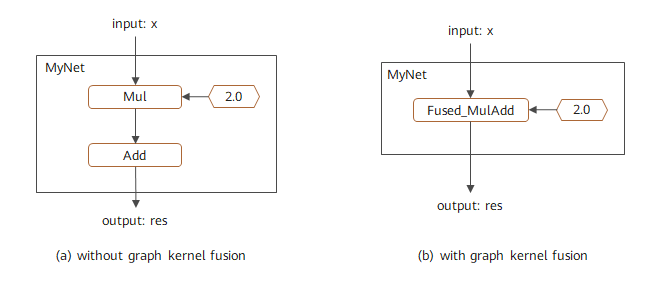
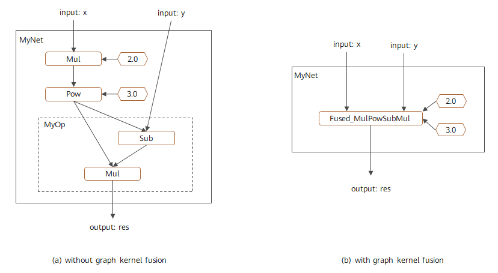

# 使能图算融合

`Ascend` `GPU` `CPU` `模型调优`

<a href="https://gitee.com/mindspore/docs/blob/r1.7/docs/mindspore/source_zh_cn/design/enable_graph_kernel_fusion.md" target="_blank"></a>

## 概述

图算融合是MindSpore特有的网络性能优化技术。它可以通过自动分析和优化现有网络计算图逻辑，并结合目标硬件能力，对计算图进行计算化简和替代、算子拆分和融合、算子特例化编译等优化，以提升设备计算资源利用率，实现对网络性能的整体优化。相比传统优化技术，图算融合具有多算子跨边界联合优化、与MindSpore AKG（基于Polyhedral的算子编译器）跨层协同、即时编译等独特优势。另外，图算融合只需要用户打开对应配置后，整个优化过程即可自动完成，不需要网络开发人员进行其它额外感知，使得用户可以聚焦网络算法实现。

> MindSpore默认自动安装MindSpore AKG。对于CPU后端并且通过源码安装的MindSpore，需确保已正确安装[llvm 12.0.1版本](https://github.com/llvm/llvm-project/archive/refs/tags/llvmorg-12.0.1.tar.gz)。

图算融合的适用场景包括：

- 对网络执行时间具有较高性能要求的场景；
- 通过拼接基本算子实现自定义组合算子，并希望对这些基本算子进行自动融合，以提升自定义组合算子性能的场景。

## 使用方法

当前图算融合优化默认关闭状态，我们只需在训练脚本中为`context`指定参数`enable_graph_kernel=True`即可启用图算融合：

```python
from mindspore import context
context.set_context(enable_graph_kernel=True)
```

> - 图算融合优化只支持Graph模式。
> - 对于CPU平台，图算融合采用了[OpenMP](https://www.openmp.org/)并行计算技术进行算子性能加速。为了获取更好的执行性能，建议配置OMP_NUM_THREADS环境变量以指定OpenMP并行线程数。推荐配置为小于等于当前CPU核数的正整数，如：`export OMP_NUM_THREADS=10`

### 样例脚本

为了说明图算融合优化场景，我们构造了一个简单网络`MyNet`, 包含一个乘法和加法计算。在打开图算融合进行优化之后，这两个计算便会自动合成一个融合算子:

```python
import numpy as np
import mindspore.context as context
from mindspore import Tensor
from mindspore.nn import Cell
import mindspore.ops as ops

context.set_context(mode=context.GRAPH_MODE, device_target="GPU")
# save graph ir to view fusion detail.
context.set_context(save_graphs=True)
# enable graph kernel optimization.
context.set_context(enable_graph_kernel=True)

class MyNet(Cell):
    def __init__(self):
        super(MyNet, self).__init__()
        self.add = ops.Add()
        self.mul = ops.Mul()

    def construct(self, x):
        a = self.mul(x, 2.0)
        res = self.add(a, 1.0)
        return res

x = np.ones((4, 4)).astype(np.float32) * 0.5
net = MyNet()
result = net(Tensor(x))
print("result: {}".format(result))
```

输出结果：

```text
result: [[2. 2. 2. 2.]
 [2. 2. 2. 2.]
 [2. 2. 2. 2.]
 [2. 2. 2. 2.]]
```

该计算图的融合结果如图1所示，其中左图为未使能图算融合时的对应计算图，右图为使能图算融合后的对应计算图。可以看到该网络中的加法和乘法被融合成一个算子。该融合过程可以通过查看中间IR，或者通过Profiling等工具跟踪算子执行过程进行验证。



*图1：图算融合优化计算图*

## 自定义组合算子

基于图算融合技术，用户可以很方便地实现高性能的自定义组合算子。其主要流程为：  

1. 在脚本中用基本算子组合的方式实现自定义算子定义和使用；
2. 打开图算融合配置；
3. 图算融合对自定义组合算子中的基本算子自动进行算子融合，并生成高性能融合算子。

相比其它自定义算子方式，这种方式具有对框架无侵入、简单易用等优点。

### 样例脚本

我们构造一个简单网络`MyNet`，并在其中使用了自定义算子`MyOp`。代码样例如下:

```python
import numpy as np
import mindspore.context as context
from mindspore import Tensor
from mindspore.nn import Cell
import mindspore.ops as ops

context.set_context(mode=context.GRAPH_MODE, device_target="GPU")
# enable graph kernel optimization.
context.set_context(enable_graph_kernel=True)

class MyOp(Cell):
    """ my first custom OP composited by basic OPs """
    def __init__(self):
        super(MyOp, self).__init__()
        self.sub = ops.Sub()
        self.mul = ops.Mul()

    def construct(self, x, y):
        a = self.sub(x, y)
        return self.mul(a, x)

class MyNet(Cell):
    def __init__(self):
        super(MyNet, self).__init__()
        self.mul = ops.Mul()
        self.pow = ops.Pow()
        self.my_op = MyOp()

    def construct(self, x, y):
        a = self.mul(x, 2.0)
        b = self.pow(a, 3.0)
        res = self.my_op(b, y)
        return res

x = np.ones((4, 4)).astype(np.float32) * 0.2
y = np.ones((4, 4)).astype(np.float32) * 0.3
net = MyNet()
result = net(Tensor(x), Tensor(y))
print("result: {}".format(result))
```

输出结果：

```text
result: [[-0.015104 -0.015104 -0.015104 -0.015104]
 [-0.015104 -0.015104 -0.015104 -0.015104]
 [-0.015104 -0.015104 -0.015104 -0.015104]
 [-0.015104 -0.015104 -0.015104 -0.015104]]
```

该计算图的融合结果如图2所示，其中左图为未使能图算融合时的对应计算图，右图为使能图算融合后的对应计算图。可以看到不仅自定义算子`MyOp`中的基本算子进行了融合，并且与主图中的其他算子也进行了更大范围融合。该融合过程可以通过查看中间IR，或者通过Profiling等工具跟踪算子执行过程进行验证。



*图2：自定义组合算子优化计算图*
