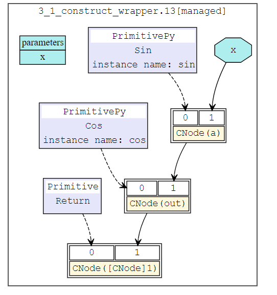

# 函数式可微分编程

`Ascend` `GPU` `CPU` `设计` `模型开发`

<a href="https://gitee.com/mindspore/docs/blob/r1.7/docs/mindspore/source_zh_cn/design/gradient.md" target="_blank"></a>

## 自动微分简介

深度学习等现代AI算法通过使用大量的数据来学习拟合出一个优化后带参模型，其中使用的学习算法多是基于现实数据自模型中的经验误差来反向传播以更新模型的参数，自动微分技术（Automatic Differentiation， AD）正是其中的关键技术。

自动微分是一种介于数值微分与符号微分之间的一种求导方法。自动微分的核心思想是将计算机程序中的运算操作分解为一个有限的基本操作合集，且合集中基本操作的求导规则均为已知的。 在完成每一个基本操作的求导后，使用链式求导法则将结果组合得到整体程序的求导结果。

链式求导法则： $(f\circ g)^{'}(x)=f^{'}(g(x))g^{'}(x)$

根据对分解后的基本操作求导和链式规则的组合不同，自动微分可以分为前向模式和反向模式。

我们以下方函数为例介绍前向微分与反向微分的具体计算方式：

$$y=f(x_{1},x_{2})=ln(x_{1})+x_{1}x_{2}-sin(x_{2})$$

当我们使用前向自动微分求取函数在$x_{1}=2,x_{2}=5$处的导数$\frac{\partial y}{\partial x_{1}}$时，前向自动微分的求导方向与原函数的求值方向一致，原函数结果与微分结果可以被同时获得。


当使用反向自动微分时，反向自动微分的求导方向与原函数的求值方向相反，微分结果需要依赖原函数的运行结果。


MindSpore先构建的是基于反向自动微分的GradOperation方法，并在该方法的基础上实现了正向微分。

为了进一步说明前向微分与反向微分的区别， 我们将被求导的原函数泛化为具有N输入与M输出的函数F：

$$ (Y_{1},Y_{2},...,Y_{M})=F(X_{1},X_{2},...,X_{N})$$

F函数的导数本身为一个雅可比矩阵(Jacobian matrix)。

$$
 \left[
 \begin{matrix}
   \frac{\partial Y_{1}}{\partial X_{1}}& ... & \frac{\partial Y_{1}}{\partial X_{N}} \\
   ... & ... & ... \\
   \frac{\partial Y_{M}}{\partial X_{1}} & ... & \frac{\partial Y_{M}}{\partial X_{N}}
  \end{matrix}
  \right]
$$

### 前向自动微分

在前向自动微分当中，我们是从输入开始向输出的方向计算的，因此每一次计算我们可以求得输出对某一输入的导数，即雅可比矩阵中的一列。

$$
 \left[
 \begin{matrix}
   \frac{\partial Y_{1}}{\partial X_{1}}\\
   ...  \\
   \frac{\partial Y_{M}}{\partial X_{1}}
  \end{matrix}
  \right]
$$

为了求取该列的值， 自动微分将程序分解为一系列求导规则已知的基本操作，这些基本操作也可以被泛化表达为具有$n$输入和$m$输出的函数$f$：

$$ (y_{1},y_{2},...,y_{m})=f(x_{1},x_{2},...,x_{n})$$

由于我们的已知基础函数$f$的求导规则，即$f$的雅可比矩阵是已知的。 于是我们可以对$f$计算雅可比向量积（Jvp, Jacobian-vector-product），并应用链式求导法则获得导数结果。

$$
 \left[
 \begin{matrix}
   \frac{\partial y_{1}}{\partial X_{i}}\\
   ...  \\
   \frac{\partial y_{m}}{\partial X_{i}}
  \end{matrix}
  \right]=\left[
 \begin{matrix}
   \frac{\partial y_{1}}{\partial x_{1}}& ... & \frac{\partial y_{1}}{\partial x_{n}} \\
   ... & ... & ... \\
   \frac{\partial y_{m}}{\partial x_{1}} & ... & \frac{\partial y_{M}}{\partial x_{n}}
  \end{matrix}
  \right]\left[
 \begin{matrix}
   \frac{\partial x_{1}}{\partial X_{i}}\\
   ...  \\
   \frac{\partial x_{n}}{\partial X_{i}}
  \end{matrix}
  \right]
$$

### 反向自动微分

在反向自动微分当中，我们是从输出开始向输入的方向计算的，因此每一次计算我们可以求得某一输出对输入的导数，即雅可比矩阵中的一行。

$$
 \left[
 \begin{matrix}
   \frac{\partial Y_{1}}{\partial X_{1}}& ... & \frac{\partial Y_{1}}{\partial X_{N}} \\
  \end{matrix}
  \right]
$$

为了求取该列的值， 自动微分将程序分解为一系列求导规则已知的基本操作，这些基本操作也可以被泛化表达为具有n输入和m输出的函数$f$：

$$ (y_{1},y_{2},...,y_{m})=f(x_{1},x_{2},...,x_{n})$$

由于我们的已知基础函数$f$的求导规则，即f的雅可比矩阵是已知的。 于是我们可以对$f$计算向量雅可比积(Vjp, Vector-jacobian-product)，并应用链式求导法则获得导数结果。

$$
 \left[
 \begin{matrix}
   \frac{\partial Y_{j}}{\partial x_{1}}& ... & \frac{\partial Y_{j}}{\partial x_{N}} \\
  \end{matrix}
  \right]=\left[
 \begin{matrix}
   \frac{\partial Y_{j}}{\partial y_{1}}& ... & \frac{\partial Y_{j}}{\partial y_{m}} \\
  \end{matrix}
  \right]\left[
 \begin{matrix}
   \frac{\partial y_{1}}{\partial x_{1}}& ... & \frac{\partial y_{1}}{\partial x_{n}} \\
   ... & ... & ... \\
   \frac{\partial y_{m}}{\partial x_{1}} & ... & \frac{\partial y_{m}}{\partial x_{n}}
  \end{matrix}
  \right]
$$

## GradOperation实现

GradOperation使用的是反向自动微分模式，即从正向网络的输出开始计算梯度。

### GradOperation算法设计

设模型定义的原函数为：$f(g(x, y, z))$ ，
则$f$对$x$的梯度为：$\frac{df}{dx}=\frac{df}{dg}\frac{dg}{dx}\frac{dx}{dx}+\frac{df}{dg}\frac{dg}{dy}\frac{dy}{dx}+\frac{df}{dg}\frac{dg}{dz}\frac{dz}{dx}$, $\frac{df}{dy}$和$\frac{df}{dz}$与$\frac{df}{dx}$类似。

应用链式求导法则，对每个函数(包括算子和图)定义梯度函数`bprop: dout->(df, dinputs)`，这里`df`表示函数对自由变量（函数外定义的变量）的梯度，`dinputs`是对函数输入的梯度。在此基础上，应用全微分法则，将`(df, dinputs)`累加到对应的变量。

MindSporeIR实现了分支，循环，闭包的函数表达式，所以对相应的算子实现正确的反向规则即可求得输入函数的梯度函数。
定义运算符K，反向自动微分算法可以简单表示如下：

```text
v = (func, inputs)
F(v): {
    (result, bprop) = K(func)(K(inputs))
    df, dinputs = bprop(dout)
    v.df += df
    v.dinputs += dinputs
}
```

### GradOperation算法实现

在自动微分流程中，需要进行自动微分的函数会被取出。并作为自动微分模块的输入, 并输出对应的梯度图。 自动微分模块实现了从原函数对象到梯度函数对象的转换。转换后的对象为`fprop`形式的梯度函数对象。`fprop = (forward_result, bprop)`, `forward_result`是前向计算图的输出节点， `bprop`是以`fprop`的闭包对象形式生成的梯度函数，它只有`dout`一个入参， `inputs`和`outputs`是引用的`fprop`的输入和输出。

```c++
  MapObject(); // 实现ValueNode/Parameter/FuncGraph/Primitive对象的映射
  MapMorphism(); // 实现CNode的态射
  res = k_graph(); // res就是梯度函数的fprop对象
```

在生成梯度函数对象的过程中，需要完成从原函数到梯度函数的一系列的映射， 即为每个原函数中的节点生成其所对应的梯度函数的节点，再按照反向自动微分的规则将这些节点连接在一起，生成梯度函数图。 每张原函数对象的子图都会都会生成一个`Dfunctor`对象，负责将该原函数对象映射为梯度函数对象。`DFunctor`主要需要经过 `MapObject`, `MapMorphism`两步来实现这种映射关系。

`MapObject`实现了原函数节点到梯度函数节点的映射，具体包括对自由变量，参数节点以及ValueNode的映射。

```c++
MapFvObject(); // 自由变量的映射
MapParamObject(); // 参数节点的映射
MapValueObject(); // ValueNode的映射
```

`MapFvObject`是对自由变量的映射， `MapParamObject`是对参数节点的映射。 `MapValueObject`中主要对`Primitive`以及`FuncGraph`对象进行映射。其中，对`FuncGraph`进行的映射同样需要为该子图创造相应的`DFunctor`，是一个递归的过程。 `Primitive`表明了算子的种类，为了支持自动微分，需要为每一种`Primitive`定义其对应的反向微分函数。 MindSpore将这些定义放在了Python侧，以`sin`算子为例：

```python
@bprop_getters.register(P.Sin)
def get_bprop_sin(self):
    """Grad definition for `Sin` operation."""
    cos = P.Cos()

    def bprop(x, out, dout):
        dx = dout * cos(x)
        return (dx,)

    return bprop
```

`x`为原函数对象`sin`的输入，`out`为原函数对象`sin`的输出，`dout`为当前累加的梯度输入。

当`MapObject`完成对以上节点的映射后，`MapMorphism`从原函数的输出节点开始以递归的方式实现对`CNode`的态射，建立起节点间的反向传播链接，实现梯度累加。

### GradOperation示例

我们构建一个简单的网络，并对其输入`x`求导， 网络的结构为：

```python
class Net(nn.Cell):
    def __init__(self):
        super(Net, self).__init__()
        self.sin = ops.Sin()
        self.cos = ops.Cos()

    def construct(self, x):
        a = self.sin(x)
        out = self.cos(a)
        return out
```

正向网络的结构为：



对该网络进行反向微分后，所得微分网络结构为：


## 前向自动微分实现

除了支持反向自动微分的GradOperation之外，MindSpore还扩展实现了前向自动微分Jvp（Jacobian-Vector-Product）。相比于反向自动微分，前向自动微分更适合于求取输入维度小于输出维度的网络的梯度。MindSpore的前向自动微分是基于反向自动微分接口GradOperation开发的。


黑色为网络的正向流程，第一次求导为针对$x$的求导，得到的是蓝色的图。第二次的为蓝色图针对$v$的求导，得到的是黄色的图。黄色的图就是我们所需要的前向模式自动微分的结果图。由于蓝色图可以视为关于$v$的线性函数，蓝色节点与黄色节点之间不会存在连边。蓝色节点全部为悬空节点，会被消除，真正运行的就只有原函数节点以及前向微分的节点。因此，该方法不会有额外的运行开销。

### 参考文献

[1] Baydin, A.G. et al., 2018. Automatic differentiation in machine learning: A survey. arXiv.org. Available at: <https://arxiv.org/abs/1502.05767> [Accessed September 1, 2021].
