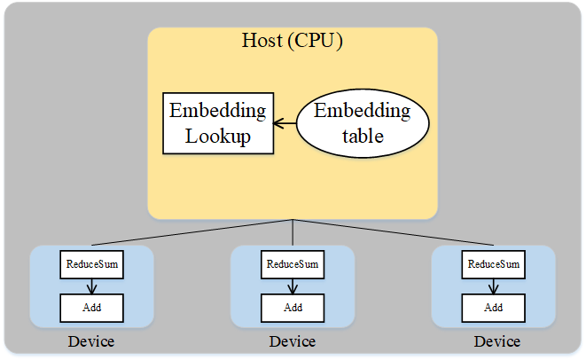

# Host&Device异构

`Ascend` `GPU` `分布式并行` `全流程`

<a href="https://gitee.com/mindspore/docs/blob/r1.7/docs/mindspore/source_zh_cn/design/host_device_training.md" target="_blank"></a>

## 概述

在深度学习中，工作人员时常会遇到超大模型的训练问题，即模型参数所占内存超过了设备内存上限。为高效地训练超大模型，一种方案便是分布式并行训练，也就是将工作交由同构的多个加速器（如Ascend 910 AI处理器，GPU等）共同完成。但是这种方式在面对几百GB甚至几TB级别的模型时，所需的加速器过多。而当从业者实际难以获取大规模集群时，这种方式难以应用。另一种可行的方案是使用主机端（Host）和加速器（Device）的混合训练模式。此方案同时发挥了主机端内存大和加速器端计算快的优势，是一种解决超大模型训练较有效的方式。

在MindSpore中，用户可以将待训练的参数放在主机，同时将必要算子的执行位置配置为主机，其余算子的执行位置配置为加速器，从而方便地实现混合训练。此教程以推荐模型[Wide&Deep](https://gitee.com/mindspore/models/tree/r1.7/official/recommend/wide_and_deep)为例，讲解MindSpore在主机和Ascend 910 AI处理器的混合训练。

## 基本原理

流水线并行和算子级并行适用于模型的算子数量较大，同时参数较均匀的分布在各个算子中。如果模型中的算子数量较少，同时参数只集中在几个算子中呢？Wide&Deep就是这样的例子，如下图所示。Wide&Deep中的Embedding table作为需训练的参数可达几百GB甚至几TB，若放在加速器(device)上执行，那么所需的加速器数量巨大，训练费用昂贵。另一方面，若使用加速器计算，其获得的训练加速有限，同时会引发跨服务器的通信量，端到端的训练效率不会很高。


*图：Wide&Deep模型的部分结构*

仔细分析Wide&Deep模型的特殊结构后可得：Embedding table虽然参数量巨大，但其参与的计算量很少，可以将Embedding table和其对应的算子EmbeddingLookup算子放置在Host端，利用CPU进行计算，其余算子放置在加速器端。这样做能够同时发挥Host端内存量大、加速器端计算快的特性，同时利用了同一台服务器的Host到加速器高带宽的特性。下图展示了Wide&Deep异构切分的方式：



*图：Wide&Deep异构方式*

## 操作实践

### 样例代码说明

1. 准备模型代码。Wide&Deep的代码可参见：<https://gitee.com/mindspore/models/tree/r1.7/official/recommend/wide_and_deep>，其中，`train_and_eval_auto_parallel.py`脚本定义了模型训练的主流程，`src/`目录中包含Wide&Deep模型的定义、数据处理和配置信息等，`script/`目录中包含不同配置下的训练脚本。

2. 准备数据集。请参考[1]中的论文所提供的链接下载数据集，并利用脚本`src/preprocess_data.py`将数据集转换为MindRecord格式。

3. 配置处理器信息。在裸机环境（即本地有Ascend 910 AI 处理器）进行分布式训练时，需要配置加速器信息文件。此样例只使用一个加速器，故只需配置包含0号卡的`rank_table_1p_0.json`文件。MindSpore提供了生成该配置文件的自动化生成脚本及相关说明，可参考[HCCL_TOOL](https://gitee.com/mindspore/models/tree/r1.7/utils/hccl_tools)。

### 配置混合执行

1. 配置混合训练标识。在`default_config.yaml`文件中，设置`host_device_mix`默认值为`1`：

    ```python
    host_device_mix: 1
    ```

2. 检查必要算子和优化器的执行位置。在`src/wide_and_deep.py`的`WideDeepModel`类中，检查`EmbeddingLookup`为主机端执行：

    ```python
    self.deep_embeddinglookup = nn.EmbeddingLookup()
    self.wide_embeddinglookup = nn.EmbeddingLookup()
    ```

    在`src/wide_and_deep.py`文件的`class TrainStepWrap(nn.Cell)`中，检查两个优化器主机端执行的属性。

    ```python
    self.optimizer_w.target = "CPU"
    self.optimizer_d.target = "CPU"
    ```

### 训练模型

为了保存足够的日志信息，需在执行脚本前使用命令`export GLOG_v=1`将日志级别设置为INFO，且在MindSpore编译时添加-p on选项。如需了解MindSpore编译流程，可参考[编译MindSpore](https://www.mindspore.cn/install/detail?path=install/master/mindspore_ascend_install_source.md&highlight=%E7%BC%96%E8%AF%91mindspore)。

使用训练脚本`script/run_auto_parallel_train.sh`。执行命令：`bash run_auto_parallel_train.sh 1 1 <DATASET_PATH> <RANK_TABLE_FILE>`。
其中第一个`1`表示用例使用的卡数，第二`1`表示训练的epoch数，`DATASET_PATH`是数据集所在路径，`RANK_TABLE_FILE`为上述`rank_table_1p_0.json`文件所在路径。

运行日志保存在`device_0`目录下，其中`loss.log`保存一个epoch内多个loss值，其值类似如下：

```text
epoch: 1 step: 1, wide_loss is 0.6873926, deep_loss is 0.8878349
epoch: 1 step: 2, wide_loss is 0.6442529, deep_loss is 0.8342661
epoch: 1 step: 3, wide_loss is 0.6227323, deep_loss is 0.80273706
epoch: 1 step: 4, wide_loss is 0.6107221, deep_loss is 0.7813441
epoch: 1 step: 5, wide_loss is 0.5937832, deep_loss is 0.75526017
epoch: 1 step: 6, wide_loss is 0.5875453, deep_loss is 0.74038756
epoch: 1 step: 7, wide_loss is 0.5798845, deep_loss is 0.7245408
epoch: 1 step: 8, wide_loss is 0.57553077, deep_loss is 0.7123517
epoch: 1 step: 9, wide_loss is 0.5733629, deep_loss is 0.70278376
epoch: 1 step: 10, wide_loss is 0.566089, deep_loss is 0.6884129
```

`test_deep0.log`保存pytest进程输出的详细的运行时日志，搜索关键字`EmbeddingLookup`，可找到如下信息：

```text
[INFO] DEVICE(109904,python3.7):2020-06-27-12:42:34.928.275 [mindspore/ccsrc/device/cpu/cpu_kernel_runtime.cc:324] Run] cpu kernel: Default/network-VirtualDatasetCellTriple/_backbone-NetWithLossClass/network-WideDeepModel/EmbeddingLookup-op297 costs 3066 us.
[INFO] DEVICE(109904,python3.7):2020-06-27-12:42:34.943.896 [mindspore/ccsrc/device/cpu/cpu_kernel_runtime.cc:324] Run] cpu kernel: Default/network-VirtualDatasetCellTriple/_backbone-NetWithLossClass/network-WideDeepModel/EmbeddingLookup-op298 costs 15521 us.
```

表示`EmbeddingLookup`在主机端的执行时间。
继续在`test_deep0.log`搜索关键字`FusedSparseFtrl`和`FusedSparseLazyAdam`，可找到如下信息：

```text
[INFO] DEVICE(109904,python3.7):2020-06-27-12:42:35.422.963 [mindspore/ccsrc/device/cpu/cpu_kernel_runtime.cc:324] Run] cpu kernel: Default/optimizer_w-FTRL/FusedSparseFtrl-op299 costs 54492 us.
[INFO] DEVICE(109904,python3.7):2020-06-27-12:42:35.565.953 [mindspore/ccsrc/device/cpu/cpu_kernel_runtime.cc:324] Run] cpu kernel: Default/optimizer_d-LazyAdam/FusedSparseLazyAdam-op300 costs 142865 us.
```

表示两个优化器在主机端的执行时间。

## 参考文献

[1] Huifeng Guo, Ruiming Tang, Yunming Ye, Zhenguo Li, Xiuqiang He. [DeepFM: A Factorization-Machine based Neural Network for CTR Prediction.](https://doi.org/10.24963/ijcai.2017/239) IJCAI 2017.