# 多级编译架构

## 背景

随着深度学习大模型时代的到来，网络规模越来越大，对图编译性能、执行性能和调试调优效率的挑战也越来越大。为此，MindSpore提出多级编译架构，提供O0/O1/O2三档编译执行模式，它们在图优化、算子融合、内存管理以及执行模式等方面有所不同，旨在提供图模式的多样性选择，用户可以根据自己的网络特点和需求，选择最适合的编译执行模式：

1. O0模式：这是一个基础的编译执行模式，除必要影响功能的优化外，其他优化均关闭，使用单算子执行的执行方式。因此执行性能可能不是最优，但它的优点是可以保证图的原始结构，方便用户进行调试和理解，编译性能也较好。如下图中的Add和Mul单算子执行。
2. O1模式：这个模式会进行一些基础的优化，比如常用图优化和自动算子融合优化，使用单算子执行的执行方式。相比O0，由于使能了融合优化，可以提高执行性能，但可能会影响到图的原始结构，因此编译性能和调试调优效率有所损失。如下图中的Add跟Mul融合成一个fused_op执行。
3. O2模式：这是一个更高级的优化模式，跟O0/O1有本质的区别，使用整图下沉的执行方式。由于增加了图转换开销，因此编译性能损失较大，并且会对图的原始结构产生更大的影响，使得调试和理解变得更加困难。由于没有host调度开销，因此在host bound场景下性能提升较为明显。如下图中的Add跟Mul转换成整图graph下沉执行。

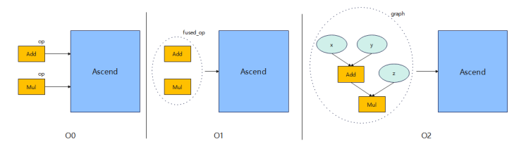

## 多级编译架构概述

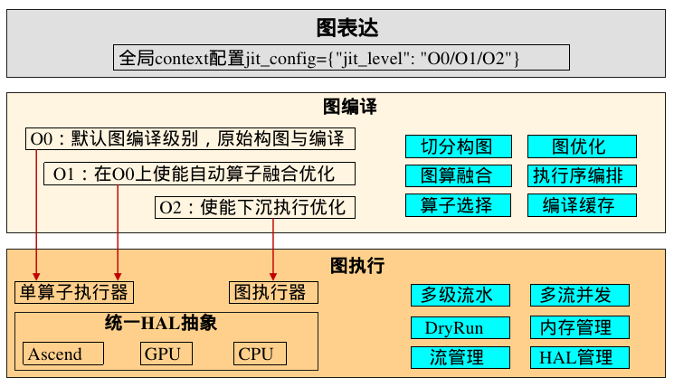

1. 图表达：通过context接口jit_config={"jit_level": "O0/O1/O2"}来配置多级编译级别。默认Altas训练产品为O2，其余产品均O0。
2. 图编译：根据配置的多级编译级别，选择不同的编译模式，其中O0为最基础的原生构图与编译，O1在O0基础增加了自动算子融合功能，O2则主要是整图下沉执行。
3. 图执行：O0跟O1均为单算子执行器，通过运行时多级流水提升host调度性能；O2为整图执行器，无host调度开销。

## O0模式介绍

O0为基础的图编译执行模式，除必要影响功能的优化外，其他优化均关闭，使用原生的图结构进行编译和执行，方便调试调优，具备较好的编译性能。下面按章节一一介绍O0基础特性。

### 切分构图

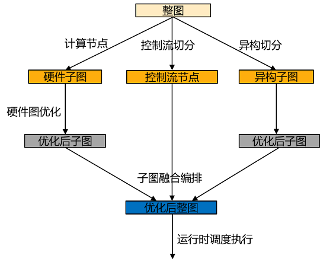

MindIR是一种基于图表示的函数式IR，表达的语法较为丰富，支持复杂的控制流表达和异构表达。从MindIR到后端硬件算子执行的过程中，需要经过后端图处理以及运行时调度，尤其硬件能力无法支持复杂控制流以及CPU异构的执行。因此，需要对MindIR进行切分构建子图，将切分后的子图在硬件上做图优化，运行时将优化后的子图和切分的节点连接好下发执行。

### 图优化

O0模式的图优化较少，基础的优化主要为后端LazyInline和No-task node执行优化，下面一一介绍。

- **后端LazyInline**

  **LazyInline**：主要思想是将函数调用的开销推迟到实际需要调用的时候，这样可以减少编译时的开销，提高编译效率。LazyInline在图编译阶段是将相同的子图结构复用，不展开放在图中，避免图规模较大导致影响编译性能。

  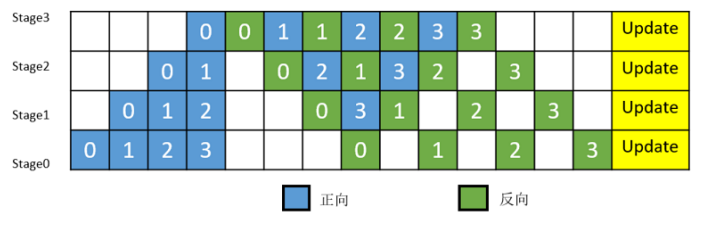

  **流水线（Pipeline）并行**：将神经网络中的算子切分成多个Stage，再把Stage映射到不同的设备上，使得不同设备去计算神经网络的不同部分。为了提升效率，流水线并行进一步将小批次(MiniBatch)切分成更细粒度的微批次(MicroBatch)，在微批次中采用流水线式的调度，从而达到提升效率的目的。

  **后端LazyInline**：由于Pipeline并行的MicroBatch切分会导致整个计算图扩张到MicroBatch的数量倍，从而导致模型规模巨大，编译性能时间较长（可能小时级别）。而这些Micro子图结构都是一样的，为了解决编译性能问题，LazyInline技术则非常契合，不过LazyInline带来的问题就是运行时无法采用最优的方式进行内存复用和流分配、无法做跨图的优化（内存优化、通信融合、算子融合等）等问题。为此，在图编译结束后，在图执行之前，将这些Micro子图做实际的节点Inline，以形成完整的全局整图，再通过图Inline后的内存优化、通信优化、冗余计算消除等方式，从而实现在编译性能、执行性能、执行内存方面都兼顾的目标。

- **No-task node执行优化**

  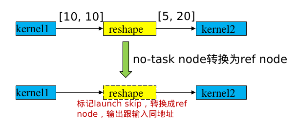

  No-task node指的是Reshape、ExpandDims、Squeeze、Flatten、FlattenGrad、Reformat等诸类算子没有计算逻辑，不修改内存排布，仅修改shape、format等信息。在图编译结束后，将No-task node转换成ref node，输出跟输入同地址，执行过程中跳过kernel launch，从而达到执行性能优化目的。

### 算子选择

算子是深度学习框架中的基本执行单元，它们负责执行特定的计算任务，如矩阵乘法、卷积、池化等。算子选择需要综合考虑算子类型、数据类型、硬件平台和算子优化等因素，以选择最优的算子来实现深度学习任务。

MindSpore Ascend后端的算子类型有Aclnn kernel/Aclop kernel/Hccl kernel /Cpu kernel，算子选择流程如下图所示：

1. 算子类型：首先根据算子类型选择为计算算子还是通信算子。
2. 硬件平台：如果硬件上有对应算子，则优先选择硬件上的算子，否则选择CPU上的异构算子，例如shape相关的计算算子可能只适合在CPU上支持，没有对应的硬件算子。
3. 算子效率：Ascend上由于Aclnn算子较好的性能，因此计算类型算子如果有对应Aclnn kernel，则优先选择Aclnn kernel，否则就选择Aclop kernel。
4. 如果上述3步都未选择到算子，则为不支持的算子，算子选择失败退出。

### 执行序编排

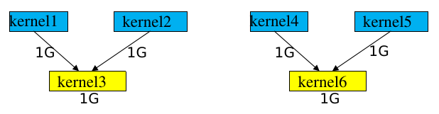

不同图遍历算法产生的执行序在执行性能跟内存上会有较大的差异，如上图所示：

- **BFS得到的执行序**：kernel1-> kernel2-> kernel4-> kernel5-> kernel3-> kernel6，内存峰值为5G（kernel3执行后可以把kernel1和kernel2的释放掉，则轮到kernel6执行的时候则能复用，因此kernel6 不用额外申请多的内存）。
- **DFS得到的执行序**：kernel1-> kernel2-> kernel3-> kernel4-> kernel5-> kernel6，内存峰值为4G（kernel3执行后可以把kernel1和kernel2的释放掉，则轮到kernel4和kernel5执行的时候则能复用，因此kernel4和kernel5不用额外申请多的内存）。

执行序编排是在一定内存限制下求解最优算子并发的复杂性问题，不仅需要识别和利用计算图中的并发机会，以提升计算效率，还必须同时考虑多种限制条件，以确保系统的稳定性和高效性。

- 首先，优化模块需要解决求解最优算子并发的复杂性问题。由于计算图中的算子数量庞大且相互依赖，找到一个既能最大化并发又能保持计算图逻辑正确性的执行顺序是一个极具挑战性的任务。
- 其次，内存限制是执行序优化中不可忽视的关键因素。增大并发虽然可以提升计算效率，但往往会显著增加峰值内存需求，从而可能导致内存溢出（OOM）错误，尤其是在资源受限的环境中。因此，优化模块必须权衡并发与内存使用之间的关系，确保在提升并发的同时，不会超出系统的内存容量。
- MindSpore的执行序调整模块结合了基于规则和基于启发式策略的方式，提供bfs/dfs两种执行序编排算法，以实现对计算图执行顺序的精细调整，从而在保证计算效率的同时，有效应对内存限制和系统稳定性等多重挑战。

### 编译缓存

编译缓存是指在图的首次编译过程中将已经编译过的计算图缓存起来，以便在下一次训练时可以直接使用，而不需要重新编译，主要用于提升集群故障恢复训练效率。大模型大集群训练场景下，由于大集群出现故障概率较大，二次断点续训的频率非常高，再加上大模型的图规模较大，往往图的编译耗时较长。因此，有了图编译缓存功能的加持，能大大提高集群故障恢复训练效率。

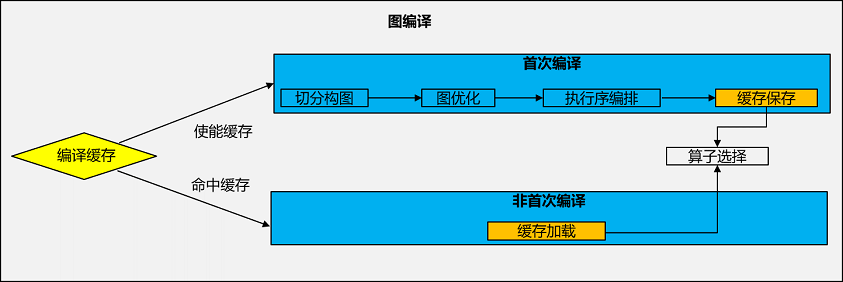

### 多级流水

多级流水是运行时的关键性能优化功能点，对于一个算子的调度，运行时需要处理InferShape（含更新shape）、Resize（含tiling计算和更新内存大小）和Launch（含内存申请和释放）。如果这些过程在host串行处理的话，极容易导致host处理时间较长，从而导致device执行等待，影响执行性能。为此，我们针对算子的调度实现了多级流水功能，将InferShape、Resize和Launch通过Infer Queue、Resize Queue和Launch Queue三个队列流水并行起来，从而大大提升运行时调度性能：

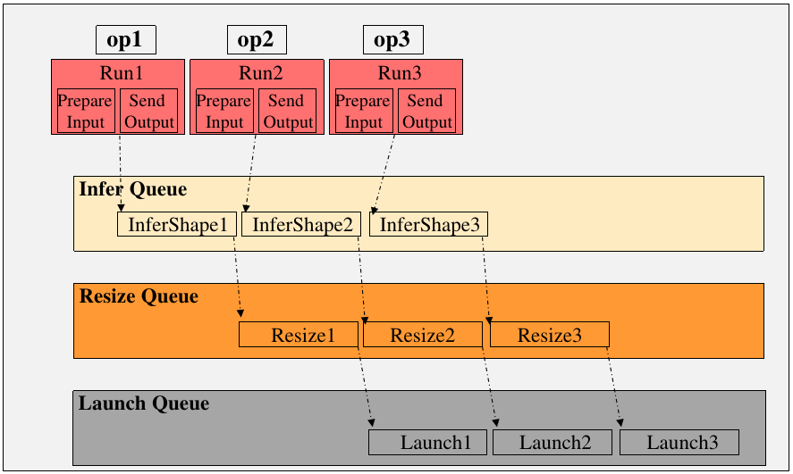

首算子收集到输入后，只需要将InferShape的task下发到Infer队列，即可将算子的输出数据发给下一个算子，InferShape完成后将该算子的Resize task下发到Resize队列，最后Resize完成后将LaunchKernel task下发到Launch队列。

### 多流并发

在大规模深度学习模型的训练过程中，为了尽量多的做到通信跟计算的overlap，通信和计算多流并发对于执行性能的重要性不言而喻。为了应对这一挑战，MindSpore在其框架中实现了自动流分配和event插入功能，以优化计算图的执行效率和资源利用率。这些功能的引入，不仅提升了计算图的并发能力，还显著减少了设备内存开销，从而在大模型训练中实现了更高的性能和更低的延迟。

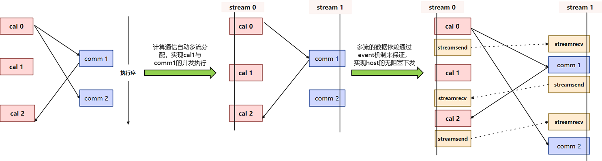

传统的多流并发方法通常依赖于手动配置，这不仅繁琐且容易出错，而且在面对复杂的计算图时，手动配置往往难以达到最优的并发效果。MindSpore的自动流分配功能通过智能算法，自动识别和分配计算图中的并发机会，将不同的算子分配到不同的流中执行。这种自动化的分配过程不仅简化了用户的操作，还能够在运行时动态调整流分配策略，以适应不同的计算环境和资源状况。

### 内存管理

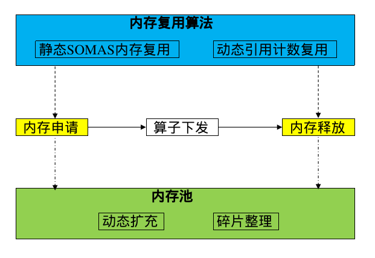

内存是AI模型训练中最为重要的资源，内存管理无疑是深度学习框架中极为关键的功能，负责模型的内存分配和复用，对内存分配释放性能以及内存复用效率的要求都非常高。内存管理体现主要为算子下发前对算子进行内存分配，下发后内存释放为了后面算子复用，关键功能点为内存池和内存复用算法。

**内存池**：作为内存管理的底座，主要使用BestFit最佳适应内存分配算法，支持动态扩充内存块和碎片整理：

1. 切分操作：内存分配时，空闲区按其大小排序，找到第一个满足要求的空闲区，按需分配，切分多余部分，插入新的空闲内存块。
2. 合并操作：内存回收时，相邻的空闲内存块被回收，合并为一个大的空闲内存块。
3. 扩充操作：内存分配时，当空闲区没有满足要求的空闲内存则通过接口申请一定大小的内存扩充内存池。
4. 碎片整理：内存分配时，当单个空闲内存不足以分配，但是实际剩余内存足够时会出触发碎片整理从而腾挪出一整块空闲内存。

**内存复用算法**：作为内存管理的核心竞争力，分为静态SOMAS复用和动态引用计数复用，两种算法各有优缺点，更多场景下是两者算法的结合使用，根据网络结构特点按需选择使用：

- 静态SOMAS：SOMAS（Safe Optimized Memory Allocation Solver ）将计算图并行流与数据依赖进行聚合分析，得到算子间祖先关系构建张量全局生命期互斥约束，使用多种启发式算法求解最优的内存静态规划，最小化内存碎片，实现逼近理论极限的内存复用。静态SOMAS为图编译阶段分析图阶段获取最优内存规划，但是动态shape由于编译阶段无法获取真实shape而无法使用。
- 动态引用计数：执行过程中分配内存，完全动态，编译阶段不提前分析图结构，即来即申请，根据引用计数确保使用完就释放，达到动态复用效果。动态引用计数在执行过程中动态分配，适用于任何场景，但是容易产生碎片。

### 流管理

MindSpore的设备流管理是框架后端中的一项关键功能，旨在高效管理和调度计算设备上的流（Stream），以优化计算图的执行效率和资源利用率。设备流管理通过智能的流分配和调度策略，确保在多计算资源的环境中，计算、通信任务能够高效并发执行，从而提升整体性能。

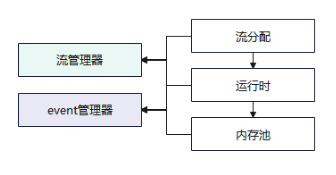

在MindSpore的架构中， **流管理器（Stream Manager）** 扮演着核心角色。它负责流的创建、分配和销毁，确保每个计算任务都能在合适的流上执行。流管理器根据任务的类型、优先级以及设备的负载情况，将任务调度到不同的流上，以实现最佳的资源利用和任务并发度。**事件管理器（Event Manager）** 则负责监控和管理流之间的同步和依赖关系。通过事件的记录和触发，事件管理器确保不同流上的任务能够按照正确的顺序执行，避免数据竞争和资源冲突。事件管理器还支持异步事件（如内存回收）的触发和处理，进一步提升了系统的并发性和响应速度。

### HAL管理

为了后端架构解耦和第三方硬件对接，在MindSpore中提供了硬件抽象层，定义了标准化的硬件对接接口，实现了框架跟硬件的解耦，详见[三方硬件对接](https://www.mindspore.cn/docs/zh-CN/r2.6.0/design/pluggable_device.html)。

## O1模式介绍

O1主要定位于在O0基础上实现通用、可泛化的AI编译优化，以支持大部分通用训练、推理场景的更好执行性能需求。

在当前阶段，O1主要支持了图算融合优化。其主要思路是：在静态图编译阶段，自动识别计算图中相邻的可融合节点，然后将其融合为更大粒度的可执行算子。通过图算融合，实现增加算子计算局部性、减少整体全局内存访存带宽开销等优化效果。通过对15+网络的实测验证，O1能够实现相比O0平均15%的性能加速。特别是对于访存密集型网络，O1优化效果更加显著。

### 图算融合

MindSpore等主流AI计算框架对用户提供的算子通常是从用户可理解、易使用角度进行定义。每个算子承载的计算量不等，计算复杂度也各不相同。但从硬件执行角度看，这种天然的、基于用户角度的算子计算量划分，并不高效，也无法充分发挥硬件资源计算能力。主要体现在：

1. 计算量过大、过复杂的算子，通常很难生成切分较好的高性能算子，从而降低设备利用率；
2. 计算量过小的算子，由于计算无法有效隐藏数据搬移开销，也可能会造成计算的空等时延，从而降低设备利用率；
3. 硬件Device通常为多核、众核结构，当算子shape较小或其他原因引起计算并行度不够时，可能会造成部分核的空闲，从而降低设备利用率。特别是基于专用处理器架构（Domain Specific Architecture，后文简称DSA）的芯片对这些因素更为敏感。如何最大化发挥硬件算力性能的同时使算子也能具备较好的易用性，一直以来是一个很大的挑战。

在AI框架设计方面，目前业界主流采用图层和算子层分层的实现方法。图层负责对计算图进行融合或重组，算子层负责将融合或重组后的算子编译为高性能的可执行算子。图层通常采用基于Tensor的High-Level IR的处理和优化，算子层则采用基于计算指令的Low-Level IR进行分析和优化。 这种人为分层处理显著增加了图、算两层进行协同优化的难度。

MindSpore在过去几年的技术实践中，采用了图算融合的技术来较好的解决了这个问题。NLP、推荐等不同类别的典型网络在使能图算融合后训练速度都有明显收益。主要原因之一就是这些网络中存在大量小算子组合，具有较多的融合优化机会。

#### 图算融合架构及整体流程

图算融合整体架构如下图所示。在图层主要思路是把复合算子打开，然后进行跨边界聚合和优化，最后进行Kernel算子拆分。主要步骤包括：

1. Composite Expansion：将复合算子展开为基本算子，并构成Composite子图，方便进行后续的跨边界优化和算子拆分；
2. Cross-OP Aggregation：将相邻的基本算子或Composite子图进行聚合，从而构成更大的聚合子图，方便进行后续的跨边界优化和算子拆分；
3. High-Level Optimization：在上面两步得到的聚合子图的基础上，我们可以进行大量的跨边界优化，如代数化简、公共子表达式提取（CSE）等；
4. Kernel Partition：基于计算特征以及融合算子性能，对聚合计算子图进行算子拆分。

优化后的计算图会以一个个子图的方式传给MindSpore AKG继续进行后端优化、生成目标代码。

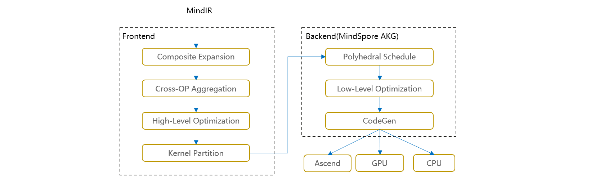

通过以上步骤，我们可以获得两方面性能收益：

1. 不同算子之间的跨边界性能优化收益；
2. 通过对整个计算图进行重组拆分，得到最优粒度的融合算子。

#### 融合算子加速优化（MindSpore AKG）

前文提到，在HPC、深度神经网络训练等场景中，图算融合优化可带来成倍的性能提升。但随着图算融合能力的不断增强，融合算子的开发成为了继续提升图算融合能力的瓶颈点。

融合算子的自动生成技术可以解决基于DSA开发融合算子编程门槛较高的问题，让程序员在算子开发过程中能够聚焦于算子的实现逻辑，无需关注后端优化，极大提高其开发效率。尤其对于后端硬件架构复杂以及存在复杂算子和融合算子的场景，算子自动生成技术更加关键。

因此，**MindSpore AKG基于多面体编译技术（Polyhedral Model），对融合算子的加速优化与自动生成**，能够帮助MindSpore的图算融合模块优化后的融合算子在**异构硬件平台**（GPU/Ascend）上自动生成高性能的kernel，提升MindSpore的训练性能。

架构及整体流程如下：

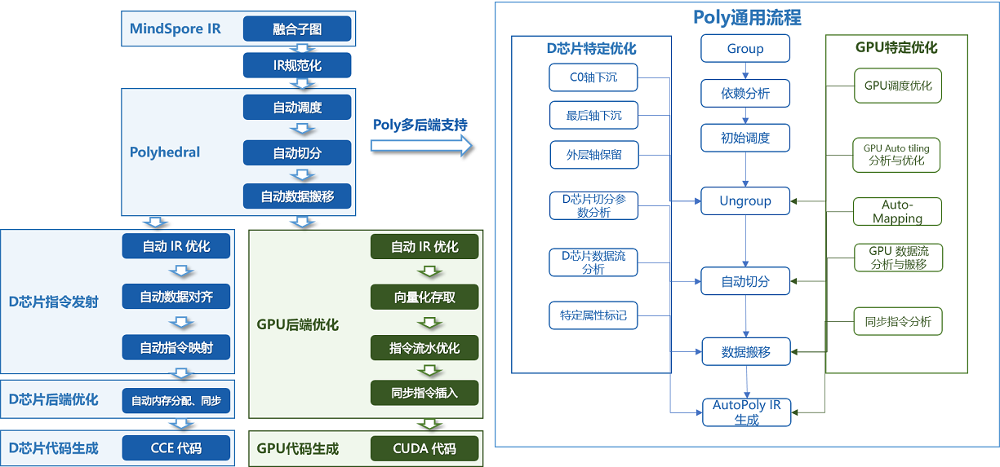

MindSpore AKG的整体框架如上图所示：

- IR规范化
    - MindSpore AKG的输入为MindSpore图算融合模块优化后的融合子图，通过TVM的Compute / IR Builder / Hybrid 等多种描述方式对子图中的算子进行表达。然后DSL会被转换为 Halide IR（[Halide](https://halide-lang.org/)，是常见的用于开发高性能图像处理和Array计算的语言，可作为中间表达解耦算法和优化）并进行 IR 规范化；
    - 完成初步简化和优化后，Halide IR会被转化为Poly模块所需的调度树；
- Poly模块调度优化
    - 利用Polyhedral技术中的Pluto调度算法，实现循环的自动融合、自动重排等变换，为融合算子自动生成满足并行性、数据局部性的初始调度；
    - 为快速适配不同硬件后端，Poly模块内的优化pass会分为硬件无关的通用优化与硬件相关的特定优化，编译时按照硬件特征拼接组合，实现异构硬件后端的快速适配。自动切分、自动映射以及自动内存提升等pass会根据不同硬件的架构性质给出不同的优化方式；
- 后端优化
    - 为了进一步提升算子的性能，我们针对不同硬件后端开发了相应的优化pass，如Ascend后端中实现数据对齐、指令映射，GPU后端中实现向量化存取，插入同步指令等，最终生成相应平台代码。

### 其它图优化技术

除了图算融合之外，在后续版本中，O1可能会逐步扩展增加一些其它图优化技术。比如：

1. KernelPacket: 用于在动态shape场景对shape计算进行自动融合和优化；
2. 通算融合：将通信算子与计算算子进行融合。

## O2模式介绍

O2级别采用图下沉的执行方式，将计算图下沉到Device侧执行。相比于O0和O1模式，O2模式可以基于图的全局信息进行大粒度的图优化，例如图融合、通信算子融合、UB融合等，以及O2下有单独的内存复用策略。最为主要的是O2模式将模型下沉到device侧，消除了算子host与device之间的交互，基本上无host调度开销。不过O2模式也存在一些缺点，例如：

1. O2模式的编译时间较长，特别是在模型规模较大时。
2. O2模式的执行粒度为计算图，与算子粒度的用户脚本相比，存在一定的差异，因而调试调优难度较高。

因此在中小模型中，容易出现host bound，若想获得极致的执行性能，建议使用O2模式。
