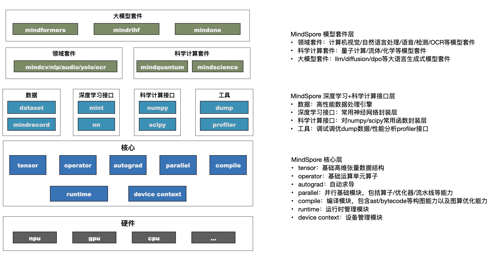

# MindSpore设计概览

## 概述

人工智能（AI）框架已经有十余年的发展历史，四条主线驱动着AI框架不停地演进和发展：

1. 面向开发者：兼顾算法开发的效率和运行性能。
2. 面向硬件：充分发挥芯片和集群的性能。
3. 面向算法和数据：从计算规模看，需要应对模型越来越大的挑战；从计算范式看，需要处理不断涌现的新的计算负载。
4. 面向部署：需要将AI能力部署到每个设备、每个应用、每个行业。

MindSpore是面向“端-边-云”全场景设计的AI框架，旨在弥合AI算法研究与生产部署之间的鸿沟：

- 在算法研究阶段，为开发者提供动静统一的编程体验以提升算法的开发效率；
- 在生产阶段，自动并行可以极大加快分布式训练的开发和调试效率，同时充分挖掘异构硬件的算力；
- 在部署阶段，基于“端-边-云”统一架构，应对企业级部署和安全可信方面的挑战。

## 整体架构

MindSpore整体架构如下：

1. 模型套件：为开发者提供开箱即用的模型和开发套件，如大模型套件MindSpore Transformers、MindSpore ONE以及科学计算库等热点研究领域拓展库；
2. 深度学习+科学计算：为开发者提供AI模型开发所需各类Python接口，最大化保持开发者在Python生态开发的使用习惯；
3. 核心：作为AI框架的核心，构建Tensor数据结构、基础运算算子Operator、自动求导autograd模块、并行计算Parallel模块、编译compile能力以及runtime运行时管理模块。

## 设计理念

昇思MindSpore是一个全场景深度学习框架，旨在实现易开发、高效执行、全场景统一部署三大目标。其中，易开发表现为API友好，调试难度低；高效执行包括计算效率、数据预处理效率和分布式训练效率；全场景则指框架同时支持云、边缘以及端侧场景。

### 函数式和对象式融合编程范式

MindSpore提供面向对象和面向函数的[编程范式](https://www.mindspore.cn/docs/zh-CN/r2.6.0/design/programming_paradigm.html)，二者都可用来构建网络算法和训练流程。

开发者可以基于nn.Cell类派生定义所需功能的AI网络或层（layer），并可通过对象的嵌套调用的方式将已定义的各种layer进行组装，完成整个AI网络的定义。

同时，开发者也可以定义一个可被MindSpore源到源编译转换的Python纯函数，通过MindSpore提供的函数或装饰器，将其加速执行。在满足MindSpore静态语法的要求下，Python纯函数可以支持子函数嵌套、控制逻辑甚至是递归函数表达。因此基于此编程范式，开发者可灵活使能一些功能特性，更易于表达业务逻辑。

MindSpore实现了[函数式微分编程](https://www.mindspore.cn/docs/zh-CN/r2.6.0/design/programming_paradigm.html#函数式微分编程)，对可被微分求导的函数对象，按照调用关系，基于调用链进行求导。采取这样自动微分策略更符合数学语义，与基本代数中的复合函数有直观的对应关系，只要已知基础函数的求导公式，就能推导出由任意基础函数组成的复合函数的求导公式。

同时，基于函数式编程范式，MindSpore提供了丰富高阶函数如vmap、shard等内置高阶函数功能。与微分求导函数grad一样，可以让开发者方便的构造一个函数或对象，作为高阶函数的参数。高阶函数经过内部编译优化，生成针对开发者函数的优化版本，实现如向量化变换、分布式并行切分等特点功能。

### [动静统一的编程体验](https://www.mindspore.cn/docs/zh-CN/r2.6.0/features/program_form/overview.html)

传统AI框架主要有两种编程执行形态，静态图模式和动态图模式。

静态图模式会基于开发者调用的接口，在编译时生成神经网络的图结构，然后再执行图中涉及的计算操作。

动态图模式，能有效解决静态图的编程门槛高问题，由于程序是按照代码的编写顺序执行，不做整图编译优化，相对性能优化空间较少，特别是面向DSA等专有硬件的优化具有较大挑战。

静态图模式，能有效感知神经网络各层算子间的关系，基于编译技术进行有效的编译优化以提升性能。但传统静态图需要开发者感知构图接口，组建或调试网络比较复杂，且难于与常用Python库、自定义Python函数进行穿插使用。

MindSpore基于Python构建神经网络的图结构，相比于传统的静态图模式，能有更易用、更灵活的表达能力。MindSpore创新性的构建源码转换能力，基于Python语句提取AST进行计算图构建，因此可以支持开发者使用的Python原生语法（条件/循环等）和其他操作，如元组（Tuple）、列表（List）以及Lambda表达来构建计算图，并对计算图进行自动微分。所以MindSpore能更好地兼容动态图和静态图的编程接口，在代码层面保持一致，如控制流写法等。

原生Python表达可基于Python控制流关键字，直接使能静态图模式的执行，使得动静态图的编程统一性更高。同时开发者基于MindSpore的接口，可以灵活的对Python代码片段进行动静态图模式控制。即可以将程序局部函数以静态图模式执行（mindspore.jit）而同时其他函数按照动态图模式执行。从而使得在与常用Python库、自定义Python函数进行穿插执行使用时，开发者可以灵活指定函数片段进行静态图优化加速，而不牺牲穿插执行的编程易用性。

### [分布式并行](https://www.mindspore.cn/docs/zh-CN/r2.6.0/design/distributed_training_design.html)

大模型参数越来越大，需要复杂和多样的分布式并行策略应对，MindSpore内置了多维分布式训练策略，可供开发者灵活组装使用。并通过并行抽象，隐藏通讯操作，简化开发者并行编程的复杂度。

通过自动的并行策略搜索，提供透明且高效分布式训练能力。“透明”是指开发者只需更改一行配置，提交一个版本的Python代码，就可以在多个设备上运行这一版本的Python代码进行训练。“高效”是指该算法以最小的代价选择并行策略，降低了计算和通信开销。

MindSpore在并行化策略搜索中引入了张量重排布技术（Tensor Redistribution，TR），这使输出张量的设备布局在输入到后续算子之前能够被转换。MindSpore识别算子在不同输入数据切片下的输出数据overlap情况，并基于此进行切片推导，自动生成对应的张量重排计划。基于此计划，可以统一表达数据并行、模型并行等多种并行策略。

同时MindSpore还提供了流水线并行、优化器并行、重计算等多种并行策略供开发者使用。

### 硬件高性能发挥

MindSpore基于编译技术，提供了丰富的硬件无关优化，如IR融合、代数化简、常数折叠、公共子表达式消除等。同时针对NPU、GPU等不同硬件，也提供各种硬件优化能力，从而更好的发挥硬件的大规模计算加速能力。

#### [图算融合](https://www.mindspore.cn/docs/zh-CN/r2.6.0/design/multi_level_compilation.html#图算融合)

MindSpore等主流AI计算框架对开发者提供的算子通常是从开发中可理解、易使用角度进行定义。每个算子承载的计算量不等，计算复杂度也各不相同。但从硬件执行角度看，这种天然的、基于用开发者角度的算子计算量划分，并不高效，也无法充分发挥硬件资源计算能力。主要体现在：

1. 计算量过大、过复杂的算子，通常很难生成切分较好的高性能算子，从而降低设备利用率；
2. 计算量过小的算子，由于计算无法有效隐藏数据搬移开销，也可能会造成计算的空等时延，从而降低设备利用率；
3. 硬件Device通常为多核、众核结构，当算子shape较小或其他原因引起计算并行度不够时，可能会造成部分核的空闲，从而降低设备利用率。特别是基于专用处理器架构（Domain Specific Architecture，后文简称DSA）的芯片对这些因素更为敏感。如何最大化发挥硬件算力性能的同时使算子也能具备较好的易用性，一直以来是一个很大的挑战。

在AI框架设计方面，目前业界主流采用图层和算子层分层的实现方法。图层负责对计算图进行融合或重组，算子层负责将融合或重组后的算子编译为高性能的可执行算子。图层通常采用基于Tensor的High-Level IR的处理和优化，算子层则采用基于计算指令的Low-Level IR进行分析和优化。这种人为分层处理显著增加了图、算两层进行协同优化的难度。

MindSpore在过去几年的技术实践中，采用了图算融合的技术来较好的解决了这个问题。业界主流SOTA模型在使能图算融合后训练速度都有明显收益。

#### 面向昇腾硬件的竞争力优化

On Device中的Device通常指Ascend（昇腾）AI处理器。昇腾芯片上集成了AI CORE、AI CPU和CPU。其中，AICORE负责大型Tensor Vector运算，AICPU负责标量运算，CPU负责逻辑控制和任务分发。

Host侧CPU负责将图或算子下发到昇腾芯片。昇腾芯片由于具备了运算、逻辑控制和任务分发的功能，所以不需要与Host侧的CPU进行频繁的交互，只需要将计算完的最终结果返回给Host侧，实现整图下沉到Device执行，避免Host-Device频繁交互，减小开销。

计算图整图下沉到Device上执行，减少Host-Device交互开销。可以结合循环下沉实现多个Step下沉，进一步减少Host和Device的交互次数。

循环下沉是在On Device执行的基础上的优化，目的是进一步减少Host侧和Device侧之间的交互次数。通常情况下，每个step都返回一个结果，循环下沉是控制每隔多少个step返回一次结果。

数据下沉即数据通过通道直接传送到Device上。

### [全场景统一部署](https://www.mindspore.cn/docs/zh-CN/r2.6.0/design/all_scenarios.html)

MindSpore是训推一体的AI框架，同时支持训练和推理等功能。同时MindSpore支持CPU、GPU、NPU等多种芯片，并且在不同芯片上提供统一的编程使用接口以及可生成在多种硬件上加载执行的离线模型。

MindSpore按照实际执行环境和业务需求，提供多种规格的版本形态，支持部署在云端、服务器端、手机等嵌入式设备端以及耳机等超轻量级设备端上的部署执行。

### [三方硬件接入](https://www.mindspore.cn/docs/zh-CN/r2.6.0/design/pluggable_device.html)

MindSpore基于统一MindIR构建了开放式AI架构，支持第三方芯片插件化、标准化、低成本快速对接，可接入GPU系列芯片亦可接入各类DSA芯片。MindSpore提供Kernel模式对接和Graph模式对接两种芯片接入方式，芯片产商可根据自身特点进行接入方式选择。
