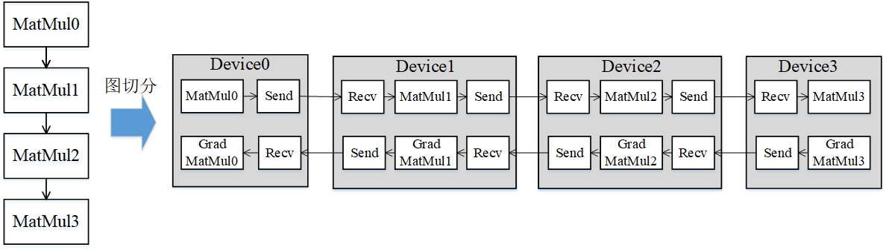
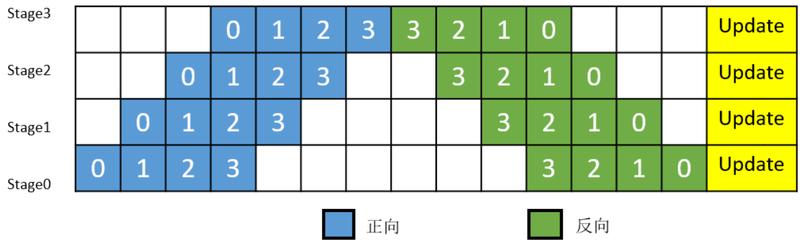
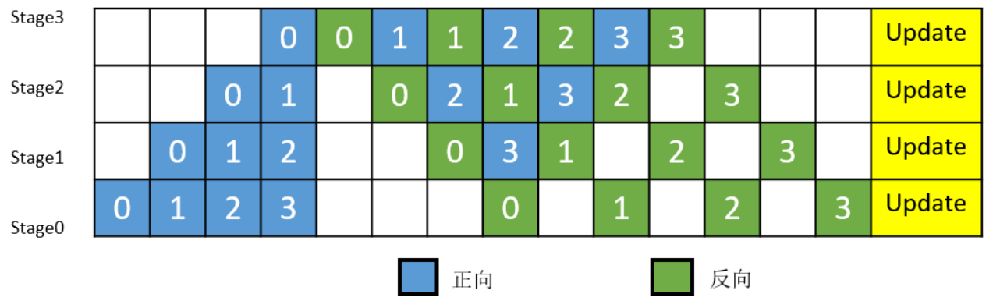

# 流水线并行

`Ascend` `GPU` `分布式并行` `全流程`

<a href="https://gitee.com/mindspore/docs/blob/r1.7/docs/mindspore/source_zh_cn/design/pipeline_parallel.md" target="_blank"></a>

## 概述

近年来，神经网络的规模几乎是呈指数型增长。受单卡内存的限制，训练这些大模型用到的设备数量也在不断增加。受server间通信带宽低的影响，传统数据并行叠加模型并行的这种混合并行模式的性能表现欠佳，需要引入流水线并行。流水线并行能够将模型在空间上按`stage`
进行切分，每个`stage`只需执行网络的一部分，大大节省了内存开销，同时缩小了通信域，缩短了通信时间。MindSpore能够根据用户的配置，将单机模型自动地转换成流水线并行模式去执行。

## 基本原理

流水线（Pipeline）并行是将神经网络中的算子切分成多个阶段（Stage），再把阶段映射到不同的设备上，使得不同设备去计算神经网络的不同部分。流水线并行适用于模型是线性的图结构。如图1所示，将4层MatMul的网络切分成4个阶段，分布到4台设备上。正向计算时，每台机器在算完本台机器上的MatMul之后将结果通过通信算子发送（Send）给下一台机器，同时，下一台机器通过通信算子接收（Receive）上一台机器的MatMul结果，同时开始计算本台机器上的MatMul；反向计算时，最后一台机器的梯度算完之后，将结果发送给上一台机器，同时，上一台机器接收最后一台机器的梯度结果，并开始计算本台机器的反向。



*图1：流水线并行的图切分示意图*

简单地将模型切分到多设备上并不会带来性能的提升，因为模型的线性结构到时同一时刻只有一台设备在工作，而其它设备在等待，造成了资源的浪费。为了提升效率，流水线并行进一步将小批次(MiniBatch)切分成更细粒度的微批次(MicroBatch)，在微批次中采用流水线式的执行序，从而达到提升效率的目的，如图2所示。将小批次切分成4个微批次，4个微批次在4个组上执行形成流水线。微批次的梯度汇聚后用来更新参数，其中每台设备只存有并更新对应组的参数。其中白色序号代表微批次的索引。



*图2：带MicroBatch的流水线并行执行时间线示意图*

MindSpore的流水线并行实现中对执行序进行了调整，来达到更优的内存管理。如图3所示，在编号为0的MicroBatch的正向执行完后立即执行其反向，这样做使得编号为0的MicroBatch的中间结果的内存得以更早地（相较于图2）释放，进而确保内存使用的峰值比图2的方式更低。



*图3：MindSpore流水线并行执行时间线示意图*

## 操作实践

### 样例代码说明

> 你可以在这里下载完整的样例代码：
>
> <https://gitee.com/mindspore/docs/tree/r1.7/docs/sample_code/distributed_training>。

目录结构如下：

```text
└─sample_code
    ├─distributed_training
    │      rank_table_16pcs.json
    │      rank_table_8pcs.json
    │      rank_table_2pcs.json
    │      resnet.py
    │      resnet50_distributed_training_pipeline.py
    │      run_pipeline.sh
    ...
```

其中，`rank_table_16pcs.json`、`rank_table_8pcs.json`、`rank_table_2pcs.json`是配置Ascend多卡环境的组网信息文件。`resnet.py`、`resnet50_distributed_training_pipeline.py`等文件是定义网络结构的脚本。`run_pipeline.sh`是执行脚本。

### 下载数据集

本样例采用`CIFAR-10`
数据集，数据集的下载和加载方式可参考：<https://www.mindspore.cn/tutorials/experts/zh-CN/r1.7/parallel/train_ascend.html>。

### 配置分布式环境

> 流水线并行支持Ascend和GPU。

分布式环境的配置以及集合通信库的调用可参考：<https://www.mindspore.cn/tutorials/experts/zh-CN/r1.7/parallel/train_ascend.html>。

### 定义网络

网络的定义和Ascend的分布式并行训练基础样例中一致。

网络、优化器、损失函数的定义可参考：<https://www.mindspore.cn/tutorials/experts/zh-CN/r1.7/parallel/train_ascend.html>。

> 流水线并行需要用户去定义并行的策略，通过调用`pipeline_stage`接口来指定每个layer要在哪个stage上去执行。`pipeline_stage`接口的粒度为`Cell`。所有包含训练参数的`Cell`都需要配置`pipeline_stage`，并且`pipeline_stage`要按照网络执行的先后顺序，从小到大进行配置。

```python
class ResNet(nn.Cell):
    """ResNet"""

    def __init__(self, block, num_classes=100, batch_size=32):
        """init"""
        super(ResNet, self).__init__()
        self.batch_size = batch_size
        self.num_classes = num_classes

        self.head = Head()
        self.layer1 = MakeLayer0(block, in_channels=64, out_channels=256, stride=1)
        self.layer2 = MakeLayer1(block, in_channels=256, out_channels=512, stride=2)
        self.layer3 = MakeLayer2(block, in_channels=512, out_channels=1024, stride=2)
        self.layer4 = MakeLayer3(block, in_channels=1024, out_channels=2048, stride=2)

        self.pool = ops.ReduceMean(keep_dims=True)
        self.squeeze = ops.Squeeze(axis=(2, 3))
        self.fc = fc_with_initialize(512 * block.expansion, num_classes)

        # pipeline parallel config
        self.head.pipeline_stage = 0
        self.layer1.pipeline_stage = 0
        self.layer2.pipeline_stage = 0
        self.layer3.pipeline_stage = 1
        self.layer4.pipeline_stage = 1
        self.fc.pipeline_stage = 1

    def construct(self, x):
        """construct"""
        x = self.head(x)

        x = self.layer1(x)
        x = self.layer2(x)
        x = self.layer3(x)
        x = self.layer4(x)

        x = self.pool(x, (2, 3))
        x = self.squeeze(x)
        x = self.fc(x)
        return x
```

### 训练网络

为了使能流水线并行，需要在训练脚本中加一些必要的配置：

- 在`set_auto_parallel_context`中设置`pipeline_stages`，`pipeline_stages`用来表明`stage`的总数。
- 目前流水线并行只支持`SEMI_AUTO_PARALLEL`模式，数据集要以`full_batch`模式导入。
- 需要定义LossCell，本例中调用了`nn.WithLossCell`接口。
- 目前流水线并行不支持自动混合精度特性。
- 最后，需要在LossCell外包一层`PipelineCell`
  ，并指定MicroBatch的size。为了提升机器的利用率，MindSpore将MiniBatch切分成了更细粒度的MicroBatch，最终的loss则是所有MicroBatch计算的loss值累加。其中，MicroBatch的size必须大于等于`stage`
  的数量。

```python
from mindspore import context, Model, nn
from mindspore.nn import Momentum
from mindspore.train.callback import LossMonitor
from mindspore.context import ParallelMode
from resnet import resnet50


def test_train_cifar(epoch_size=10):
    context.set_auto_parallel_context(parallel_mode=ParallelMode.SEMI_AUTO_PARALLEL, gradients_mean=True)
    context.set_auto_parallel_context(pipeline_stages=2, full_batch=True)
    loss_cb = LossMonitor()
    data_path = os.getenv('DATA_PATH')
    dataset = create_dataset(data_path)
    batch_size = 32
    num_classes = 10
    net = resnet50(batch_size, num_classes)
    loss = SoftmaxCrossEntropyExpand(sparse=True)
    net_with_loss = nn.WithLossCell(net, loss)
    net_pipeline = nn.PipelineCell(net_with_loss, 2)
    opt = Momentum(net.trainable_params(), 0.01, 0.9)
    model = Model(net_pipeline, optimizer=opt)
    model.train(epoch_size, dataset, callbacks=[loss_cb], dataset_sink_mode=True)
```

### 运行单机八卡脚本

利用样例代码，

Ascend可以用以下命令运行8卡，2个stage的流水线训练：

```bash
bash run_pipeline.sh [DATA_PATH] Ascend
```

GPU可以用以下命令运行8卡，2个stage的流水线训练：

```bash
bash run_pipeline.sh [DATA_PATH] GPU
```
