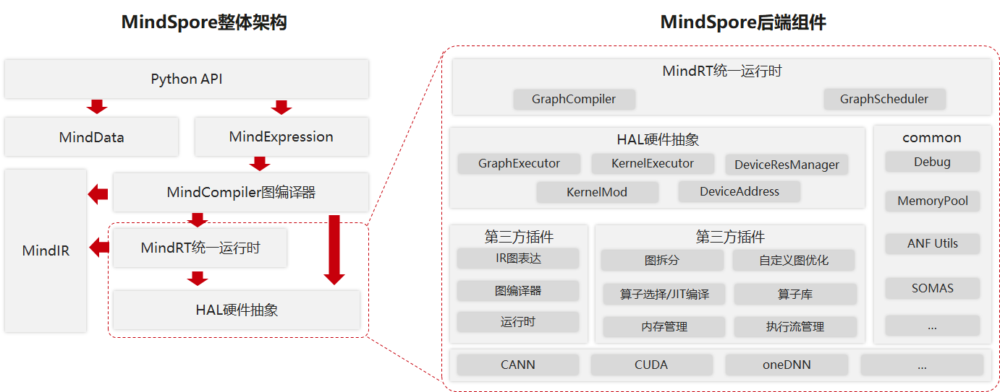
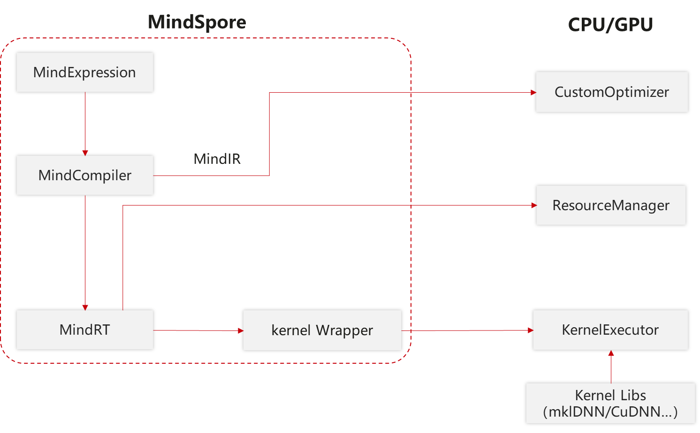
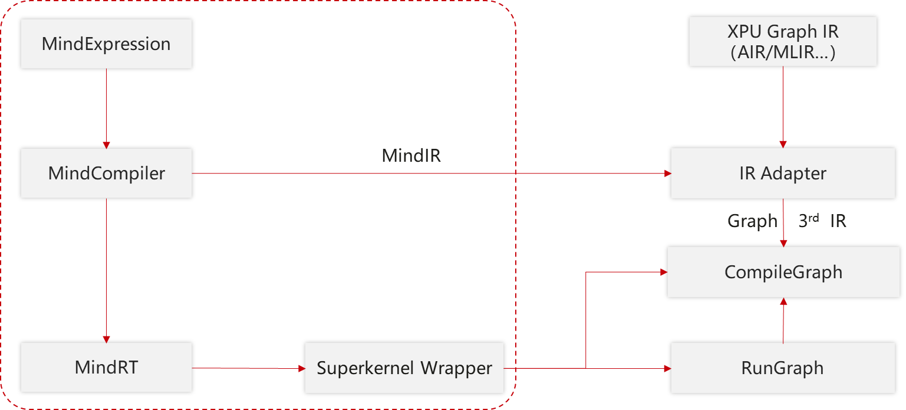

# 三方硬件对接

MindSpore通过开放式架构，支持第三方芯片插件化、标准化、低成本快速对接：

- 后端架构解耦，快速支持新芯片插件化对接；
- 抽象硬件类型建模，对接流程标准化；
- 抽象算子封装，多芯片异构算子统一选择；
- 支持第三方图IR接入，充分发挥芯片架构优势。

MindSpore整体架构及后端相关组件如下图所示：

MindSpore整体架构包括如下几个主要组件，它们之间存在相互的依赖关系：

- Python API：提供了基于Python的前端表达与编程接口，支撑用户进行网络构建、整图执行、子图执行以及单算子执行，并通过pybind11接口调用到C++模块，C++模块分为前端、后端、MindData、Core等；
- MindExpression前端表达：负责编译流程控制和硬件无关的优化如类型推导、自动微分、表达式化简等；
- MindData数据组件：MindData提供高效的数据处理、常用数据集加载等功能和编程接口，支持用户灵活的定义处理注册和pipeline并行优化；
- MindIR：包含了ANF IR数据结构、日志、异常等端、云共用的数据结构与算法。

第三方芯片对接MindSpore的过程主要涉及MindSpore的后端，后端也分为多个组件，整体上分为两大类：

- 一类与硬件无关，如MemoryManager、MemoryPool、DeviceAddres等常用数据结构及相关算法以及包括GraphCompiler、GraphSchdeduler在内的能够调度整个流程、具有对图或单算子的初步处理和调度能力的组件；
- 另一类与硬件相关，这部分通过对硬件的抽象，提供了多个接口，第三方芯片可以根据情况选择对接，实现硬件平台上特有的算子、图优化、内存分配、流分配等逻辑，并封装成动态库，程序运行时作为插件加载。第三方芯片对接时可以参考MindSpore默认内置的CPU/GPU/Ascend插件。

为了方便第三方硬件对接，在MindSpore中提供了硬件抽象层，定义了标准化的硬件对接接口，抽象层被上层统一运行时中的GraphCompiler和GraphScheduler两个模块调用：

- GraphCompiler负责提供默认的控制流、异构图拆分逻辑，不同阶段的图优化，调用抽象层提供的算子选择/算子编译、内存分配和流分配等；
- GraphScheduler负责将编译完成的图转化为Actor模型并加入到线程池中，并执行调度这些Actor。

同时，在框架中也提供了公共数据结构与算法，如debug工具、默认的内存池实现、数百个对Anf IR的常见操作、由MindSpore研发高效内存复用算法SOMAS等。

硬件抽象层提供了Graph模式（GraphExecutor）和Kernel模式（KernelExecutor）用于两种对接方式，分别面向DSA架构（如NPU、XPU等）和通用架构的芯片（如GPU、CPU等）提供分类的对接接口。芯片厂商可以继承某种或两种抽象类并实现，根据对接方式的不同，如果对接Kernel模式还需实现DeviceResMananger、KernelMod、DeviceAddress等接口。

## Kernel模式对接

通用架构Kernel模式需要在插件中实现以下几个方面的功能：

- 自定义图拆分逻辑，可以低成本实现框架提供的控制流、异构等高级特性，如果不使用这些特性，可以空实现；

- 自定义图优化，可以根据硬件的特性对某些算子进行拆分与融合，以及其他自定义的对图的修改；

- 算子选择和算子编译；
- 内存管理，DeviceAddres是对内存的抽象，第三方芯片厂商需要实现Host与Device之间拷贝的功能。还需要提供内存申请、销毁的功能。为了方便第三方芯片厂商，MindSpore在Common组件中提供了一套内存池的实现和高效内存复用算法SOMAS；
- 流管理，如果待对接的芯片有流的概念，需要提供创建与销毁的功能，如果没有，则将会以单流模式运行。

## Graph模式对接

若芯片厂商的软件栈较完整能够提供High level的API，或DSA架构芯片的软件栈与Kernel模式存在差异，可以对接Graph模式。Graph模式将整个图视为一个由第三方软件栈实现的大算子（SuperKernel），需要由第三方软件栈实现以下两个功能：

- 图编译，第三方芯片厂商需要将MindSpore的Anf IR转换成第三方IR图表达，并执行第三方图编译流程将该图编译至可执行的就绪状态；

- 图执行，第三方芯片厂商需要理解MindSpore的Tensor格式或将其转换成可被理解的格式，并调用执行已就绪的图，并将执行的结果转换成MindSpore的Tensor格式。

