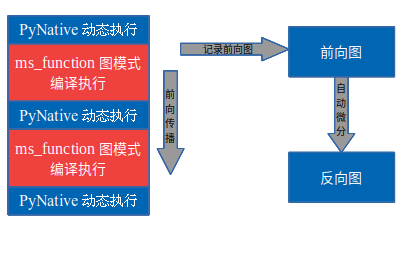

# 函数式算子切分

<a href="https://gitee.com/mindspore/docs/blob/master/docs/mindspore/source_zh_cn/design/pynative_shard_function_parallel.md" target="_blank"></a>

## 概述

动态图支持语法更丰富，使用更为灵活，但是目前MindSpore的动态图模式不支持自动并行的各种特性。借鉴Jax的pmap的设计理念，即在动态图模式下，指定某一个部分以图模式执行，并进行各种并行操作，我们设计了shard函数，支持在动态图模式下，指定某一部分以图模式执行，并且执行各种并行操作。

## 基本原理

MindSpore的动态图模式下，可以通过ms_function的装饰符，指定某一段以图模式编译执行，在前向执行的同时，会将执行的算子、子图记录下来，前向执行完毕后，会对得到的整图进行自动微分得到反向图，具体流程如下图所示：



*图1：ms_function执行示意图*

Shard function沿用此模式，不同的是可以在图模式编译执行的环节进行算子级别的模型并行。

## 操作实践

### 样例代码说明

>你可以在这里下载完整的样例代码：
>
><https://gitee.com/mindspore/docs/tree/master/docs/sample_code/pynative_shard_function_parallel>。

目录结构如下：

```text
└─sample_code
    ├─shard_function_parallel
        ├── rank_table_8pcs.json
        ├── run_shard_function_example.sh
        └── shard_function_example.py
```

其中每个文件的作用如下：

- shard_function_example.py：shard function的示例代码，介绍了如何使用shard function指定部分代码并行执行。
- rank_table_8pcs.json：RANK_TABLE_FILE的8卡配置文件。
- run_shard_function_example.sh：shard function example的启动脚本。

### 接口介绍

```python
def shard(fn, in_strategy, out_strategy, device="Ascend", level=0):
    return shard_fn(fn, in_strategy, out_strategy, device, level)
```

`in_strategy(tuple)`: 指定输入`Tensor`的切分策略，每个元素为元组，表示对应输入`Tensor`的切分策略，每个元组的长度要与对应`Tensor`的维度相等，表示每个维度如何切分，可以传入`None`，表示对应`Tensor`按照数据并行进行切分。

`out_strategy(tuple)`: 指定输出`Tensor`的切分策略，用法和`in_strategy`相同。在深度学习模型中，输出策略会被覆盖为数据并行，即高维按卡数均匀切分。

`device(string)`: 指定执行的设备，可选范围`Ascend`、`GPU`和`CPU`，默认为`Ascend`，目前尚未使能，后续会开放。

`level(int)`: 指定全部算子搜索策略，输入输出`Tensor`的切分策略由用户指定，其余算子的切分策略会由框架搜索得到，此参数指定搜索时的目标函数，可选范围为0、1、2，分别代表最大化计算通信比、内存消耗最小、最大化运行速度，默认为0，目前尚未使能，后续会开放。

### 执行模式

如前所述，shard function会将动态图模式下某一部分以图模式执行算子级模型并行，因此使用shard function时需要设置模式为

```python
from mindspore import context
context.set_context(mode=context.PYNATIVE_MODE)
context.set_auto_parallel_context(parallel_mode=context.ParallelMode.AUTO_PARALLEL,
                                  search_mode="sharding_propagation", device_num=8)
```

### 使用方法

shard function目前有两种使用方法，以下面的网络为例介绍shard function的使用方法。

```python
import mindspore.nn as nn
class BasicBlock(nn.Cell):
    def __init__(self):
        super(BasicBlock, self).__init__()
        self.dense1 = nn.Dense(10, 10)
        self.gelu = nn.GELU()
        self.dense2 = nn.Dense(10, 10)
    def construct(self, x):
        # two dimensional input x
        x = self.dense1(x)
        x = self.gelu(x)
        x = self.dense2(x)
        return x

class Net(nn.Cell):
    def __init__(self):
        super(Net, self).__init__()
        self.block1 = BasicBlock()
        self.block2 = BasicBlock()
        self.block3 = BasicBlock()
    def construct(self, x):
        # All three blocks are executed as PyNative mode.
        x = self.block1(x)
        x = self.block2(x)
        x = self.block3(x)
        return x
```

- 使用类方法`shard`

    ```python
    class Net1(Net):
        def __init__(self):
            super(Net1, self).__init__()
            # slice input along the second axis and make output as data-parallel layout
            self.block1.shard(in_strategy=((1, 8),), out_strategy=(None,))
        def construct(self, x):
            # block1 is executed as GRAPH. The inputs/outputs layouts follow the user definition and the slice strategy for inner ops are obtained by auto search
            x = self.block1(x)
            # block2 and block3 are executed as PyNative mode.
            x = self.block2(x)
            x = self.block3(x)
            return x
    ```

- 使用函数式接口`ops.shard`，由于`shard`函数的返回值为函数，使用函数式接口的时候，不能将已经实例过的类赋值为`shard`的返回值，因为MindSpore不支持将类实例赋值为其它类型

    ```python
    import mindspore.ops as ops
    class NetError(Net):
        def __init__(self):
            self.block1 = ops.shard(self.block1, in_strategy=((8, 1),), out_strategy=(None,))
        def construct(self, x):
            x = self.block1(x)
            x = self.block2(x)
            x = self.block3(x)
            return x
    ```

    如此执行会遇到报错

    ```text
    TypeError: For 'Cell', the type of block1 should be cell, but got function.
    ```

    正确使用方式如下

    ```python

    class Net2(Net):
        def __init__(self):
            # set the return function of shard a different name with the Cell instance
            self.block1_graph = ops.shard(self.block1, in_strategy=((8, 1),), out_strategy=(None,))
            self.block2.shard(in_strategy=((1, 8),), out_strategy=((1, 8),))
        def construct(self, x):
            # block1 is executed as GRAPH with input sliced along the first dimension
            x = self.block1_graph(x)
            # block2 is executed as GRAPH as well. But the output won't follow the specified layout, it will be over-written by data-parallel layout instead.
            x = self.block2(x)
            # block3 is executed as PyNative mode.
            x = self.block3(x)
            return x
    ```

### 使用限制

目前由于动态图模式和静态图模式HCCL通信接口不同，对于切分存在限制，即`shard`内部的模型并行产生的通信只能发生在`world group`内部，所以指定的切分策略目前只能支持切一个维度。

使用时，需设置`Ascend`后端，执行模式需设置为`PYNATIVE_MODE`，并行配置为`AUTO_PARALLEL`，`search_mode`为`sharding_propagation`。

在训练神经网络时，`out_strategy`会被覆盖为数据并行，来适配动态图部分的数据并行。

由于目前的算法实现，不支持在`__init__`中声明不会被使用的参数，定义网络时请注意。

会在后续迭代中解决这些问题。

### 运行代码

上述代码需要在配置分布式变量后才可以运行。Ascend环境需要配置RANK_TABLE_FILE、RANK_ID和DEVICE_ID。配置的过程请参考[此处](https://www.mindspore.cn/tutorials/experts/zh-CN/master/parallel/train_ascend.html#配置分布式环境变量)。

Ascend分布式相关的环境变量有:

- RANK_TABLE_FILE：组网信息文件的路径。rank_table_file文件可以使用models代码仓中的hccl_tools.py生成，可以从[此处](https://gitee.com/mindspore/models/tree/master/utils/hccl_tools)获取。
- DEVICE_ID：当前卡在机器上的实际序号。
- RANK_ID：当前卡的逻辑序号。

```bash
#!/bin/bash
set -e
echo "=============================================================================================================="
echo "Please run the script as: "
echo "bash run_fusion_example.sh"
echo "It is better to use the absolute path."
echo "This example is expected to run on the Ascend environment."
echo "=============================================================================================================="
RANK_SIZE=8
EXEC_PATH=$(pwd)
export RANK_TABLE_FILE=${EXEC_PATH}/rank_table_8pcs.json
export RANK_SIZE=8

for((i=0;i<${RANK_SIZE};i++))
do
    rm -rf device$i
    mkdir device$i
    cp ./shard_funtion_example.py ./device$i
    cd ./device$i
    export DEVICE_ID=$i
    export RANK_ID=$i
    echo "start training for device $i"
    env > env$i.log
    pytest -s -v ./shard_function_example.py > train.log$i 2>&1 &
    cd ../
done
echo "The program launch succeed, the log is under device0/train.log0."
```

在当前目录下配置完RANK_TABLE_FILE之后，下述的命令要求用户拥有8张Ascend 910设备。运行命令如下：

```bash
bash run_fusion_example.sh
```

执行过程中，框架会自动为`shard`的输入函数进行算子级别的模型并行，每个算子的并行策略由框架搜索得到，整个过程用户无感知。可以按如下操作存图

```python
context.set_context(save_graphs=True)
```

在`step_parallel_end.ir`中可以看到具体每一个算子的并行策略。
