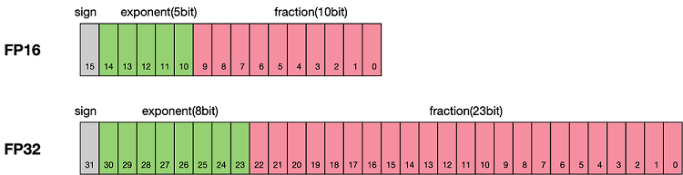
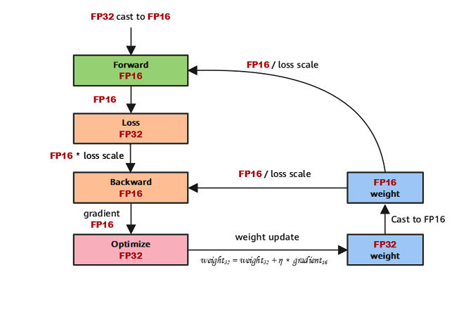

# 自动混合精度

[](https://gitee.com/mindspore/docs/blob/master/docs/mindspore/source_zh_cn/features/amp.md)

混合精度（Mix Precision）训练是指在训练时，对神经网络不同的运算采用不同的数值精度的运算策略。在神经网络运算中，部分运算对数值精度不敏感，此时使用较低精度可以达到明显的加速效果（如conv、matmul等）；而部分运算由于输入和输出的数值差异大，通常需要保留较高精度以保证结果的正确性（如log、softmax等）。

## 原理

浮点数据类型主要分为双精度（FP64）、单精度（FP32）、半精度（FP16）、brain floating point（BF16），每一种都有符号位、指数位、浮点位三个不同的部分来表示。FP64表示采用8个字节共64位；FP32表示采用4个字节共32位；FP16、BF16表示采用2字节共16位。如图所示：



从图中可以看出，与FP32相比，FP16的存储空间是FP32的一半。类似地，FP32则是FP64的一半。因此使用低精度进行运算具备以下优势：

- 减少内存占用：FP16、BF16的位宽是FP32的一半，因此权重等参数所占用的内存也是原来的一半，节省下来的内存可以放更大的网络模型或者使用更多的数据进行训练。
- 计算效率更高：在特殊的AI加速芯片如华为Atlas训练系列产品和Atlas 200/300/500推理产品系列，或者NVIDIA VOLTA架构的GPU上，使用FP16、BF16的执行运算性能比FP32更加快。
- 加快通讯效率：针对分布式训练，特别是在大模型训练的过程中，通讯的开销制约了网络模型训练的整体性能，通讯的位宽少了意味着可以提升通讯性能，减少等待时间，加快数据的流通。

但是使用低精度计算同样会带来一些问题：

- 数据溢出：FP16的有效数据表示范围为 $[5.9\\times10^{-8}, 65504]$，FP32的有效数据表示范围为 $[1.4\\times10^{-45}, 1.7\\times10^{38}]$。可见FP16相比FP32的有效范围要窄很多，使用FP16替换FP32会出现上溢（Overflow）和下溢（Underflow）的情况。而在深度学习中，需要计算网络模型中权重的梯度（一阶导数），因此梯度会比权重值更加小，往往容易出现下溢情况。
- 舍入误差：Rounding Error是指当网络模型的反向梯度很小，一般FP32能够表示，但是转换到FP16会小于当前区间内的最小间隔，会导致数据溢出。如`0.00006666666`在FP32中能正常表示，转换到FP16后会表示成为`0.000067`，不满足FP16最小间隔的数会强制舍入。

因此，在使用混合精度获得训练加速和内存节省的同时，需要考虑低精度引入问题的解决。一般的，混合精度会配套损失缩放（Loss Scale）一起使用，其主要思想是在计算损失值loss的时候，将loss扩大一定的倍数。根据链式法则，梯度也会相应扩大，然后在优化器更新权重时再缩小相应的倍数，从而避免了数据下溢。

根据上述原理介绍，典型的混合精度计算流程如下图所示：



## 混合精度使用示例

```python
import mindspore
from mindspore import amp

loss_scaler = amp.DynamicLossScaler(scale_value=1024, scale_factor=2, scale_window=1000)
ori_model = Net()
# 使能自动混合精度
model = amp.auto_mixed_precision(ori_model, amp_level="auto", dtype=mindspore.float16)
loss_fn = Loss()
optimizer = Opimizer()

# 构建前向网络
def forward_fn(data, label):
    logits = model(data)
    loss = loss_fn(logits, label)
    # 对loss做scale
    loss = loss_scaler.scale(loss)
    return loss, logits

# 生成求导函数，用于计算给定函数的前向计算结果和梯度
grad_fn = mindspore.value_and_grad(forward_fn, None, model.trainable_params(), has_aux=True)

# 构建训练函数
def train_step(data, label):
    (loss, _), grads = grad_fn(data, label)
    # unscale loss到真实的loss值
    loss = loss_scaler.unscale(loss)
    # 检查梯度是否没有溢出
    is_finite = amp.all_finite(grads)
    if is_finite:
        # 梯度没有溢出，unscale梯度到真实的梯度值
        # 在unscale梯度之后可以对梯度做一些梯度裁剪、梯度惩罚等操作
        grads = loss_scaler.unscale(grads)
        # 优化器更新模型参数
        optimizer(grads)
    # 动态更新loss_scaler的值
    loss_scaler.adjust(is_finite)
    return loss

# 构建数据迭代器
train_dataset = Dataset()
train_dataset_iter = train_dataset.create_tuple_iterator()

for epoch in range(epochs):
    for data, label in train_dataset_iter:
        # 执行训练并获取loss
        loss = train_step(data, label)
```

关于自动混合精度，更多细节可以参考[amp.auto_mixed_precision](https://www.mindspore.cn/docs/zh-CN/master/api_python/amp/mindspore.amp.auto_mixed_precision.html)。
