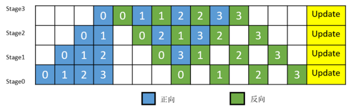
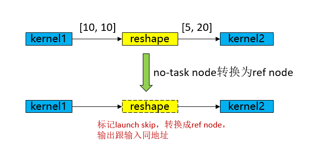
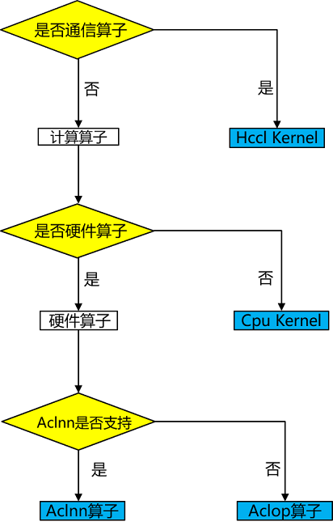
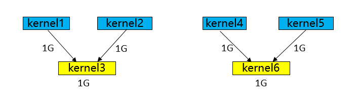
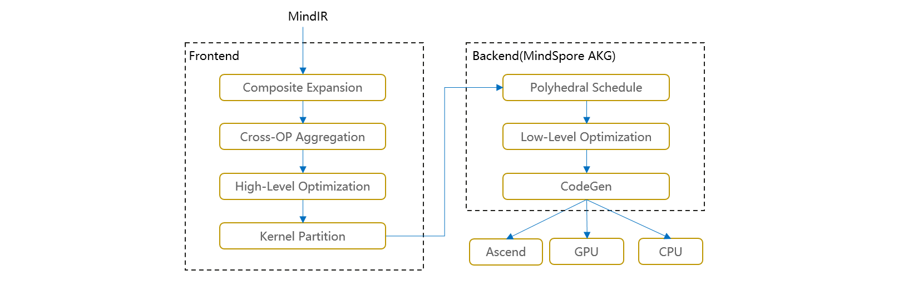
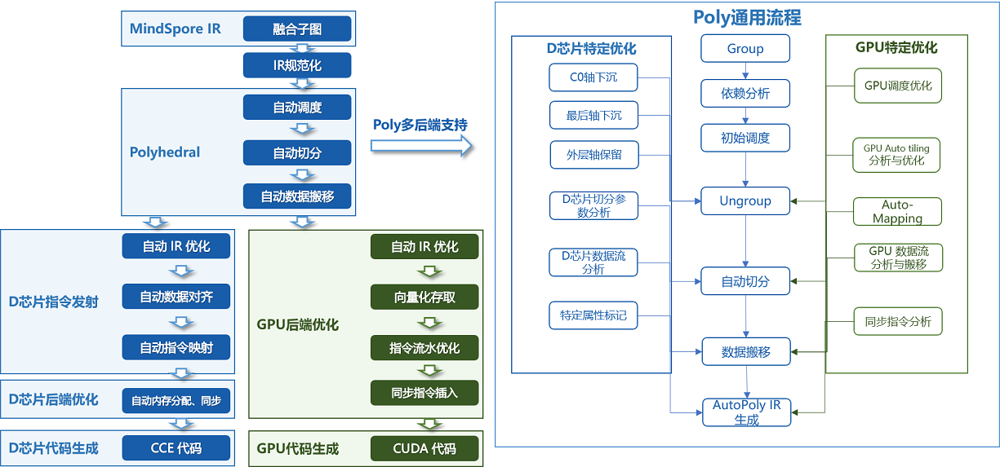

# mindspore.jit 多级编译优化

[](https://gitee.com/mindspore/docs/blob/r2.7.1/docs/mindspore/source_zh_cn/features/compile/compilation_guide.md)

## MindSpore编译架构

MindSpore利用jit（just-in-time）来进行性能优化。jit模式会通过AST树解析、Python字节码解析或追踪代码执行的方式，将Python代码转换为中间表示图（IR，Intermediate Representation）。我们给它命名MindIR。编译器通过对该IR图的优化，来达到对代码的优化，提高运行性能。与PyNative Mode相对应，这种JIT的编译模式被称为Graph Mode。

开发者写的Python代码默认以PyNative Mode运行，可以通过`@mindspore.jit`装饰器修饰函数，来指定其按照Graph Mode执行。有关`@mindspore.jit`装饰器的相关文档请见[jit 文档](https://www.mindspore.cn/docs/zh-CN/r2.7.1/api_python/mindspore/mindspore.jit.html#mindspore.jit)。

Graph Mode大致分为3个阶段：

- 图捕获（构图）：Python代码 -> MindIR。
- 图优化（前端）：对MindIR进行硬件无关优化，代数化简、函数inline（内联）、冗余消除等。
- 图优化（后端）：对MindIR进行硬件相关优化，LazyInline、算子选择、图算融合等。

## 图捕获（构图）

MindSpore提供三种捕获方式，如下：

- AST：通过AST树解析的方式将执行的函数转换成IR图
- bytecode（实验性）：对Python字节码的解析，尽可能的构建IR图，无法转换为IR图的部分则会按照PyNative Mode进行执行
- trace（实验性）：通过追踪Python代码执行的轨迹来构建IR图

这三种模式在mindspore.jit中使用capture_mode来选择，以ast举例：开发者可用`@mindspore.jit(capture_mode="ast")`装饰器修饰函数。用ast方式修饰的函数，其语法有一定限制，我们提供两种模式供开发者选择。

- strict模式：此模式目标是构成一张图，开发者的Python代码如果无法构图，选择此模式运行程序时会报错，需要开发者进行代码修改，变为可构图的语法，适合追求性能的开发者。
- lax模式：此模式目标是尽可能的让开发者程序可运行，思路是针对无法在strict模式构图的代码进行Python fallback，即返回Python层运行。

Graph Mode约束请参考[语法约束](https://www.mindspore.cn/tutorials/zh-CN/r2.7.1/compile/static_graph.html)。ast如何将Python代码解析并构图，举例如下：

```python
@mindspore.jit
def foo(x, y):
    z = x + y
    return z
```

它对应的抽象语法树如下：


通过解析上面的抽象语法树，我们得到下面的IR：

```text
%para1_x: <Tensor[Int64], ()>
%para2_y: <Tensor[Int64], ()>

subgraph instance: foo
subgraph @foo() {
  %0(CNode_17) = PrimFunc_Add(%para1_x, %para2_y)
      : (<Tensor[Int64], ()>, <Tensor[Int64], ()>) -> (<Tensor[Int64], ()>)
  Return(%0)
      : (<Tensor[Int64], ()>)
}
```

**ast的优点**：

- 使用ast模式，用户的编程自主性更强，性能优化更精准，可以根据函数特征以及使用经验将网络的性能调至最优。

**ast的限制**：

- ast修饰的函数，其内部的语法必须严格遵守静态图语法来进行编程。

**ast模式的使用建议**：

- 相比于PyNative Mode执行，被`@mindspore.jit`修饰的函数，在第一次调用时需要先消耗一定的时间进行编译。在该函数的后续调用时，若原有的编译结果可以复用，则会直接使用原有的编译结果进行执行。因此，使用@mindspore.jit装饰器修饰会多次执行的函数通常会获得更多的性能收益。

- Graph Mode的运行效率优势体现在其会将被@mindspore.jit修饰函数进行全局上的编译优化，函数内含有的操作越多，优化的空间越大。因此`@mindspore.jit`装饰器修饰的函数最好是内含操作很多的大代码块，而不应将很多细碎的、仅含有少量操作的函数分别打上jit标签。否则，则可能会导致性能没有收益甚至劣化。

- 绝大部分计算以及优化都是基于对Tensor计算的优化，建议被修饰的函数应该是用来进行真正的数据计算的函数，而不是一些简单的标量计算或者数据结构的变换。

- 被`@mindspore.jit`修饰的函数，若其输入存在常量，那么该函数每次输入值的变化都会导致重新编译，关于变量常量的概念请见[即时编译下的常量与变量](https://www.mindspore.cn/tutorials/zh-CN/r2.7.1/compile/static_graph.html)。因此，建议被修饰的函数以Tensor或者被Mutable修饰的数据作为输入。避免因多次编译导致的额外性能损耗。

## 图优化（前端）

与传统编译优化技术类似，MindSpore 中的编译优化也是通过一个个 Pass 来完成的。将每个 Pass 的上一个 Pass 所产生的 MindIR 作为输入，经过本 Pass 优化之后，产生新的 MindIR 表示作为输出。一个大的 Pass 可以包含多个小的 Pass，每个小的 Pass 只负责单点的编译优化，如：代数化简、函数内联（inline）、冗余消除等。一个 Pass 产生的优化结果，可能会为其它的 Pass 带来优化机会，故可以循环运行这些 Pass，直到产生的 MindIR 不再发生变化为止。

前端编译优化技术有很多，如：代数化简、函数inline（内联）、冗余消除等。这里仅介绍具有代表性的编译优化技术。

### 1 代数化简

在传统编译器中，代数化简是一种编译器优化技术，旨在简化源代码中的代数表达式，消除多余计算，提高程序执行效率、减少内存占用等。

例如，在以下代码片段中：

```cpp
int a = x * 1;
int b = x + 0;
int c = x * 0 + y * 1;
```

传统编译器根据代数规则和恒等式对识别出的表达式进行等价替换。常见代数规则包括结合律、交换律和分配律等，编译器尽可能将表达式替换成更为简单的形式。通过对 AST（抽象语法树）或 SSA（静态单赋值形式）的分析来进行优化，识别并简化代码为：

```cpp
a = x;
b = x;
c = y;
```

在MindSpore编译器中，代数化简原理不同于传统编译器，进行处理的是计算图而非传统控制流图，通过调整计算图中算子的执行顺序，或者删除不必要的算子，以保持计算图的简洁性和提高计算效率。

例如，在如下Python代码片段中：

```python
import numpy as np
import mindspore

@mindspore.jit
def func(x):
    return x + 0

m = mindspore.tensor(np.array([[1, 2, 3], [4, 5, 6]]).astype(np.int32))
out = func(m)
```

MindSpore图编译器会把 Python 程序转换为计算图，计算图由多个子图构成。源程序中的代数运算，转换为子图内部的算子调用，可以看到 PrimFunc_Add 算子调用了一次。

```text
%para1_x: <Tensor[Int32], (2, 3)>

subgraph @1_func_14() {
    %0(CNode_7) = PrimFunc_Add(%para1_x, Tensor(shape=[], dtype=Int32, value=0))
        : (<Tensor[int32], (2, 3)>, <Tensor[Int32], (), value=...>) -> (<Tensor[int32], (2, 3)>)

    Return(%0)
        : (<Tensor[int32], (2, 3)>)
}
```

通过代数化简，可以直接删除 PrimFunc_Add 算子，简化计算图结构，将 `x + 0` 简化成 `x`。

```text
%para1_x: <Tensor[Int32], (2, 3)>

subgraph @1_func_14() {
    Return(%para1_x)
        : (<Tensor[int32], (2, 3)>)
}
```

代数化简能更多地涉及对计算图结构的修改，它通常还与其他编译器优化技术（如常量折叠、常量传播等）结合使用，共同提高程序性能。

### 2 函数inline

在传统编译器中，inline（内联）是一种优化技术，可以把被调用函数的代码直接替换到调用该函数的位置，提高程序运行效率。假设我们有一个 C++ 函数`add`，用于对两个数求和：

```cpp
int add(int a, int b) {
    return a + b;
}

int main() {
    int x = add(3, 5);
    int y = add(x, 10);
    return y;
}
```

编译器通过 inline 将函数体直接替换到调用处，这消除了函数调用的开销，同时为后续优化（如消除冗余计算`3 + 5`，直接在编译期求值替换）创造了条件。这种**用代码替换调用**的思想，正是 inline 的核心。

```cpp
int main() {
    int x = 3 + 5;   // 替换第一次调用
    int y = x + 10;  // 替换第二次调用
    return y;
}
```

在 AI 框架的计算图编译器中，inline 的目标类似，但操作对象从“函数”变成了“子图”（subgraph）。假设我们有一个 Python 程序：

```python
from mindspore

def f2(x: mindspore.Tensor, y: mindspore.Tensor):
    return x * 0.5 + y

@mindspore.jit
def f1(a: mindspore.Tensor, b: mindspore.Tensor, c: mindspore.Tensor):
    x = f2(a, b)
    y = f2(a, c)
    return x + y

# 创建3个shape=(2, 4)的随机值Tensor
a = mindspore.ops.randn(2, 4)
b = mindspore.ops.randn(2, 4)
c = mindspore.ops.randn(2, 4)
out = f1(a, b, c)
```

首先，MindSpore 的计算图编译器会把 Python 程序转换为计算图。而 Python 程序中的函数调用，会转换为计算图之间的调用，得到类似于下面的原始计算图。其中，主图 f1 调用了 2 次子图 f2。

```text
# Params:
%para1_a: <Tensor[Float32], (2, 4)>
%para2_b: <Tensor[Float32], (2, 4)>
%para3_c: <Tensor[Float32], (2, 4)>

subgraph @f2(%para1_x, %para2_y) {
    %0 = PrimFunc_Mul(%para1_x, Float32(0.5))

    %1 = PrimFunc_Add(%0, %para2_y)

    Return(%1)
}

subgraph @f1() {
  %0(x) = call @f2(%para1_a, %para2_b)  # 调用子图f2

  %1(y) = call @f2(%para1_a, %para3_c)  # 调用子图f2

  %2 = PrimFunc_Add(%0, %1)

  Return(%2)
}
```

通过 inline，可以将子图 f2 展开，合并到主图 f1。

```text
subgraph @f1() {
  # 第一次子图inline
  %0 = PrimFunc_Mul(%para1_a, Float32(0.5))  # 重复计算步骤
  %1 = PrimFunc_Add(%0, %para2_b)

  # 第二次子图inline
  %2 = PrimFunc_Mul(%para1_a, Float32(0.5))  # 重复计算步骤
  %3 = PrimFunc_Add(%2, %para3_c)

  %4 = PrimFunc_Add(%1, %3)

  Return(%4)
}
```

在 inline 将子图展开之前，编译器可能无法识别到两次调用子图 f2 中的重复操作（此时子图通常被当作黑盒处理）。而通过 inline 将子图展开后，此时编译器可以清晰看到`x * 0.5`被计算了两次，就可以触发编译器进一步的优化：**公共子表达式消除** (CSE, Common Subexpression Elimination)，这样就降低了计算量。

```text
subgraph @f1() {
  %0 = PrimFunc_Mul(%para1_a, Float32(0.5))  # CSE合并重复计算

  %1 = PrimFunc_Add(%0, %para2_b)

  %2 = PrimFunc_Add(%0, %para3_c)  # 直接复用%0

  %3 = PrimFunc_Add(%1, %2)

  Return(%3)
}
```

通过 inline 将子图展开，编译器能够更清晰地识别跨子图的优化机会，除了公共子表达式消除 (CSE)，还能够触发算子融合、内存管理等许多优化措施。因此 inline 是计算图编译器的一项重要优化机制，也是许多跨图优化的基础。

### 3 冗余消除

在传统编译器中，冗余消除包含了多种编译优化技术，旨在通过在编译期间识别出代码中存在冗余的部分并进行消除，达到减少不必要的计算，提高程序的执行效率的目的。

通常冗余代码可能是用户出于可读性等目的有意编写的，也可能仅仅是编码过程中的无心之举。此外，编译优化过程本身通过其它优化技术（如：代数化简、inline、公共子表达式消除等）产生的中间结果，也可能带来冗余消除的机会。

MindSpore冗余消除的目的及使用的技术与传统编译器类似。不同的是这些冗余优化是在 MindIR 上完成的。例如：

1. **无用代码消除**

    假设有如下存在冗余计算的Python代码：

    ```python
    import mindspore

    @mindspore.jit
    def func(x, y):
        a = x + y
        b = x - y
        c = x * y # 无用代码
        d = a / b
        return d

    x = mindspore.tensor(20, mindspore.float32)
    y = mindspore.tensor(10, mindspore.float32)
    out = func(x, y)
    ```

    MindSpore 图编译器会通过静态分析将 `@mindspore.jit` 修饰的 Python 代码转换为 MindIR 的表示形式并消除其中冗余的 `c = x * y` 的计算，最终生成的 MindIR 如下：

    ```text
    # Params:
    %para1_x: <Tensor[Float32], ()>
    %para2_y: <Tensor[Float32], ()>

    subgraph @func_1() {
    %0(a) = PrimFunc_Add(%para1_x, %para2_y)
        : (<Tensor[Float32], ()>, <Tensor[Float32], ()>) -> (<Tensor[Float32], ()>)
    %1(b) = PrimFunc_Sub(%para1_x, %para2_y)
        : (<Tensor[Float32], ()>, <Tensor[Float32], ()>) -> (<Tensor[Float32], ()>)
    %2(d) = PrimFunc_Div(%0, %1)
        : (<Tensor[Float32], ()>, <Tensor[Float32], ()>) -> (<Tensor[Float32], ()>)
    Return(%2)
        : (<Tensor[Float32], ()>)
    }
    ```

2. **不可达代码消除**

    假设有如下存在不可达路径的Python代码：

    ```python
    import mindspore

    @mindspore.jit
    def func(x, y):
        a = x + y
        if 1 < 0: # 不可达分支
            b = x + y
        else:
            b = x - y
        d = a / b
        return d

    x = mindspore.tensor(20, mindspore.float32)
    y = mindspore.tensor(10, mindspore.float32)
    out = func(x, y)
    ```

    MindSpore图编译器会通过静态分析将 `@mindspore.jit` 修饰的 Python 代码转换为 MindIR 的表示形式并消除其中冗余的控制流分支 `1 < 0` 的代码，最终生成的 MindIR 如下：

    ```text
    # Params:
    %para1_x: <Tensor[Float32], ()>
    %para2_y: <Tensor[Float32], ()>

    subgraph @func_1() {
    %0(a) = PrimFunc_Add(%para1_x, %para2_y)
        : (<Tensor[Float32], ()>, <Tensor[Float32], ()>) -> (<Tensor[Float32], ()>)
    %1(b) = PrimFunc_Sub(%para1_x, %para2_y)
        : (<Tensor[Float32], ()>, <Tensor[Float32], ()>) -> (<Tensor[Float32], ()>)
    %2(d) = PrimFunc_Div(%0, %1)
        : (<Tensor[Float32], ()>, <Tensor[Float32], ()>) -> (<Tensor[Float32], ()>)
    Return(%2) cnode_attrs: {checkpoint: Bool(1)}
        : (<Tensor[Float32], ()>)
    }
    ```

冗余消除在编译优化中扮演着重要的角色，在不改变程序原语义的前提下，能够显著提高程序的执行效率，通过减少不必要的运行时计算节省计算资源。冗余消除通常还与其它编译优化技术结合使用以获得更多消除冗余代码的机会。

## 图优化（后端）

当MindIR图经过前端优化完成后，需要进行进一步优化（包含目标硬件）。优化模式我们分为O0，O1，用参数jit_level表示：

- **jit_level=O0**：只做基本的图切分优化，以及算子选择（硬件相关），优点是可以保证IR图的原始结构，编译速度较快。
- **jit_level=O1**：增加图优化和自动算子融合，编译性能有所损失，但模型开始训练后，效率较高。

MindIR经过本轮优化后，会由runtime模块进行执行，涉及多级流水并发等技术，可参考[多级流水](https://www.mindspore.cn/docs/zh-CN/r2.7.1/features/runtime/multilevel_pipeline.html)。

### jit_level=O0 模式

O0模式的优化较少，基础的优化主要为后端LazyInline和No-task node执行优化。

- **LazyInline**：主要思想是将函数调用的开销推迟到实际需要调用的时候，这样可以减少编译时的开销，提高编译效率。LazyInline在图编译阶段是将相同的子图结构复用，不展开放在图中，避免图规模较大导致影响编译性能。

  

- **No-task node执行优化**：No-task node指的是Reshape、ExpandDims、Squeeze、Flatten、FlattenGrad、Reformat等诸类算子没有计算逻辑，不修改内存排布，仅修改shape、format等信息。在图编译结束后，将No-task node转换成ref node，输出跟输入同地址，执行过程中跳过kernel launch，从而达到执行性能优化目的。

  

#### 算子选择

算子是深度学习框架中的基本执行单元，它们负责执行特定的计算任务，如矩阵乘法、卷积、池化等。算子选择需要综合考虑算子类型、数据类型、硬件平台和算子优化等因素，以选择最优的算子来实现模型运行效率最高。

MindSpore 在Ascend硬件的算子类型有aclnn kernel/aclop kernel/hccl kernel/cpu kernel，算子选择流程如下图所示：



1. 算子类型：首先根据算子类型选择为计算算子还是通信算子。
2. 硬件平台：如果硬件上有对应算子，则优先选择硬件上的算子，否则选择CPU上的算子（异构），例如shape相关的计算算子可能只适合在CPU上支持，没有对应的硬件算子。
3. 算子效率：ascend硬件由于aclnn算子较好的性能，因此计算类型算子如果有对应aclnn kernel，则优先选择aclnn kernel，否则就选择aclop kernel。
4. 如果上述3步都未选择到算子，则为不支持的算子，算子选择失败报错。

#### 执行序编排

不同图遍历算法产生的执行序在执行性能跟内存上会有较大的差异，如图所示：



- **BFS得到的执行序**：kernel1-> kernel2-> kernel4-> kernel5-> kernel3-> kernel6，内存峰值为5G（kernel3执行后可以把kernel1和kernel2的释放掉，则轮到kernel6执行的时候则能复用，因此kernel6 不用额外申请多的内存）。
- **DFS得到的执行序**：kernel1-> kernel2-> kernel3-> kernel4-> kernel5-> kernel6，内存峰值为4G（kernel3执行后可以把kernel1和kernel2的释放掉，则轮到kernel4和kernel5执行的时候则能复用，因此kernel4和kernel5不用额外申请多的内存）。

执行序编排是在一定内存限制下求解最优算子并发的复杂性问题，不仅需要识别和利用计算图中的并发机会，以提升计算效率，还必须同时考虑多种限制条件，以确保系统的稳定性和高效性。

- 首先，优化模块需要解决求解最优算子并发的复杂性问题。由于计算图中的算子数量庞大且相互依赖，找到一个既能最大化并发又能保持计算图逻辑正确性的执行顺序是一个极具挑战性的任务。
- 其次，内存限制是执行序优化中不可忽视的关键因素。增大并发虽然可以提升计算效率，但往往会显著增加峰值内存需求，从而可能导致内存溢出（OOM）错误，尤其是在资源受限的环境中。因此，优化模块必须权衡并发与内存使用之间的关系，确保在提升并发的同时，不会超出系统的内存容量。
- MindSpore的执行序调整模块结合了基于规则和基于启发式策略的方式，提供bfs/dfs两种执行序编排算法[mindspore.jit(option={"exec_order":"bfs/dfs"})](https://www.mindspore.cn/docs/zh-CN/r2.7.1/api_python/mindspore/mindspore.jit.html)，以实现对计算图执行顺序的精细调整，从而在保证计算效率的同时，有效应对内存限制和系统稳定性等多重挑战。

### jit_level=O1 模式

当前O1主要支持了图算融合优化。其主要思路是：在编译阶段，自动识别计算图中相邻的可融合节点，然后将其融合为更大粒度的可执行算子。通过图算融合，实现增加算子计算局部性、减少整体全局内存访存带宽开销等优化效果。通过对主流SOTA模型的实测验证，O1能够实现相比O0平均15%的性能加速。特别是对于访存密集型网络，O1优化效果更加显著。

#### 图算融合

MindSpore等主流AI计算框架对用户提供的算子通常是从用户可理解、易使用角度进行定义。每个算子承载的计算量不等，计算复杂度也各不相同。但从硬件执行角度看，这种天然的、基于用户角度的算子计算量划分，并不高效，也无法充分发挥硬件资源计算能力。主要体现在：

1. 计算量过大、过复杂的算子，通常很难生成切分较好的高性能算子，从而降低设备利用率；
2. 计算量过小的算子，由于计算无法有效隐藏数据搬移开销，也可能会造成计算的空等时延，从而降低设备利用率；
3. 硬件Device通常为多核、众核结构，当算子shape较小或其他原因引起计算并行度不够时，可能会造成部分核的空闲，从而降低设备利用率。特别是基于专用处理器架构（Domain Specific Architecture，后文简称DSA）的芯片对这些因素更为敏感。如何最大化发挥硬件算力性能的同时使算子也能具备较好的易用性，一直以来是一个很大的挑战。

在AI框架设计方面，目前业界主流采用图层和算子层分层的实现方法。图层负责对计算图进行融合或重组，算子层负责将融合或重组后的算子编译为高性能的可执行算子。图层通常采用基于Tensor的High-Level IR的处理和优化，算子层则采用基于计算指令的Low-Level IR进行分析和优化。 这种人为分层处理显著增加了图、算两层进行协同优化的难度。

MindSpore在过去几年的技术实践中，采用了图算融合的技术来较好的解决了这个问题。NLP、推荐等不同类别的典型网络在使能图算融合后训练速度都有明显收益。主要原因之一就是这些网络中存在大量小算子组合，具有较多的融合优化机会。

#### 图算融合架构及整体流程

图算融合整体架构如下图所示。在图层主要思路是把复合算子打开，然后进行跨边界聚合和优化，最后进行Kernel算子拆分。主要步骤包括：

1. Composite Expansion：将复合算子展开为基本算子，并构成Composite子图，方便进行后续的跨边界优化和算子拆分；
2. Cross-OP Aggregation：将相邻的基本算子或Composite子图进行聚合，从而构成更大的聚合子图，方便进行后续的跨边界优化和算子拆分；
3. High-Level Optimization：在上面两步得到的聚合子图的基础上，我们可以进行大量的跨边界优化，如代数化简、公共子表达式提取（CSE）等；
4. Kernel Partition：基于计算特征以及融合算子性能，对聚合计算子图进行算子拆分。

优化后的计算图会以一个个子图的方式传给MindSpore AKG继续进行后端优化、生成目标代码。



通过以上步骤，我们可以获得两方面性能收益：

1. 不同算子之间的跨边界性能优化收益；
2. 通过对整个计算图进行重组拆分，得到最优粒度的融合算子。

#### 融合算子加速优化（MindSpore AKG）

前文提到，在HPC、深度神经网络训练等场景中，图算融合优化可带来成倍的性能提升。但随着图算融合能力的不断增强，融合算子的开发成为了继续提升图算融合能力的瓶颈点。

融合算子的自动生成技术可以解决基于DSA开发融合算子编程门槛较高的问题，让程序员在算子开发过程中能够聚焦于算子的实现逻辑，无需关注后端优化，极大提高其开发效率。尤其对于后端硬件架构复杂以及存在复杂算子和融合算子的场景，算子自动生成技术更加关键。

因此，**MindSpore AKG基于多面体编译技术（Polyhedral Model），对融合算子的加速优化与自动生成**，能够帮助MindSpore的图算融合模块优化后的融合算子在**异构硬件平台**（GPU/Ascend）上自动生成高性能的kernel，提升MindSpore的训练性能。

架构及整体流程如下：



MindSpore AKG的整体框架如上图所示：

- IR规范化
    - MindSpore AKG的输入为MindSpore图算融合模块优化后的融合子图，通过TVM的Compute / IR Builder / Hybrid 等多种描述方式对子图中的算子进行表达。然后DSL会被转换为 Halide IR（[Halide](https://halide-lang.org/)，是常见的用于开发高性能图像处理和Array计算的语言，可作为中间表达解耦算法和优化）并进行 IR 规范化；
    - 完成初步简化和优化后，Halide IR会被转化为Poly模块所需的调度树；
- Poly模块调度优化
    - 利用Polyhedral技术中的Pluto调度算法，实现循环的自动融合、自动重排等变换，为融合算子自动生成满足并行性、数据局部性的初始调度；
    - 为快速适配不同硬件后端，Poly模块内的优化pass会分为硬件无关的通用优化与硬件相关的特定优化，编译时按照硬件特征拼接组合，实现异构硬件后端的快速适配。自动切分、自动映射以及自动内存提升等pass会根据不同硬件的架构性质给出不同的优化方式；
- 后端优化
    - 为了进一步提升算子的性能，我们针对不同硬件后端开发了相应的优化pass，如Ascend后端中实现数据对齐、指令映射，GPU后端中实现向量化存取，插入同步指令等，最终生成相应平台代码。

总结：MindSpore编译从图捕获模式，IR优化图算融合等各维度对AI模型代码进行优化，很多特性在易用性和性能方面的取舍也有一定挑战。我们也规划进一步分层解耦整个流程，避免黑盒运行，增加开发者理解的门槛。