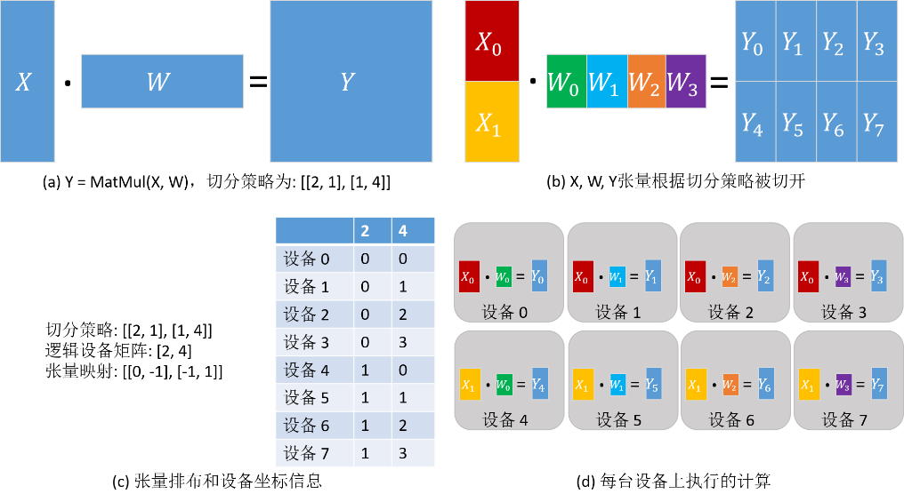

自动并行策略搜索
========================

.. image:: https://mindspore-website.obs.cn-north-4.myhuaweicloud.com/website-images/r2.6.0rc1/resource/_static/logo_source.svg
    :target: https://gitee.com/mindspore/docs/blob/r2.6.0rc1/docs/mindspore/source_zh_cn/features/parallel/auto_parallel.rst
    :alt: 查看源文件

自动并行策略搜索模式能够让用户无需关心策略配置，自动地建立代价模型，找到训练时间较短的并行策略。当前MindSpore支持如下两种不同的自动并行策略搜索方案：

- 切分策略传播算法：由配置并行策略的算子向未配置的算子传播并行策略。在传播时，算法会尽量选取引发张量重排布通信最少的策略。
- 双递归策略搜索算法：其基于符号运算的代价模型可以自由适配不同的加速器集群，对于巨大网络以及大规模多卡切分能够保证瞬间生成最优策略。

自动并行策略搜索算法是基于算子级模型并行的策略搜索算法，要了解其原理，首先需要了解MindSpore算子级并行中的基本概念：分布式算子、张量排布和张量重排布。算子级并行属于“单程序多数据”（Single Program Multiple Data，SPMD）的一种实现，即同一段程序执行在不同数据分片上。

MindSpore将单机版本的程序转换成并行版本的程序。该转换是细粒度的，会将单机版本程序中每个算子替换成分布式算子，同时保证替换是数学等价的。

分布式算子
----------------------

运行在多设备上的分布式算子保证了与单机版本算子计算语义的等价性。即在给定相同输入的情况下，分布式算子与单机版本算子总是得到相同的输出。

以矩阵乘算子（MatMul）为例，其输入是两个矩阵X和W，输出为Y = MatMul(X, W)。假设将这个算子切分到4台设备上并行执行，具体实现的方式取决于输入矩阵的切分策略：

- 情况一：如果矩阵X在4台设备上都有副本，而W按列切分4份，每台设备有一份，那么单机版本MatMul算子对应的分布式算子同样是MatMul；即每台设备上都将执行MatMul算子。
- 情况二：如果将X按照列切分4份，W按行切4份，每台机器各得到X和W的一个分片，那么单机版本MatMul算子对应的分布式算子是MatMul->AllReduce；即每台设备上都将顺序执行MatMul和AllReduce两个算子，才能保证数学等价性。

除了“单程序”（Single Program，SP）外，“多数据”（Multiple Data，MD）也需要指定，也就是哪台设备得到数据的哪个切片。为此，我们先定义切分策略（Sharding Strategy）。

切分策略
----------------------

算子的切分策略是一个二维数组，表示该算子的每个输入张量中的每个维度的切片数量。这里的切分都是均匀切分。

由切分策略，可以推导出 **张量排布** ，用以描述张量是如何分布在各个设备上的。

张量排布
----------------------

给定一个算子的切分策略，能够推导出该算子的输入和输出张量的 **张量排布** 。张量排布是由 **逻辑设备矩阵** 和 **张量映射** 构成的，其中：

- 逻辑设备矩阵是该算子的输入和输出张量共用的，为一维数组，表示设备的组织形式；
- 张量映射是二维数组，表示张量的某一维切分到逻辑设备矩阵的某一维。

同样以矩阵乘算子（MatMul）为例，其输入是两个矩阵X和W，输出为Y = MatMul(X, W)。给算子配置切分策略为[[2, 1], [1, 4]]，从而得到的张量排布和每台设备上执行的计算如下图所示。其中，X沿行均匀切分为2份，W沿列均匀切分为4份（如下图(b)）；根据切分策略，推导出逻辑设备矩阵和张量映射，如下图(c)所示；各个设备的坐标因此也确定下来了，描述了其在逻辑设备矩阵中的位置。张量在各个设备中的分布由设备的坐标决定。由下图(c)中表的‘2’列得出：设备0—设备3得到 :math:`X_0` 分片，设备4—设备7得到 :math:`X_1` 分片。由下图(c)中表的‘4’列得出：设备0和设备4得到 :math:`W_0` 分片，设备1和设备5得到 :math:`W_1` 分片，设备2和设备6得到 :math:`W_2` 分片，设备3和设备7得到 :math:`W_3` 分片。因此，各台设备上的计算也确定下来了，如下图(d)所示。

对于有数据依赖的两个算子（即一个算子的输出张量被第二个算子使用），两个算子对于该数据依赖张量定义的张量排布可能不同（由于逻辑设备矩阵不同或张量映射不同），因此提出了 **张量重排布** ，用以转换不一致的排布。这里给出张量重排布的定义，省略了具体算法。

张量重排布
----------------------

给定同一张量的两个不一致的张量排布，张量重排布能够将源排布转换到目的排布，同时保证转换产生的通信代价最小。这里的通信代价指的是每台设备通信的数据量。

以两个矩阵乘算子为例：Z = MatMul(X, W), O = MatMul(Z, Y)。为了使得张量重排布起作用，两个矩阵乘算子配置了不同的切分策略，使得张量Z的排布不一致。在下图(a)中，第一个矩阵乘算子的输出张量Z是按行切分的，然而第二个矩阵乘算子要求张量Z是完整的，因此张量重排布推导出这里需要插入AllGather算子完成转换 :sup:`[1]` 。在下图(b)中，第一个矩阵乘算子的输出张量Z是按行切分的，然而第二个矩阵乘算子要求张量Z是按列切分的，故张量重排布推导出这里需要插入AllToAll算子完成转换。

.. image:: ./images/tensor_redistribution_zh.png

[1]：注：实际上需要插入AllGather算子和Concat算子。

策略传播算法
----------------

切分策略传播算法
~~~~~~~~~~~~~~~~

切分策略传播算法是指：用户仅需手动定义计算图中几个关键算子的策略，其余算子的策略由算法自动生成。因为关键算子的策略已被定义，所以该算法的代价模型主要描述算子之间的重排布代价（Redistribution Cost），优化目标为全图重排代价最小。主要算子策略已被定义，意味着压缩了搜索空间，这种方案的搜索时间较短，其策略性能依赖于关键算子策略的定义。因此使用切分策略传播算法需要用户具备一定的分析、定义策略的能力。

.. note::
   切分策略传播算法支持的硬件平台为Ascend，此外还同时支持 PyNative 模式和 Graph 模式。

相关接口：

1. ``mindspore.parallel.auto_parallel.AutoParallel(net, parallel_mode="recursive_programming")``：设置并行模式，可以通过parallel_mode选择策略传播算法或双递归算法。

2. ``mindspore.nn.Cell.shard()`` 以及 ``mindspore.ops.Primitive.shard()``：指定算子切分策略，其余算子的策略通过传播算法推导得到。目前 ``mindspore.nn.Cell.shard()`` 接口同时支持 PyNative 模式与 Graph 模式；``mindspore.ops.Primitive.shard()`` 接口仅可在 Graph 模式下使用。

总而言之，切分策略传播算法需要用户手动配置关键算子的切分策略。

基本原理
^^^^^^^^

给定计算图， **切分策略传播** （Sharding Propagation）使得策略由配置的算子传播到整张计算图的所有算子。在传播过程中，策略选择的目标是最小化张量重排布产生的通信代价。

切分策略传播的输入是带有一些算子切分策略的计算图，其中的点表示算子，有向边表示数据依赖关系。切分策略传播的执行流程如下：

1. 为未配置切分策略的算子生成可行的切分策略；
2. 为每条边生成重排布策略及相应的代价；
3. 从已配置切分策略的算子出发，利用广度优先搜索将切分策略传播到其他未配置切分策略的算子。传播过程的目标是最小化每条边上的重排布通信代价。若在当前传播路径上遇到已配置策略的算子，则停止传播。

下图所示的是切分策略传播的一个流程实例：

1. 在给定带有切分策略的计算图后，首先为没有配置切分策略的算子枚举其可行的策略，如下图(b)所示。
2. 为每条边枚举重排布策略和相应的代价。如下图(c)所示，这里的重排布策略定义为二元组[ *s_strategy* , *t_strategy* ]，其中 *s_strategy* 表示的是源算子（下图(c)中的ReLU）的切分策略， *t_strategy* 表示的是目的算子（下图(c)中的MatMul）的切分策略。
3. 当沿着一条边传播到下一个算子时（如图中ReLU切分策略已确定，为[2, 4]，下一步要决定MatMul算子的切分策略），在表中选择引起通信代价最小的目的算子策略（即为MatMul选择[[2, 4], [4, 1]]）。最后，所有算子的切分策略都被确定，如下图(d)所示。

.. image:: ./images/sharding_propagation_zh.png
   :alt: 切分策略传播的流程实例
   :target: ./images/sharding_propagation_zh.png

双递归策略搜索算法
~~~~~~~~~~~~~~~~~~~~

双递归策略搜索算法（Symbolic Automatic Parallel Planner，简称SAPP）基于符号化自动策略生成。SAPP算法能够对于巨大网络以及大规模切分瞬间生成最优策略。SAPP基于并行原理建模，通过建立抽象机来描述硬件集群拓扑，并通过符号化简优化代价模型。其代价模型比较的不是预估的绝对时延，而是不同并行策略的相对代价，因此能够大大压缩搜索空间，在百卡集群上能够保证分钟级的搜索时间。

.. note::
   双递归策略搜索算法支持的硬件平台为Ascend，需要在 Graph 模式下运行。

相关接口：
``mindspore.parallel.auto_parallel.AutoParallel(net, parallel_mode="recursive_programming")``
除了以上 ``AutoParallel`` 接口，双递归策略搜索算法无需额外配置。

基本原理
^^^^^^^^^

双递归策略搜索算法是一种全自动的算子级策略搜索方案，用户无需对模型进行任何配置，算法可以自动搜索出通信代价最小的并行策略。

传统自动算子级策略搜索的核心问题有两点：

1. 指数级的切分可能带来庞大的搜索空间，遍历庞大的搜索空间耗时十分长；
2. 为了构造代价模型以分析不同策略，需要进行 profiling，而 profiling 过程和 profiling 结果分析都会引入更多的耗时。

对于第一个问题，双递归策略搜索算法通过对 AI 训练集群进行抽象，总结出其对称多阶的特点，因此可以等价地进行递归二分，来压缩设备数带来的搜索空间；另一方面，双递归策略搜索算法将算子的通信代价进行分类，比较算子内的通信代价以及算子间的重排布代价，通过对算子的权重进行排序的方法，将指数级的搜索复杂度压缩到线性。

对于第二个问题，双递归策略搜索算法建立符号化的代价模型，传统方法的代价模型着眼于如何准确地预估不同策略的绝对时延，而双递归策略搜索算法的代价模型比较的是不同策略的相对代价，因此可以大大节省 profiling 的成本。

因此双递归策略搜索算法对于巨大网络以及大规模集群切分能够快速生成最优策略。总而言之，双递归策略搜索算法基于并行原理建模，通过建立抽象机来描述硬件集群拓扑，通过符号化简化代价模型。其代价模型比较的不是预估的绝对时延，而是不同并行策略的相对代价，因此能够大大压缩搜索空间，对于百卡集群能够保证分钟级的搜索时间。
