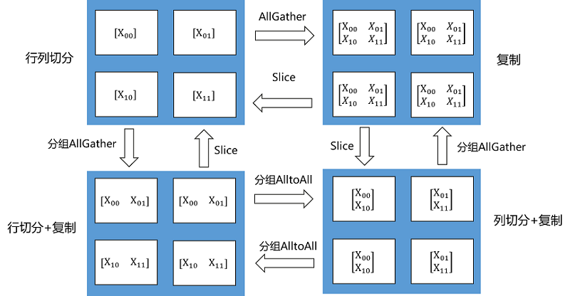

# 算子级并行

[](https://gitee.com/mindspore/docs/blob/master/docs/mindspore/source_zh_cn/features/parallel/operator_parallel.md)

## 概述

随着深度学习的发展，网络模型正变得越来越大，如NLP领域已出现万亿级参数量的模型，模型容量远超单个设备的内存容量，导致单卡或数据并行均无法进行训练。

算子级并行是将网络模型中每个算子涉及到的张量进行切分，当仅切分数据维度时，为逻辑上的数据并行；当仅切分模型维度时，为逻辑上的模型并行。通过将张量切分到多个设备上，降低单个设备的内存消耗，从而使大模型的训练成为可能。

MindSpore提供两种粒度的算子级并行能力：[算子级并行](#基本原理)和[高阶算子级并行](#高阶算子级并行)。算子级并行通过简单切分策略描述张量维度分布，满足大多数场景需求。高阶算子级并行通过开放设备排布描述，支持复杂切分场景（如非连续设备分配、多维混合切分）。两种粒度的算子级并行能力均同时支持ops和mint算子，本章仅介绍基于ops算子的算子级并行和高阶算子级并行，基于mint算子的算子级并行配置方法请参照[算子级并行教程](https://www.mindspore.cn/tutorials/zh-CN/master/parallel/operator_parallel.html)中的mint算子并行和高阶mint算子并行章节。

目前，MindSpore支持并行的算子列表，可以参考[算子级并行使用约束](https://www.mindspore.cn/docs/zh-CN/master/api_python/operator_list_parallel.html)。

> 算子级并行模型支持的硬件平台包括Ascend、GPU，需要在Graph模式下运行。

相关接口：

1. [mindspore.parallel.auto_parallel.AutoParallel(network, parallel_mode="semi_auto")](https://www.mindspore.cn/docs/zh-CN/master/api_python/parallel/mindspore.parallel.auto_parallel.AutoParallel.html)：通过静态图并行封装指定并行模式，其中`network`是待封装的顶层`Cell`或函数，`parallel_mode`取值`semi_auto`，表示半自动并行模式。该接口返回封装后包含并行配置的`Cell`。

2. [mindspore.ops.Primitive.shard()](https://www.mindspore.cn/docs/zh-CN/master/api_python/ops/mindspore.ops.Primitive.html#mindspore.ops.Primitive.shard)：指定算子切分策略，详细案例请参考本章的[基本原理](#基本原理)。

3. [`mindspore.ops.Primitive.add_prim_attr()`](https://www.mindspore.cn/docs/zh-CN/master/api_python/ops/mindspore.ops.Primitive.html#mindspore.ops.Primitive.add_prim_attr)：为满足不同场景诉求，部分算子能通过`add_prim_attr`接口对其分布式实现进行配置，这些配置仅对`SEMI_AUTO_PARALLEL`与`AUTO_PARALLEL`模式适用，例如：

    - `ops.Gather().add_prim_attr("manual_split", split_tuple)`：该接口配置Gather算子的第一个输入非均匀切分，它仅对axis=0时有效。其中`split_tuple`是一个元素为int类型的元组，元素之和须等于Gather算子第一个输入的第零维的长度，元组个数须等于Gather算子第一个输入的第零维切分份数。
    - `ops.Gather().add_prim_attr("primitive_target", "CPU")`：该接口配置Gather算子在CPU上执行，用于异构场景。
    - `ops.Reshape().add_prim_attr("skip_redistribution")`：对于ops.Reshape的前后不进行张量重排布(张量重排布见[基本原理](#基本原理))。
    - `ops.ReduceSum().add_prim_attr("cross_batch")`：该接口仅对Reduce类算子适用。当配置这个参数后，Reduce类算子如果轴被切分，则会对分片完成reduce操作后不进行多卡之间的同步，结果会和单卡不等价。
    - `ops.TensorScatterUpdate().add_prim_attr("self_define_shard", True)`: 对于任意打上`self_define_shard`标签的算子，可以支持对该算子（无论是否实现过算子切分）配置输入输出Layout。但是输入输出Layout的正确性以及算子切分后的精度需要由用户保证。

## 基本原理

MindSpore对每个算子独立建模，用户可以设置正向网络中每个算子的切分策略（对于未设置的算子，默认按数据并行进行切分）。

在构图阶段，框架将遍历正向图，根据算子的切分策略对每个算子及其输入张量进行切分建模，使得该算子的计算逻辑在切分前后保持数学等价。框架内部使用Tensor Layout来表达输入/输出张量在集群中的分布状态，Tensor Layout中包含了张量和设备间的映射关系，用户无需感知模型各切片在集群中如何分布，框架将自动调度分配。

此外，框架还将遍历相邻算子间张量的Tensor Layout。如果前一个算子输出张量作为下一个算子的输入张量，且前一个算子输出张量的Tensor Layout与下一个算子输入张量的Tensor Layout不同时，则需要在两个算子之间进行张量重排布（Tensor Redistribution）。对于训练网络来说，框架处理完正向算子的分布式切分之后，依靠框架的自动微分能力，即能自动完成反向算子的分布式切分。

Tensor Layout用于描述Tensor在集群中的分布信息，Tensor可以按某些维度切分到集群，也可以在集群上复制。在下面这个例子中，将一个二维矩阵切分到两个节点，有三种切分方式：行切分、列切分及复制（每种切分方式即对应于一种Tensor Layout），如下图所示：


如果将二维矩阵切分到4个节点，则有四种切分方式，行列同时切分、复制、行切分+复制、列切分+复制，如下图所示：


Tensor Redistribution用于处理不同Tensor Layout之间的转换，它能在集群中将Tensor从一种排布转换成另外一种排布。所有重排布操作，都会被分解成“集合通信+split+concat”等算子组合。下面两张图说明了几种Tensor Redistribution的操作。


*图：Tensor切分到两个节点的重排*



*图：Tensor切分到四个节点的重排*

用户可以使用shard()接口来设置算子的切分策略，该接口可以描述算子的每个输入张量的每个维度如何切分。比如MatMul().shard(((a, b), (b, c)))表示MatMul有两个输入张量，对第一个输入张量的行均匀切分a份，列均匀切分b份；对第二个输入张量的行均匀切分b份，列均匀切分c份。

```python
import mindspore.nn as nn
from mindspore import ops
from mindspore.parallel.auto_parallel import AutoParallel

class DenseMatMulNet(nn.Cell):
    def __init__(self):
        super(DenseMatMulNet, self).__init__()
        self.matmul1 = ops.MatMul().shard(((4, 1), (1, 1)))
        self.matmul2 = ops.MatMul().shard(((1, 1), (1, 4)))
    def construct(self, x, w, v):
        y = self.matmul1(x, w)
        z = self.matmul2(y, v)
        return z

net = DenseMatMulNet()
paralell_net = AutoParallel(net, parallel_mode='semi_auto')
```

在以上例子中，用户在4个卡上计算两个连续的二维矩阵乘：`Z = (X * W) * V` 。第一个矩阵乘`Y = X * W`，用户想把X按行切4份（即数据并行）；而第二个矩阵乘`Z = Y * V`，用户想把V按列切4份（即模型并行）：

由于第一个算子输出的Tensor Layout是第零维切分到集群，而第二个算子要求第一个输入Tensor在集群上复制。所以，在图编译阶段会自动识别两个算子输出/输入之间Tensor Layout的不同，从而自动推导出Tensor重排布的算法。而这个例子所需要的Tensor重排布是一个AllGather算子（注：MindSpore的AllGather算子会自动把多个输入Tensor在第零维进行合并）


## 高阶算子级并行

在MindSpore中，算子级并行的配置是通过mindspore.ops.Primitive.shard()接口实现的。该接口通过tuple描述每个输入张量的切分方式，适用于大多数场景，配置过程较为简单。然而，这种切分方式仅描述了张量的切分逻辑，却隐藏了张量在设备rank上的具体排布。因此，它在表达张量切分与设备排布之间的映射关系时存在局限性，无法满足一些复杂场景的需求。

为了应对这些复杂场景，本章节将介绍一种开放设备排布描述的高阶算子级并行配置方法。

[算子级并行](https://www.mindspore.cn/docs/zh-CN/master/features/parallel/operator_parallel.html) 中介绍了MindSpore对张量的基本切分逻辑，但不能表达出所有的切分场景。例如，对于一个二维张量 "[[a0, a1, a2, a3], [a4, a5, a6, a7]]"，其张量排布如下图所示：


*图：二维张量排布示意*

由图可知，张量的0轴，如"[a0, a1, a2, a3]"切分到了不连续的卡"[Rank0, Rank4, Rank2, Rank6]"上，而该张量按照strategy=(2, 4)切分，排布应该如下图所示：


*图：二维张量按照切分策略排布示意*

因此，直接对算子的输入/输出张量按照切分数目进行切分，无法表达出一些有特殊诉求的切分场景。

### 接口配置

为了表达出如上述场景下的切分，[shard](https://www.mindspore.cn/docs/zh-CN/master/api_python/parallel/mindspore.parallel.shard.html) 接口进行了功能扩展。

入参in_strategy和out_strategy都额外接收新的数量类型——tuple(Layout)。其中[Layout](https://www.mindspore.cn/docs/zh-CN/master/api_python/parallel/mindspore.parallel.Layout.html) 通过设备矩阵进行初始化，并同时要求给设备矩阵的每个轴取一个别名。例如："layout = Layout((8, 4, 4), name = ("dp", "sp", "mp"))"表示该设备共有128张卡，按照(8, 4, 4)的形状进行排列，并为每个轴分别取了别名"dp"、"sp"、"mp"。

关于Layout的具体含义与配置推导方法，可参考如下两篇技术文档：

- [基于MindSpore Layout推导各卡上的Tensor分片（列表法）](https://discuss.mindspore.cn/t/topic/124)
- [基于MindSpore Layout推导各卡上的Tensor分片（图解法）](https://discuss.mindspore.cn/t/topic/125)

在调用Layout时，通过传入这些轴的别名，每个张量根据其形状（shape）决定每个维度映射到设备矩阵的哪个轴，以及对应的切分份数。例如：

- "dp"表示在设备排布的最高维度的8个设备内切分为8份；
- "sp"表示在设备排布的中间维度的4个设备内切分为4份；
- "mp"表示在设备排布的最低维度的4个设备内切分为4份。

特别地，张量的一个维度可以映射到设备的多个维度，以表达在一个维度进行多次切分。

针对上述例子中"[[a0, a1, a2, a3], [a4, a5, a6, a7]]"切分到不连续卡上的情况，可以通过如下Layout表达：

```python
# a = [[a0, a1, a2, a3], [a4, a5, a6, a7]]
from mindspore import Layout
layout = Layout((2, 2, 2), alias_name = ("dp", "sp", "mp"))
a_strategy = layout("mp", ("sp", "dp"))
```

可以看到，在张量a的"[a0, a1, a2, a3]"上进行了两次切分，从而切分到了设备的"sp"与"dp"两个轴上，这样出来的结果才是：


下面，通过一个具体的例子，演示用户在8个卡上计算二维矩阵乘：`Y = (X * W)` 。其中，设备按照`2 * 2 * 2`进行组织；X的切分与上述的张量a切分一致。代码如下所示：

```python
import mindspore.nn as nn
from mindspore import ops, Layout
from mindspore.parallel.auto_parallel import AutoParallel

class DenseMatMulNet(nn.Cell):
    def __init__(self):
        super(DenseMatMulNet, self).__init__()
        layout = Layout((2, 2, 2), alias_name = ("dp", "sp", "mp"))
        in_strategy = (layout("mp", ("sp", "dp")), layout(("sp", "dp"), "None"))
        out_strategy = (layout(("mp", "sp", "dp"), "None"), )
        self.matmul1 = ops.MatMul().shard(in_strategy, out_strategy)
    def construct(self, x, w):
        y = self.matmul1(x, w)
        return y

net = DenseMatMulNet()
paralell_net = AutoParallel(net, parallel_mode='semi_auto')
```