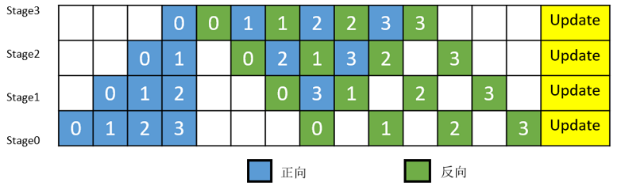
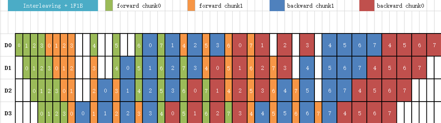
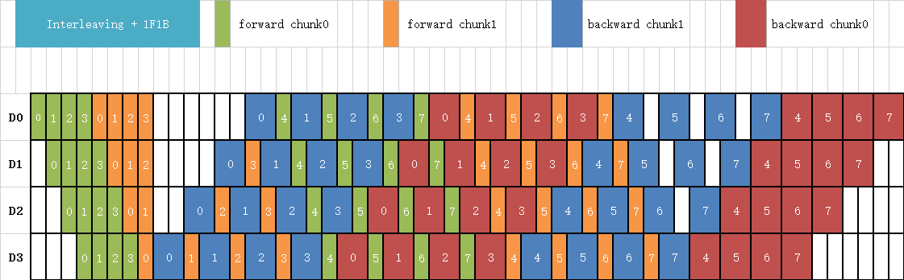

# 流水线并行

## 概述

近年来，神经网络的规模几乎是呈指数型增长。受单卡内存的限制，训练这些大模型需要的设备数量也在不断增加。受server间通信带宽低的影响，传统的`数据并行+模型并行`这种混合并行模式的性能表现欠佳，需要引入流水线并行。流水线并行能够将模型在空间上按阶段（Stage）进行切分，每个Stage只需执行网络的一部分，大大节省了内存开销，同时缩小了通信域，缩短了通信时间。MindSpore能够根据用户的配置，将单机模型自动转换成流水线并行模式去执行。

> 流水线并行模型支持的硬件平台包括Ascend、GPU，需要在Graph模式下运行。

相关接口：

1. `mindspore.parallel.auto_parallel.AutoParallel(network, parallel_mode="semi_auto")`：通过静态图并行封装指定并行模式，其中`network`是待封装的顶层`Cell`或函数，`parallel_mode`取值`semi_auto`，表示半自动并行模式。该接口返回封装后包含并行配置的`Cell`。

2. `mindspore.parallel.auto_parallel.AutoParallel.pipeline(stages=1, output_broadcast=False, interleave=False, scheduler='1f1b')`：设置流水线并行配置。`stages`表示流水线并行需要设置的切分总数，`output_broadcast`表示流水线并行推理时，最后一个stage的结果是否广播给其他stage，`interleave`表示是否开启interleave优化策略，`scheduler`表示流水线并行的调度策略，当前支持`gpipe`和`1f1b`。

3. `mindspore.parallel.Pipeline(network, micro_size=1, stage_config={"cell1":0, "cell2":1})`：流水线并行需要需要在`network`外再添加一层`Pipeline`，并通过`micro_size`指定MicroBatch的个数，以及指出网络中各Cell在哪个`stage`中执行。如果对于`network`使用`nn.WithLossCell`封装，则会改变`Cell`的名称，并增加`_backbone`前缀。为了提升机器的利用率，MindSpore将MiniBatch切分成了更细粒度的MicroBatch，最终的loss则是所有MicroBatch计算的loss值累加。其中，micro_size必须大于等于stages的数量。

4. `mindspore.parallel.PipelineGradReducer(parameters, scale_sense=1.0, opt_shard=None)`：流水线并行需要使用`PipelineGradReducer`来完成梯度聚合。这是因为流水线并行中，其输出是由多个`MicroBatch`的结果相加得到，因此其梯度也需要进行累加。

5. `mindspore.parallel.sync_pipeline_shared_parameters(net)`: 在推理场景下，用于同步不同stage之间共享权重。

## 基本原理

流水线（Pipeline）并行是将神经网络中的算子切分成多个Stage，再把Stage映射到不同的设备上，使得不同设备去计算神经网络的不同部分。流水线并行适用于模型是线性的图结构。

如图1所示，将4层MatMul的网络切分成4个Stage，分布到4台设备上。正向计算时，每台机器在算完本台机器上的MatMul之后将结果通过通信算子发送（Send）给下一台机器，同时，下一台机器通过通信算子接收（Receive）上一台机器的MatMul结果，同时开始计算本台机器上的MatMul；反向计算时，最后一台机器的梯度算完之后，将结果发送给上一台机器，同时，上一台机器接收最后一台机器的梯度结果，并开始计算本台机器的反向。

*图1：流水线并行的图切分示意图*

### Gpipe流水线并行调度

简单地将模型切分到多设备上并不会带来性能的提升，因为模型的线性结构在同一时刻只有一台设备在工作，而其他设备在等待，造成了资源的浪费。为了提升效率，流水线并行进一步将小批次(MiniBatch)切分成更细粒度的微批次(MicroBatch)，在微批次中采用流水线式的调度，从而达到提升效率的目的。

如图2所示，将小批次切分成4个微批次，4个微批次在4个组上执行形成流水线。微批次的梯度汇聚后用来更新参数，其中每台设备只存储并更新对应组的参数。其中白色序号代表微批次的索引。

*图2：带MicroBatch的流水线并行执行时间线示意图*

### 1F1B流水线并行调度

MindSpore的流水线并行实现中了对执行序进行调整，来达到更优的内存管理。

如图3所示，在编号为0的MicroBatch的正向计算执行完后，立即执行其反向。这样做使得其中间结果的内存得以更早地（相较于图2）释放，进而确保内存使用峰值比图2的方式更低。

*图3：MindSpore流水线并行执行时间线示意图*

### interleaved pipeline调度

为了提升流水线并行的效率，减少Bubble的占比，Megatron-LM提出了一种新的流水线并行调度策略：“interleaved pipeline”。传统的流水线并行通常会在一个stage上放置几个连续的模型层（如：Transformer层），如图3所示。而在interleaved pipeline调度中，每个stage会对非连续的模型层进行交错式的计算，以更多的通信量来进一步降低Bubble的占比，如图4所示。例如：传统流水线并行每个stage有2个模型层，即：stage0有第0-1层，stage1有第2-3层，stage2有第4-5层，stage3有第6-7层；在interleaved pipeline中，stage0有第0层和第4层，stage1有第1层和第5层，stage2有第2层和第6层，stage3有第3层和第7层。

*图4:  interleaved pipeline调度*

### MindSpore中的interleaved pipeline调度

MindSpore在Megatron-LM的interleaved pipeline调度的基础上做了内存优化，具体做法是将部分前向的执行序往后移动，如图5所示。这样可以使得在内存峰值时刻，累积更少的MicroBatch内存。

*图5: MindSpore的interleaved pipeline调度*

