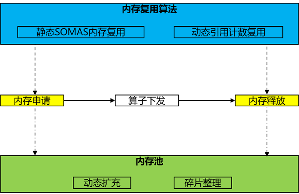
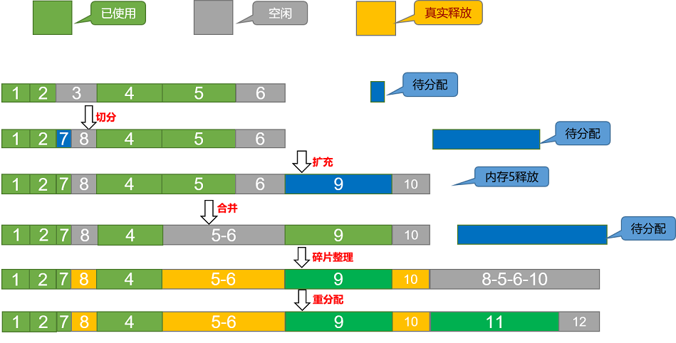

# 内存管理

## 概述

设备上的device内存（以下均简称为内存）是AI模型训练中最为重要的资源，内存管理无疑是运行时中极为关键的功能，对内存分配释放性能以及内存复用效率的要求都非常高。内存管理体现主要为算子下发前对算子进行内存分配，下发后内存释放，供后续算子复用，关键功能点为内存池和内存复用算法：

1. 内存池作为内存管理的底座，可以有效避免内存频繁动态分配的开销。
2. 内存复用算法作为内存管理的核心竞争力，需要具备高效的内存复用效果以及尽量少的内存碎片。

## 接口

内存管理相关接口详见[runtime接口](https://www.mindspore.cn/docs/zh-CN/r2.6.0rc1/api_python/mindspore.runtime.html#%E5%86%85%E5%AD%98)，其中最为重要的两个接口为内存设置接口和内存碎片管理接口：

1. 内存设置接口：[mindspore.runtime.set_memory](https://www.mindspore.cn/docs/zh-CN/r2.6.0rc1/api_python/runtime/mindspore.runtime.set_memory.html#mindspore.runtime.set_memory)，设置使用内存池管理的内存参数以及内存复用算法。
2. 内存碎片管理接口：[环境变量MS_ALLOC_CONF](https://www.mindspore.cn/docs/zh-CN/r2.6.0rc1/api_python/env_var_list.html#%E5%9B%BE%E7%BC%96%E8%AF%91%E6%89%A7%E8%A1%8C)，根据硬件驱动是否具备虚拟内存跟物理内存映射能力来确定行为，如果具备则默认打开，否则默认关闭。可通过export MS_ALLOC_CONF=“enable_vmm:false”强制关闭。

## 内存池

内存池作为内存管理的底座，其核心思想是预先分配一大块连续内存，申请内存时直接从池中分配，释放时归还到池中复用，而非频繁调用系统中的内存申请释放接口，减少了频繁动态分配的开销，提升了系统性能。MindSpore主要使用最佳适应（BestFit）内存分配算法，支持动态扩充内存块和碎片整理，通过接口mindspore.runtime.set_memory(init_size,increase_size,max_size)设置内存池初始化参数用于控制内存池动态扩充大小和最大内存使用量。

1. 切分操作：内存分配时，空闲区按其大小排序，找到第一个满足要求的空闲区，按需分配，切分多余部分，插入新的空闲内存块。
2. 合并操作：内存回收时，相邻的空闲内存块被回收，合并为一个大的空闲内存块。
3. 扩充操作：内存分配时，当空闲区没有满足要求的空闲内存，则通过接口申请一定大小的内存扩充内存池。
4. 碎片整理：内存分配时，当单个空闲内存不足以分配，但是实际剩余内存足够时，会触发碎片整理，从而腾挪出一整块空闲内存。

## 内存复用算法

内存复用算法作为内存管理的核心竞争力，通过好的复用算法可以有效减少内存碎片。MindSpore实现了静态SOMAS复用和动态引用计数复用两种算法，各有优缺点，更多场景下是两者算法的结合使用，根据网络结构特点按需选择使用。通过接口mindspore.runtime.set_memory(optimize_level)设置内存复用算法，O0表示动态内存复用，O1表示静态内存复用。

**静态内存复用**

静态内存复用主要是在图编译阶段确定了内存复用关系，MindSpore实现了SOMAS（Safe Optimized Memory Allocation Solver ）算法，其主要思想是将计算图并行流与数据依赖进行聚合分析，得到算子间依赖关系，通过依赖关系建模张量全局生命期约束，使用多种启发式算法求解最优的内存静态规划，最小化内存碎片，实现逼近理论极限的内存复用。主要步骤为：

1. 对图进行建模。
2. 根据建模信息计算tensor之间的互斥约束关系。
3. 使用多种启发式算法求解。
4. 选择最优的求解结果进行内存分配。

- 优点：图编译阶段静态规划内存复用，可以获取到全局依赖关系，尽量减少内存碎片。
- 缺点：图编译阶段在动态shape场景下，无法获取到tensor的shape，导致无法使用。

**动态内存复用**

动态内存复用刚好跟静态内存复用相反，将内存复用关系转移到执行阶段，执行过程中完全动态分配内存，执行时即来即申请，根据引用计数确保使用完就释放，达到动态复用效果。主要步骤为：

1. 记录每个tensor的user个数，称为引用计数。
2. 执行中tensor每被消费一次，则将引用计数减1。
3. 引用计数减为0，则释放给内存池。
4. 重置第1步的初始引用计数。

- 优点：图执行阶段动态内存复用，完全泛通用，尤其对于动态shape和控制流场景非常友好。
- 缺点：图执行阶段按需复用，获取不到全局信息，容易产生内存碎片。
