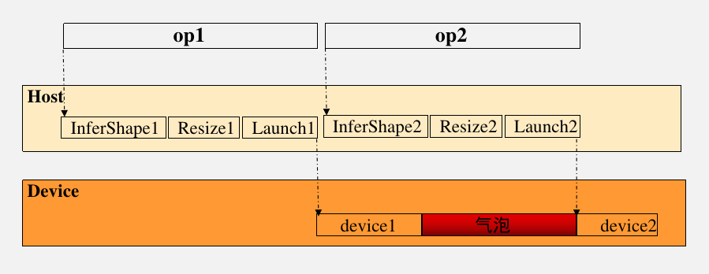
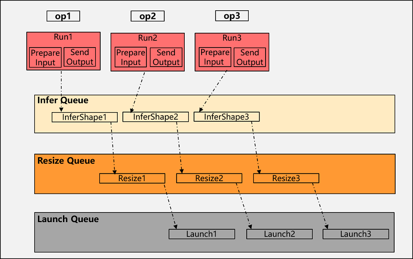

# 多级流水

## 概述

运行时对于一个算子的调度，主要包括InferShape（含更新shape）、Resize（含tiling计算和更新内存大小）和Launch（含内存申请和释放）这些操作，host完成这些操作后才能下发到device（NPU/GPU）上，当host这些处理速度跟不上算子的device执行时间时，则在device侧会产生气泡，导致device算力得不到最大化使用，影响整体性能，为此MindSpore提出运行时多级流水下发，充分利用host多线程资源，将host这些操作拆解为单独的操作单元，流水下发，大大提升host下发效率。

## 基本原理

多级流水是运行时的关键性能优化点，通过任务分解和并行流水下发来提高运行时调度效率，充分发挥CPU多核性能。主要流程如下：

1. 任务分解：将算子调度分解InferShape、Resize和Launch三个任务。
2. 队列创建：创建Infer Queue、Resize Queue和Launch Queue三个队列，用于承接第1步的三个任务。
3. 流水调度：首算子收集到输入后，只需要将InferShape的task下发到Infer队列，即可将算子的输出数据发给下一个算子，InferShape完成后将该算子的Resize task下发到Resize队列，最后Resize完成后将LaunchKernel task下发到Launch队列。
