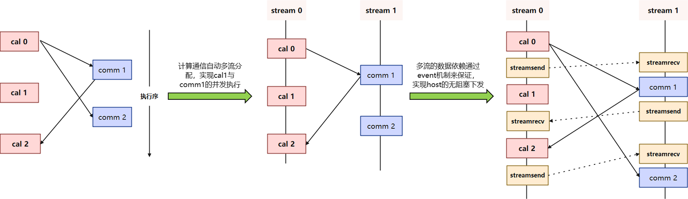
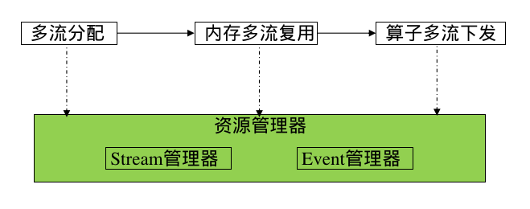

# 多流并发

## 概述

在大规模深度学习模型的训练过程中，为了尽量多地做到通信和计算的overlap，通信和计算多流并发对于执行性能的重要性不言而喻。为了应对这一挑战，MindSpore实现了自动stream分配和event插入功能，以优化计算图的执行效率和资源利用率。这些功能的引入，不仅提升了计算图的并发能力，还显著减少了设备内存开销，从而在大模型训练中实现了更高的性能和更低的延迟。

## 基本原理

传统的多流并发方法通常依赖于手动配置，这不仅繁琐且容易出错，而且在面对复杂的计算图时，手动配置往往难以达到最优的并发效果。MindSpore的自动流分配功能通过智能算法，自动识别和分配计算图中的并发机会，将不同的算子分配到不同的流中执行。这种自动化的分配过程不仅简化了用户的操作，还能够在运行时动态调整流分配策略，以适应不同的计算环境和资源状况。

原理如下：

1. 根据执行序识别通信算子和计算算子。
2. 计算通信算子自动多流分配实现并发执行。
3. 多流之间数据依赖通过多流边界位置插入event，以实现host的无阻塞下发。

**多流管理**

为了实现上述多流并发执行的效果，多流管理是其重要技术，旨在高效管理和调度计算设备上的流（Stream），以优化计算图的执行效率和资源利用率。设备多流管理通过智能的流分配和调度策略，确保在多计算资源的环境中，计算、通信任务能够高效并发执行，从而提升整体性能。

**流管理器（Stream管理器）** 扮演着核心角色。它负责流的创建、分配和销毁，确保每个计算任务都能在合适的流上执行。流管理器根据任务的类型、优先级以及设备的负载情况，将任务调度到不同的流上，以实现最佳的资源利用和任务并发度。

**事件管理器（Event管理器）** 则负责监控和管理流之间的同步和依赖关系。通过事件的记录和触发，事件管理器确保不同流上的任务能够按照正确的顺序执行，避免数据竞争和资源冲突。事件管理器还支持异步事件（如内存回收）的触发和处理，进一步提升了系统的并发性和响应速度。
