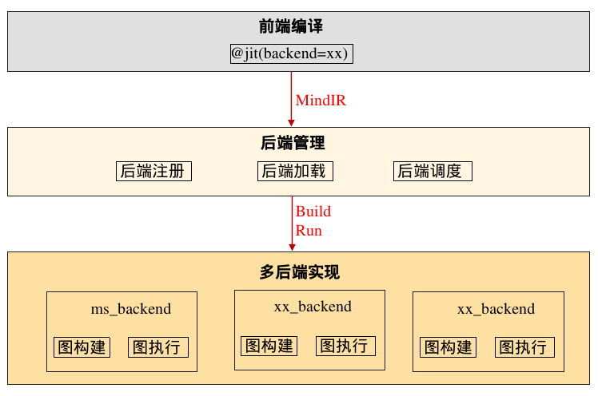

# 多后端接入

## 概述

为了满足新后端和新硬件的快速对接诉求，MindSpore通过开放式架构，在MindIR的基础上支持第三方后端插件化、低成本快速对接，第三方后端无需关注当前已有后端的数据结构和实现，只需以MindIR作为输入，实现自己的后端和功能，以独立so注册加载，不同后端之间的功能互相隔离。

## 接口

多后端实现，可通过mindspore.jit(backend="xx")指定使用的后端，详见[jit接口](https://www.mindspore.cn/docs/zh-CN/r2.6.0rc1/api_python/mindspore/mindspore.jit.html#mindspore.jit)。

## 基本原理

MindSpore多后端对接示意图如上，核心思想为：

1. 后端管理模块提供C++对外接口（backendmanager的Build和Run）和对内接口（基类backend的Build和Run）。
2. backendmanager对外接口，主要提供给前端MindIR对接后端功能，用于前后端解耦。
3. 基类backend对内接口，主要提供给各个后端各自实现Build和Run功能。
4. 各个后端功能均是独立so，用于后端管理模块动态加载调度。

了解了MindSpore多后端对接的核心思想后，新增后端时，主要工作如下：

1. mindspore.jit(backend="xx")接口新增后端类型。
2. 新后端子类继承基类backend，实现对应的Build和Run功能。
3. 新后端代码编译成独立so，注册到后端管理模块。
