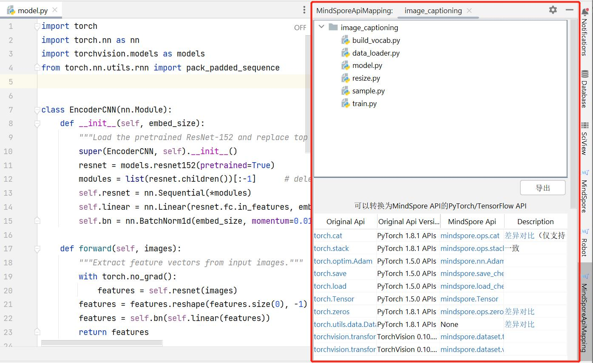

# 模型分析与准备

## 复现算法实现

1. 获取在PyTorch上已实现的参考代码。
2. 分析算法及网络结构，以及算法的创新点（包括数据增强方法、学习率衰减策略、优化器参数、参数初始化方法等）。
3. 复现参考论文实现的精度，获取参考性能数据，并提前识别问题。

请参考[复现算法实现详解](https://www.mindspore.cn/docs/zh-CN/master/migration_guide/reproducing_algorithm.html)。

## 分析API满足度

在实践迁移之前，建议先分析MindSpore对迁移代码中的API支持程度，避免API不支持影响代码实现。

这里分析的API专指网络执行图中的API，包含MindSpore的[算子](https://www.mindspore.cn/docs/zh-CN/master/api_python/mindspore.ops.primitive.html)及高级封装API，不包括数据处理中使用的API。数据处理过程中使用的API建议使用三方的实现代替，如numpy，opencv，pandas，PIL等。

分析API满足度有以下两种方式：

1. 使用API扫描工具自动（推荐）。
2. 手动查询API映射表进行分析。

### 工具扫描API

[MindSpore Dev Toolkit](https://www.mindspore.cn/devtoolkit/docs/zh-CN/master/index.html)是一款由MindSpore开发的多平台（目前支持在PyCharm和Visual Studio Code上运行）Python IDE插件，可基于文件级别或项目级别进行API扫描。

PyCharm中Dev Toolkit插件使用指南请参考[PyCharm API扫描](https://www.mindspore.cn/devtoolkit/docs/zh-CN/master/api_scanning.html#)。

Visual Studio Code中Dev Toolkit插件使用指南请参考[Visual Studio Code API扫描](https://www.mindspore.cn/devtoolkit/docs/zh-CN/master/VSCode_api_scan.html)。

### 手动查询API映射表

以PyTorch的代码迁移为例，拿到参考代码实现后，可以通过过滤`torch`，`nn`，`ops`等关键字获取使用的API接口，如调用了其他库的方法，需要手动分析。然后对照[PyTorch与MindSpore API 映射](https://www.mindspore.cn/docs/zh-CN/master/note/api_mapping/pytorch_api_mapping.html)
或者[API](https://www.mindspore.cn/docs/zh-CN/master/api_python/mindspore.ops.primitive.html) 查找对应的API实现。

其他框架API的映射可以参考API命名与功能描述。注意，针对相同功能的API，MindSpore的命名可能与其他框架不同，同名API参数与功能也可能与其他框架有区别，均以官方描述为准。

### 处理缺失API

如果没有找到对应的API接口，可采用以下策略来处理：

1. 等价替换。
2. 使用已有API包装等价功能逻辑。
3. 自定义算子。
4. 社区求助。

详细处理方法请参考[缺失API处理策略](https://www.mindspore.cn/docs/zh-CN/master/migration_guide/missing_api_processing_policy.html)。

## 分析功能满足度

MindSpore仍在持续迭代中，部分功能目前存在限制，在网络迁移过程中涉及受限功能使用的情况。通过分析功能满足度，可了解功能差异，并采取正确的措施来避免功能限制的影响。如[动态shape](https://www.mindspore.cn/docs/zh-CN/master/migration_guide/dynamic_shape.html)特性和[稀疏](https://www.mindspore.cn/docs/zh-CN/master/migration_guide/sparsity.html)特性。

## 迁移场景好用功能和特性推荐

### [动态图与静态图](https://www.mindspore.cn/tutorials/zh-CN/master/beginner/accelerate_with_static_graph.html)

目前主流的深度学习框架有静态图(Graph)和动态图(PyNative)两种执行模式。

- 静态图模式下，程序在编译执行时，首先生成神经网络的图结构，然后再执行图中涉及的计算操作。因此，在静态图模式下，编译器可以通过使用图优化等技术来获得更好的执行性能，有助于规模部署和跨平台运行。

- 动态图模式下，程序按照代码的编写顺序逐行执行，在执行正向过程中根据反向传播的原理，动态生成反向执行图。这种模式下，编译器将神经网络中的各个算子逐一下发到设备进行计算操作，方便用户编写和调试神经网络模型。

### [调用自定义类](https://www.mindspore.cn/tutorials/zh-CN/master/advanced/static_graph_expert_programming.html#使用jit-class)

在静态图模式下，通过使用`jit_class`修饰自定义类，用户可以创建、调用该自定义类的实例，并且可以获取其属性和方法。

`jit_class`应用于静态图模式，扩充完善静态图编译语法的支持范围。在动态图模式即PyNative模式下，`jit_class`的使用不影响PyNative模式的执行逻辑。

### [自动微分](https://www.mindspore.cn/tutorials/zh-CN/master/beginner/autograd.html)

自动微分能够计算可导函数在某点处的导数值，是反向传播算法的一般化。自动微分主要解决的问题是将一个复杂的数学运算分解为一系列简单的基本运算，该功能对用户屏蔽了大量的求导细节和过程，大大降低了框架的使用门槛。

### [混合精度](https://www.mindspore.cn/tutorials/zh-CN/master/advanced/mixed_precision.html)

通常我们训练神经网络模型的时候，默认使用的数据类型为单精度FP32。近年来，为了加快训练时间、减少网络训练时候所占用的内存，并且保存训练出来的模型精度持平的条件下，业界提出越来越多的混合精度训练的方法。这里的混合精度训练是指在训练的过程中，同时使用单精度（FP32）和半精度（FP16）。

### [自动数据增强](https://www.mindspore.cn/tutorials/experts/zh-CN/master/dataset/augment.html)

MindSpore除了可以让用户自定义数据增强的使用，还提供了一种自动数据增强方式，可以基于特定策略自动对图像进行数据增强处理。

### [梯度累加](https://www.mindspore.cn/tutorials/experts/zh-CN/master/optimize/gradient_accumulation.html)

梯度累加是一种训练神经网络的数据样本按Batch拆分为几个小Batch的方式，然后按顺序计算。目的是为了解决由于内存不足，导致Batch size过大神经网络无法训练或者网络模型过大无法加载的OOM（Out Of Memory）问题。

### [Summary](https://www.mindspore.cn/mindinsight/docs/zh-CN/master/summary_record.html)

训练过程中的标量、图像、计算图、训练优化过程以及模型超参等信息记录到文件中，通过可视化界面供用户查看。

### [调试器](https://www.mindspore.cn/mindinsight/docs/zh-CN/master/debugger.html)

MindSpore调试器是为图模式训练提供的调试工具，可以用来查看并分析计算图节点的中间结果。

### [Golden Stick](https://www.mindspore.cn/golden_stick/docs/zh-CN/master/index.html)

MindSpore Golden Stick是华为诺亚团队和华为MindSpore团队联合设计开发的一个模型压缩算法集。包含基本的量化和剪枝方法。
