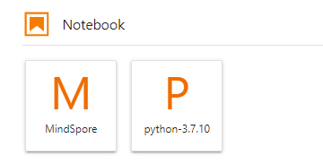
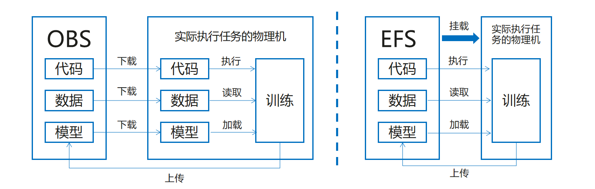

# 环境准备与资料获取

<a href="https://gitee.com/mindspore/docs/blob/master/docs/mindspore/source_zh_cn/migration_guide/enveriment_preparation.md" target="_blank"></a>

网络迁移首先需要配置MindSpore的开发环境，本章会详细描述安装过程与相关资料获取。相关资料包括对MindSpore组件models 与 Hub的基本介绍，包含用途、场景与使用方法。此外还有云上训练的相关教程：使用ModelArts适配脚本，在OBS上传数据集，进行线上训练等。

## MindSpore安装

[昇思MindSpore](https://www.mindspore.cn/tutorials/zh-CN/master/beginner/introduction.html)是一个全场景深度学习框架，目前支持在[昇腾](https://e.huawei.com/cn/products/servers/ascend)、GPU、CPU等多种device上运行。其中昇腾和GPU上安装MindSpore前需要配置好对应的运行环境。

> MindSpore 昇腾支持AI训练（910）、推理卡（310与310P）及训练服务器等多种Atlas系列芯片上运行，注意MindSpore版本需要和昇腾AI处理器配套软件包配套使用，如MindSpore1.8.1 必须配套昇腾软件包商业版22.0.RC2版本或者CANN社区版5.1.RC2.alpha008版本，在其他版本可能会有问题，详情请参考MindSpore Ascend版本安装指南中的“安装昇腾AI处理器配套软件包”章节。
>
> MindSpore GPU支持在Linux环境上CUDA 10.1和CUDA 11.1使用。NVIDIA官方给出了多种安装方式和安装指导，详情可查看[CUDA下载页面](https://developer.nvidia.com/cuda-toolkit-archive)和[CUDA安装指南](https://docs.nvidia.com/cuda/cuda-installation-guide-linux/index.html)。
>
> MindSpore CPU目前支持Linux，Windows和Mac。

在配套软件包安装齐全的基础上，再根据MindSpore安装指引，安装对应版本的MindSpore即可体验。

参考如下表格确定系统的发行版本、架构（X86或Arm）及Python版本。

|系统|查询内容| 查询命令|
|:----|:----|:----|
|Linux|系统发行版本| `cat /proc/version`|
|Linux|系统架构| `uname -m`|
|Linux|Python版本| `python3`|

根据自己使用的操作系统及计算硬件，选择对应的MindSpore版本，通过Pip、Conda、Docker或源码编译等方式安装MindSpore，推荐访问[MindSpore安装页面](https://www.mindspore.cn/install) ，并参考该网站指导完成安装并进行验证。

## models 与 hub

[MindSpore models](https://gitee.com/mindspore/models) 是MindSpore与社区共同提供的深度优化的模型集市，向开发者提供了深度优化的模型，生态中的小伙伴可以方便地基于ModelZoo中的模型进行个性化开发。当前已经覆盖了机器视觉、自然语言处理、语音、推荐系统等多个领域的主流模型。

目前有300+的模型实现，其中official目录下的网络是官方提供的网络，针对模型实现有一些优化；research目录下大多是众智的模型，精度和性能都有一定的保证；community目录是开发者贡献的代码，目前还没有进行维护，仅供参考。

[MindSpore Hub](https://www.mindspore.cn/resources/hub) 是存放MindSpore官方或者第三方开发者提供的预训练模型的平台。它向应用开发者提供了简单易用的模型加载和微调API，使得用户可以基于预训练模型进行推理或者微调，并部署到自己的应用中。用户也可以将自己训练好的模型按照指定的步骤 [发布模型](https://www.mindspore.cn/hub/docs/zh-CN/master/publish_model.html) 到MindSpore Hub中，供其他用户下载和使用。

[下载中心](https://download.mindspore.cn/model_zoo/) 保存了目前models仓里模型训练好的参数文件，用户可以在这里下载到对应的参数文件进行开发。

## ModelArts

### 开发环境简介

ModelArts是华为云提供的面向AI开发者的一站式开发平台，集成了昇腾AI处理器资源池，用户可以在该平台下体验MindSpore。相关文档可参考[AI开发平台ModelArts](https://support.huaweicloud.com/wtsnew-modelarts/index.html)。

### 开发环境与训练环境

**开发环境**主要指Notebook的开发环境，主要用于代码的编写和调试，有着几乎和线下一致的开发体验，但是机器和核数相对较少，使用时间是受限的。



**训练环境**是云上的主要生产环境，机器和核数都比较多，适合大集群和批量任务。

### 开发环境存储方式介绍

开发环境支持的存储方式有OBS和EFS，如下图所示：



OBS：也叫做S3桶，在开发环境和训练环境中需要将存储在OBS上的代码、数据、预训练模型先传到对应的物理机上，之后才能执行作业。[本地上传文件到OBS](https://bbs.huaweicloud.com/blogs/212453)。

[MoXing](https://bbs.huaweicloud.com/blogs/101129)：MoXing是华为云深度学习服务提供的网络模型开发API，使用上需要重点关注数据拷贝的接口：

```python
import moxing as mox
mox.file.copy_parallel(src_path, target_path)  #将OBS桶中的数据拷到实际执行的物理机或者相反
```

EFS：可以理解为一块可挂载的云盘，在开发环境和训练环境中可以直接挂载到对应的物理机上，方便执行作业。

欢迎点击下面视频，一起来学习。

<div style="position: relative; padding: 30% 45%;">
<iframe style="position: absolute; width: 100%; height: 100%; left: 0; top: 0;" src="https://player.bilibili.com/player.html?aid=814612708&bvid=BV16G4y1a7A8&cid=805013543&page=1&high_quality=1&&danmaku=1" scrolling="no" border="0" frameborder="no" framespacing="0" allowfullscreen="true"></iframe>
</div>
