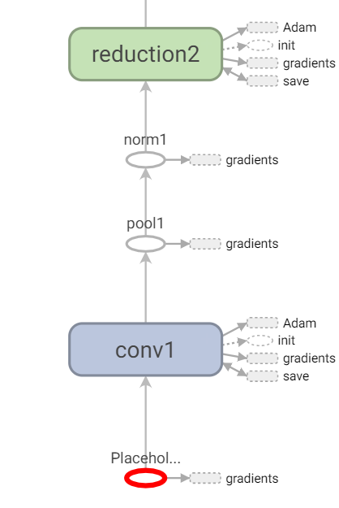
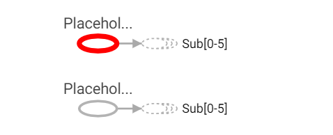

# 迁移脚本

<a href="https://gitee.com/mindspore/docs/blob/r1.7/docs/mindspore/source_zh_cn/migration_guide/migration_script.md" target="_blank"></a>

## 概述

本文档主要介绍，怎样将网络脚本从TensorFlow或PyTorch框架迁移至MindSpore。

## TensorFlow脚本迁移MindSpore

通过读TensorBoard图，进行脚本迁移。

1. 以TensorFlow实现的[PoseNet](https://arxiv.org/pdf/1505.07427v4.pdf)为例，演示如何利用TensorBoard读图，编写MindSpore代码，将[TensorFlow模型](https://github.com/kentsommer/tensorflow-posenet)迁移到MindSpore上。

   > 此处提到的PoseNet代码为基于Python2的代码，需要对Python3做一些语法更改才能在Python3上运行，具体修改内容不予赘述。

2. 改写代码，利用`tf.summary`接口，保存TensorBoard需要的log，并启动TensorBoard。

3. 打开的TensorBoard如图所示，图例仅供参考，可能因log生成方式的差异，TensorBoard展示的图也有所差异。

   

4. 找到3个输入的Placeholder，通过看图并阅读代码得知，第二、第三个输入都只在计算loss时使用。

   

   

   

   至此，我们可以初步划分出，构造网络模型三步：

   第一步，在网络的三个输入中，第一个输入将在backbone中计算出六个输出；

   第二步，上一步结果与第二、第三个输入在loss子网中计算loss；

   第三步，利用`TrainOneStepCell`自动微分构造反向网络；利用TensorFlow工程中提供的Adam优化器及属性，写出对应的MindSpore优化器来更新参数，网络脚本骨干可写作：

   ```python
   import mindspore
   from mindspore import nn
   from mindspore.nn import TrainOneStepCell
   from mindspore.nn import Adam

   # combine backbone and loss
   class PoseNetLossCell(nn.Cell):
       def __init__(self, backbone, loss):
           super(PoseNetLossCell, self).__init__()
           self.pose_net = backbone
           self.loss = loss
       def construct(self, input_1, input_2, input_3):
           p1_x, p1_q, p2_x, p2_q, p3_x, p3_q = self.poss_net(input_1)
           loss = self.loss(p1_x, p1_q, p2_x, p2_q, p3_x, p3_q, input_2, input_3)
           return loss

   # define backbone
   class PoseNet(nn.Cell):
       def __init__(self):
           super(PoseNet, self).__init__()
       def construct(self, input_1):
           """do something with input_1, output num 6"""
           return p1_x, p1_q, p2_x, p2_q, p3_x, p3_q

   # define loss
   class PoseNetLoss(nn.Cell):
       def __init__(self):
           super(PoseNetLoss, self).__init__()

       def construct(self, p1_x, p1_q, p2_x, p2_q, p3_x, p3_q, poses_x, poses_q):
           """do something to calc loss"""
           return loss

   # define network
   backbone = PoseNet()
   loss = PoseNetLoss()
   net_with_loss = PoseNetLossCell(backbone, loss)
   opt = Adam(net_with_loss.trainable_params(), learning_rate=0.001, beta1=0.9, beta2=0.999, eps=1e-08, use_locking=False)
   net_with_grad = TrainOneStepCell(net_with_loss, opt)


   ```

5. 接下来，我们来具体实现backbone中的计算逻辑。

   第一个输入首先经过了一个名为conv1的子图，通过看图可得，其中计算逻辑为：

   

   输入->Conv2D->BiasAdd->ReLU，虽然图上看起来，BiasAdd后的算子名虽然为conv1，但其实际执行的是ReLU。

   

   这样一来，第一个子图conv1，可以定义如下，具体参数，与原工程中的参数对齐：

   ```python
   class Conv1(nn.Cell):
       def __init__(self):
           super(Conv1, self).__init__()
           self.conv = Conv2d()
           self.relu = ReLU()
       def construct(self, x):
           x = self.conv(x)
           x = self.relu(x)
           return x
   ```

   通过观察TensorBoard图和代码，我们不难发现，原TensorFlow工程中定义的conv这一类型的子网，可以复写为MindSpore的子网，减少重复代码。

   TensorFlow工程conv子网定义：

   ```python
   def conv(self,
                input,
                k_h,
                k_w,
                c_o,
                s_h,
                s_w,
                name,
                relu=True,
                padding=DEFAULT_PADDING,
                group=1,
                biased=True):
           # Verify that the padding is acceptable
           self.validate_padding(padding)
           # Get the number of channels in the input
           c_i = input.get_shape()[-1]
           # Verify that the grouping parameter is valid
           assert c_i % group == 0
           assert c_o % group == 0
           # Convolution for a given input and kernel
           convolve = lambda i, k: tf.nn.conv2d(i, k, [1, s_h, s_w, 1], padding=padding)
           with tf.variable_scope(name) as scope:
               kernel = self.make_var('weights', shape=[k_h, k_w, c_i / group, c_o])
               if group == 1:
                   # This is the common-case. Convolve the input without any further complications.
                   output = convolve(input, kernel)
               else:
                   # Split the input into groups and then convolve each of them independently
                   input_groups = tf.split(3, group, input)
                   kernel_groups = tf.split(3, group, kernel)
                   output_groups = [convolve(i, k) for i, k in zip(input_groups, kernel_groups)]
                   # Concatenate the groups
                   output = tf.concat(3, output_groups)
               # Add the biases
               if biased:
                   biases = self.make_var('biases', [c_o])
                   output = tf.nn.bias_add(output, biases)
               if relu:
                   # ReLU non-linearity
                   output = tf.nn.relu(output, name=scope.name)
               return output
   ```

   则对应MindSpore子网定义如下：

   ```python
   from mindspore import nn
   from mindspore.nn import Conv2d, ReLU

   class ConvReLU(nn.Cell):
       def __init__(self, channel_in, kernel_size, channel_out,  strides):
           super(ConvReLU, self).__init__()
           self.conv = Conv2d(channel_in, channel_out, kernel_size, strides, has_bias=True)
           self.relu = ReLU()

       def construct(self, x):
           x = self.conv(x)
           x = self.relu(x)
           return x
   ```

   那么，对照着TensorBoard中的数据流向与算子属性，backbone计算逻辑可编写如下：

   ```python
   from mindspore.nn import MaxPool2d
   import mindspore.ops as ops


   class LRN(nn.Cell):
       def __init__(self, radius, alpha, beta, bias=1.0):
           super(LRN, self).__init__()
           self.lrn = ops.LRN(radius, bias, alpha, beta)
       def construct(self, x):
           return self.lrn(x)


   class PoseNet(nn.Cell):
       def __init__(self):
           super(PoseNet, self).__init__()
           self.conv1 = ConvReLU(3, 7, 64, 2)
           self.pool1 = MaxPool2d(3, 2, pad_mode="SAME")
           self.norm1 = LRN(2, 2e-05, 0.75)
           self.reduction2 = ConvReLU(64, 1, 64, 1)
           self.conv2 = ConvReLU(64, 3, 192, 1)
           self.norm2 = LRN(2, 2e-05, 0.75)
           self.pool2 = MaxPool2d(3, 2, pad_mode="SAME")
           self.icp1_reduction1 = ConvReLU(192, 1, 96, 1)
           self.icp1_out1 = ConvReLU(96, 3, 128, 1)
           self.icp1_reduction2 = ConvReLU(192, 1, 16, 1)
           self.icp1_out2 = ConvReLU(16, 5, 32, 1)
           self.icp1_pool = MaxPool2d(3, 1, pad_mode="SAME")
           self.icp1_out3 = ConvReLU(192, 5, 32, 1)
           self.icp1_out0 = ConvReLU(192, 1, 64, 1)
           self.concat = ops.Concat(axis=1)
           self.icp2_reduction1 = ConvReLU(256, 1, 128, 1)
           self.icp2_out1 = ConvReLU(128, 3, 192, 1)
           self.icp2_reduction2 = ConvReLU(256, 1, 32, 1)
           self.icp2_out2 = ConvReLU(32, 5, 96, 1)
           self.icp2_pool = MaxPool2d(3, 1, pad_mode="SAME")
           self.icp2_out3 = ConvReLU(256, 1, 64, 1)
           self.icp2_out0 = ConvReLU(256, 1, 128, 1)
           self.icp3_in = MaxPool2d(3, 2, pad_mode="SAME")
           self.icp3_reduction1 = ConvReLU(480, 1, 96, 1)
           self.icp3_out1 = ConvReLU(96, 3, 208, 1)
           self.icp3_reduction2 = ConvReLU(480, 1, 16, 1)
           self.icp3_out2 = ConvReLU(16, 5, 48, 1)
           self.icp3_pool = MaxPool2d(3, 1, pad_mode="SAME")
           self.icp3_out3 = ConvReLU(480, 1, 64, 1)
           self.icp3_out0 = ConvReLU(480, 1, 192, 1)
           """etc"""
           """..."""

       def construct(self, input_1):
           """do something with input_1, output num 6"""
           x = self.conv1(input_1)
           x = self.pool1(x)
           x = self.norm1(x)
           x = self.reduction2(x)
           x = self.conv2(x)
           x = self.norm2(x)
           x = self.pool2(x)
           pool2 = x

           x = self.icp1_reduction1(x)
           x = self.icp1_out1(x)
           icp1_out1 = x

           icp1_reduction2 = self.icp1_reduction2(pool2)
           icp1_out2 = self.icp1_out2(icp1_reduction2)

           icp1_pool = self.icp1_pool(pool2)
           icp1_out3 = self.icp1_out3(icp1_pool)

           icp1_out0 = self.icp1_out0(pool2)

           icp2_in = self.concat((icp1_out0, icp1_out1, icp1_out2, icp1_out3))
           """etc"""
           """..."""

           return p1_x, p1_q, p2_x, p2_q, p3_x, p3_q
   ```

   相应的，loss计算逻辑可编写如下：

   ```python
   class PoseNetLoss(nn.Cell):
       def __init__(self):
           super(PoseNetLoss, self).__init__()
           self.sub = ops.Sub()
           self.square = ops.Square()
           self.reduce_sum = ops.ReduceSum()
           self.sqrt = ops.Sqrt()

       def construct(self, p1_x, p1_q, p2_x, p2_q, p3_x, p3_q, poses_x, poses_q):
           """do something to calc loss"""
           l1_x = self.sqrt(self.reduce_sum(self.square(self.sub(p1_x, poses_x)))) * 0.3
           l1_q = self.sqrt(self.reduce_sum(self.square(self.sub(p1_q, poses_q)))) * 150
           l2_x = self.sqrt(self.reduce_sum(self.square(self.sub(p2_x, poses_x)))) * 0.3
           l2_q = self.sqrt(self.reduce_sum(self.square(self.sub(p2_q, poses_q)))) * 150
           l3_x = self.sqrt(self.reduce_sum(self.square(self.sub(p3_x, poses_x)))) * 1
           l3_q = self.sqrt(self.reduce_sum(self.square(self.sub(p3_q, poses_q)))) * 500
           return l1_x + l1_q + l2_x + l2_q + l3_x + l3_q
   ```

   最终，你的训练脚本应该类似如下所示：

   ```python
   if __name__ == "__main__":
       backbone = PoseNet()
       loss = PoseNetLoss()
       net_with_loss = PoseNetLossCell(backbone, loss)
       opt = Adam(net_with_loss.trainable_params(), learning_rate=0.001, beta1=0.9, beta2=0.999, eps=1e-08, use_locking=False)
       net_with_grad = TrainOneStepCell(net_with_loss, opt)
       """dataset define"""
       model = Model(net_with_grad)
       model.train(epoch_size, dataset)
   ```

   这样，就基本完成了模型脚本从TensorFlow到MindSpore的迁移，接下来就是利用丰富的MindSpore工具和计算策略，对精度进行调优，在此不予详述。

## PyTorch脚本迁移MindSpore

通过读PyTorch脚本，直接进行迁移。

1. PyTorch子网模块通常继承`torch.nn.Module`，MindSpore通常继承`mindspore.nn.Cell`；PyTorch子网模块正向计算逻辑需要重写forward方法，MindSpore子网模块正向计算逻辑需要重写construct方法。

2. 以常见的Bottleneck类在MindSpore下的迁移为例。

   PyTorch工程代码

   ```python
   # defined in PyTorch
   class Bottleneck(nn.Module):
       def __init__(self, inplanes, planes, stride=1, mode='NORM', k=1, dilation=1):
           super(Bottleneck, self).__init__()
           self.mode = mode
           self.relu = nn.ReLU(inplace=True)
           self.k = k

           btnk_ch = planes // 4
           self.bn1 = nn.BatchNorm2d(inplanes)
           self.conv1 = nn.Conv2d(inplanes, btnk_ch, kernel_size=1, bias=False)

           self.bn2 = nn.BatchNorm2d(btnk_ch)
           self.conv2 = nn.Conv2d(btnk_ch, btnk_ch, kernel_size=3, stride=stride, padding=dilation,
                                  dilation=dilation, bias=False)

           self.bn3 = nn.BatchNorm2d(btnk_ch)
           self.conv3 = nn.Conv2d(btnk_ch, planes, kernel_size=1, bias=False)

           if mode == 'UP':
               self.shortcut = None
           elif inplanes != planes or stride > 1:
               self.shortcut = nn.Sequential(
                   nn.BatchNorm2d(inplanes),
                   self.relu,
                   nn.Conv2d(inplanes, planes, kernel_size=1, stride=stride, bias=False)
               )
           else:
               self.shortcut = None

       def _pre_act_forward(self, x):
           residual = x

           out = self.bn1(x)
           out = self.relu(out)
           out = self.conv1(out)

           out = self.bn2(out)
           out = self.relu(out)
           out = self.conv2(out)

           out = self.bn3(out)
           out = self.relu(out)
           out = self.conv3(out)

           if self.mode == 'UP':
               residual = self.squeeze_idt(x)
           elif self.shortcut is not None:
               residual = self.shortcut(residual)

           out += residual

           return out

       def squeeze_idt(self, idt):
           n, c, h, w = idt.size()
           return idt.view(n, c // self.k, self.k, h, w).sum(2)

       def forward(self, x):
           out = self._pre_act_forward(x)
           return out

   ```

   根据PyTorch和MindSpore对卷积参数定义的区别，可以翻译成如下定义：

   ```python
   from mindspore import nn
   import mindspore.ops as ops

   # defined in MindSpore
   class Bottleneck(nn.Cell):
       def __init__(self, inplanes, planes, stride=1, k=1, dilation=1):
           super(Bottleneck, self).__init__()
           self.mode = mode
           self.relu = nn.ReLU()
           self.k = k

           btnk_ch = planes // 4
           self.bn1 = nn.BatchNorm2d(num_features=inplanes, momentum=0.9)
           self.conv1 = nn.Conv2d(in_channels=inplanes, out_channels=btnk_ch, kernel_size=1, pad_mode='pad', has_bias=False)

           self.bn2 = nn.BatchNorm2d(num_features=btnk_ch, momentum=0.9)
           self.conv2 = nn.Conv2d(in_channels=btnk_ch, out_channels=btnk_ch, kernel_size=3, stride=stride, pad_mode='pad', padding=dilation, dilation=dilation, has_bias=False)

           self.bn3 = nn.BatchNorm2d(num_features=btnk_ch, momentum=0.9)
           self.conv3 = nn.Conv2d(in_channels=btnk_ch, out_channels=planes, kernel_size=1, pad_mode='pad', has_bias=False)

           self.shape = ops.Shape()
           self.reshape = ops.Reshape()
           self.reduce_sum = ops.ReduceSum()

           if mode == 'UP':
               self.shortcut = None
           elif inplanes != planes or stride > 1:
               self.shortcut = nn.SequentialCell([
                   nn.BatchNorm2d(num_features=inplanes, momentum=0.9),
                   nn.ReLU(),
                   nn.Conv2d(in_channels=inplanes, out_channels=planes, kernel_size=1, stride=stride, pad_mode='pad', has_bias=False)
               ])
           else:
               self.shortcut = None

       def _pre_act_forward(self, x):
           residual = x

           out = self.bn1(x)
           out = self.relu(out)
           out = self.conv1(out)

           out = self.bn2(out)
           out = self.relu(out)
           out = self.conv2(out)

           out = self.bn3(out)
           out = self.relu(out)
           out = self.conv3(out)

           if self.shortcut is not None:
               residual = self.shortcut(residual)

           out += residual
           return out

       def construct(self, x):
           out = self._pre_act_forward(x)
           return out
   ```

3. PyTorch的反向传播通常使用`loss.backward()`实现，参数更新通过`optimizer.step()`实现，在MindSpore中，这些不需要用户显式调用执行，可以交给`TrainOneStepCell`类进行反向传播和梯度更新。最后，训练脚本结构应如下所示：

   ```python
   # define dataset
   dataset = ...

   # define backbone and loss
   backbone = Net()
   loss = NetLoss()

   # combine backbone and loss
   net_with_loss = WithLossCell(backbone, loss)

   # define optimizer
   opt = ...

   # combine forward and backward
   net_with_grad = TrainOneStepCell(net_with_loss, opt)

   # define model and train
   model = Model(net_with_grad)
   model.train(epoch_size, dataset)
   ```

PyTorch和mindspore在一些基础API的定义上比较相似，比如[mindspore.nn.SequentialCell](https://www.mindspore.cn/docs/zh-CN/r1.7/api_python/nn/mindspore.nn.SequentialCell.html#mindspore.nn.SequentialCell)和[torch.nn.Sequential](https://pytorch.org/docs/stable/generated/torch.nn.Sequential.html#torch.nn.Sequential)，另外，一些算子API可能不尽相同，此处列举一些常见的API对照，更多信息可以参考MindSpore官网的[MindSpore与PyTorch对照表](https://www.mindspore.cn/docs/zh-CN/r1.7/note/api_mapping/pytorch_api_mapping.html)。

|              PyTorch              |                     MindSpore                      |
| :-------------------------------: | :------------------------------------------------: |
|           tensor.view()           |     mindspore.ops.operations.Reshape()(tensor)     |
|           tensor.size()           |      mindspore.ops.operations.Shape()(tensor)      |
|         tensor.sum(axis)          | mindspore.ops.operations.ReduceSum()(tensor, axis) |
| torch.nn.Upsample[mode: nearest]  |   mindspore.ops.operations.ResizeNearestNeighbor   |
| torch.nn.Upsample[mode: bilinear] |      mindspore.ops.operations.ResizeBilinear       |
|          torch.nn.Linear          |                 mindspore.nn.Dense                 |
|       torch.nn.PixelShuffle       |       mindspore.ops.operations.DepthToSpace        |

值得注意的是，尽管`torch.nn.MaxPool2d`和`mindspore.nn.MaxPool2d`在接口定义上较为相似，但在Ascend上的训练过程中，MindSpore实际调用了`MaxPoolWithArgMax`算子，该算子与TensorFlow的同名算子功能相同，在迁移过程中MaxPool层后的输出MindSpore与PyTorch不一致是正常现象，理论上不影响最终训练结果。
