# 网络迁移工具应用实践指南

[](https://gitee.com/mindspore/docs/blob/r2.3/docs/mindspore/source_zh_cn/migration_guide/migrator_with_tools.md)

## 概述

本指导介绍了将神经网络从其他机器学习框架迁移到MindSpore过程时，如何应用各种迁移相关工具以提高迁移效率，侧重描述如何将迁移工具与迁移过程紧密结合。

## 网络迁移路径相关工具说明

### 迁移路径工具地图

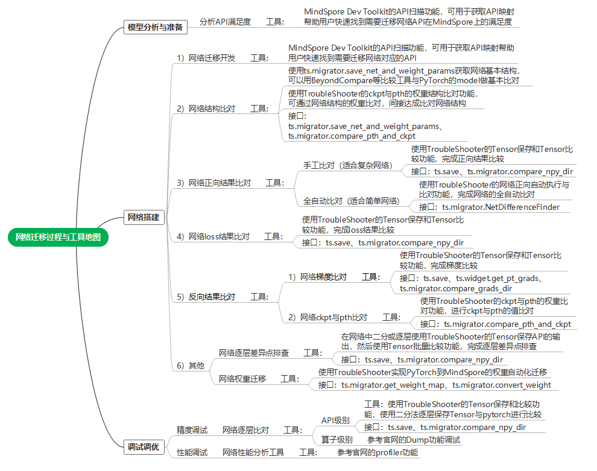

| 工具      | 工具说明         | 网络迁移用途         |
| --------------------- | -------------------- | --------------------- |
| [MindSpore Dev Toolkit](https://www.mindspore.cn/devtoolkit/docs/zh-CN/master/index.html) | MindSpore Dev Toolkit是一款支持MindSpore开发的多平台Python IDE插件，提供创建项目、智能补全、API互搜和文档搜索等功能。 | 通过API扫描等能力，能够提升用户的网络迁移开发效率。          |
| [TroubleShooter](https://gitee.com/mindspore/toolkits/tree/master/troubleshooter)   | TroubleShooter 是MindSpore网络开发调试工具包，用于提供便捷、易用的调试能力。 | 网络调试工具集（如：网络权重迁移、精度比对、代码跟踪、报错分析、执行跟踪等功能），帮助用户提高迁移调试效率。 |
| [Profiler](https://www.mindspore.cn/mindinsight/docs/zh-CN/master/performance_profiling.html)     | Profiler可将训练过程中的算子耗时等信息记录到文件中，通过可视化界面供用户查看分析，帮助用户更高效地调试神经网络性能。 | 网络迁移后，如果执行性能不佳，可用Profiler进行性能分析，Profiler提供框架的host执行、以及算子执行的Profiler分析功能。 |
| [Dump](https://www.mindspore.cn/tutorials/experts/zh-CN/r2.3/debug/dump.html)                  | 提供了Dump功能，用来将模型训练中的图以及算子的输入输出数据保存到磁盘文件。 | 一般用于网络迁移复杂问题定位（例如：算子溢出等）可以dump出算子级别的数据。 |

## 网络迁移工具应用实例

本章节以一张网络（Vision Transformer）为例子完成网络迁移，并介绍关键迁移过程中各种工具的应用方法。

注：迁移网络的完整样例代码可参考如下链接

<https://github.com/WZMIAOMIAO/deep-learning-for-image-processing/tree/master/pytorch_classification/vision_transformer>

### 网络迁移开发

[MindSpore Dev Toolkit](https://www.mindspore.cn/devtoolkit/docs/zh-CN/master/index.html)的API扫描功能，扫描到PyTorch网络中的API与MindSpore API的映射关系，有差异的API可以打开“说明”的URL，会给出API详细分析，帮助用户快速构建MindSpore的网络代码。

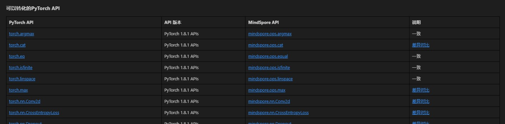

例如：`torch.cat`接口：

在“说明”的URL（PyTorch与MindSpore API映射表）中可见如下API差异。

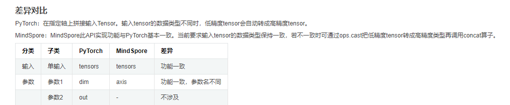

按照规则，可参考如下PyTorch代码：

```python
x = torch.cat((cls_token, x), dim=1) # [B, 197, 768]
```

写出MindSpore代码：

```python
x = mindspore.ops.cat((cls_token, x), axis=1) # [B, 197, 768]
```

### 网络结构初始验证

在网络初步迁移构建完成后，我们可以先进行一些网络结构的基础比对，以验证迁移的网络结构是否正确。可以分别使用如下两种方式进行网络结构的比对：

**步骤1：获取PyTorch ViT网络结构和权重参数(pth)**

调用[ts.migrator.save_net_and_weight_params](https://gitee.com/mindspore/toolkits/blob/master/troubleshooter/docs/api/migrator/save_net_and_weight_params.md#)接口，可以将网络对象保存成文件（与用print打印model对象的内容相同，这里model是一个nn.Module对象），并且会保存权重参数到pth文件以及映射文件（用于与MindSpore进行权重比对）。

```python
def net_pt_vit(args):
    device = torch.device(args.device if torch.cuda.is_available() else "cpu")
    model = create_model(num_classes=args.num_classes, has_logits=False).to(device)
    ts.migrator.save_net_and_weight_params(model, path="/mindspore_model/vit/v1/temp_data/pt_net_info/")
```

在配置的path下，可以找到如下文件。

```text
-rw-r--r-- 1 root root      8709 Jul  5 20:36 torch_net_architecture.txt （网络结构信息，与用python print打印model对象的内容相同）
-rw-r--r-- 1 root root      7737 Jul  5 20:36 torch_net_map.json  （参数映射文件，用于与MindSpore进行权重比对）
-rw-r--r-- 1 root root 343261393 Jul  5 20:36 torch_troubleshooter_create.pth （权重参数）
```

**步骤2：获取MindSpore ViT网络结构和权重参数(ckpt)**

调用[ts.migrator.save_net_and_weight_params](https://gitee.com/mindspore/toolkits/blob/master/troubleshooter/docs/api/migrator/save_net_and_weight_params.md#)接口，可以将网络对象保存成文件（与用print打印model对象的内容相同，这里model是一个Cell对象），并且会保存权重参数到ckpt文件。

```python
def net_ms_vit(args):
    model = create_model(num_classes=args.num_classes, has_logits=False)
    ts.migrator.save_net_and_weight_params(model, path="/mindspore_model/vit/v1/temp_data/ms_net_info/")
```

在配置的path下，可以找到如下文件。

```text
-r-------- 1 root root 343217199 Jul  5 20:26 mindspore_troubleshooter_create.ckpt    （权重参数）
-rw-r--r-- 1 root root     14013 Jul  5 20:26 mindspore_net_architecture.txt  （网络结构信息，与用python print打印model对象的内容相同）
```

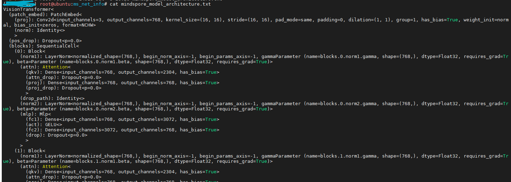

**步骤3：通过net_architecture.txt比对网络基础结构**

通过Beyond Compare等工具可以快速对比网络结构（即mindspore_net_architecture.txt与torch_net_architecture.txt），如下可初步判断网络结构层级基本是对齐的，存在一些天然的API以及参数差异，例如：Dense和Linear属于正常范围。

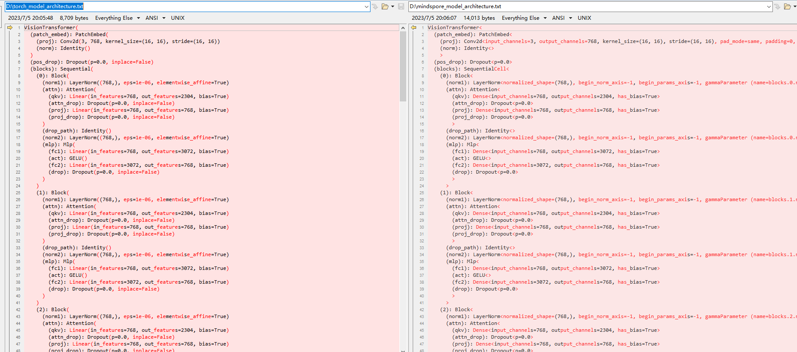

**步骤4：再通过对比权重参数进一步比对网络结构**

用我们步骤1和2保存的文件，通过TroubleShooter的[ts.migrator.compare_pth_and_ckpt](https://gitee.com/mindspore/toolkits/blob/master/troubleshooter/docs/api/migrator/compare_pth_and_ckpt.md#)接口，可以完成pth与ckpt的权重参数结构比较，以进一步验证网络结构是否正确。

```python
# weight_map_path 为步骤1导出的参数映射文件，compare_value=False代表只比对数量和shape信息，不比对参数值
ts.migrator.compare_pth_and_ckpt(
    weight_map_path="/mindspore_model/vit/v1/temp_data/pt_net_info/torch_net_map.json",
    pt_file_path="/mindspore_model/vit/v1/temp_data/pt_net_info/torch_troubleshooter_create.pth",
    ms_file_path="/mindspore_model/vit/v1/temp_data/ms_net_info/mindspore_troubleshooter_create.ckpt",
    compare_value=False)
```

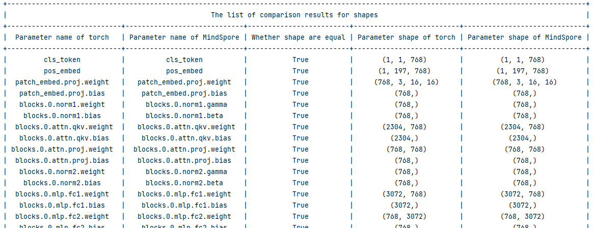

### 网络正向结果验证

在迁移的MindSpore网络可以正常执行后，即可进行网络正向结果验证，验证是通过比对PyTorch和MindSpore网络正向结果来完成的。这里提供了两种不同的验证方案，一种是半自动验证方案，一种是全自动验证方案，我们将分别介绍两种方案适用场景和使用方法。

#### 网络比对三个基本条件

> 说明：此处只做简单说明，详细步骤可参考半自动验证方案的例子

要进行PyTorch和MindSpore网络比对前，需要满足三个条件：

1. 随机性固定并相同

    可以在PyTorch和MindSpore使用[ts.migrator.fix_random](https://gitee.com/mindspore/toolkits/blob/master/troubleshooter/docs/api/widget/fix_random.md#)来固定随机性，例如：

    ```python
    ts.widget.fix_random(16)
    ```

2. 输入数据样本一致

    参考如下两步，可以用来保存和加载相同的数据样本（包含：数据和标签都可用此方法）。

    - 步骤1：使用[ts.save](https://gitee.com/mindspore/toolkits/blob/master/troubleshooter/docs/api/save.md#)保存PyTorch网络的某个数据样本为npy，[ts.save](https://gitee.com/mindspore/toolkits/blob/master/troubleshooter/docs/api/save.md#)会自动编号为`0_images.npy`

        ```python
        ts.save("/mindspore_model/vit/v1/temp_data/pt/npy/images.npy", images)
        ```

    - 步骤2：再使用`np.load`将这个数据分别加载成PyTorch的Tenosr和MindSpore的Tensor

        ```python
        images = torch.tensor(np.load('/mindspore_model/vit/v1/pytorch_org/vision_transformer/0_images.npy'))
        images = mindspore.Tensor(np.load('/mindspore_model/vit/v1/pytorch_org/vision_transformer/0_images.npy'))
        ```

3. 初始化权重参数一致

    一般我们会以PyTorch网络的权重为基准，转换为MindSpore的权重并加载，来实现统一的初始化权重参数，参考如下两步。

    - 步骤1：保存PyTorch网络权重和转换映射，用于在MindSpore加载。

        使用[ts.migrator.save_net_and_weight_params](https://gitee.com/mindspore/toolkits/blob/master/troubleshooter/docs/api/migrator/save_net_and_weight_params.md#)接口，保存PyTorch网络权重和转换映射。
        例如：

        ```python
        ts.migrator.save_net_and_weight_params(model, path="/mindspore_model/vit/v1/temp_data/pt_net_info/")
        ```

    - 步骤2：在MindSpore网络转换并加载权重。

        使用[ts.migrator.convert_weight_and_load](https://gitee.com/mindspore/toolkits/blob/master/troubleshooter/docs/api/migrator/convert_weight_and_load.md#)接口转换PyTorch权重，并加载到MindSpore的网络中。例如：

        ```python
        ts.migrator.convert_weight_and_load(weight_map_path="/mindspore_model/vit/v1/temp_data/pt_net_info/torch_net_map.json",
        pt_file_path="/mindspore_model/vit/v1/temp_data/pt_net_info/torch_troubleshooter_create.pth",net=model)
        ```

#### 半自动验证方案

在满足比对的三个前提条件基础上，半自动验证方案通过手工指定要保存的数据，并进行批量比对完成正向结果的验证。半自动方案优点是场景适用性强，缺点是需要较多手工操作。

**步骤1：执行PyTorch网络并获取正向结果**

```python
def run_pt_net(args):
    # 1）固定随机性，调用ts.widget.fix_random接口固定PyTorch的随机性
    ts.widget.fix_random(16)
    device = torch.device(args.device if torch.cuda.is_available() else "cpu")
    model = create_model(num_classes=args.num_classes, has_logits=False).to(device)
    # 2）加载相同数据样本（样本可以用numpy.save在PyTorch网络执行时保持一个.npy格式的数据。）
    images = torch.tensor(np.load('/mindspore_model/vit/v1/pytorch_org/vision_transformer/0_images.npy'))
    # 3）保存权重和转换映射，用于在MindSpore加载
    ts.migrator.save_net_and_weight_params(model, path="/mindspore_model/vit/v1/temp_data/pt_net_info/")
    # 4）执行网络并保存正向结果，使用ts.save接口保存网络执行结果
    pred = model(images.to(device))
    ts.save("/mindspore_model/vit/v1/temp_data/pt/npy/pred.npy", pred)
```

**步骤2：执行MindSpore网络获取正向结果**

```python
def run_ms_net(args):
    # 1）固定随机性，与步骤1相同，调用相同接口 ts.widget.fix_random(16)
    ts.widget.fix_random(16)
    # 2）加载相同数据样本
    images = mindspore.Tensor(np.load('/mindspore_model/vit/v1/pytorch_org/vision_transformer/0_images.npy'))
    model = create_model(num_classes=args.num_classes, has_logits=False)
    # 3）加载pt导出的权重，保证初始化权重参数一致
    # 调用ts.migrator.convert_weight_and_load接口，将PyTorch权重参数转为MindSpore权重参数并加载到MindSpore网络中
    ts.migrator.convert_weight_and_load(weight_map_path="/mindspore_model/vit/v1/temp_data/pt_net_info/torch_net_map.json",
                                        pt_file_path="/mindspore_model/vit/v1/temp_data/pt_net_info/torch_troubleshooter_create.pth",
                                        net=model)
    # 4）执行网络并保存正向结果
    pred = model(images)
    ts.save("/mindspore_model/vit/v1/temp_data/ms/npy/pred.npy", pred)
```

**步骤3：进行比较并查看比对结果**

使用[ts.migrator.compare_npy_dir](https://gitee.com/mindspore/toolkits/blob/master/troubleshooter/docs/api/migrator/compare_npy_dir.md#)接口，进行正向结果比较。

```python
# 5）比较PyTorch与MindSpore的正向输出结果，调用ts.migrator.compare_npy_dir接口完成保存的正向结果比较
ts.migrator.compare_npy_dir('/mindspore_model/vit/v1/temp_data/pt/npy',
                            '/mindspore_model/vit/v1/temp_data/ms/npy')
```

可见如下比对结果，正向网络结果通过allclose和余弦相似度比较，都可以正常对齐，证明结果完全相同。

```text
The orig dir: /mnt/sdb2/mindspore_model/vit/v1/temp_data/pt/npy
The target dir: /mnt/sdb2/mindspore_model/vit/v1/temp_data/ms/npy
```

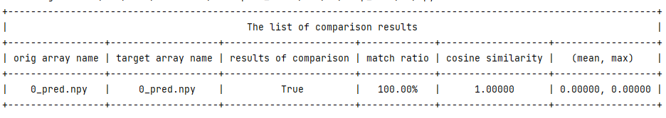

#### 全自动验证方案

全自动验证方案适用于验证推理网络或网络正向结果等迁移场景，与半自动方案的差别在于由工具自动完成各种对比前的条件对齐，用户只需要传入网络对象即可，相对于半自动方案更为简单，基本可实现一键式比对，但一些复杂场景使用可能受限，例如：PyTorch网络和MindSpore网络不方便跑在同一机器上。全自动验证方案不能支持的场景，请参考半自动验证方案章节。

**步骤1：导入PyTorch模型对象，完成网络正向自动比对**

```python
def auto_run_ms_net(args):
    # 1）导入pytoch脚本路径，并import pytorch的model，用于创建PyTorch模型对象
    import sys
    sys.path.insert(0, "/mindspore_model/vit/v1/pytorch_org")
    from pytorch_org.vision_transformer.vit_model import vit_base_patch16_224_in21k as create_pt_model
    # 2）分别创建MindSpore的model对象和PyTorch的model对象，用于传入自动比对接口
    model = create_model(num_classes=args.num_classes, has_logits=False)
    pt_model = create_pt_model(num_classes=args.num_classes, has_logits=False)
    # 3）创建正向自动比对对象，并执行比对
    diff_finder = ts.migrator.NetDifferenceFinder(pt_net=pt_model,
                                                  ms_net=model)
    # auto_inputs参数，可自动按照shape生成数据样本，compare将自动对齐权重、固定随机性。
    diff_finder.compare(auto_inputs=(((8, 3, 224,224), np.float32),))
```

**步骤2：查看比对结果**

接口运行后会打印一些执行过程的日志，最后会打印网络正向输出的比对结果。


> 说明：当结果不一致的时候，可通过[ts.save](https://gitee.com/mindspore/toolkits/blob/master/troubleshooter/docs/api/save.md#)接口，二分或逐层导出网络各层API的输出，并通过[ts.migrator.compare_npy_dir](https://gitee.com/mindspore/toolkits/blob/master/troubleshooter/docs/api/migrator/compare_npy_dir.md#)接口批量比对，来定位到问题引入的API。

### 网络loss结果验证

loss的验证方案，与正向结果的半自动验证方案类似，在满足比对的三个前提条件基础上，通过手工指定要保存的loss并使用ts.save接口进行保存，并使用[ts.migrator.compare_npy_dir](https://gitee.com/mindspore/toolkits/blob/master/troubleshooter/docs/api/migrator/compare_npy_dir.md#)进行批量比对完成loss的结果验证，具体步骤参考正向结果的半自动验证方案即可。

### 反向结果验证(含梯度、权重参数的比对)

梯度的比对验证方案，思路也与正向结果的半自动验证方案类似，但调用方式略有不同，参考如下步骤操作。

**步骤1：保存PyTorch网络训练各阶段的输出**

与正向结果的半自动验证方案类似，我们可以用[ts.save](https://gitee.com/mindspore/toolkits/blob/master/troubleshooter/docs/api/save.md#)接口进行训练各阶段关键数据的保存，例如：正向输出、loss、grads、权重参数等。参考下方例子，会对每个关键数据保存进行说明。

```python
def train_one_step(args):
    # 1）固定随机性
    ts.widget.fix_random(16)
    # 2）训练网络的创建流程
    device = torch.device(args.device if torch.cuda.is_available() else "cpu")
    model = create_model(num_classes=args.num_classes, has_logits=False).to(device)
    loss_function = torch.nn.CrossEntropyLoss()
    pg = [p for p in model.parameters() if p.requires_grad]
    optimizer = optim.SGD(pg, lr=args.lr, momentum=0.9, weight_decay=5E-5)
    model.train()
    optimizer.zero_grad()
    # 3）统一数据样本和标签
    images = torch.tensor(np.load('/mindspore_model/vit/v1/'
                                  'pytorch_org/vision_transformer/1_None.npy'))
    labels = torch.tensor(np.load('/mindspore_model/vit/v1/'
                                  'pytorch_org/vision_transformer/0_None.npy'))
    # 4）保存权重和转换映射，用于在MindSpore加载
    ts.migrator.save_net_and_weight_params(model, path="/mindspore_model/vit/v1/temp_data/pt_net_info/")
    # 5）执行训练过程
    pred = model(images.to(device))
    loss = loss_function(pred, labels.to(device))
    loss.backward()
    # 6）保存梯度
    # ts.widget.get_pt_grads 接口封装了PyTorch保存grads的方法，可直接调用此接口并使用ts.save保存
    # 因为梯度是一个Tensor list所以ts.save保存梯度会保存多个文件并自动编号，建议单独建立目录保存梯度列表
    ts.save("/mindspore_model/vit/v1/temp_data/pt/grads/grads.npy", ts.widget.get_pt_grads(model))
    optimizer.step()
    # 7) 保存权重参数pth，设置weight_params_filename名称，不使用默认值避免覆盖初始化的权重
    ts.migrator.save_net_and_weight_params(model, path="/mindspore_model/vit/v1/temp_data/pt_net_info/",
                                           weight_params_filename='result_pt.pth')

```

**步骤2：保存MindSpore网络训练各阶段的输出**

```python
def train_one_step_ms(args):
    # 1）固定随机性
    ts.widget.fix_random(16)
    # 2）训练网络的创建流程
    model = create_model(num_classes=args.num_classes, has_logits=False)
    optimizer = mindspore.nn.SGD(model.trainable_params(), learning_rate=args.lr, momentum=0.9, weight_decay=5E-5)
    loss_function = mindspore.nn.CrossEntropyLoss()
    def forward_fn(data, label):
        logits = model(data)
        loss = loss_function(logits, label)
        return loss, logits
    grad_fn = mindspore.value_and_grad(forward_fn, None, optimizer.parameters, has_aux=True)
    # 3）加载pt导出的权重，保证初始化权重参数一致
    # 调用ts.migrator.convert_weight_and_load接口，将PyTorch权重参数转为MindSpore权重参数并加载到MindSpore网络中
    ts.migrator.convert_weight_and_load(weight_map_path="/mindspore_model/vit/v1/temp_data/pt_net_info/torch_net_map.json",
                                        pt_file_path="/mindspore_model/vit/v1/temp_data/pt_net_info/torch_troubleshooter_create.pth",
                                        net=model)
    # 4）加载与PT相同的数据样本和标签
    data = mindspore.Tensor(np.load('/mindspore_model/vit/v1/pytorch_org/vision_transformer/1_None.npy'))
    label = mindspore.Tensor(np.load('/mindspore_model/vit/v1/pytorch_org/vision_transformer/0_None.npy'))
    # 5）执行训练过程
    (loss, pred), grads = grad_fn(data, label.astype(mstype.int32))
    # 6）保存梯度
    ts.save("/mindspore_model/vit/v1/temp_data/ms/grads/grads.npy", grads)
    optimizer(grads)
    # 7）保存权重参数pth
    mindspore.save_checkpoint(model,"/mindspore_model/vit/v1/temp_data/ms/ms_result.ckpt")
```

**步骤3：比较梯度**

使用[ts.migrator.compare_grads_dir](https://gitee.com/mindspore/toolkits/blob/master/troubleshooter/docs/api/migrator/compare_grads_dir.md#)接口，进行梯度比较。

```python
ts.migrator.compare_grads_dir('/mindspore_model/vit/v1/temp_data/pt/grads',
                              '/mindspore_model/vit/v1/temp_data/ms/grads')
```

运行结果：

```text
The orig dir: /mindspore_model/vit/v1/temp_data/pt/grads
The target dir: /mindspore_model/vit/v1/temp_data/ms/grads
```

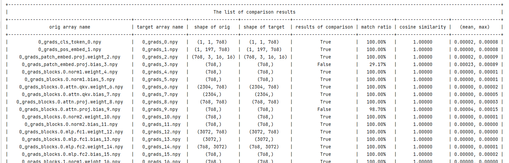

**步骤4：比较权重参数**

使用[ts.migrator.compare_pth_and_ckpt](https://gitee.com/mindspore/toolkits/blob/master/troubleshooter/docs/api/migrator/compare_pth_and_ckpt.md#)接口，进行权重参数比对。

```python
ts.migrator.compare_pth_and_ckpt(weight_map_path="/mindspore_model/vit/v1/temp_data/pt_net_info/torch_net_map.json",
                                 pt_file_path="/mindspore_model/vit/v1/temp_data/pt_net_info/result_pt.pth",
                                 ms_file_path="/mindspore_model/vit/v1/temp_data/ms/ms_result.ckpt")
```

获取到权重参数shape的比较结果。

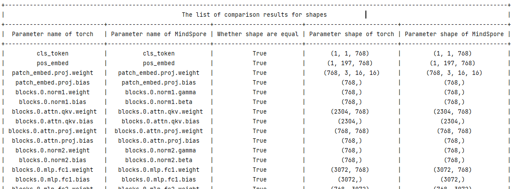

获取到权重参数数值的比较结果。

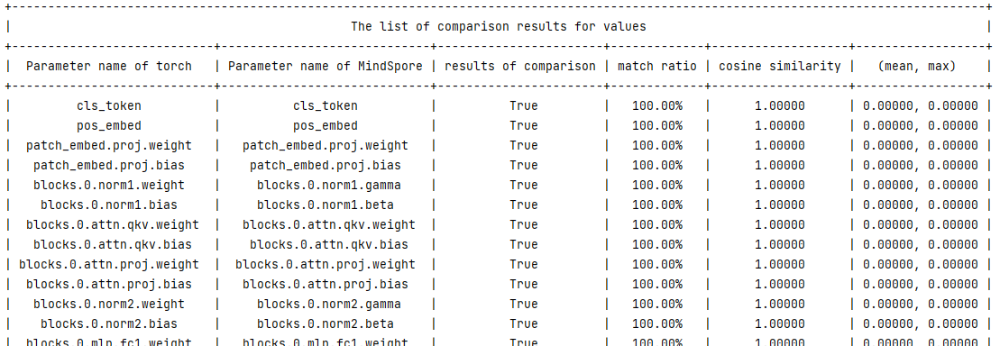

> 说明：如果比对结果不一致，可以往前回溯到梯度是否一致，如果梯度一致，则可以检查优化器使用是否正确，可参考网络逐层差异点排查章节，逐层进行问题定界排查。

### 其他

#### 网络逐层差异点排查

在比较网络正向结果或者loss不一致时，我们需要定位问题原因，则可采取二分或者逐层保存API输出并进行数据比对的方式来排查差异引入点。此比对也需要满足比对的三个基本条件。

**步骤1：保存PyTorch的网络部分API输出**

在网络中，使用[ts.save](https://gitee.com/mindspore/toolkits/blob/master/troubleshooter/docs/api/save.md#)保存API的输出，用于排查网络差异引入点。

> 说明：[ts.save](https://gitee.com/mindspore/toolkits/blob/master/troubleshooter/docs/api/save.md#)支持保存Tensor（包括mindspore.Tensor和torch.tensor），以及Tensor构成的list/tuple/dict。当为list/tuple类型时，会按照顺序添加编号；当为dict类型时，文件名中会添加key，详细参考[troubleshooter.save](https://gitee.com/mindspore/toolkits/blob/master/troubleshooter/docs/api/save.md#)。

```python
class Mlp(nn.Module):
    """
    MLP as used in Vision Transformer, MLP-Mixer and related networks
    """
    def __init__(self, in_features, hidden_features=None, out_features=None, act_layer=nn.GELU, drop=0.):
        super().__init__()
        out_features = out_features or in_features
        hidden_features = hidden_features or in_features
        self.fc1 = nn.Linear(in_features, hidden_features)
        self.act = act_layer()
        self.fc2 = nn.Linear(hidden_features, out_features)
        self.drop = nn.Dropout(drop)
    def forward(self, x):
        x = self.fc1(x)
        # 保存self.fc1 即nn.Linear的输出
        ts.save('/mindspore_model/vit/v1/temp_data/pt/npy/fc1.npy',  x)
        x = self.act(x)
        x = self.drop(x)
        x = self.fc2(x)
        # 保存self.fc2 即nn.Linear的输出
        ts.save('/mindspore_model/vit/v1/temp_data/pt/npy/fc2.npy',  x)
        x = self.drop(x)
        return x
```

**步骤2：保存MindSpore的网络部分API输出**

在网络中，使用[ts.save](https://gitee.com/mindspore/toolkits/blob/master/troubleshooter/docs/api/save.md#)保存API的输出，用于排查网络差异引入点。

```python
class Mlp(nn.Cell):
    def __init__(self, in_features, hidden_features=None, out_features=None, act_layer=nn.GELU, drop=0.):
        super().__init__()
        out_features = out_features or in_features
        hidden_features = hidden_features or in_features
        self.fc1 = nn.Dense(in_features, hidden_features)
        #self.act = act_layer(approximate=False)
        self.act = nn.GELU(approximate=False)
        self.fc2 = nn.Dense(hidden_features, out_features)
        self.drop = nn.Dropout(p=drop)

    def construct(self, x):
        x = self.fc1(x)
        # 保存self.fc1 即nn.Dense的输出
        ts.save('/mindspore_model/vit/v1/temp_data/ms/npy/fc1.npy',  x)
        x = self.act(x)
        x = self.drop(x)
        x = self.fc2(x)
        # 保存self.fc2 即nn.Dense的输出
        ts.save('/mindspore_model/vit/v1/temp_data/ms/npy/fc2.npy',  x)
        x = self.drop(x)
        return x
```

**步骤3：比对API输出结果，查找差异点**

使用[ts.migrator.compare_npy_dir](https://gitee.com/mindspore/toolkits/blob/master/troubleshooter/docs/api/migrator/compare_npy_dir.md#)接口对各层保存的数据进行比对，可以通过比对结果判定哪里引入了差异，以进行问题定位。

```python
ts.migrator.compare_npy_dir('/mindspore_model/vit/v1/temp_data/pt/npy',
                            '/mindspore_model/vit/v1/temp_data/ms/npy')
```

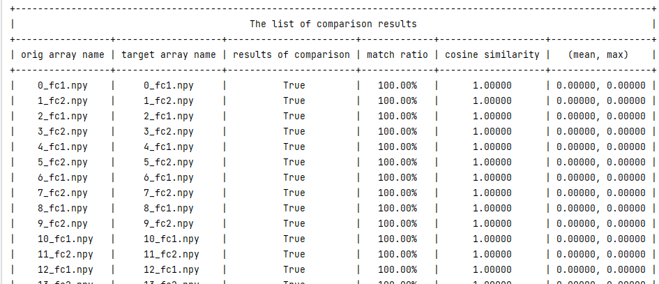

#### 网络权重迁移

在迁移推理网络或微调网络训练等场景中，通常需要将PyTorch的权重迁移到MindSpore中。此时可以使用TroubleShooter的权重迁移工具，先调用[ts.migrator.get_weight_map](https://gitee.com/mindspore/toolkits/blob/master/troubleshooter/docs/api/migrator/get_weight_map.md#)获取权重映射的json文件，再调用[ts.migrator.convert_weight](https://gitee.com/mindspore/toolkits/blob/master/troubleshooter/docs/api/migrator/convert_weight.md#)完成权重自动化迁移，以下为基本样例。需要添加前缀、自定义映射等复杂场景可参考[TroubleShooter pth到ckpt权重自动转换](https://gitee.com/mindspore/toolkits/blob/master/troubleshooter/docs/migrator.md#%E5%BA%94%E7%94%A8%E5%9C%BA%E6%99%AF1pth%E5%88%B0ckpt%E6%9D%83%E9%87%8D%E8%87%AA%E5%8A%A8%E8%BD%AC%E6%8D%A2)。

```python
import troubleshooter as ts

device = torch.device(args.device if torch.cuda.is_available() else "cpu")
# 1）创建Torch网络
model = create_model(num_classes=args.num_classes, has_logits=False).to(device)

# 2）通过Torch网络，获取权重映射json文件
ts.migrator.get_weight_map(model, weight_map_save_path="/mindspore_model/vit/v1/temp_data/pt_net_info/torch_net_map.json")

# 3）使用2）得到的权重映射json文件，进行权重转换
ts.migrator.convert_weight(weight_map_path="/mindspore_model/vit/v1/temp_data/pt_net_info/torch_net_map.json",
                           pt_file_path="/torch_model/vit/v1/torch_net.pth",
                           ms_file_save_path='/mindspore_model/vit/v1/ms_net.ckpt')
```

执行`convert_weight`时会打印权重转换过程中的详细信息，包括名称、转换详情、参数的shape等信息，如下图所示。

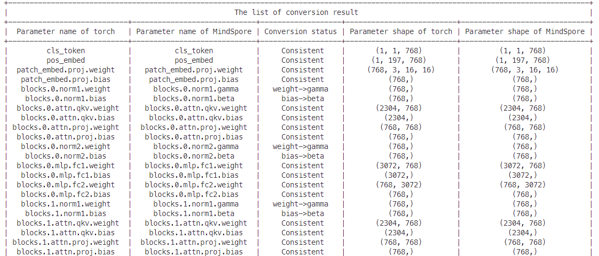
