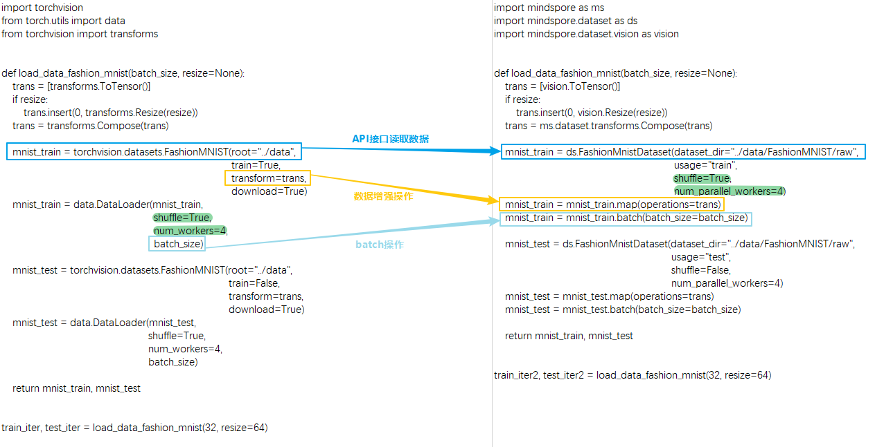
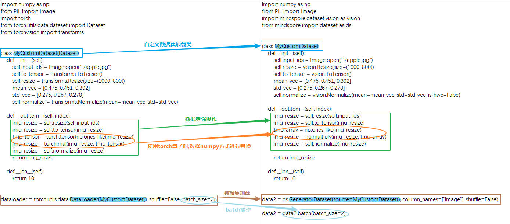

# 数据处理

[](https://gitee.com/mindspore/docs/blob/master/docs/mindspore/source_zh_cn/migration_guide/model_development/dataset.md)

本章节主要对网络迁移中数据处理相关的注意事项加以说明，基础的数据处理概念请参考：

[数据处理](https://www.mindspore.cn/tutorials/zh-CN/master/beginner/dataset.html)

[自动数据增强](https://www.mindspore.cn/tutorials/experts/zh-CN/master/dataset/augment.html)

[轻量化数据处理](https://mindspore.cn/tutorials/zh-CN/master/advanced/dataset/eager.html)

[数据处理性能优化](https://www.mindspore.cn/tutorials/experts/zh-CN/master/dataset/optimize.html)

## 数据处理差异对比

MindSpore和PyTorch的数据构建基本流程主要包括两个方面：数据集加载和数据增强。下面从读取常见数据集处理流程、读取自定义数据集处理流程两方面来比较二者的写法差异：

### 处理常见数据集

MindSpore提供了很多不同领域的[常见数据集的加载接口](https://www.mindspore.cn/docs/zh-CN/master/api_python/mindspore.dataset.html)。
除以上业界常用数据集外，MindSpore还开发了MindRecord数据格式以应对高效的读取、超大型数据存储与读取场景，感兴趣可以参阅[MindRecord](https://www.mindspore.cn/tutorials/zh-CN/master/advanced/dataset/record.html)。由于此文章是介绍同类API及写法差异，故选取一个较为经典的数据集API作为迁移对比示例。其他数据集接口差异详细可参考PyTorch与MindSpore API映射表的 [torchaudio](https://www.mindspore.cn/docs/zh-CN/master/note/api_mapping/pytorch_api_mapping.html#torchaudio)、[torchtext](https://www.mindspore.cn/docs/zh-CN/master/note/api_mapping/pytorch_api_mapping.html#torchtext)、[torchvision](https://www.mindspore.cn/docs/zh-CN/master/note/api_mapping/pytorch_api_mapping.html#torchvision) 模块。

这里以FashionMnistDataset举例。下图展示了PyTorch的API使用方法（左边部分），以及MindSpore的API使用方法（右边部分）。主要的读取流程为：使用FashionMnist API加载源数据集，再使用transforms对数据内容进行变换，最后根据对数据集进行`batch`操作。两侧代码对应的关键部分，均使用颜色框进行了标记。



可以看到MindSpore和PyTorch在读取常见数据有以下不同：

1. 获取和读取数据集的方式不同：

   * PyTorch既可以先将数据集下载到本地然后传给API接口进行读取和解析数据，也可以通过设置API接口的参数 `download` 来下载数据集然后进行读取。

   * MindSpore需要先将数据集下载到本地然后传给API接口进行读取和解析数据。

2. 对数据集本身进行混洗、批处理、并行加载等功能支持的方式不同：

   * PyTorch支持在 `DataLoader` 中配置参数 `shuffle` 、`batch` 、`num_workers` 等来实现相应功能。

   * 由于接口API设计的差异，MindSpore则直接在数据集API接口，通过参数 `shuffle` 、 `num_parallel_workers` 承载了混洗、并行加载功能，然后在数据增强结束后，使用 `batch` 操作将数据集中连续的数据合并为一个批处理数据。`batch` 操作详情请参考[batch](https://www.mindspore.cn/docs/zh-CN/master/api_python/dataset/dataset_method/batch/mindspore.dataset.Dataset.batch.html#mindspore.dataset.Dataset.batch)，由于API设计差异，需要注意MindSpore中 `batch` 操作的参数 `drop_remainder` 与 PyTorch的DataLoader中的参数 `drop_last` 含义一致。

   除了FashionMnist API，所有的数据集加载API均有相同的参数设计，上述例子中的 `batch` 操作均适用于所有数据集API。下面以一个可以返回假图像的数据集API `FakeImageDataset` 再次举例并使用相关的数据操作：

   ```python
   import mindspore.dataset as ds

   dataset = ds.FakeImageDataset(num_images=1000, image_size=(32, 32, 3), num_classes=10, base_seed=0)\
       .batch(32, drop_remainder=True)
   print("When drop_remainder=True, the last batch will be drop, the total batch number is ", dataset.get_dataset_size())
   # 1000 // 32 = 31

   dataset = ds.FakeImageDataset(num_images=1000, image_size=(32, 32, 3), num_classes=10, base_seed=0)\
       .batch(32, drop_remainder=False)
   print("When drop_remainder=False, the last batch will not be drop, the total batch number is ", dataset.get_dataset_size())
   # ceil(1000 / 32) = 32
   ```

   运行结果：

   ```text
   When drop_remainder=True, the last batch will be drop, the total batch number is 31
   When drop_remainder=False, the last batch will not be drop, the total batch number is 32
   ```

   batch操作也可以使用一些batch内的增强操作，详情可参考[YOLOv3](https://gitee.com/mindspore/models/blob/master/official/cv/YOLOv3/src/yolo_dataset.py#L177)。

   上面提到的**数据集加载API含有相同的参数**，在这里介绍一些常用的：

   | 属性 | 介绍 |
   | ---- | ---- |
   | num_samples(int) | 规定数据总的sample数 |
   | shuffle(bool)  | 是否对数据做随机打乱 |
   | sampler(Sampler) | 数据取样器，可以自定义数据打乱、分配，`sampler` 设置和 `num_shards` 、`shard_id` 互斥 |
   | num_shards(int) | 用于分布式场景，将数据分为多少份，与 `shard_id` 配合使用 |
   | shard_id(int) | 用于分布式场景，取第几份数据(0~n-1，n为设置的 `num_shards` )，与 `num_shards` 配合使用 |
   | num_parallel_workers(int) | 并行配置的线程数 |

   这里还是以 `FakeImageDataset` 举个例子：

   ```python
   import mindspore.dataset as ds

   dataset = ds.FakeImageDataset(num_images=1000, image_size=(32, 32, 3), num_classes=10, base_seed=0)
   print(dataset.get_dataset_size())
   # 1000

   dataset = ds.FakeImageDataset(num_images=1000, image_size=(32, 32, 3), num_classes=10, base_seed=0, num_samples=3)
   print(dataset.get_dataset_size())
   # 3

   dataset = ds.FakeImageDataset(num_images=1000, image_size=(32, 32, 3), num_classes=10, base_seed=0,
                                 num_shards=8, shard_id=0)
   print(dataset.get_dataset_size())
   # 1000 / 8 = 125
   ```

   运行结果：

   ```text
   1000
   3
   125
   ```

3. 数据增强操作使用的方式不同：

   ```text
   # PyTorch
   trans = torchvision.transforms.Resize(...)
   mnist_train = torchvision.datasets.FashionMNIST(..., transforms=trans, ...)

   # MindSpore
   trans = mindspore.dataset.vision.Resize(...)
   mnist_train = mindspore.dataset.FashionMnistDataset(...)
   mnist_train = mnist_train.map(trans, ...)
   ```

   * PyTorch在读取常见数据集时将数据增强操作作为参数传给API接口。

   * MindSpore通过 [map](https://www.mindspore.cn/docs/zh-CN/master/api_python/dataset/dataset_method/operation/mindspore.dataset.Dataset.map.html) 的方式进行一系列数据增强操作。简单来说 `map` 会从上一个数据节点一条一条获取数据，并对每条数据进行指定的变换操作。传入 `map` 操作的数据增强操作可以包含MindSpore预先提供的各类数据增强方法：[audio](https://www.mindspore.cn/docs/zh-CN/master/api_python/mindspore.dataset.transforms.html#%E9%9F%B3%E9%A2%91)、[text](https://www.mindspore.cn/docs/zh-CN/master/api_python/mindspore.dataset.transforms.html#%E6%96%87%E6%9C%AC)、[vision](https://www.mindspore.cn/docs/zh-CN/master/api_python/mindspore.dataset.transforms.html#%E8%A7%86%E8%A7%89)、[通用](https://www.mindspore.cn/docs/zh-CN/master/api_python/mindspore.dataset.transforms.html)。详情请参考[数据变换 Transforms](https://www.mindspore.cn/tutorials/zh-CN/master/beginner/transforms.html)。
   也可以是Python函数，函数里可以自由使用 opencv、PIL、pandas 等一些第三方的库或方法。需要注意的是：

   > 数据集加载和数据增强的过程中，不能使用MindSpore的ops或者nn算子，否则会产生异常。

### 处理自定义数据集

除了常见的数据集之外，当遇到需要定制加载逻辑的场景，就需要使用自定义数据集API，MindSpore中对应的API为 `GeneratorDataset` 、PyTorch中对应的API为 `DataLoader` 。
PyTorch和MindSpore构造自定义 Dataset 对象的基本流程都需要创建一个迭代器类，如下面的 `MyCustomDataset` ，在该类中定义 `__init__` 、 `__getitem__` 、 `__len__` 三个方法。



可以看到MindSpore和PyTorch在定义和读取自定义数据集有以下不同：

1. 构建和读取自定义数据集类方式不同：

   * PyTorch自定义一个数据加载类，该类需要继承 `torch.utils.data.Dataset` ，然后传给 `DataLoader` 来生成数据迭代对象。

   * MindSpore自定义的数据加载类不需要继承 `mindspore.dataset.Dataset` ，就可以传给自定义数据集接口 `GeneratorDataset` 来生成数据迭代对象。需要注意的是，使用自定义数据集 `GeneratorDataset` 时需要给每一个输出列设置一个列名，如上面的 `column_names=["image"]` ，表示迭代器的第一个输出列叫 `image` 。在后续的数据增强以及数据迭代获取阶段，可以通过数据列名字来分别对不同列进行处理。详细可参考[与torch.utils.data.DataLoader的差异](https://www.mindspore.cn/docs/zh-CN/master/note/api_mapping/pytorch_diff/DataLoader.html) 。在自定义数据加载类时需要注意以下事项：

   > 在迭代器类中不能使用MindSpore的算子。
   >
   > 迭代器的输出需要是numpy的array。
   >
   > 定义可随机访问数据集时，必须要设置 `__len__` 方法，返回的结果一定要是真实的数据集大小，设置大了在getitem取值时会有越界问题。如数据集大小未确定，可以使用可迭代数据集，详见[自定义数据集](https://www.mindspore.cn/tutorials/zh-CN/master/beginner/dataset.html#%E8%87%AA%E5%AE%9A%E4%B9%89%E6%95%B0%E6%8D%AE%E9%9B%86) 。

2. 数据增强操作的数据类型不同：

   * PyTorch的数据增强输入的对象是 `Tensor` 类型。

   * MindSpore的数据增强输入的对象是 `numpy` 类型。

   ```text
   # PyTorch
   ...
   img_resize = torchvision.transforms.Resize(...)(input_ids)
   img_resize = torchvision.transforms.ToTensor()(img_resize)

   tmp_tensor = torch.tensor(np.ones_like(img_resize))
   img_resize = torch.mul(img_resize, tmp_tensor)

   img_resize = torchvision.transforms.Normalize(...)(img_resize)
   ...

   # MindSpore
   ...
   img_resize = mindspore.dataset.vision.Resize(...)(input_ids)
   img_resize = mindspore.dataset.vision.ToTensor()(img_resize)

   tmp_array = np.ones_like(img_resize)
   img_resize = np.multiply(img_resize, tmp_array)

   img_resize = mindspore.dataset.vision.Normalize(...)(img_resize)
   ...
   ```

   当PyTorch使用了 `torch` 算子在数据处理中做了运算，MindSpore不能直接使用对应的 `ops` 算子(详细可参考[PyTorch与MindSpore API映射表](https://www.mindspore.cn/docs/zh-CN/master/note/api_mapping/pytorch_api_mapping.html)) 对数据做运算，需要将其替换为第三方的库或方法比如 numpy、opencv、PIL、pandas等。一般来说MindSpore的算子在numpy中都能找到对应的方法，如果对应方法的功能不一致，可以向[MindSpore社区](https://gitee.com/mindspore/mindspore/issues)进行反馈。

3. 数据处理格式不同：

   * PyTorch中 `torchvision` 的数据变换处理 `Tensor` 数据默认是 `CHW` 格式，处理 `PIL` 数据默认是 `HWC` 格式。

   * MindSpore的 `vision` 数据变换处理数据默认是 `HWC` 格式。详细可参考[torchvision和dataset.vision的差异](https://www.mindspore.cn/docs/zh-CN/master/note/api_mapping/pytorch_api_mapping.html#torchvision) 。

   需要留意的是在网络中是否需要将数据格式从 `HWC` 转为 `CHW` ，这个要根据网络结构的第一个输入格式是否匹配数据格式进行判断，由于数据处理是按照 `HWC` 处理的，得到的结果一般也是 `HWC` ，若需要转换，则在数据处理的最后一个 `map` 调用 [HWC2CHW](https://www.mindspore.cn/docs/zh-CN/master/api_python/dataset_vision/mindspore.dataset.vision.HWC2CHW.html) 方法。

## 数据迭代差异对比

### 直接遍历dataset对象

PyTorch的数据对象常见的用法是使用for循环对其进行遍历。

```python
import numpy as np
import torch
from torch.utils.data import DataLoader

x = np.random.randint(0, 255, size=(20, 32, 32, 3))
tensor_x = torch.Tensor(x)
dataloader = DataLoader(tensor_x, batch_size=10)

for i, data in enumerate(dataloader):
    print(i, data.shape)
```

运行结果：

```text
0 torch.Size([10, 32, 32, 3])
1 torch.Size([10, 32, 32, 3])
```

MindSpore也可以对数据对象直接进行遍历。

> 注意这种写法在遍历完一次epoch后不会 `shuffle` ，在训练时这样使用可能会影响精度，训练时需要直接数据迭代时建议使用下面的两种方法。

```python
import numpy as np
import mindspore.dataset as ds

x = np.random.randint(0, 255, size=(20, 32, 32, 3))
dataset = ds.GeneratorDataset(x, column_names=["data"])
dataset = dataset.batch(10, drop_remainder=True)

for data in dataset:
    print(data[0].shape)
```

运行结果：

```text
(10, 32, 32, 3)
(10, 32, 32, 3)
```

除此之外，MindSpore的数据对象还有以下几种方式迭代获取。

### [create_tuple_iterator](https://www.mindspore.cn/docs/zh-CN/master/api_python/dataset/dataset_method/iterator/mindspore.dataset.Dataset.create_tuple_iterator.html#mindspore.dataset.Dataset.create_tuple_iterator)

基于数据集对象创建迭代器，输出数据为 `numpy.ndarray` 组成的列表。

可以通过参数 `columns` 指定输出的所有列名及列的顺序。如果columns未指定，列的顺序将保持不变。

```python
import numpy as np
import mindspore.dataset as ds

x = np.random.randint(0, 255, size=(20, 32, 32, 3))
dataset = ds.GeneratorDataset(x, column_names=["data"])
dataset = dataset.batch(10, drop_remainder=True)
iterator = dataset.create_tuple_iterator()

for data_tuple in iterator:
    print(data_tuple[0].shape)
```

运行结果：

```text
(10, 32, 32, 3)
(10, 32, 32, 3)
```

上面两种在数据读入顺序和网络需要的顺序一致时，可以直接使用：

```text
for data in dataset:
    loss = net(*data)
```

### [create_dict_iterator](https://www.mindspore.cn/docs/zh-CN/master/api_python/dataset/dataset_method/iterator/mindspore.dataset.Dataset.create_dict_iterator.html#mindspore.dataset.Dataset.create_dict_iterator)

基于数据集对象创建迭代器，输出的数据为字典类型。

```python
import numpy as np
import mindspore.dataset as ds

x = np.random.randint(0, 255, size=(20, 32, 32, 3))
dataset = ds.GeneratorDataset(x, column_names=["data"])
dataset = dataset.batch(10, drop_remainder=True)
iterator = dataset.create_dict_iterator()

for data_dict in iterator:
    print(data_dict["data"].shape)
```

运行结果：

```text
data (10, 32, 32, 3)
data (10, 32, 32, 3)
```

## 迁移实战案例

以下是社区中的MindSpore开发者/用户贡献的迁移实战案例，供参考和交流，同时也非常欢迎大家向社区提供更多的案例。

[从PyTorch迁移至MindSpore--数据处理](https://www.hiascend.com/forum/thread-0263137175098201010-1-1.html)

[从PyTorch迁移至MindSpore--数据处理（实战篇）](https://www.hiascend.com/forum/thread-0283137235691918013-1-1.html)

[PyTorch迁移至MindSpore记录（上）](https://www.hiascend.com/forum/thread-0244128586212080089-1-1.html)

[PyTorch迁移至MindSpore记录（下）](https://www.hiascend.com/forum/thread-0247128586317458099-1-1.html)
