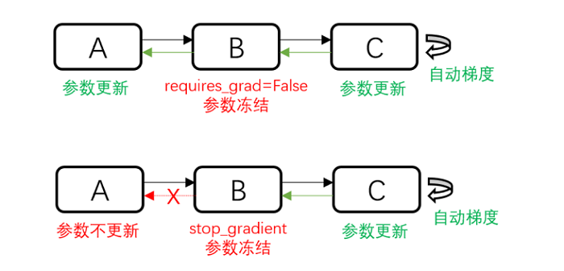

# 网络主体及loss搭建

<a href="https://gitee.com/mindspore/docs/blob/master/docs/mindspore/source_zh_cn/migration_guide/model_development/model_and_loss.md" target="_blank"></a>

在阅读本章节之前，请先阅读MindSpore官网教程[构建网络](https://www.mindspore.cn/tutorials/zh-CN/master/advanced/network/forward.html)和[损失函数](https://www.mindspore.cn/tutorials/zh-CN/master/advanced/network/loss.html)。

## 网络基本构成单元 Cell

MindSpore的网络搭建主要使用[Cell](https://www.mindspore.cn/docs/zh-CN/master/api_python/nn/mindspore.nn.Cell.html#mindspore.nn.Cell)进行图的构造，用户需要定义一个类继承`Cell`这个基类，在`init`里声明需要使用的API及子模块，在`construct`里进行计算，`Cell`在`GRAPH_MODE`(静态图模式)下将编译为一张计算图，在`PYNATIVE_MODE`(动态图模式)下作为神经网络的基础模块。一个基本的`Cell`搭建过程如下所示：

```python
import mindspore.nn as nn
import mindspore.ops as ops

class MyCell(nn.Cell):
    def __init__(self, forward_net):
        super(MyCell, self).__init__(auto_prefix=True)
        self.net = forward_net
        self.relu = ops.ReLU()

    def construct(self, x):
        y = self.net(x)
        return self.relu(y)

inner_net = nn.Conv2d(120, 240, 4, has_bias=False)
my_net = MyCell(inner_net)
print(my_net.trainable_params())
# [Parameter (name=net.weight, shape=(240, 120, 4, 4), dtype=Float32, requires_grad=True)]
```

参数的名字一般是根据`__init__`定义的对象名字和参数定义时用的名字组成的，比如上面的例子中，卷积的参数名为`net.weight`，其中，`net`是`self.net = forward_net`中的对象名，`weight`是Conv2d中定义卷积的参数时的`name`：`self.weight = Parameter(initializer(self.weight_init, shape), name='weight')`。

为了对齐参数名，有的时候可能不需要加对象名，Cell提供了`auto_prefix`接口用来判断Cell中的参数名是否加对象名这层信息，默认是`True`，也就是加对象名。如果`auto_prefix`设置为`False`，则上面这个例子中打印的`Parameter`的`name`是`weight`。

### 单元测试

搭建完`Cell`之后，最好对每个`Cell`构建一个单元测试方法与对标代码比较，比如上面的例子，其PyTorch的构建代码为：

```python
import torch.nn as torch_nn

class MyCell_pt(torch_nn.Module):
    def __init__(self, forward_net):
        super(MyCell_pt, self).__init__()
        self.net = forward_net
        self.relu = torch_nn.ReLU()

    def forward(self, x):
        y = self.net(x)
        return self.relu(y)

inner_net_pt = torch_nn.Conv2d(120, 240, kernel_size=4, bias=False)
pt_net = MyCell_pt(inner_net_pt)
for i in pt_net.parameters():
    print(i.shape)
# torch.Size([240, 120, 4, 4])
```

有了构建`Cell`的脚本，需要使用相同的输入数据和参数，对输出做比较：

```python
import numpy as np
import mindspore as ms

x = np.random.uniform(-1, 1, (2, 120, 12, 12)).astype(np.float32)
for m in pt_net.modules():
    if isinstance(m, torch_nn.Conv2d):
        torch_nn.init.constant_(m.weight, 0.1)

for _, cell in my_net.cells_and_names():
    if isinstance(cell, nn.Conv2d):
        cell.weight.set_data(ms.common.initializer.initializer(0.1, cell.weight.shape, cell.weight.dtype))

y_ms = my_net(ms.Tensor(x))
y_pt = pt_net(torch.from_numpy(x))
diff = np.max(np.abs(y_ms.asnumpy() - y_pt.detach().numpy()))
print(diff)

# ValueError: operands could not be broadcast together with shapes (2,240,12,12) (2,240,9,9)
```

可以发现MindSpore和PyTorch的输出不一样，什么原因呢？

查询[API差异文档](https://www.mindspore.cn/docs/zh-CN/master/note/api_mapping/pytorch_diff/nn_Conv2d.html)发现，`Conv2d`的默认参数MindSpore和PyTorch有区别，
MindSpore默认使用`same`模式，PyTorch默认使用`pad`模式，迁移时需要改一下MindSpore `Conv2d`的`pad_mode`：

```python
inner_net = nn.Conv2d(120, 240, 4, has_bias=False, mode="pad")
my_net = MyCell(inner_net)

# 构造随机输入
x = np.random.uniform(-1, 1, (2, 120, 12, 12)).astype(np.float32)
for m in pt_net.modules():
    if isinstance(m, torch_nn.Conv2d):
        # 固定PyTorch初始化参数
        torch_nn.init.constant_(m.weight, 0.1)

for _, cell in my_net.cells_and_names():
    if isinstance(cell, nn.Conv2d):
        # 固定MindSpore初始化参数
        cell.weight.set_data(ms.common.initializer.initializer(0.1, cell.weight.shape, cell.weight.dtype))

y_ms = my_net(ms.Tensor(x))
y_pt = pt_net(torch.from_numpy(x))
diff = np.max(np.abs(y_ms.asnumpy() - y_pt.detach().numpy()))
print(diff)

# 1.1444092e-05
```

整体误差在万分之一左右，基本符合预期。**在迁移Cell的过程中最好对每个Cell都做一次单元测试，保证迁移的一致。**

### Cell常用的方法介绍

`Cell`是MindSpore中神经网络的基本构成单元，提供了很多设置标志位以及好用的方法，下面来介绍一些常用的方法。

#### 手动混合精度

MindSpore提供了一种自动混合精度的方法，详见[Model](https://mindspore.cn/docs/zh-CN/master/api_python/mindspore/mindspore.Model.html#mindspore.Model)的amp_level属性。

但是有的时候开发网络时希望混合精度策略更加的灵活，MindSpore也提供了[`to_float`](https://mindspore.cn/docs/zh-CN/master/api_python/nn/mindspore.nn.Cell.html#mindspore.nn.Cell.to_float)的方法手动的添加混合精度。

`to_float(dst_type)`: 在`Cell`和所有子`Cell`的输入上添加类型转换，以使用特定的浮点类型运行。

如果 `dst_type` 是 `ms.float16` ，`Cell`的所有输入(包括作为常量的input， `Parameter`， `Tensor`)都会被转换为`float16`。例如，我想将resnet里所有的BN和loss改成`float32`的，其余操作是`float16`的，可以这么做：

```python
import mindspore as ms
from mindspore import nn
from mindvision.classification.models import resnet50
...
resnet = resnet50(pretrained=False)
resnet.to_float(ms.float16)  # 将net里所有的操作加float16的标志，框架会在编译时在输入加cast方法
for _, cell in resnet.cells_and_names():
    if isinstance(cell, [nn.BatchNorm1d, nn.BatchNorm2d, nn.BatchNorm3d]):
        cell.to_float(ms.float32)
loss = nn.SoftmaxCrossEntropyWithLogits(sparse=True, reduction='mean').to_float(ms.float32)
net_with_loss = nn.WithLossCell(resnet, loss_fn=loss)
```

**自定义的`to_float`和Model里的`amp_level`冲突，使用自定义的混合精度就不要设置Model里的`amp_level`。**

#### 自定义初始化参数

MindSpore封装的高阶API里一般会给参数一个默认的初始化，有时候这个初始化分布与需要使用的初始化、PyTorch的初始化不一致，此时需要进行自定义初始化。[网络参数初始化](https://mindspore.cn/tutorials/zh-CN/master/advanced/network/parameter.html#%E7%BD%91%E7%BB%9C%E5%8F%82%E6%95%B0%E5%88%9D%E5%A7%8B%E5%8C%96)介绍了一种在使用API属性进行初始化的方法，这里介绍一种利用Cell进行参数初始化的方法。

参数的相关介绍请参考[网络参数](https://www.mindspore.cn/tutorials/zh-CN/master/advanced/network/parameter.html)，本节主要以`Cell`为切入口，举例获取`Cell`中的所有参数，并举例说明怎样给`Cell`里的参数进行初始化。
**注意本节的方法不能在`construct`里执行，在网络中修改参数的值请使用[assign](https://www.mindspore.cn/docs/zh-CN/master/api_python/ops/mindspore.ops.assign.html)**。

[set_data(data, slice_shape=False)](https://www.mindspore.cn/docs/zh-CN/master/api_python/mindspore/mindspore.Parameter.html?highlight=set_data#mindspore.Parameter.set_data)设置参数数据。

MindSpore支持的参数初始化方法参考[mindspore.common.initializer](https://www.mindspore.cn/docs/zh-CN/master/api_python/mindspore.common.initializer.html)，当然也可以直接传入一个定义好的[Parameter](https://www.mindspore.cn/docs/zh-CN/master/api_python/mindspore/mindspore.Parameter.html#mindspore.Parameter)对象。

```python
import math
import mindspore as ms
from mindspore import nn
from mindvision.classification.models import resnet50
...
resnet = resnet50(pretrained=False)
for _, cell in resnet.cells_and_names():
    if isinstance(cell, nn.Conv2d):
        cell.weight.set_data(ms.common.initializer.initializer(
            ms.common.initializer.HeNormal(negative_slope=0, mode='fan_out', nonlinearity='relu'),
            cell.weight.shape, cell.weight.dtype))
    elif isinstance(cell, (nn.BatchNorm2d, nn.GroupNorm)):
        cell.gamma.set_data(ms.common.initializer.initializer("ones", cell.gamma.shape, cell.gamma.dtype))
        cell.beta.set_data(ms.common.initializer.initializer("zeros", cell.beta.shape, cell.beta.dtype))
    elif isinstance(cell, (nn.Dense)):
        cell.weight.set_data(ms.common.initializer.initializer(
            ms.common.initializer.HeUniform(negative_slope=math.sqrt(5)),
            cell.weight.shape, cell.weight.dtype))
        cell.bias.set_data(ms.common.initializer.initializer("zeros", cell.bias.shape, cell.bias.dtype))
```

#### 参数冻结

`Parameter`有一个`requires_grad`的属性来判断是否需要做参数更新，当`requires_grad=False`时相当于PyTorch的`buffer`对象。

我们可以通过Cell的`parameters_dict`、`get_parameters`和`trainable_params`来获取`Cell`中的参数列表。

- parameters_dict：获取网络结构中所有参数，返回一个以key为参数名，value为参数值的`OrderedDict`。

- get_parameters：获取网络结构中的所有参数，返回`Cell`中`Parameter`的迭代器。

- trainable_params：获取`Parameter`中`requires_grad`为`True`的属性，返回可训参数的列表。

```python
import mindspore.nn as nn

net = nn.Dense(2, 1, has_bias=True)
print(net.trainable_params())
# [Parameter (name=weight, shape=(1, 2), dtype=Float32, requires_grad=True), Parameter (name=bias, shape=(1,), dtype=Float32, requires_grad=True)]

for param in net.trainable_params():
    param_name = param.name
    if "bias" in param_name:
        param.requires_grad = False
print(net.trainable_params())
# [Parameter (name=weight, shape=(1, 2), dtype=Float32, requires_grad=True)]
```

在定义优化器时，使用`net.trainable_params()`获取需要进行参数更新的参数列表。

除了使用给参数设置`requires_grad=False`来不更新参数外，还可以使用`stop_gradient`来阻断梯度计算以达到冻结参数的作用。那什么时候使用`requires_grad=False`，什么时候使用`stop_gradient`呢？



如上图所示，`requires_grad=False`只是不更新部分参数，但是反向的梯度计算还是正常执行的；
`stop_gradient`会直接阶段反向梯度，当冻结的参数之前没有需要训练的参数时，两者在功能上时等价的。
但是`stop_gradient`会更快（少执行了一部分反向梯度计算）。
当冻结的参数之前有需要训练的参数时，只能使用`requires_grad=False`。

#### 参数保存和加载

MindSpore提供了`load_checkpoint`和`save_checkpoint`用来参数的保存和加载，需要注意的是参数保存时保存的是参数列表，参数加载时对象必须是Cell。
在参数加载时可能参数名对不上需要做一些修改，可以直接构造一个新的参数列表给到`load_checkpoint`加载到Cell。

```python
import mindspore as ms
import mindspore.ops as ops
import mindspore.nn as nn

net = nn.Dense(2, 1, has_bias=True)
for param in net.get_parameters():
    print(param.name, param.data.asnumpy())

ms.save_checkpoint(net, "dense.ckpt")
dense_params = ms.load_checkpoint("dense.ckpt")
print(dense_params)
new_params = {}
for param_name in dense_params:
    print(param_name, dense_params[param_name].data.asnumpy())
    new_params[param_name] = ms.Parameter(ops.ones_like(dense_params[param_name].data), name=param_name)

ms.load_param_into_net(net, new_params)
for param in net.get_parameters():
    print(param.name, param.data.asnumpy())

# weight [[-5.8331250e-05  1.3193867e-02]]
# bias [0.]
# {'weight': Parameter (name=weight, shape=(1, 2), dtype=Float32, requires_grad=True), 'bias': Parameter (name=bias, shape=(1,), dtype=Float32, requires_grad=True)}
# weight [[-5.8331250e-05  1.3193867e-02]]
# bias [0.]
# weight [[1. 1.]]
# bias [1.]
```

### 动态图与静态图

对于`Cell`，MindSpore提供`GRAPH_MODE`（静态图）和`PYNATIVE_MODE`（动态图）两种模式，详情请参考[动态图和静态图](https://www.mindspore.cn/tutorials/zh-CN/master/advanced/pynative_graph.html)。

`PyNative`模式下模型进行**推理**的行为与一般Python代码无异。但是在训练过程中，注意**一旦将Tensor转换成numpy做其他的运算后将会截断网络的梯度，相当于PyTorch的detach**。

而在使用`GRAPH_MODE`时，或使用`PYNATIVE_MODE`进行**训练**时，通常会出现语法限制。在这两种情况下，需要对Python代码进行图编译操作，而这一步操作中MindSpore目前还未能支持完整的Python语法全集，所以`construct`函数的编写会存在部分限制。具体限制内容可以参考[MindSpore静态图语法](https://www.mindspore.cn/docs/zh-CN/master/note/static_graph_syntax_support.html)。

#### 常见限制

相较于详细的语法说明，常见的限制可以归结为以下几点：

- 场景1

    限制：构图时（construct函数部分或者用ms_function修饰的函数），不要调用其他Python库，例如numpy、scipy，相关的处理应该前移到`__init__`阶段。
    措施：使用MindSpore内部提供的API替换其他Python库的功能。常量的处理可以前移到`__init__`阶段。

- 场景2

    限制：构图时不要使用自定义类型，而应该使用MindSpore提供的数据类型和Python基础类型，可以使用基于这些类型的tuple/list组合。
    措施：使用基础类型进行组合，可以考虑增加函数参数量。函数入参数没有限制，并且可以使用不定长输入。

- 场景3

    限制：构图时不要对数据进行多线程或多进程处理。
    措施：避免网络中出现多线程处理。

### 自定义反向

但是有的时候MindSpore不支持某些处理，需要使用一些三方的库的方法，但是我们又不想截断网络的梯度，这时该怎么办呢？这里介绍一种在`PYNATIVE_MODE`模式下，通过自定义反向规避此问题的方法：

有这么一个场景，需要随机有放回的选取大于0.5的值，且每个batch的shape固定是max_num。但是这个随机有放回的操作目前没有MindSpore的API支持，这时我们在`PYNATIVE_MODE`下使用numpy的方法来计算，然后自己构造一个梯度传播的过程。

```python
import numpy as np
import mindspore as ms
import mindspore.nn as nn
import mindspore.ops as ops

ms.set_context(mode=ms.PYNATIVE_MODE)
ms.set_seed(1)

class MySampler(nn.Cell):
    # 自定义取样器，在每个batch选取max_num个大于0.5的值
    def __init__(self, max_num):
        super(MySampler, self).__init__()
        self.max_num = max_num

    def random_positive(self, x):
        # 三方库numpy的方法，选取大于0.5的位置
        pos = np.where(x > 0.5)[0]
        pos_indice = np.random.choice(pos, self.max_num)
        return pos_indice

    def construct(self, x):
        # 正向网络构造
        batch = x.shape[0]
        pos_value = []
        pos_indice = []
        for i in range(batch):
            a = x[i].asnumpy()
            pos_ind = self.random_positive(a)
            pos_value.append(ms.Tensor(a[pos_ind], ms.float32))
            pos_indice.append(ms.Tensor(pos_ind, ms.int32))
        pos_values = ops.stack(pos_value, axis=0)
        pos_indices = ops.stack(pos_indice, axis=0)
        print("pos_values forword", pos_values)
        print("pos_indices forword", pos_indices)
        return pos_values, pos_indices

x = ms.Tensor(np.random.uniform(0, 3, (2, 5)), ms.float32)
print("x", x)
sampler = MySampler(3)
pos_values, pos_indices = sampler(x)
grad = ops.GradOperation(get_all=True)(sampler)(x)
print("dx", grad)

# x [[1.2510660e+00 2.1609735e+00 3.4312444e-04 9.0699774e-01 4.4026768e-01]
#  [2.7701578e-01 5.5878061e-01 1.0366821e+00 1.1903024e+00 1.6164502e+00]]
# pos_values forword [[0.90699774 2.1609735  0.90699774]
#  [0.5587806  1.6164502  0.5587806 ]]
# pos_indices forword [[3 1 3]
#  [1 4 1]]
# pos_values forword [[0.90699774 1.251066   2.1609735 ]
#  [1.1903024  1.1903024  0.5587806 ]]
# pos_indices forword [[3 0 1]
#  [3 3 1]]
# dx (Tensor(shape=[2, 5], dtype=Float32, value=
# [[0.00000000e+000, 0.00000000e+000, 0.00000000e+000, 0.00000000e+000, 0.00000000e+000],
#  [0.00000000e+000, 0.00000000e+000, 0.00000000e+000, 0.00000000e+000, 0.00000000e+000]]),)

```

当我们不构造这个反向过程时，由于使用的是numpy的方法计算的`pos_value`，梯度将会截断。
如上面注释所示，`dx`的值全是0。另外细心的同学会发现这个过程打印了两次`pos_values forword`和`pos_indices forword`，这是因为在`PYNATIVE_MODE`下在构造反向图时会再次构造一次正向图，这使得上面的这种写法实际上跑了两次正向和一次反向，这不但浪费了训练资源，在某些情况还会造成精度问题，如有BatchNorm的情况，在运行正向时就会更新`moving_mean`和`moving_var`导致一次训练更新了两次`moving_mean`和`moving_var`。
为了避免这种场景，MindSpore针对`Cell`有一个方法`set_grad()`，在`PYNATIVE_MODE`模式下框架会在构造正向时同步构造反向，这样在执行反向时就不会再运行正向的流程了。

```python
x = ms.Tensor(np.random.uniform(0, 3, (2, 5)), ms.float32)
print("x", x)
sampler = MySampler(3).set_grad()
pos_values, pos_indices = sampler(x)
grad = ops.GradOperation(get_all=True)(sampler)(x)
print("dx", grad)

# x [[1.2510660e+00 2.1609735e+00 3.4312444e-04 9.0699774e-01 4.4026768e-01]
#  [2.7701578e-01 5.5878061e-01 1.0366821e+00 1.1903024e+00 1.6164502e+00]]
# pos_values forword [[0.90699774 2.1609735  0.90699774]
#  [0.5587806  1.6164502  0.5587806 ]]
# pos_indices forword [[3 1 3]
#  [1 4 1]]
# dx (Tensor(shape=[2, 5], dtype=Float32, value=
# [[0.00000000e+000, 0.00000000e+000, 0.00000000e+000, 0.00000000e+000, 0.00000000e+000],
#  [0.00000000e+000, 0.00000000e+000, 0.00000000e+000, 0.00000000e+000, 0.00000000e+000]]),)
```

下面，我们来演示下如何[自定义反向](https://www.mindspore.cn/tutorials/experts/zh-CN/master/network/custom_cell_reverse.html)：

```python
import numpy as np
import mindspore as ms
import mindspore.nn as nn
import mindspore.ops as ops

ms.set_context(mode=ms.PYNATIVE_MODE)
ms.set_seed(1)

class MySampler(nn.Cell):
    # 自定义取样器，在每个batch选取max_num个大于0.5的值
    def __init__(self, max_num):
        super(MySampler, self).__init__()
        self.max_num = max_num

    def random_positive(self, x):
        # 三方库numpy的方法，选取大于0.5的位置
        pos = np.where(x > 0.5)[0]
        pos_indice = np.random.choice(pos, self.max_num)
        return pos_indice

    def construct(self, x):
        # 正向网络构造
        batch = x.shape[0]
        pos_value = []
        pos_indice = []
        for i in range(batch):
            a = x[i].asnumpy()
            pos_ind = self.random_positive(a)
            pos_value.append(ms.Tensor(a[pos_ind], ms.float32))
            pos_indice.append(ms.Tensor(pos_ind, ms.int32))
        pos_values = ops.stack(pos_value, axis=0)
        pos_indices = ops.stack(pos_indice, axis=0)
        print("pos_values forword", pos_values)
        print("pos_indices forword", pos_indices)
        return pos_values, pos_indices

    def bprop(self, x, out, dout):
        # 反向网络构造
        pos_indices = out[1]
        print("pos_indices backward", pos_indices)
        grad_x = dout[0]
        print("grad_x backward", grad_x)
        batch = x.shape[0]
        dx = []
        for i in range(batch):
            dx.append(ops.UnsortedSegmentSum()(grad_x[i], pos_indices[i], x.shape[1]))
        return ops.stack(dx, axis=0)

x = ms.Tensor(np.random.uniform(0, 3, (2, 5)), ms.float32)
print("x", x)
sampler = MySampler(3).set_grad()
pos_values, pos_indices = sampler(x)
grad = ops.GradOperation(get_all=True)(sampler)(x)
print("dx", grad)

# x [[1.2510660e+00 2.1609735e+00 3.4312444e-04 9.0699774e-01 4.4026768e-01]
#  [2.7701578e-01 5.5878061e-01 1.0366821e+00 1.1903024e+00 1.6164502e+00]]
# pos_values forword [[0.90699774 2.1609735  0.90699774]
#  [0.5587806  1.6164502  0.5587806 ]]
# pos_indices forword [[3 1 3]
#  [1 4 1]]
# pos_indices backward [[3 1 3]
#  [1 4 1]]
# grad_x backward [[1. 1. 1.]
#  [1. 1. 1.]]
# dx (Tensor(shape=[2, 5], dtype=Float32, value=
# [[0.00000000e+000, 1.00000000e+000, 0.00000000e+000, 2.00000000e+000, 0.00000000e+000],
#  [0.00000000e+000, 2.00000000e+000, 0.00000000e+000, 0.00000000e+000, 1.00000000e+000]]),)
```

我们在`MySampler`类里加入了`bprop`方法，这个方法的输入时正向的输入（展开写），正向的输出（一个tuple），输出的梯度（一个tuple）。在这个方法里构造梯度到输入的梯度反传流程。
可以看到在第0个batch，我们随机选取第3、1、3位置的值，输出的梯度都是1，最后反传出去的梯度为`[0.00000000e+000, 1.00000000e+000, 0.00000000e+000, 2.00000000e+000, 0.00000000e+000]`，符合预期。

### 动态shape规避策略

一般动态shape引入的原因有：

- 输入shape不固定；
- 网络执行过程中有引发shape变化的算子；
- 控制流不同分支引入shape上的变化。

下面，我们针对这几种场景介绍一些规避策略。

#### 输入shape不固定的场景

1. 可以在输入数据上加pad，pad到固定的shape。如deep_speechv2的[数据处理](https://gitee.com/mindspore/models/blob/master/research/audio/deepspeech2/src/dataset.py#L153) 规定`input_length`的最大长度，短的补0，长的随机截断，但是注意这种方法可能会影响训练的精度，需要平衡训练精度和训练性能。

2. 可以设置一组固定的输入shape，将输入分别处理成几个固定的尺度。如YOLOv3_darknet53的[数据处理](https://gitee.com/mindspore/models/blob/master/official/cv/yolov3_darknet53/src/yolo_dataset.py#L177)，在batch方法加处理函数`multi_scale_trans`,在其中在[MultiScaleTrans](https://gitee.com/mindspore/models/blob/master/official/cv/yolov3_darknet53/src/transforms.py#L456)中随机选取一个shape进行处理。

目前对输入shape完全随机的情况支持有限，需要等待新版本支持。

#### 网络执行过程中有引发shape变化的操作

对于网络运行过程中生成不固定shape的Tensor的场景，最常用的方式是构造mask来过滤掉无效的位置的值。一个简单的例子，在检测场景下需要根据预测框和真实框的iou结果选取一些框。
PyTorch的实现如下：

```python
def box_select_torch(box, iou_score):
    mask = iou_score > 0.3
    return box[mask]
```

当前MindSpore1.8之后全场景支持了masked_select，在MindSpore上可以这样实现：

```python
import mindspore as ms
from mindspore import ops as ops

ms.set_seed(1)

def box_select_ms(box, iou_score):
    mask = (iou_score > 0.3).expand_dims(1)
    return ops.masked_select(box, mask)
```

看一下结果对比：

```python
import torch
import numpy as np
import mindspore as ms

ms.set_seed(1)

box = np.random.uniform(0, 1, (3, 4)).astype(np.float32)
iou_score = np.random.uniform(0, 1, (3,)).astype(np.float32)

print("box_select_ms", box_select_ms(ms.Tensor(box), ms.Tensor(iou_score)))
print("box_select_torch", box_select_torch(torch.from_numpy(box), torch.from_numpy(iou_score)))

# box_select_ms [0.14675589 0.09233859 0.18626021 0.34556073]
# box_select_torch tensor([[0.1468, 0.0923, 0.1863, 0.3456]])
```

但是这样操作后会产生动态shape，在后续的网络计算中可能会有问题，在现阶段，推荐先使用mask规避一下：

```python
def box_select_ms2(box, iou_score):
    mask = (iou_score > 0.3).expand_dims(1)
    return box * mask, mask
```

**在后续计算中，如果涉及box的一些操作，需要注意是否需要乘mask用来过滤非有效结果。**

对于求loss时对feature做选取，导致获取到不固定shape的Tensor的场景，处理方式基本和网络运行过程中不固定shape的处理方式相同，只是loss部分后续可能没有其他的操作，不需要返回mask。

举个例子，我们想选取前70%的正样本的值求loss。
PyTorch的实现如下：

```python
import torch
import torch.nn as torch_nn

class ClassLoss_pt(torch_nn.Module):
    def __init__(self):
        super(ClassLoss_pt, self).__init__()
        self.con_loss = torch_nn.CrossEntropyLoss(reduction='none')

    def forward(self, pred, label):
        mask = label > 0
        vaild_label = label * mask
        pos_num = torch.clamp(mask.sum() * 0.7, 1).int()
        con = self.con_loss(pred, vaild_label.long()) * mask
        loss, _ = torch.topk(con, k=pos_num)
        return loss.mean()
```

在里面使用了`torch.topk`来获取前70%的正样本数据，在MindSpore里目前不支持TopK的K是变量，所以需要转换下思路，获取到第k的值，然后通过这个值获取到topk的mask，MindSpore的实现如下：

```python
import mindspore as ms
from mindspore import ops as ops
from mindspore import nn as ms_nn

class ClassLoss_ms(ms_nn.Cell):
    def __init__(self):
        super(ClassLoss_ms, self).__init__()
        self.con_loss = ms_nn.SoftmaxCrossEntropyWithLogits(sparse=True, reduction="none")
        self.sort_descending = ops.Sort(descending=True)

    def construct(self, pred, label):
        mask = label > 0
        vaild_label = label * mask
        pos_num = ops.maximum(mask.sum() * 0.7, 1).astype(ms.int32)
        con = self.con_loss(pred, vaild_label.astype(ms.int32)) * mask
        con_sort, con_idx = self.sort_descending(con)
        con_k = con_sort[pos_num - 1]
        con_mask = (con >= con_k).astype(con.dtype)
        loss = con * con_mask
        return loss.sum() / con_mask.sum()
```

我们来看一下实验结果：

```python
import torch
import numpy as np
import mindspore as ms
ms.set_seed(1)

pred = np.random.uniform(0, 1, (5, 2)).astype(np.float32)
label = np.array([-1, 0, 1, 1, 0]).astype(np.int32)
print("pred", pred)
print("label", label)
t_loss = ClassLoss_pt()
cls_loss_pt = t_loss(torch.from_numpy(pred), torch.from_numpy(label))
print("cls_loss_pt", cls_loss_pt)
m_loss = ClassLoss_ms()
cls_loss_ms = m_loss(ms.Tensor(pred), ms.Tensor(label))
print("cls_loss_ms", cls_loss_ms)

# pred [[4.17021990e-01 7.20324516e-01]
#  [1.14374816e-04 3.02332580e-01]
#  [1.46755889e-01 9.23385918e-02]
#  [1.86260208e-01 3.45560730e-01]
#  [3.96767467e-01 5.38816750e-01]]
# label [-1  0  1  1  0]
# cls_loss_pt tensor(0.7207)
# cls_loss_ms 0.7207259
```

#### 控制流不同分支引入shape上的变化

分析下在模型分析与准备章节的例子：

```python
import numpy as np
import mindspore as ms
from mindspore import ops
np.random.seed(1)
x = ms.Tensor(np.random.uniform(0, 1, (10)).astype(np.float32))
cond = (x > 0.5).any()

if cond:
    y = ops.masked_select(x, x > 0.5)
else:
    y = ops.zeros_like(x)
print(x)
print(cond)
print(y)

# [4.17021990e-01 7.20324516e-01 1.14374816e-04 3.02332580e-01
#  1.46755889e-01 9.23385918e-02 1.86260208e-01 3.45560730e-01
#  3.96767467e-01 5.38816750e-01]
# True
# [0.7203245  0.53881675]
```

在`cond=True`的时最大的shape和x一样大，根据上面的加mask方法，可以写成：

```python
import numpy as np
import mindspore as ms
from mindspore import ops
np.random.seed(1)
x = ms.Tensor(np.random.uniform(0, 1, (10)).astype(np.float32))
cond = (x > 0.5).any()

if cond:
    mask = (x > 0.5).astype(x.dtype)
else:
    mask = ops.zeros_like(x)
y = x * mask
print(x)
print(cond)
print(y)

# [4.17021990e-01 7.20324516e-01 1.14374816e-04 3.02332580e-01
#  1.46755889e-01 9.23385918e-02 1.86260208e-01 3.45560730e-01
#  3.96767467e-01 5.38816750e-01]
# True
# [0.         0.7203245  0.         0.         0.         0.
#  0.         0.         0.         0.53881675]
```

需要注意的是如果y在后续有参与其他的计算，需要一起传入mask对有效位置做过滤。

## Loss构建

Loss函数本质上也是网络构建的一部分，可以通过`Cell`进行构建，具体请参考[损失函数](https://www.mindspore.cn/tutorials/zh-CN/master/advanced/network/loss.html)。

需要注意的是Loss中一般会涉及特征的组合，交叉熵，规约等操作，这种操作极易溢出，不推荐Loss中使用float16。一个基本的带Loss的网络构建是这样的：

```python
# 1. 构建网络
net = Net()
# 2. 构建Loss
loss = Loss()
# 3. 对网络做混合精度
net = apply_amp(net)
# 4. 保持Loss部分使用float32
loss = loss.to_float(ms.float32)
# 5. 组装网络和loss
net_with_loss = WithLossCell(net, loss)
net_with_loss.set_train()
# 6. PYNATIVE模式下需要设置反向标志
net_with_loss.set_grad()
```

这个组装过程也可以通过[Model](https://www.mindspore.cn/tutorials/zh-CN/master/advanced/train/model.html)接口来封装。

需要注意的是使用`Model`对网络进行包装时不需要设置`set_train`和`set_grad`，框架在执行`model.train`时会设置；
