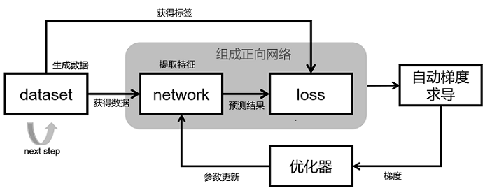
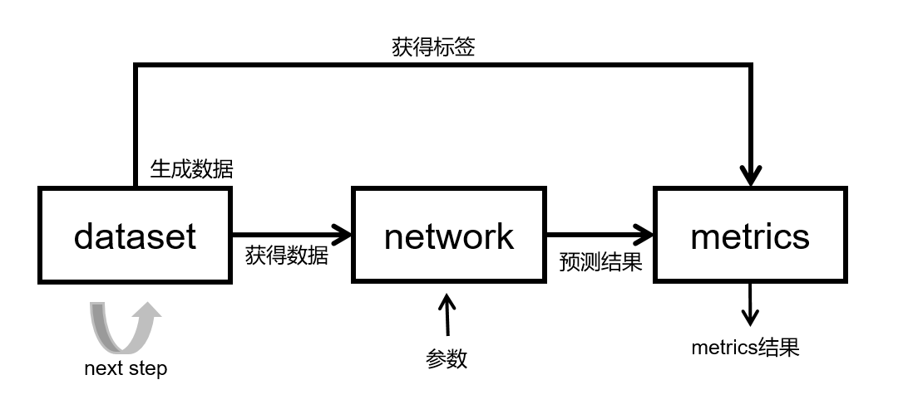

# MindSpore网络搭建

<a href="https://gitee.com/mindspore/docs/blob/master/docs/mindspore/source_zh_cn/migration_guide/model_development/model_development.md" target="_blank"></a>

本章节将会从训练和推理需要的基本模块出发，介绍MindSpore脚本编写的相关内容，包含数据集、网络模型及loss函数、优化器、训练流程、推理流程等内容。其中会包含一些在网络迁移中常用的功能技巧，比如网络编写的规范，训练、推理流程模板，动态shape的规避策略等。

## 网络训练原理



网络训练的基本原理如上图所示：

整个网络的训练过程包含5个模块：

- dataset；用于获取数据，包含网络的输入，标签等。MindSpore提供了基本的[常见的数据集处理接口](https://www.mindspore.cn/docs/zh-CN/master/api_python/mindspore.dataset.html)，同时也支持利用python的迭代器构建数据集。

- network；网络模型实现，一般使用Cell包装。在init里声明需要的模块和算子，在construct里构图实现。

- loss；损失函数。用于衡量预测值与真实值差异的程度。深度学习中，模型训练就是通过不停地迭代来缩小损失函数值的过程，定义一个好的损失函数可以帮助损失函数值更快收敛，达到更好的精度，MindSpore提供了很多[常见的loss函数](https://www.mindspore.cn/docs/zh-CN/master/api_python/mindspore.nn.html#%E6%8D%9F%E5%A4%B1%E5%87%BD%E6%95%B0)，当然可以自己定义实现自己的loss函数。

- 自动梯度求导；一般将network和loss一起包装成正向网络一起给到自动梯度求导模块进行梯度计算。MindSpore提供了自动的梯度求导接口，该功能对用户屏蔽了大量的求导细节和过程，大大降低了框架的使用门槛。需要自定义梯度时，MindSpore也提供了[接口](https://www.mindspore.cn/tutorials/experts/zh-CN/master/network/custom_cell_reverse.html)去自由实现梯度计算。

- 优化器；优化器在模型训练过程中，用于计算和更新网络参数。MindSpore提供了许多[通用的优化器](https://www.mindspore.cn/docs/zh-CN/master/api_python/mindspore.nn.html#%E4%BC%98%E5%8C%96%E5%99%A8)供用户选择，同时也支持用户根据需要自定义优化器。

## 网络推理原理



网络推理的基本原理如上图所示：

整个网络的训练过程包含3个模块：

- dataset；用于获取数据，包含网络的输入，标签等。由于推理过程需要推理全部的推理数据集，batchsize最好设置成1，如果batchsize不是1的话，注意，加batch时加drop_remainder=False，另外推理过程是一个固定的过程，加载同样的参数每一次的推理结果相同，推理过程不要有随机的数据增强。

- network；网络模型实现，一般使用Cell包装。推理时的网络结构一般和训练是一样的。需要注意推理时给Cell加set_train(False)的标签，训练时加set_train(True)的标签，这个和PyTorch model.eval() (模型评估模式)，model.train() (模型训练模式) 一样。

- metrics；当训练任务结束，常常需要评价指标（Metrics）评估函数来评估模型的好坏。常用的评价指标有混淆矩阵、准确率 Accuracy、精确率 Precision、召回率 Recall等。mindspore.nn模块提供了常见的[评估函数](https://www.mindspore.cn/docs/zh-CN/master/api_python/mindspore.train.html#评价指标) ，用户也可以根据需要自行定义评估指标。自定义Metrics函数需要继承nn.Metric父类，并重新实现父类中的clear方法、update方法和eval方法。

## 网络搭建

了解了网络训练和推理的过程后，下面介绍以下如何在MindSpore上实现网络训练和推理的过程。

- [数据集构建](https://www.mindspore.cn/docs/zh-CN/master/migration_guide/model_development/dataset.html)
- [网络主体及loss搭建](https://www.mindspore.cn/docs/zh-CN/master/migration_guide/model_development/model_and_loss.html)
- [学习率及优化器](https://www.mindspore.cn/docs/zh-CN/master/migration_guide/model_development/learning_rate_and_optimizer.html)
- [训练网络与梯度求导](https://www.mindspore.cn/docs/zh-CN/master/migration_guide/model_development/training_and_gradient.html)
- [推理及训练流程](https://www.mindspore.cn/docs/zh-CN/master/migration_guide/model_development/training_and_evaluation_procession.html)

> 做网络迁移时，我们推荐在完成网络脚本的编写后，优先做模型的推理验证。这样做有以下几点好处：
>
> - 比起训练，推理过程是固定的，能够与参考实现进行对比；
> - 比起训练，推理需要的时间极少，能够快速验证网络结构和推理流程的正确性；
> - 训练完的结果需要使用推理过程来验证模型的结果，需要优先保证推理的正确才能证明训练的有效。

## MindSpore网络编写注意事项

在MindSpore网络实现过程中，有一些容易出现问题的地方，遇到问题请优先排查是否有以下情况：

1. 数据处理中使用MindSpore的算子。数据处理过程一般会有多线程/多进程，此场景下数据处理使用MindSpore的算子存在限制，数据处理过程中使用的算子建议使用三方的实现代替，如numpy，opencv，pandas，PIL等。
2. 控制流。详情请参考[流程控制语句](https://www.mindspore.cn/tutorials/experts/zh-CN/master/network/control_flow.html)。当多层调用条件控制语句时在图模式下编译会很慢。
3. 切片操作，当遇到对一个Tensor进行切片时需要注意，切片的下标是否是变量，当是变量时会有限制，请参考[网络主体和loss搭建](https://www.mindspore.cn/docs/zh-CN/master/migration_guide/model_development/model_and_loss.html)对动态shape规避。
4. 自定义混合精度和Model里的`amp_level`冲突，使用自定义的混合精度就不要设置Model里的`amp_level`。
5. 在Ascend环境下Conv，Sort，TopK只能是float16的，注意加[loss scale](https://mindspore.cn/tutorials/experts/zh-CN/master/others/mixed_precision.html)避免溢出。
6. 在Ascend环境下Conv，Pooling等带有stride属性的算子对stride的长度有规定，需要规避。
7. 在分布式环境下必须加seed，用以保证多卡的初始化的参数一致。
8. 网络中使用Cell的list或者Parameter的list的情况，请在`init`里对list进行转换，转换成[CellList](https://www.mindspore.cn/docs/zh-CN/master/api_python/nn/mindspore.nn.CellList.html)，[SequentialCell](https://www.mindspore.cn/docs/zh-CN/master/api_python/nn/mindspore.nn.SequentialCell.html)，[ParameterTuple](https://www.mindspore.cn/docs/zh-CN/master/api_python/mindspore/mindspore.ParameterTuple.html)。

```python
# 在init里定义图构造时需要用的层，不要这样写
self.layer = [nn.Conv2d(1, 3), nn.BatchNorm(3), nn.ReLU()]

# 需要包装成CellList或者SequentialCell
self.layer = nn.CellList([nn.Conv2d(1, 3), nn.BatchNorm(3), nn.ReLU()])
# 或者
self.layer = nn.SequentialCell([nn.Conv2d(1, 3), nn.BatchNorm(3), nn.ReLU()])
```


