# 网络迁移调试实例

<a href="https://gitee.com/mindspore/docs/blob/master/docs/mindspore/source_zh_cn/migration_guide/sample_code.md" target="_blank"></a>

本章将以经典网络 ResNet50 为例，结合代码来详细介绍网络迁移方法。

## 模型分析与准备

假设已经按照[环境准备](https://www.mindspore.cn/docs/zh-CN/master/migration_guide/enveriment_preparation.html)章节配置好了MindSpore的运行环境。且假设resnet50在models仓还没有实现。

首先需要分析算法及网络结构。

残差神经网络（ResNet）由微软研究院何凯明等人提出，通过ResNet单元，成功训练152层神经网络，赢得了ILSVRC2015冠军。传统的卷积网络或全连接网络或多或少存在信息丢失的问题，还会造成梯度消失或爆炸，导致深度网络训练失败，ResNet则在一定程度上解决了这个问题。通过将输入信息传递给输出，确保信息完整性。整个网络只需要学习输入和输出的差异部分，简化了学习目标和难度。ResNet的结构大幅提高了神经网络训练的速度，并且大大提高了模型的准确率。

[论文](https://arxiv.org/pdf/1512.03385.pdf)：Kaiming He, Xiangyu Zhang, Shaoqing Ren, Jian Sun."Deep Residual Learning for Image Recognition"

我们找到了一份[PyTorch ResNet50 Cifar10的示例代码](https://gitee.com/mindspore/docs/tree/master/docs/mindspore/source_zh_cn/migration_guide/code/resnet_convert/resnet_pytorch)，里面包含了PyTorch ResNet的实现，Cifar10数据处理，网络训练及推理流程。

### checklist

在阅读论文和参考实现过程中，我们分析填写以下checklist：

|trick|记录|
|----|----|
|数据增强| RandomCrop，RandomHorizontalFlip，Resize，Normalize |
|学习率衰减策略| 固定学习率 0.001 |
|优化器参数| Adam优化器，weight_decay=1e-5 |
|训练参数| batch_size=32，epochs=90 |
|网络结构优化点| Bottleneck |
|训练流程优化点| 无 |

### 复现参考实现

下载PyTorch的代码，cifar10的数据集，对网络进行训练：

```text
Train Epoch: 89 [0/1563 (0%)]    Loss: 0.010917
Train Epoch: 89 [100/1563 (6%)]    Loss: 0.013386
Train Epoch: 89 [200/1563 (13%)]    Loss: 0.078772
Train Epoch: 89 [300/1563 (19%)]    Loss: 0.031228
Train Epoch: 89 [400/1563 (26%)]    Loss: 0.073462
Train Epoch: 89 [500/1563 (32%)]    Loss: 0.098645
Train Epoch: 89 [600/1563 (38%)]    Loss: 0.112967
Train Epoch: 89 [700/1563 (45%)]    Loss: 0.137923
Train Epoch: 89 [800/1563 (51%)]    Loss: 0.143274
Train Epoch: 89 [900/1563 (58%)]    Loss: 0.088426
Train Epoch: 89 [1000/1563 (64%)]    Loss: 0.071185
Train Epoch: 89 [1100/1563 (70%)]    Loss: 0.094342
Train Epoch: 89 [1200/1563 (77%)]    Loss: 0.126669
Train Epoch: 89 [1300/1563 (83%)]    Loss: 0.245604
Train Epoch: 89 [1400/1563 (90%)]    Loss: 0.050761
Train Epoch: 89 [1500/1563 (96%)]    Loss: 0.080932

Test set: Average loss: -9.7052, Accuracy: 91%

Finished Training
```

可以从[resnet_pytorch_res](https://mindspore-website.obs.cn-north-4.myhuaweicloud.com/notebook/models/resnet_pytorch_res.zip)下载到训练时日志和保存的参数文件。

### 分析API/特性缺失

- API分析

| PyTorch 使用API       | MindSpore 对应API | 是否有差异 |
| ---------------------- | ------------------ | ------|
| `nn.Conv2D`            | `nn.Conv2d`        | 有，[差异对比](https://www.mindspore.cn/docs/zh-CN/master/note/api_mapping/pytorch_diff/Conv2d.html) |
| `nn.BatchNorm2D`       | `nn.BatchNom2d`    | 有，[差异对比](https://www.mindspore.cn/docs/zh-CN/master/note/api_mapping/pytorch_diff/BatchNorm2d.html) |
| `nn.ReLU`              | `nn.ReLU`          | 无 |
| `nn.MaxPool2D`         | `nn.MaxPool2d`     | 有，[差异对比](https://www.mindspore.cn/docs/zh-CN/master/note/api_mapping/pytorch_diff/MaxPool2d.html) |
| `nn.AdaptiveAvgPool2D` | `nn.AdaptiveAvgPool2D` |  无  |
| `nn.Linear`            | `nn.Dense`         | 有，[差异对比](https://www.mindspore.cn/docs/zh-CN/master/note/api_mapping/pytorch_diff/Dense.html) |
| `torch.flatten`        | `nn.Flatten`       | 无 |

查看[PyTorch API映射](https://www.mindspore.cn/docs/zh-CN/master/note/api_mapping/pytorch_api_mapping.html)，我们获取到有四个API有差异。

- 功能分析

| Pytorch 使用功能          | MindSpore 对应功能                    |
| ------------------------- | ------------------------------------- |
| `nn.init.kaiming_normal_` | `initializer(init='HeNormal')`        |
| `nn.init.constant_`       | `initializer(init='Constant')`        |
| `nn.Sequential`           | `nn.SequentialCell`                   |
| `nn.Module`               | `nn.Cell`                             |
| `nn.distibuted`           | `set_auto_parallel_context`   |
| `torch.optim.SGD`         | `nn.optim.SGD` or `nn.optim.Momentum` |

（由于MindSpore 和 PyTorch 在接口设计上不完全一致，这里仅列出关键功能的比对）

经过API和功能分析，我们发现，相比 PyTorch，MindSpore 上没有缺失的API和功能。

## MindSpore模型实现

### 数据集

PyTorch 的 cifar10数据集处理如下：

```python
import torch
import torchvision.transforms as trans
import torchvision

train_transform = trans.Compose([
    trans.RandomCrop(32, padding=4),
    trans.RandomHorizontalFlip(0.5),
    trans.Resize(224),
    trans.ToTensor(),
    trans.Normalize([0.4914, 0.4822, 0.4465], [0.2023, 0.1994, 0.2010]),
])
test_transform = trans.Compose([
    trans.Resize(224),
    trans.RandomHorizontalFlip(0.5),
    trans.ToTensor(),
    trans.Normalize([0.4914, 0.4822, 0.4465], [0.2023, 0.1994, 0.2010]),
])
train_set = torchvision.datasets.CIFAR10(root='./data', train=True, transform=train_transform)
train_loader = torch.utils.data.DataLoader(train_set, batch_size=32, shuffle=True)
test_set = torchvision.datasets.CIFAR10(root='./data', train=False, transform=test_transform)
test_loader = torch.utils.data.DataLoader(test_set, batch_size=1, shuffle=False)
```

如果本地没有cifar10数据集，在使用`torchvision.datasets.CIFAR10`时添加`download=True`可以自动下载。

cifar10数据集目录组织参考：

```text
└─dataset_path
    ├─cifar-10-batches-bin      # train dataset
        ├─ data_batch_1.bin
        ├─ data_batch_2.bin
        ├─ data_batch_3.bin
        ├─ data_batch_4.bin
        ├─ data_batch_5.bin
    └─cifar-10-verify-bin       # evaluate dataset
        ├─ test_batch.bin
```

这个操作在MindSpore上实现如下：

```python
import mindspore as ms
import mindspore.dataset as ds
from mindspore.dataset import vision
from mindspore.dataset.transforms.transforms import TypeCast

def create_cifar_dataset(dataset_path, do_train, batch_size=32, image_size=(224, 224), rank_size=1, rank_id=0):
    dataset = ds.Cifar10Dataset(dataset_path, shuffle=do_train,
                                num_shards=rank_size, shard_id=rank_id)

    # define map operations
    trans = []
    if do_train:
        trans += [
            vision.RandomCrop((32, 32), (4, 4, 4, 4)),
            vision.RandomHorizontalFlip(prob=0.5)
        ]

    trans += [
        vision.Resize(image_size),
        vision.Rescale(1.0 / 255.0, 0.0),
        vision.Normalize([0.4914, 0.4822, 0.4465], [0.2023, 0.1994, 0.2010]),
        vision.HWC2CHW()
    ]

    type_cast_op = TypeCast(ms.int32)

    data_set = dataset.map(operations=type_cast_op, input_columns="label")
    data_set = data_set.map(operations=trans, input_columns="image")

    # apply batch operations
    data_set = data_set.batch(batch_size, drop_remainder=do_train)
    return data_set
```

### 网络模型实现

参考[PyTorch resnet](https://gitee.com/mindspore/docs/blob/master/docs/mindspore/source_zh_cn/migration_guide/code/resnet_convert/resnet_pytorch/resnet.py)，我们实现了一版[MindSpore resnet](https://gitee.com/mindspore/docs/blob/master/docs/mindspore/source_zh_cn/migration_guide/code/resnet_convert/resnet_ms/src/resnet.py)，通过比较工具发现，实现只有几个地方有差别：

```python
# Conv2d PyTorch
nn.Conv2d(
    in_planes,
    out_planes,
    kernel_size=3,
    stride=stride,
    padding=dilation,
    groups=groups,
    bias=False,
    dilation=dilation,
)
##########################################

# Conv2d MindSpore
nn.Conv2d(
    in_planes,
    out_planes,
    kernel_size=3,
    pad_mode="pad",
    stride=stride,
    padding=dilation,
    group=groups,
    has_bias=False,
    dilation=dilation,
)
```

```python
# PyTorch
nn.Module
############################################
# MindSpore
nn.Cell
```

```python
# PyTorch
nn.ReLU(inplace=True)
############################################
# MindSpore
nn.ReLU()
```

```python
# PyTorch 图构造
forward
############################################
# MindSpore 图构造
construct
```

```python
# PyTorch 带padding的MaxPool2d
maxpool = nn.MaxPool2d(kernel_size=3, stride=2, padding=1)
############################################
# MindSpore 带padding的MaxPool2d
maxpool = nn.SequentialCell([
              nn.Pad(paddings=((0, 0), (0, 0), (1, 1), (1, 1)), mode="CONSTANT"),
              nn.MaxPool2d(kernel_size=3, stride=2)])
```

```python
# PyTorch AdaptiveAvgPool2d
avgpool = nn.AdaptiveAvgPool2d((1, 1))
############################################
# MindSpore ReduceMean 和 AdaptiveAvgPool2d output shape是1时功能一致，且速度会快
mean = ops.ReduceMean(keep_dims=True)
```

```python
# PyTorch 全连接
fc = nn.Linear(512 * block.expansion, num_classes)
############################################
# MindSpore 全连接
fc = nn.Dense(512 * block.expansion, num_classes)
```

```python
# PyTorch Sequential
nn.Sequential
############################################
# MindSpore SequentialCell
nn.SequentialCell
```

```python
# PyTorch 初始化
for m in self.modules():
    if isinstance(m, nn.Conv2d):
        nn.init.kaiming_normal_(m.weight, mode="fan_out", nonlinearity="relu")
    elif isinstance(m, (nn.BatchNorm2d, nn.GroupNorm)):
        nn.init.constant_(m.weight, 1)
        nn.init.constant_(m.bias, 0)

# Zero-initialize the last BN in each residual branch,
# so that the residual branch starts with zeros, and each residual block behaves like an identity.
# This improves the model by 0.2~0.3% according to https://arxiv.org/abs/1706.02677
if zero_init_residual:
    for m in self.modules():
        if isinstance(m, Bottleneck) and m.bn3.weight is not None:
            nn.init.constant_(m.bn3.weight, 0)  # type: ignore[arg-type]
        elif isinstance(m, BasicBlock) and m.bn2.weight is not None:
            nn.init.constant_(m.bn2.weight, 0)  # type: ignore[arg-type]

############################################

# MindSpore 初始化
for _, cell in self.cells_and_names():
    if isinstance(cell, nn.Conv2d):
        cell.weight.set_data(ms.common.initializer.initializer(
            ms.common.initializer.HeNormal(negative_slope=0, mode='fan_out', nonlinearity='relu'),
            cell.weight.shape, cell.weight.dtype))
    elif isinstance(cell, (nn.BatchNorm2d, nn.GroupNorm)):
        cell.gamma.set_data(ms.common.initializer.initializer("ones", cell.gamma.shape, cell.gamma.dtype))
        cell.beta.set_data(ms.common.initializer.initializer("zeros", cell.beta.shape, cell.beta.dtype))
    elif isinstance(cell, (nn.Dense)):
        cell.weight.set_data(ms.common.initializer.initializer(
            ms.common.initializer.HeUniform(negative_slope=math.sqrt(5)),
            cell.weight.shape, cell.weight.dtype))
        cell.bias.set_data(ms.common.initializer.initializer("zeros", cell.bias.shape, cell.bias.dtype))

# Zero-initialize the last BN in each residual branch,
# so that the residual branch starts with zeros, and each residual block behaves like an identity.
# This improves the model by 0.2~0.3% according to https://arxiv.org/abs/1706.02677
if zero_init_residual:
    for _, cell in self.cells_and_names():
        if isinstance(cell, Bottleneck) and cell.bn3.gamma is not None:
            cell.bn3.gamma.set_data("zeros", cell.bn3.gamma.shape, cell.bn3.gamma.dtype)
        elif isinstance(cell, BasicBlock) and cell.bn2.weight is not None:
            cell.bn2.gamma.set_data("zeros", cell.bn2.gamma.shape, cell.bn2.gamma.dtype)
```

### Loss函数

PyTorch：

```python
net_loss = torch.nn.CrossEntropyLoss()
```

MindSpore:

```python
loss = nn.SoftmaxCrossEntropyWithLogits(sparse=True, reduction='mean')
```

### 学习率与优化器

PyTorch：

```python
net_opt = torch.optim.Adam(net.parameters(), 0.001, weight_decay=1e-5)
```

MindSpore:

```python
optimizer = nn.Adam(resnet.trainable_params(), 0.001, weight_decay=1e-5)
```

## 模型验证

在[复现参考实现](#复现参考实现)章节我们获取到了训练好的PyTorch的参数，我们怎样将参数文件转换成MindSpore能够使用的checkpoint文件呢？

基本需要以下几个流程：

1. 打印PyTorch的参数文件里所有参数的参数名和shape，打印需要加载参数的MindSpore Cell里所有参数的参数名和shape；
2. 比较参数名和shape，构造参数映射关系；
3. 按照参数映射将PyTorch的参数 -> numpy -> MindSpore的Parameter，构成Parameter List后保存成checkpoint；
4. 单元测试：PyTorch加载参数，MindSpore加载参数，构造随机输入，对比输出。

### 打印参数

```python
import torch
# 通过PyTorch参数文件，打印PyTorch的参数文件里所有参数的参数名和shape，返回参数字典
def pytorch_params(pth_file):
    par_dict = torch.load(pth_file, map_location='cpu')
    pt_params = {}
    for name in par_dict:
        parameter = par_dict[name]
        print(name, parameter.numpy().shape)
        pt_params[name] = parameter.numpy()
    return pt_params

# 通过MindSpore的Cell，打印Cell里所有参数的参数名和shape，返回参数字典
def mindspore_params(network):
    ms_params = {}
    for param in network.get_parameters():
        name = param.name
        value = param.data.asnumpy()
        print(name, value.shape)
        ms_params[name] = value
    return ms_params
```

执行

```python
from resnet_ms.src.resnet import resnet50 as ms_resnet50
pth_path = "resnet.pth"
pt_param = pytorch_params(pth_path)
print("="*20)
ms_param = mindspore_params(ms_resnet50(num_classes=10))
```

得到

```text
conv1.weight (64, 3, 7, 7)
bn1.weight (64,)
bn1.bias (64,)
bn1.running_mean (64,)
bn1.running_var (64,)
bn1.num_batches_tracked ()
layer1.0.conv1.weight (64, 64, 1, 1)
......
===========================================
conv1.weight (64, 3, 7, 7)
bn1.moving_mean (64,)
bn1.moving_variance (64,)
bn1.gamma (64,)
bn1.beta (64,)
layer1.0.conv1.weight (64, 64, 1, 1)
......
```

### 参数映射及checkpoint保存

发现除了BatchNorm的参数外，其他参数的名字和shape是完全能够对的上的，这时可以写一个简单的python脚本来做参数映射:

```python
import mindspore as ms
def param_convert(ms_params, pt_params, ckpt_path):
    # 参数名映射字典
    bn_ms2pt = {"gamma": "weight",
                "beta": "bias",
                "moving_mean": "running_mean",
                "moving_variance": "running_var"}
    new_params_list = []
    for ms_param in ms_params.keys():
        # 在参数列表中，只有包含bn和downsample.1的参数是BatchNorm算子的参数
        if "bn" in ms_param or "downsample.1" in ms_param:
            ms_param_item = ms_param.split(".")
            pt_param_item = ms_param_item[:-1] + [bn_ms2pt[ms_param_item[-1]]]
            pt_param = ".".join(pt_param_item)
            # 如找到参数对应且shape一致，加入到参数列表
            if pt_param in pt_params and pt_params[pt_param].shape == ms_params[ms_param].shape:
                ms_value = pt_params[pt_param]
                new_params_list.append({"name": ms_param, "data": ms.Tensor(ms_value)})
            else:
                print(ms_param, "not match in pt_params")
        # 其他参数
        else:
            # 如找到参数对应且shape一致，加入到参数列表
            if ms_param in pt_params and pt_params[ms_param].shape == ms_params[ms_param].shape:
                ms_value = pt_params[ms_param]
                new_params_list.append({"name": ms_param, "data": ms.Tensor(ms_value)})
            else:
                print(ms_param, "not match in pt_params")
    # 保存成MindSpore的checkpoint
    ms.save_checkpoint(new_params_list, ckpt_path)

ckpt_path = "resnet50.ckpt"
param_convert(ms_params, pt_params, ckpt_path)
```

执行完成可以在`ckpt_path`找到生成的checkpoint文件。

当参数映射关系非常复杂，通过参数名很难找到映射关系时，可以写一个参数映射字典，如：

```python
param = {
    'bn1.bias': 'bn1.beta',
    'bn1.weight': 'bn1.gamma',
    'IN.weight': 'IN.gamma',
    'IN.bias': 'IN.beta',
    'BN.bias': 'BN.beta',
    'in.weight': 'in.gamma',
    'bn.weight': 'bn.gamma',
    'bn.bias': 'bn.beta',
    'bn2.weight': 'bn2.gamma',
    'bn2.bias': 'bn2.beta',
    'bn3.bias': 'bn3.beta',
    'bn3.weight': 'bn3.gamma',
    'BN.running_mean': 'BN.moving_mean',
    'BN.running_var': 'BN.moving_variance',
    'bn.running_mean': 'bn.moving_mean',
    'bn.running_var': 'bn.moving_variance',
    'bn1.running_mean': 'bn1.moving_mean',
    'bn1.running_var': 'bn1.moving_variance',
    'bn2.running_mean': 'bn2.moving_mean',
    'bn2.running_var': 'bn2.moving_variance',
    'bn3.running_mean': 'bn3.moving_mean',
    'bn3.running_var': 'bn3.moving_variance',
    'downsample.1.running_mean': 'downsample.1.moving_mean',
    'downsample.1.running_var': 'downsample.1.moving_variance',
    'downsample.0.weight': 'downsample.1.weight',
    'downsample.1.bias': 'downsample.1.beta',
    'downsample.1.weight': 'downsample.1.gamma'
}
```

再结合`param_convert`的相关流程就可以获取到参数文件了。

### 单元测试

获得对应的参数文件后，我们需要对整个模型做一次单元测试，保证模型的一致性：

```python
import numpy as np
import torch
import mindspore as ms
from resnet_ms.src.resnet import resnet50 as ms_resnet50
from resnet_pytorch.resnet import resnet50 as pt_resnet50

def check_res(pth_path, ckpt_path):
    inp = np.random.uniform(-1, 1, (4, 3, 224, 224)).astype(np.float32)
    # 注意做单元测试时，需要给Cell打训练或推理的标签
    ms_resnet = ms_resnet50(num_classes=10).set_train(False)
    pt_resnet = pt_resnet50(num_classes=10).eval()
    pt_resnet.load_state_dict(torch.load(pth_path, map_location='cpu'))
    ms.load_checkpoint(ckpt_path, ms_resnet)
    print("========= pt_resnet conv1.weight ==========")
    print(pt_resnet.conv1.weight.detach().numpy().reshape((-1,))[:10])
    print("========= ms_resnet conv1.weight ==========")
    print(ms_resnet.conv1.weight.data.asnumpy().reshape((-1,))[:10])
    pt_res = pt_resnet(torch.from_numpy(inp))
    ms_res = ms_resnet(ms.Tensor(inp))
    print("========= pt_resnet res ==========")
    print(pt_res)
    print("========= ms_resnet res ==========")
    print(ms_res)
    print("diff", np.max(np.abs(pt_res.detach().numpy() - ms_res.asnumpy())))

pth_path = "resnet.pth"
ckpt_path = "resnet50.ckpt"
check_res(pth_path, ckpt_path)
```

注意做单元测试时，需要给Cell打训练或推理的标签，PyTorch 训练 `.train()`，推理`.eval()`，MindSpore训练`.set_train()`，推理`.set_train(False)`。

```text
========= pt_resnet conv1.weight ==========
[ 1.091892e-40 -1.819391e-39  3.509566e-40 -8.281730e-40  1.207908e-39
 -3.576954e-41 -1.000796e-39  1.115791e-39 -1.077758e-39 -6.031427e-40]
========= ms_resnet conv1.weight ==========
[ 1.091892e-40 -1.819391e-39  3.509566e-40 -8.281730e-40  1.207908e-39
 -3.576954e-41 -1.000796e-39  1.115791e-39 -1.077758e-39 -6.031427e-40]
========= pt_resnet res ==========
tensor([[-15.1945,  -5.6529,   6.5738,   9.7807,  -2.4615,   3.0365,  -4.7216,
         -11.1005,   2.7121,  -9.3612],
        [-14.2412,  -5.9004,   5.6366,   9.7030,  -1.6322,   2.6926,  -3.7307,
         -10.7582,   1.4195,  -7.9930],
        [-13.4795,  -5.6582,   5.6432,   8.9152,  -1.5169,   2.6958,  -3.4469,
         -10.5300,   1.3318,  -8.1476],
        [-13.6448,  -5.4239,   5.8254,   9.3094,  -2.1969,   2.7042,  -4.1194,
         -10.4388,   1.9331,  -8.1746]], grad_fn=<AddmmBackward0>)
========= ms_resnet res ==========
[[-15.194535   -5.652934    6.5737996   9.780719   -2.4615316   3.0365033
   -4.7215843 -11.100524    2.7121294  -9.361177 ]
 [-14.24116    -5.9004383   5.6366115   9.702984   -1.6322318   2.69261
   -3.7307222 -10.758192    1.4194587  -7.992969 ]
 [-13.47945    -5.658216    5.6432185   8.915173   -1.5169426   2.6957715
   -3.446888  -10.529953    1.3317728  -8.147601 ]
 [-13.644804   -5.423854    5.825424    9.309403   -2.1969485   2.7042081
   -4.119426  -10.438771    1.9330862  -8.174606 ]]
diff 2.861023e-06
```

可以看到最后的结果差不大，基本符合预期。当结果差很大时需要逐层对比下输出，这里不多做说明。

## 推理流程

对比下PyTorch的推理:

```python
import torch
import torchvision.transforms as trans
import torchvision
import torch.nn.functional as F
from resnet import resnet50

def test_epoch(model, device, data_loader):
    model.eval()
    test_loss = 0
    correct = 0
    with torch.no_grad():
        for data, target in data_loader:
            output = model(data.to(device))
            test_loss += F.nll_loss(output, target.to(device), reduction='sum').item() # sum up batch loss
            pred = output.max(1)[1] # get the index of the max log-probability
            correct += pred.eq(target.to(device)).sum().item()

    test_loss /= len(data_loader.dataset)
    print('\nTest set: Average loss: {:.4f}, Accuracy: {:.0f}%\n'.format(
        test_loss, 100. * correct / len(data_loader.dataset)))

use_cuda = torch.cuda.is_available()
device = torch.device("cuda" if use_cuda else "cpu")
test_transform = trans.Compose([
    trans.Resize(224),
    trans.RandomHorizontalFlip(0.5),
    trans.ToTensor(),
    trans.Normalize([0.4914, 0.4822, 0.4465], [0.2023, 0.1994, 0.2010]),
])
test_set = torchvision.datasets.CIFAR10(root='./data', train=False, transform=test_transform)
test_loader = torch.utils.data.DataLoader(test_set, batch_size=1, shuffle=False)
# 2. define forward network
net = resnet50(num_classes=10).cuda() if use_cuda else resnet50(num_classes=10)
net.load_state_dict(torch.load("./resnet.pth", map_location='cpu'))
test_epoch(net, device, test_loader)
```

```text
Test set: Average loss: -9.7075, Accuracy: 91%
```

MindSpore实现这个流程：

```python
import numpy as np
import mindspore as ms
from mindspore import nn
from src.dataset import create_dataset
from src.model_utils.moxing_adapter import moxing_wrapper
from src.model_utils.config import config
from src.utils import init_env
from src.resnet import resnet50


def test_epoch(model, data_loader, loss_func):
    model.set_train(False)
    test_loss = 0
    correct = 0
    for data, target in data_loader:
        output = model(data)
        test_loss += float(loss_func(output, target).asnumpy())
        pred = np.argmax(output.asnumpy(), axis=1)
        correct += (pred == target.asnumpy()).sum()
    dataset_size = data_loader.get_dataset_size()
    test_loss /= dataset_size
    print('\nTest set: Average loss: {:.4f}, Accuracy: {:.0f}%\n'.format(
        test_loss, 100. * correct / dataset_size))


@moxing_wrapper()
def test_net():
    init_env(config)
    eval_dataset = create_dataset(config.dataset_name, config.data_path, False, batch_size=1,
                                  image_size=(int(config.image_height), int(config.image_width)))
    resnet = resnet50(num_classes=config.class_num)
    ms.load_checkpoint(config.checkpoint_path, resnet)
    loss = nn.SoftmaxCrossEntropyWithLogits(sparse=True, reduction='mean')
    test_epoch(resnet, eval_dataset, loss)


if __name__ == '__main__':
    test_net()
```

执行

```shell
python test.py --data_path data/cifar10/ --checkpoint_path resnet.ckpt
```

得到推理精度结果：

```text
run standalone!
Test set: Average loss: 0.3240, Accuracy: 91%
```

推理精度一致。

## 训练流程

PyTorch的训练流程参考[pytoch resnet50 cifar10的示例代码](https://gitee.com/mindspore/docs/tree/master/docs/mindspore/source_zh_cn/migration_guide/code/resnet_convert/resnet_pytorch)，日志文件和训练好的pth保存在[resnet_pytorch_res](https://mindspore-website.obs.cn-north-4.myhuaweicloud.com/notebook/models/resnet_pytorch_res.zip)。

对应的MindSpore代码：

```python
import numpy as np
import mindspore as ms
from mindspore.train import Model
from mindspore import nn
from mindspore.profiler import Profiler
from src.dataset import create_dataset
from src.model_utils.moxing_adapter import moxing_wrapper
from src.model_utils.config import config
from src.utils import init_env
from src.resnet import resnet50


def train_epoch(epoch, model, data_loader):
    model.set_train()
    dataset_size = data_loader.get_dataset_size()
    for batch_idx, (data, target) in enumerate(data_loader):
        loss = float(model(data, target)[0].asnumpy())
        if batch_idx % 100 == 0:
            print('Train Epoch: {} [{}/{} ({:.0f}%)]\tLoss: {:.6f}'.format(
                epoch, batch_idx, dataset_size,
                100. * batch_idx / dataset_size, loss))


def test_epoch(model, data_loader, loss_func):
    model.set_train(False)
    test_loss = 0
    correct = 0
    for data, target in data_loader:
        output = model(data)
        test_loss += float(loss_func(output, target).asnumpy())
        pred = np.argmax(output.asnumpy(), axis=1)
        correct += (pred == target.asnumpy()).sum()
    dataset_size = data_loader.get_dataset_size()
    test_loss /= dataset_size
    print('\nTest set: Average loss: {:.4f}, Accuracy: {:.0f}%\n'.format(
        test_loss, 100. * correct / dataset_size))


@moxing_wrapper()
def train_net():
    init_env(config)
    if config.enable_profiling:
        profiler = Profiler()
    train_dataset = create_dataset(config.dataset_name, config.data_path, True, batch_size=config.batch_size,
                                   image_size=(int(config.image_height), int(config.image_width)),
                                   rank_size=40, rank_id=config.rank_id)
    eval_dataset = create_dataset(config.dataset_name, config.data_path, False, batch_size=1,
                                  image_size=(int(config.image_height), int(config.image_width)))
    config.steps_per_epoch = train_dataset.get_dataset_size()
    resnet = resnet50(num_classes=config.class_num)
    optimizer = nn.Adam(resnet.trainable_params(), config.lr, weight_decay=config.weight_decay)
    loss = nn.SoftmaxCrossEntropyWithLogits(sparse=True, reduction='mean')
    train_net = nn.TrainOneStepWithLossScaleCell(
        nn.WithLossCell(resnet, loss), optimizer, ms.Tensor(config.loss_scale, ms.float32))
    for epoch in range(config.epoch_size):
        train_epoch(epoch, train_net, train_dataset)
        test_epoch(resnet, eval_dataset, loss)

    print('Finished Training')
    save_path = './resnet.ckpt'
    ms.save_checkpoint(resnet, save_path)


if __name__ == '__main__':
    train_net()
```

## 性能优化

我们在执行上面的训练时发现训练比较慢，需要进行性能优化，在进行具体的优化项前，我们先执行profiler工具获取下性能数据。由于profiler工具只能获取Model封装的训练，需要先改造下训练流程：

```python
device_num = config.device_num
if config.use_profilor:
    profiler = Profiler()
    # 注意，profiling的数据不宜过多，否则处理会很慢，这里当use_profilor=True，将原始dataset切40份
    device_num = 40
train_dataset = create_dataset(config.dataset_name, config.data_path, True, batch_size=config.batch_size,
                               image_size=(int(config.image_height), int(config.image_width)),
                               rank_size=device_num, rank_id=config.rank_id)
.....
loss_scale = ms.FixedLossScaleManager(config.loss_scale, drop_overflow_update=False)
model = Model(resnet, loss_fn=loss, optimizer=optimizer, loss_scale_manager=loss_scale)
if config.use_profilor:
    # 注意，profiling的数据不宜过多，否则处理会很慢
    model.train(3, train_dataset, callbacks=[LossMonitor(), TimeMonitor()], dataset_sink_mode=True)
    profiler.analyse()
else:
    model.train(config.epoch_size, train_dataset, eval_dataset, callbacks=[LossMonitor(), TimeMonitor()],
                dataset_sink_mode=False)
```

设置`use_profilor=True`，会在运行目录下生成`data`目录，重命名成`profiler_v1`，在同目录执行`mindinsight start`。

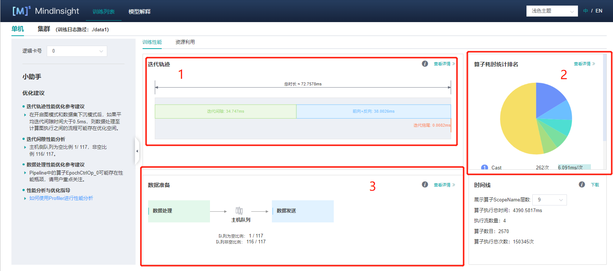

Mindinsihgt性能分析的界面如图所示（此分析是在Ascend环境上进行的，GPU上差不多，CPU暂不支持profiler）。整体上有三大部分。

第一部分是迭代轨迹，这部分是进行性能分析最基本的，单卡的数据包括迭代间隙和前向反向，其中前向反向的时间是模型在device上实际运行的时间，迭代间隙是其他的时间，在训练过程中包括数据处理，打印数据，保存参数等在CPU上的时间。
可以看到迭代间隙和前向反向执行的时间基本一半一半，数据处理等非device操作占了很大的一部分。

第二部分是前反向的网络执行时间，点进第二部分的查看详情：

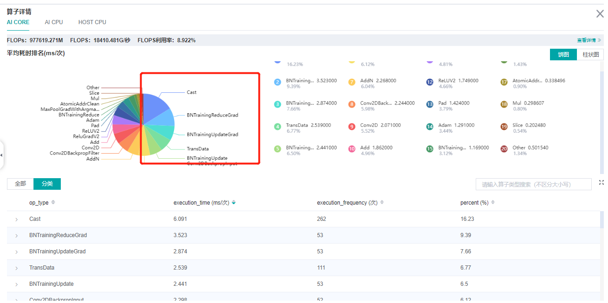

上半部分是各个AICore算子占总时间的比例图，下半部分是每个算子详细的情况：

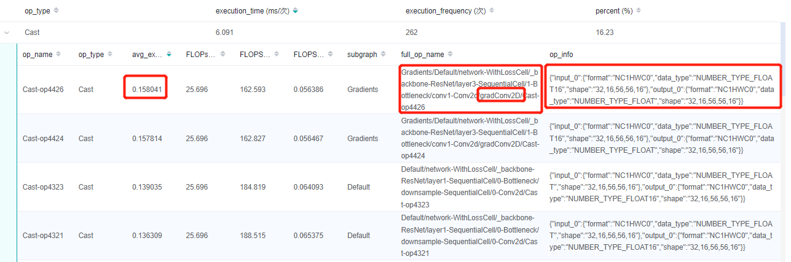

点击进去，可以获取每个算子的执行时间，算子的scope信息，算子的shape和type信息。

除了AICore算子，网络中还可能有AICPU算子和HOST CPU算子，这些算子相比与AICore算子会占用更多的时间，可以通过点击上方的页签查看：


除了这种查看算子性能的方法，还可以查看原始数据进行分析：

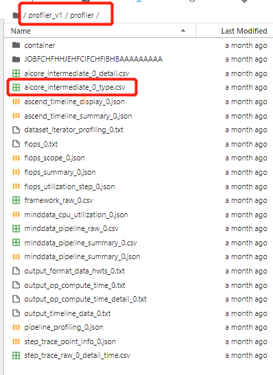

进入`profiler_v1/profiler/`目录，点击查看`aicore_intermediate_0_type.csv`文件可以查看每个算子的统计数据，共30个AICore算子，总执行时间：37.526ms

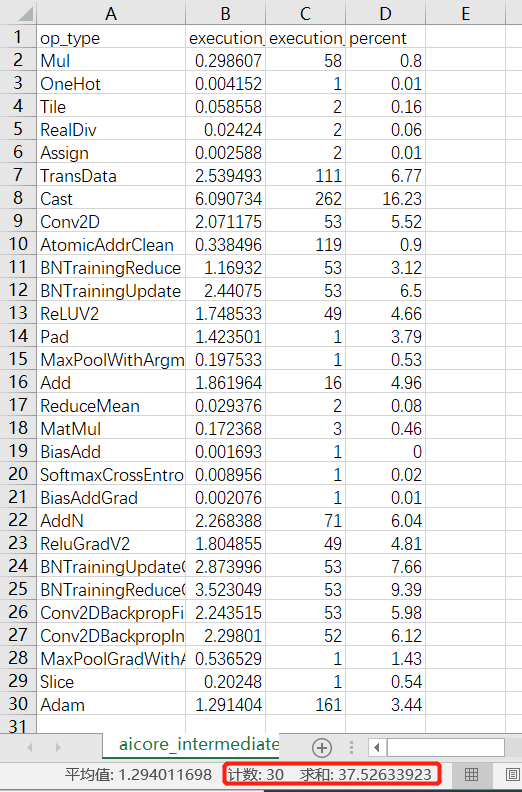

此外，`aicore_intermediate_0_detail.csv`是每个算子的详细数据，和MindInsight里显示的算子详细信息差不多。`ascend_timeline_display_0.json`是timeline数据文件，详情请参考[timeline](https://www.mindspore.cn/mindinsight/docs/zh-CN/master/performance_profiling_ascend.html#timeline%E5%88%86%E6%9E%90)。

第三部分是数据处理的性能数据，在这部分可以查看，数据队列的情况：

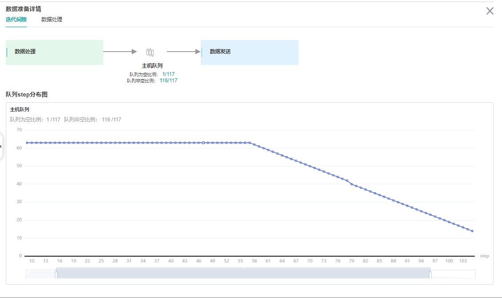

以及每个数据处理操作的队列情况：

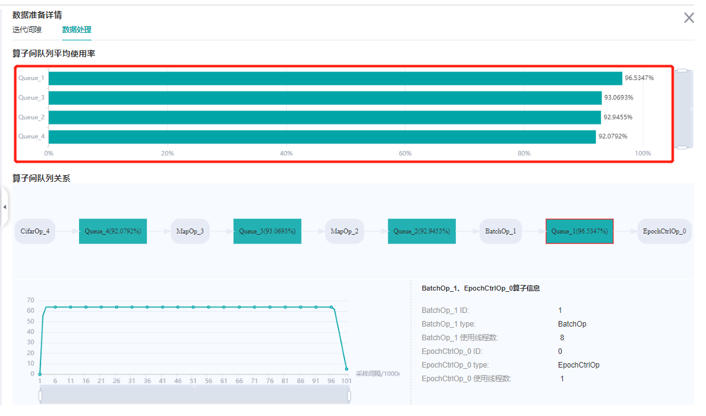

下面我们来对这个过程进行分析以及问题解决方法介绍：

从迭代轨迹来看，迭代间隙和前向反向执行的时间基本一半一半。MindSpore提供了一种[on-device执行](https://www.mindspore.cn/docs/zh-CN/master/design/overview.html#面向昇腾硬件的竞争力优化)的方法将数据处理和网络在device上的执行并行起来，只需要在`model.train`中设置`dataset_sink_mode=True`即可，注意这个配置默认是`True`当打开这个配置时，一个epoch只会返回一个网络的结果，当进行调试时建议先将这个值改成`False`。

下面是设置`dataset_sink_mode=True`的profiler的结果：

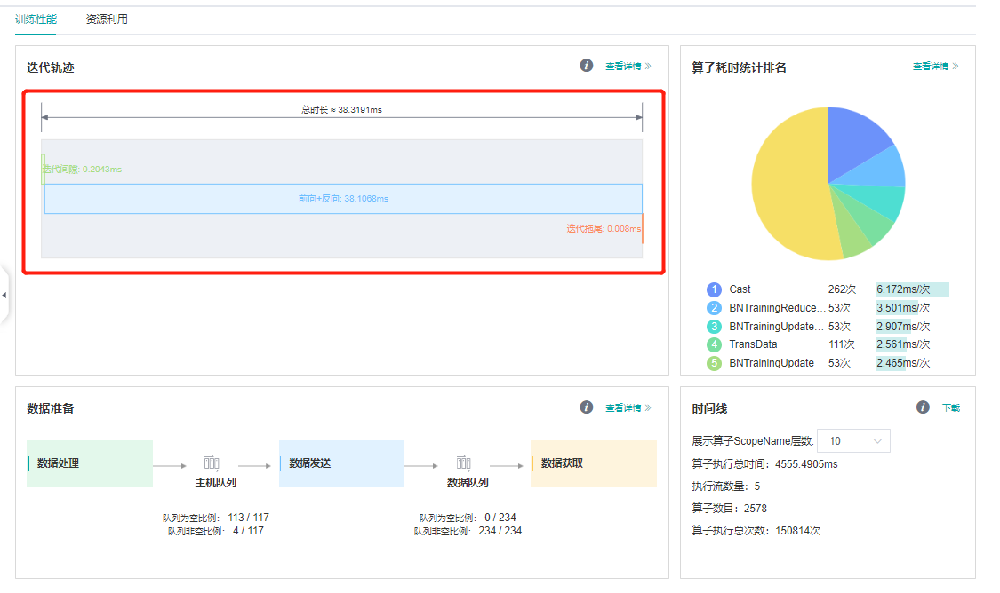

我们发现执行时间节省了一半。

我们接着进行分析和优化。从前反向的算子执行时间来看，`Cast`和`BatchNorm`几乎占了50%，那为什么会有这么多`Cast`呢？之前[MindSpore网络编写容易出现问题的地方](https://www.mindspore.cn/docs/zh-CN/master/migration_guide/model_development/model_development.html)章节有介绍说Ascend环境下Conv，Sort，TopK只能是float16的，所以在Conv计算前后会加`Cast`算子。一个最直接的方法是将网络计算都改成float16的，只会在网络的输入和loss计算前加`Cast`，`Cast`算子的消耗就可以不计了，这就涉及到MindSpore的混合精度策略。

MindSpore有三种方法使用混合精度：

1. 直接使用`Cast`，将网络的输入`cast`成`float16`，将loss的输入`cast`成`float32`；
2. 使用`Cell`的`to_float`方法，详情参考[网络主体及loss搭建](https://www.mindspore.cn/docs/zh-CN/master/migration_guide/model_development/model_and_cell.html)；
3. 使用`Model`的`amp_level`接口进行混合精度，详情参考[自动混合精度](https://www.mindspore.cn/tutorials/zh-CN/master/advanced/mixed_precision.html#%E8%87%AA%E5%8A%A8%E6%B7%B7%E5%90%88%E7%B2%BE%E5%BA%A6)。

这里我们使用第三种方法，将`Model`中的`amp_level`设置成`O3`，看一下profiler的结果：

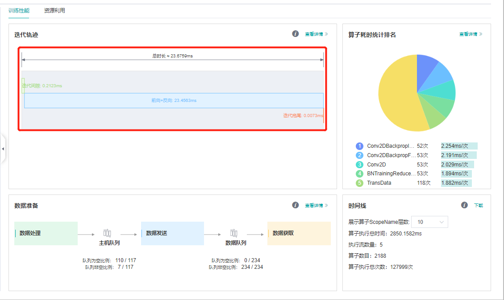

我们发现每step只需要23ms了。

最后看一下数据处理：

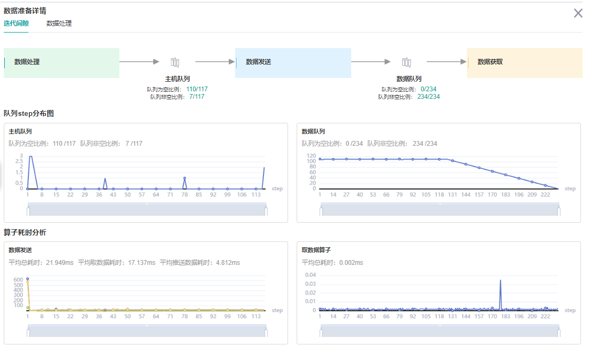

加了下沉之后发现一共有两个队列了，其中主机队列是在内存上的一个队列，数据集对象不断的将网络需要的输入数据放到主机队列里。
然后又有了一个数据队列，这个队列是在device上的，将主机队列里的数据缓存到数据队列里，然后网络直接从这里获取到模型的输入。

可以看到主机队列很多地方是空的，这说明数据集在不断生成数据的同时很快就被数据队列拿走了；数据队列基本是满的，所以数据是完全跟得上网络训练的，数据处理不是网络训练的瓶颈。

如果数据队列有大部分空的情况，则需要考虑数据性能优化了。首先需要参考：

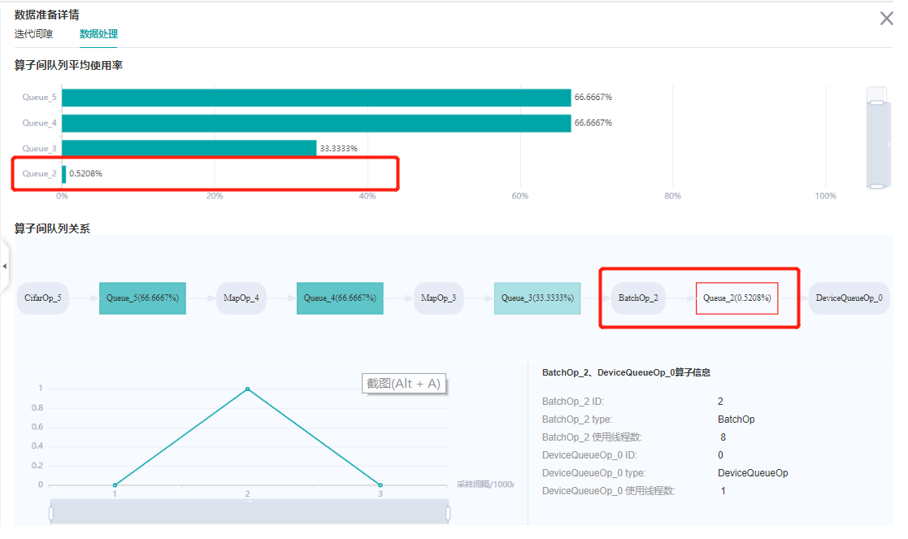

每个数据处理操作的队列，发现最后一个操作，`batch`操作空的时间比较多，可以考虑增加`batch`操作的并行度。详情请参考[数据处理性能优化](https://www.mindspore.cn/tutorials/experts/zh-CN/master/dataset/optimize.html)。

整个resnet迁移需要的代码可以在[code](https://gitee.com/mindspore/docs/tree/master/docs/mindspore/source_zh_cn/migration_guide/code)获取。

欢迎点击下面视频，一起来学习。

<div style="position: relative; padding: 30% 45%;">
<iframe style="position: absolute; width: 100%; height: 100%; left: 0; top: 0;" src="https://player.bilibili.com/player.html?aid=216889508&bvid=BV1sa411P737&cid=802191204&page=1&high_quality=1&&danmaku=1" scrolling="no" border="0" frameborder="no" framespacing="0" allowfullscreen="true"></iframe>
</div>
