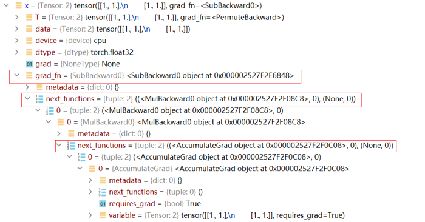

# 基本执行流程横向对比

<a href="https://gitee.com/mindspore/docs/blob/master/docs/mindspore/source_zh_cn/migration_guide/training_process_comparision.md" target="_blank"></a>

## 总体流程

MindSpore 的模型训练和推理的总体执行流程，基本与主流的 AI 框架（如 TensorFlow 和 PyTorch）类似，主要分为以下几个步骤：

1. 构建数据集对象
2. 定义正向网络结构
3. 定义 Loss
4. 定义优化器
5. 迭代数据集对象，执行正向传播，输出 Loss
6. 执行反向传播计算梯度
7. 优化器更新参数

以下是典型的 MindSpore、PyTorch 和 TensorFlow 的训练代码：

- MindSpore

    ```python
    from src.dataset import create_dataset
    from src.lenet import LeNet
    from mindspore import set_context, GRAPH_MODE, Model
    from mindspore.train.callback import ModelCheckpoint, CheckpointConfig, LossMonitor, TimeMonitor
    from mindspore.nn import Accuracy

    # set context, including device type, device number...
    set_context(mode=GRAPH_MODE, device_target=config.device_target)
    # 1. define dataset object
    ds_train = create_dataset(data_path, batch_size)
    # 2. define forward network
    network = LeNet(num_classes)
    # 3. define loss
    net_loss = SoftmaxCrossEntropyWithLogits()
    # 4. define optimizer
    net_opt = Momentum(network.trainable_params(), lr, momentum)
    # define callbacks
    config_ck = CheckpointConfig(save_checkpoint_steps)
    ckpt_cb = ModelCheckpoint(prefix="lenet", config=config_ck)
    loss_cb = LossMonitor()

    # define model
    model = Model(network, net_loss, net_opt, metrics={"Accuracy": Accuracy()})
    # 5-7. start training
    model.train(epoch_size, ds_train, callbacks=[loss_cb, ckpoint_cb ])
    ```

    代码来源： [ModelZoo/LeNet5](https://gitee.com/mindspore/models/blob/master/official/cv/lenet/train.py)

- PyTorch

    ```python
    import torch
    import torchvision
    from model import LeNet
    # 1. define dataset object and DataLoader
    train_set = torchvision.datasets.CIFAR10(root='./data', train=True)
    train_loader = torch.utils.data.DataLoader(train_set, batch_size)
    # 2. define forward network
    net = LeNet()
    # 3. define loss
    net_loss = torch.nn.CrossEntropyLoss()
    # 4. define optimizer
    net_opt = torch.optim.Adam(net.parameters(), lr)
    for epoch in range(n):
        for step, data in enumerate(train_loader, start=0):
            inputs, labels = data
            optimizer.zero_grad()
            # 5. forward propagation and output loss
            outputs = net(inputs)
            loss = net_loss(outputs, labels)
            # 6. backward propagation
            loss.backward()
            # 7. update parameters
            net_opt.step()
            print('Epoch {}, Loss: {}' % (epoch + 1, step + 1, loss,))
    print('Finished Training')
    save_path = './Lenet.pth'
    torch.save(net.state_dict(), path)
    ```

- TensorFlow

    ```python
    import tensorflow as tf
    from model import LeNet
    mnist = tf.keras.datasets.mnist
    (x_train, y_train), (x_test, y_test) = mnist.load_data()
    # 1. define dataset
    train_ds = tf.data.Dataset.from_tensor_slices((x_train, y_train)).batch(32)
    # 2. define forward network
    model = LeNet()
    # 3. define loss
    net_loss = tf.keras.losses.SparseCategoricalCrossentropy()
    # 4. define optimizer
    net_opt = tf.keras.optimizers.Adam()

    @tf.function
    def train_step(images, labels):
        with tf.GradientTape() as tape:
            # 5. forward execution and output loss
            predictions = model(images)
            loss = net_loss(labels, predictions)
        # 6. backward propagation
        gradients = tape.gradient(loss, model.trainable_variables)
        # 7. update parameters
        net_opt.apply_gradients(zip(gradients, model.trainable_variables))
        return loss

    for epoch in range(EPOCHS):
        loss = 0
        for images, labels in train_ds:
            loss = train_step(images, labels)
        print('Epoch {}, Loss: {}'.format(epoch + 1, loss))

    ```

可以看到，MindSpore、PyTorch 和 TensorFlow 在步骤 1-4 的执行流程上几乎一致，API 也很相似，开发者在做网络迁移时可以很容易进行脚本适配。但在步骤 5-7 上，三者却有一定的差异，主要是因为 MindSpore、TensorFlow 和 PyTorch 实现自动微分的逻辑不同。下面我们就对其中的几点差异做详细说明。

## 构建数据集

在构造自定义数据集时，MindSpore 和 PyTorch 有很多相似的 API，构造自定义 Dataset 对象的基本流程如下：

1. 首先创建一个类，在该类中定义  `__init__` 、 `__getitem__` 、 `__len__` 三个方法。

    ```python
    import numpy as np
    class MyDataset():
        """Self Defined dataset."""
        def __init__(self, n):
            self.data = []
            self.label = []
            for _ in range(n):
                data.append(np.zeros((3, 4, 5))
                label.append(np.ones((1))
        def __len__(self):
            return len(self.data)
        def __getitem__(self, idx):
            data = self.data[idx]
            label = self.label[idx]
            return data, label
    ```

    这里的 `__len__` 和  `__getitem__` 在 MindSpore 和 PyTorch 中都具有相同的意义，  `__len__`  表示数据集的总大小，`__getitem__`  通过传入的 idx 获取相应索引的数据。虽然   `MyDataset` 类可以帮助我们在给定索引的情况下获取数据，但实际训练的过程中，我们还需要更加复杂的功能，例如：按照某种自定义顺序索引数据、将不同索引的数据组合成一个 batch、为分布式训练做数据切分等。为了实现这些复杂的功能，MindSpore 提供了一个更高层的 API  `mindspore.dataset.GeneratorDataset` （对应到 PyTorch 上为  `torch.utils.data.DataLoader` ）。

2. 使用 `GeneratorDataset` 封装 `MyDataset`，提供更多数据预处理操作。

    ```python
    my_dataset = MyDataset(100)
    # corresponding to torch.utils.data.DataLoader(my_dataset)
    dataset = mindspore.dataset.GeneratorDataset(my_dataset)
    ```

可以发现，无论是 MindSpore 的 `GeneratorDataset` 还是 PyTorch 的  `DataLoader`，都提供了很多参数，我们将其中常用的参数进行对比：

|GeneratorDataset|DataLoader|参数意义|
|:----|:----|:----|
|source |dataset|数据集对象|
|column_names|/|数据输入每一列的名字|
|column_types |/|数据输入每一列的类型|
|num_samples |/|实际加载的数据数量|
|num_parallel_workers |num_workers|并行处理数据的子进程数量|
|shuffle |/|是否对数据序列进行 shuffle|
|sampler |sampler|定义索引生成函数|
|num_shards |/|数据集的均分数量（分布式运算涉及）|
|shard_id |/|数据集的均分后的序号（分布式运算涉及）|
|/|batch_size|批大小|
|/|batch_sampler|批索引生成函数|
|/|collate_fn|组成批数据的映射函数|
|/|drop_last|是否丢弃无法 batch 的数据|

`column_name`、`column_names` 是 MindSpore 增加的参数项，主要是为更好的描述数据列。`num_samples`  是限制实际读取的数据量，当数据集很大时可以只加载部分数据。

在 PyTorch 中，数据 shffule 和分布式数据分发的操作主要由对应的  `sampler`  实现，MindSpore 沿用了这一设计，但考虑到这两个操作使用频率较高，MindSpore 直接在  `GeneratorDataSet` 类中增加新参数 `shuffle` 和  `num_shards`、`shard_id` 来实现这两个功能。

对于 PyTorch 中额外的四个参数  `batch_size`、`batch_sampler`、`collate_fn` 和  `drop_last`，考虑到它们均与批处理有关，MindSpore 将这四个参数全部移动到了成员函数 `batch` 中，这种设计使得参数分组更加清晰。

需要注意的是，MindSpore 的 GeneratorDataset 和 PyTorch 的 Dataloader 并不是同一个概念。GenerateDataset 加载数据集后生成最基本的数据流，输出为单个样本数据，我们还可以继续使用 MindData 提供的接口进行其他预处理的数据增强操作，例如 map、batch、shuffle、repeat 等。而 Dataloader 通常是数据处理的最终出口，输出 batch size 个样本，然后直接送入网络。

3. 迭代 Dataset

- PyTorch

    ```python
    for step, (data, label) in enumerate(dataloader):
        output = net(data)
        loss = loss_fn(output, label)
    ```

- MindSpore

    ```py
    # method 1: create a tuple iterator
    for columns in dataset.create_dict_iterator():
        # type of columns is dict
        data = columns['data']
        label = columns['label']
        ...

    # method 2: create a dict iterator
    for columns in dataset.create_tuple_iterator():
        # type of columns is tuple
        data = columns[0]
        label = columns[1]
        ...
    ```

MindSpore 和 PyTorch 的数据集迭代过程基本相同，而 MindSpore 可以以  `dict` 和  `tuple` 两种形式输出数据。

需要注意的是，MindSpore 中的  `GeneratorDataset` 类除了用于迭代输出数据，它也为 MindSpore 特有的数据下沉模式做了适配，使得基于 NPU Ascend910 设备训练时，NPU 无需与 Host 交互便可获取训练数据。

## 反向传播

MindSpore 和 PyTorch 都提供了自动微分功能，让我们在定义了正向网络后，可以通过简单的接口调用实现自动反向传播以及梯度更新。但需要注意的是，MindSpore 和 PyTorch 构建反向图的逻辑是不同的，这个差异也会带来 API 设计上的不同。

### 反向传播原理

- PyTorch 的自动微分

  我们知道 PyTorch 是基于计算路径追踪的自动微分，当我们定义一个网络结构后， 并不会建立反向图，而是在执行正向图的过程中，`Variable` 或  `Parameter` 记录每一个正向计算对应的反向函数，并生成一个动态计算图，用于后续的梯度计算。当在最终的输出处调用  `backward` 时，就会从根节点到叶节点应用链式法则计算梯度。PyTorch 的动态计算图所存储的节点实际是 Function 函数对象，每当对 Tensor 执行一步运算后，就会产生一个 Function 对象，它记录了反向传播中必要的信息。反向传播过程中，autograd 引擎会按照逆序，通过 Function 的 backward 依次计算梯度。 这一点我们可以通过 Tensor 的隐藏属性查看。

    例如，运行以下代码：

    ```python
    import torch
    from torch.autograd import Variable
    x = Variable(torch.ones(2, 2), requires_grad=True)
    x = x * 2
    x = x - 1
    x.backward(x)
    ```

    此时我们查看 x 的属性，可以发现它已记录了整个反向传播过程所需要的信息：

    

    上图中的  `grad_fn`  记录了 x 反向传播所需要的函数，而由于 x 是经过多次正向计算得到的，因此  `grad_fn`  不只记录了一条反向函数。

- MindSpore 的自动微分

  在图模式下，MindSpore 的自动微分是基于图结构的微分，和 PyTorch 不同，它不会在正向计算过程中记录任何信息，仅仅执行正常的计算流程（在PyNative模式下和 PyTorch 类似）。那么问题来了，如果整个正向计算都结束了，MindSpore 也没有记录任何信息，那它是如何知道反向传播怎么执行的呢？

  MindSpore 在做自动微分时，需要传入正向图结构，自动微分的过程就是通过对正向图的分析从而得到反向传播信息，自动微分的结果与正向计算中具体的数值无关，仅和正向图结构有关。通过对正向图的自动微分，我们得到了反向传播过程，而这个反向传播过程其实也是通过一个图结构来表达，也就是反向图。将反向图添加到用户定义的正向图之后，组成一个最终的计算图。不过后添加的反向图和其中的反向算子我们并不感知，也无法手动添加，只能通过 MindSpore 为我们提供的接口自动添加，这样做也避免了我们在反向构图时引入错误。

    最终，我们看似仅执行了正向图，其实图结构里既包含了正向算子，又包含了 MindSpore 为我们添加的反向算子，也就是说，MindSpore 在我们定义的正向图后面又新加了一个看不见的  `Cell`，这个  `Cell` 里都是根据正向图推导出来的反向算子。

    而这个帮助我们构建反向图的接口就是 [GradOperation](https://www.mindspore.cn/docs/zh-CN/master/api_python/ops/mindspore.ops.GradOperation.html#mindspore.ops.GradOperation) ：

    ```python
    class GradNetWrtX(nn.Cell):
        def __init__(self, net):
            super(GradNetWrtX, self).__init__()
            self.net = net
            self.grad_op = GradOperation()
        def construct(self, x, y):
            gradient_function = self.grad_op(self.net)
            return gradient_function(x, y)
    ```

查看文档介绍我们可以发现，`GradOperation` 并不是一个算子，它的输入输出并不是 Tensor，而是 `Cell`，也就是我们定义的正向图和自动微分得到的反向图。为什么输入是一个图结构呢？因为构建反向图并不需要知道具体的输入数据是什么，只要知道正向图的结构就行了，有了正向图就可以推算出反向图结构，之后我们可以把正向图+反向图当成一个新的计算图来对待，这个新的计算图就像是一个函数，对于你输入的任何一组数据，它不仅能计算出正向的输出，还能计算出所有权重的梯度，由于图结构是固定的，并不保存中间变量，所以这个图结构可以被反复调用。

同理，之后我们再给网络加上优化器结构时，优化器也会加上优化器相关的算子，也就是再给这个计算图加点我们不感知的优化器算子，最终，计算图就构建完成。

在 MindSpore 中，大部分操作都会最终转换成真实的算子操作，最终加入到计算图中，因此，我们实际执行的计算图中算子的数量远多于我们最开始定义的计算图中算子的数量。

### TrainOneStepCell

当我们定义的网络结构比较简单，只需要基本的反向传播流程，且无需对梯度做额外操作时，直接使用 MindSpore 封装的高级接口  `mindspore.Model`  即可，代码如下：

```python
# define forward network
network = LeNet(num_classes)
# define loss
net_loss = SoftmaxCrossEntropyWithLogits()
# define optimizer
net_opt = Momentum(network.trainable_params(), lr, momentum)

# define model
model = Model(network, net_loss, net_opt)
```

使用  `Model` 封装后，网络会自动添加反向、优化器相关算子。但有时网络结构复杂，有多个输入输出，或者在求梯度后，还需要对梯度进行额外的操作（例如梯度裁剪、使用 Loss Scale 等），此时我们需要自行掌控反向流程，为此，MindSpore 提供了  `nn.TrainOneStepCell` 模板，`nn.TrainOneStepCell`  的功能是添加反向算子和优化器算子，当需要自定义反向结构时，我们可以基于该模板重写反向流程（Model 实际也是调用  `TrainOneStepCell` 完成自动微分）。

 `nn.TrainOneStepCell` 继承了 `nn.Cell`，所以它构建反向网络结构的逻辑和我们构建正向网络的保持一致。这里我们对 `nn.TrainOneStepCell` 的源码进行分析：

```python
class TrainOneStepCell(Cell):
    r"""
    Network training package class.

    Wraps the network with an optimizer. The resulting Cell is trained with input '\*inputs'.
    The backward graph will be created in the construct function to update the parameter. Different
    parallel modes are available for training.

    Args:
        network (Cell): The training network. The network only supports single output.
        optimizer (Union[Cell]): Optimizer for updating the weights.
        sens (numbers.Number): The scaling number to be filled as the input of backpropagation. Default value is 1.0.

    Inputs:
        - **(\*inputs)** (Tuple(Tensor)) - Tuple of input tensors with shape :math:`(N, \ldots)`.

    Outputs:
        Tensor, a tensor means the loss value, the shape of which is usually :math:`()`.

    Raises:
        TypeError: If `sens` is not a number.

    Supported Platforms:
        ``Ascend`` ``GPU`` ``CPU``

    Examples:
        >>> net = Net()
        >>> loss_fn = nn.SoftmaxCrossEntropyWithLogits()
        >>> optim = nn.Momentum(net.trainable_params(), learning_rate=0.1, momentum=0.9)
        >>> #1) Using the WithLossCell existing provide
        >>> loss_net = nn.WithLossCell(net, loss_fn)
        >>> train_net = nn.TrainOneStepCell(loss_net, optim)
        >>>
        >>> #2) Using user-defined WithLossCell
        >>> class MyWithLossCell(Cell):
        ...    def __init__(self, backbone, loss_fn):
        ...        super(MyWithLossCell, self).__init__(auto_prefix=False)
        ...        self._backbone = backbone
        ...        self._loss_fn = loss_fn
        ...
        ...    def construct(self, x, y, label):
        ...        out = self._backbone(x, y)
        ...        return self._loss_fn(out, label)
        ...
        ...    @property
        ...    def backbone_network(self):
        ...        return self._backbone
        ...
        >>> loss_net = MyWithLossCell(net, loss_fn)
        >>> train_net = nn.TrainOneStepCell(loss_net, optim)
    """

    def __init__(self, network, optimizer, sens=1.0):
        super(TrainOneStepCell, self).__init__(auto_prefix=False)
        self.network = network
        # set require_grad=True for Parameters in network
        self.network.set_grad()
        self.optimizer = optimizer
        self.weights = self.optimizer.parameters
        self.grad = C.GradOperation(get_by_list=True, sens_param=True)
        # set init value for back propagation
        self.sens = sens
        # reduce_flag, used in distributed training
        self.reducer_flag = False
        self.grad_reducer = F.identity
        self.parallel_mode = _get_parallel_mode()
        self.reducer_flag = self.parallel_mode in (ParallelMode.DATA_PARALLEL, ParallelMode.HYBRID_PARALLEL)
        if self.reducer_flag:
            self.mean = _get_gradients_mean()
            # number of devices
            self.degree = _get_device_num()
            self.grad_reducer = DistributedGradReducer(self.weights, self.mean, self.degree)

    def construct(self, *inputs):
        # get the loss of forward
        loss = self.network(*inputs)
        # set init value for backward propagation
        sens = F.fill(loss.dtype, loss.shape, self.sens)
        # perform backward propagation
        grads = self.grad(self.network, self.weights)(*inputs, sens)
        grads = self.grad_reducer(grads)
        loss = F.depend(loss, self.optimizer(grads))
        return loss
```

如果理解了刚才介绍的 MindSpore 反向传播原理，就会很容易理解  `TrainOneStepCell` 的每一步在做什么，其实就是一个基于计算图求导的过程。

这里需要特别解释最后几个语句：

- `sens` 表示初始梯度，类似 PyTorch 中 `loss.backward(sens)` 的作用，为反向传播过程设置一个初始梯度。
- `DistributedGradReducer` 是负责一个分布式梯度计算的  `Cell` （相当于又是一个计算图），在多卡训练时，它会将所有卡的梯度先求和，然后除以卡的数量（ `self.degree` ），最终得到全局平均的梯度。

```py
...
grads = self.grad(self.network, self.weights)(*inputs, sens)
grads = self.grad_reducer(grads)
loss = F.depend(loss, self.optimizer(grads))
...
```

除了 `TrainOneStepCell`，对于混合精度场景，MindSpore 还提供了带有 [Loss Scale](https://www.mindspore.cn/tutorials/experts/zh-CN/master/others/mixed_precision.html#lossscale与优化器) 的 `TrainOneStepWithLossScale`，原理其实是一样的，感兴趣的读者可以阅读混合精度的原理以及查看该方法的实现。

当我们使用  `TrainOneStepCell` 添加反向网络结构后，仍可以使用 `Model` 类进行封装，但此时不需要再给 `Model` 传入 loss、优化器这两个参数了，因为传入的网络已经包含了正向+反向结构。最后，通过调用  `model.train()` ，开始正常的训练流程。

参考链接： [TrainOneStepCell](https://gitee.com/mindspore/mindspore/blob/master/mindspore/python/mindspore/nn/wrap/cell_wrapper.py) 、 [TrainOneStepWithLossScale](https://gitee.com/mindspore/mindspore/blob/master/mindspore/python/mindspore/nn/wrap/loss_scale.py)
