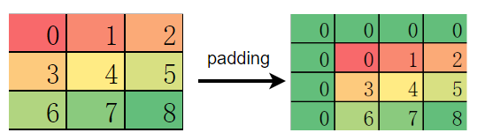
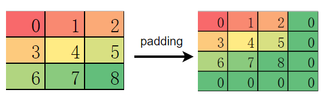

# 与PyTorch典型区别

## 与PyTorch典型接口区别

### torch.device

PyTorch 在构建模型时，通常会利用 torch.device 指定模型和数据绑定的设备，是在 CPU 还是 GPU 上，如果支持多 GPU，还可以指定具体的 GPU 序号。绑定相应的设备后，需要将模型和数据部署到对应设备，代码如下：

```python
import os
import torch
from torch import nn

# bind to the GPU 0 if GPU is available, otherwise bind to CPU
device = torch.device("cuda:0" if torch.cuda.is_available() else "cpu") # 单 GPU 或者 CPU
# deploy model to specified hardware
model.to(device)
# deploy data to specified hardware
data.to(device)

# distribute training on multiple GPUs
if torch.cuda.device_count() > 1:
 model = nn.DataParallel(model, device_ids=[0,1,2])
model.to(device)

# set available device
os.environ['CUDA_VISIBLE_DEVICE']='1'
model.cuda()
```

而在 MindSpore 中，我们通过 context 中 的 device_target 参数 指定模型绑定的设备，device_id 指定设备的序号。与 PyTorch 不同的是，一旦设备设置成功，输入数据和模型会默认拷贝到指定的设备中执行，不需要也无法再改变数据和模型所运行的设备类型。代码如下：

```python
import mindspore as ms
ms.set_context(device_target='Ascend', device_id=0)

# define net
Model = ..
# define dataset
dataset = ..
# training, automatically deploy to Ascend according to device_target
Model.train(1, dataset)
```

此外，网络运行后返回的 `Tensor` 默认均拷贝到 CPU 设备，可以直接对该 `Tensor` 进行访问和修改，包括转成 `numpy` 格式，无需像 PyTorch 一样需要先执行 `tensor.cpu` 再转换成 numpy 格式。

### nn.Module

使用 PyTorch 构建网络结构时，我们会用到`nn.Module` 类，通常将网络中的元素定义在`__init__` 函数中并对其初始化，将网络的图结构表达定义在`forward` 函数中，通过调用这些类的对象完成整个模型的构建和训练。`nn.Module` 不仅为我们提供了构建图接口，它还为我们提供了一些常用的 [API](https://pytorch.org/docs/stable/generated/torch.nn.Module.html) ，来帮助我们执行更复杂逻辑。

MindSpore 中的 `nn.Cell` 类发挥着和 PyTorch 中 `nn.Module` 相同的作用，都是用来构建图结构的模块，MindSpore 也同样提供了丰富的 [API](https://www.mindspore.cn/docs/zh-CN/master/api_python/nn/mindspore.nn.Cell.html) 供开发者使用，虽然名字不能一一对应，但 `nn.Module` 中常用的功能都可以在`nn.Cell` 中找到映射。

以几个常用方法为例:

|常用方法| nn.Module|nn.Cell|
|:----|:----|:----|
|获取子元素|named_children|cells_and_names|
|添加子元素|add_module|insert_child_to_cell|
|获取元素的参数|parameters|get_parameters|

### 数据对象

在 PyTorch 中，可以存储数据的对象总共有四种，分别时`Tensor`、`Variable`、`Parameter`、`Buffer`。这四种对象的默认行为均不相同，当我们不需要求梯度时，通常使用 `Tensor`和 `Buffer`两类数据对象，当我们需要求梯度时，通常使用 `Variable` 和 `Parameter` 两类对象。PyTorch 在设计这四种数据对象时，功能上存在冗余（`Variable` 后续会被废弃也说明了这一点）。

MindSpore 优化了数据对象的设计逻辑，仅保留了两种数据对象：`Tensor` 和 `Parameter`，其中 `Tensor` 对象仅参与运算，并不需要对其进行梯度求导和参数更新，而 `Parameter` 数据对象和 PyTorch 的 `Parameter` 意义相同，会根据其属性`requires_grad` 来决定是否对其进行梯度求导和 参数更新。 在网络迁移时，只要是在 PyTorch 中未进行参数更新的数据对象，均可在 MindSpore 中声明为 `Tensor`。

### 梯度求导

梯度求导涉及的算子和接口差异主要是由 MindSpore 和 PyTorch 自动微分原理不同引起的。

### torch.no_grad

在 PyTorch 中，默认情况下，执行正向计算时会记录反向传播所需的信息，在推理阶段或无需反向传播网络中，这一操作是冗余的，会额外耗时，因此，PyTorch 提供了`torch.no_grad` 来取消该过程。

而 MindSpore 只有在调用`GradOperation`才会根据正向图结构来构建反向图，正向执行时不会记录任何信息，所以 MindSpore 并不需要该接口，也可以理解为 MindSpore 的正向计算均在`torch.no_grad` 情况下进行的。

### retain_graph

由于 PyTorch 是基于函数式的自动微分，所以默认每次执行完反向传播后都会自动清除记录的信息，从而进行下一次迭代。这就会导致当我们想再次利用这些反向图和梯度信息时，由于已被删除而获取失败。因此，PyTorch 提供了`backward(retain_graph=True)` 来主动保留这些信息。

而 MindSpore 则不需要这个功能，MindSpore 是基于计算图的自动微分，反向图信息在调用`GradOperation`后便永久的记录在计算图中，只要再次调用计算图就可以获取梯度信息。

### 高阶导数

基于计算图的自动微分还有一个好处，我们可以很方便的实现高阶求导。第一次对正向图执行`GradOperation` 操作后，我们可以得到一阶导，此时计算图被更新为正向图+一阶导的反向图结构，但我们再次对更新后的计算图执行 `GradOperation`后，我们就可以得到二阶导，以此类推，通过基于计算图的自动微分，我们很容易求得一个网络的高阶导数。

## 与PyTorch典型算子区别

MindSpore 的大部分算子 API 和 TensorFlow 相近，但也有一部分算子的默认行为与 PyTorch 或 TensorFlow 存在差异。开发者在做网络脚本迁移时，如果未注意到这些差异，直接使用默认行为，很容易出现与原迁移网络不一致的情况，影响网络训练，我们建议开发者在迁移网络时不仅对齐使用的算子，也要对齐算子的属性。这里我们总结了几个常见的差异算子。

### nn.Dropout

Dropout 常用于防止训练过拟合，有一个重要的 **概率值** 参数，该参数在 MindSpore 中的意义与 PyTorch 和 TensorFlow 中的意义完全相反。

在 MindSpore 中，概率值对应 Dropout 算子的属性 `keep_prob`，是指输入被保留的概率，`1-keep_prob`是指输入被置 0 的概率。

在 PyTorch 和 TensorFlow 中，概率值分别对应 Dropout 算子的属性 `p`和 `rate`，是指输入被置 0 的概率，与 MindSpore.nn.Dropout 中的 `keep_prob` 意义相反。

更多信息请参考链接： [MindSpore Dropout](https://www.mindspore.cn/docs/zh-CN/master/api_python/nn/mindspore.nn.Dropout.html#mindspore.nn.Dropout) 、 [PyTorch Dropout](https://pytorch.org/docs/stable/generated/torch.nn.Dropout.html) 、 [TensorFlow Dropout](https://www.tensorflow.org/api_docs/python/tf/nn/dropout)

### nn.BatchNorm2d

BatchNorm 是 CV 领域比较特殊的正则化方法，它在训练和推理的过程中有着不同计算流程，通常由算子属性控制。MindSpore 和 PyTorch 的 BatchNorm 在这一点上使用了两种不同的参数组。

- 差异一

    `torch.nn.BatchNorm2d` 在不同参数下的状态

    |training|track_running_stats|状态|
    |:----|:----|:--------------------------------------|
    |True|True|期望中训练的状态，running_mean 和 running_var 会跟踪整个训练过程中 batch 的统计特性，而每组输入数据用当前 batch 的 mean 和 var 统计特性做归一化，然后再更新 running_mean 和 running_var。|
    |True|False|每组输入数据会根据当前 batch 的统计特性做归一化，但不会有 running_mean 和 running_var 参数了。|
    |False|True|期望中推理的状态，BN 使用 running_mean 和 running_var 做归一化，并且不会对其进行更新。|
    |False|False|效果同第二点，只不过处于推理状态，不会学习 weight 和 bias 两个参数。一般不采用该状态。|

    `mindspore.nn.BatchNorm2d` 在不同参数下的状态

    |use_batch_statistics|状态|
    |:----|:--------------------------------------|
    |True|期望中训练的状态，moving_mean 和 moving_var 会跟踪整个训练过程中 batch 的统计特性，而每组输入数据用当前 batch 的 mean 和 var 统计特性做归一化，然后再更新 moving_mean 和 moving_var。
    |Fasle|期望中推理的状态，BN 使用 moving_mean 和 moving_var 做归一化，并且不会对其进行更新。
    |None|自动设置 use_batch_statistics。如果是训练，use_batch_statistics=True，如果是推理，use_batch_statistics=False。

    通过比较可以发现，`mindspore.nn.BatchNorm2d`  相比 `torch.nn.BatchNorm2d`，少了两种冗余的状态，仅保留了最常用的训练和推理两种状态。

- 差异二

    BatchNorm系列算子 的 momentum 参数在 MindSpore 和 PyTorch 表示的意义相反，关系为：

    $momentum_{pytorch} = 1 - momentum_{mindspore}$

    参考链接：[mindspore.nn.BatchNorm2d](https://www.mindspore.cn/docs/zh-CN/master/api_python/nn/mindspore.nn.BatchNorm2d.html)，[torch.nn.BatchNorm2d](https://pytorch.org/docs/stable/generated/torch.nn.BatchNorm2d.html)

### ops.Transpose

在做轴变换时，PyTorch 常用到两种算子`Tensor.permute` 和 `torch.transpose`，而 MindSpore 和 TensorFlow 仅提供了 `transpose` 算子。需要注意的是，`Tensor.permute` 包含了 `torch.transpose` 的功能，`torch.transpose` 仅支持同时交换两个轴，而 `Tensor.permute` 可以同时变换多个轴。

```python
# PyTorch 代码
import numpy as np
import torch
from torch import Tensor
data = np.empty((1, 2, 3, 4)).astype(np.float32)
ret1 = torch.transpose(Tensor(data), dim0=0, dim1=3)
print(ret1.shape)
ret2 = Tensor(data).permute((3, 2, 1, 0))
print(ret2.shape)

# (4, 2, 3, 1)
# (4, 3, 2, 1)
```

MindSpore 和 TensorFlow 的  `transpose`算子功能相同， 虽然名字叫 `transpose`，但实际可以做多个轴的同时变换，等价于 `Tensor.permute`。因此，MindSpore 也不再单独提供类似 `torch.tranpose` 的算子。

```python
# mindspore 代码
import mindspore as ms
import numpy as np
from mindspore import ops
ms.set_context(device_target="CPU")
data = np.empty((1, 2, 3, 4)).astype(np.float32)
ret = ops.Transpose()(ms.Tensor(data), (3, 2, 1, 0))
print(ret.shape)

# (4, 3, 2, 1)
```

更多信息请参考链接：[MindSpore Transpose](https://www.mindspore.cn/docs/en/master/api_python/ops/mindspore.ops.Transpose.html#mindspore.ops.Transpose) 、 [PyTorch Transpose](https://pytorch.org/docs/stable/generated/torch.transpose.html) 、[PyTorch Permute](https://pytorch.org/docs/stable/generated/torch.Tensor.permute.html) 、 [TensforFlow Transpose](https://www.tensorflow.org/api_docs/python/tf/transpose)

### Conv 和 Pooling

对于类似卷积和池化的算子，我们知道算子的输出特征图大小依赖输入特征图、步长、kernel_size 和 padding 等变量。

如果 `pad_mode` 设置为  `valid`，则输出特征图高和宽的计算公式分别为


如果 pad_mode（对应 PyTorch 中的属性为 padding，与属性 pad_mode 含义并不相同） 设置为  `same` 时，有时需要对输入特征图进行自动的 padding 操作，当padding 的元素为偶数时，padding 的元素会均匀分布在特征图的上下左右，此时 MindSpore、PyTorch 和 TensorFlow 中该类算子行为一致。

但当 padding 的元素为奇数时，PyTorch 会优先填充在输入特征图的左侧和上侧：



而 MindSpore 和 TensorFlow 则优先填充在特征图的右侧和下侧：



举例说明：

```python
# mindspore example
import numpy as np
import mindspore as ms
from mindspore import ops
ms.set_context(device_target="CPU")
data = np.arange(9).reshape(1, 1, 3, 3).astype(np.float32)
print(data)
op = ops.MaxPool(kernel_size=2, strides=2, pad_mode='same')
print(op(ms.Tensor(data)))

# [[[[0. 1. 2.]
#    [3. 4. 5.]
#    [6. 7. 8.]]]]
# [[[[4. 5.]
#    [7. 8.]]]]
```

在做 MindSpore 模型迁移时，如果模型加载了 PyTorch 的预训练模型，而之后又在 MindSpore 进行 finetune，则该差异可能会导致精度下降，对于 padding 策略为 same 的卷积，开发者需要特别注意。

如果想和 PyTorch 行为保持一致，可以先使用   `ops.Pad` 算子手动 pad 元素，然后使用  `pad_mode=\"valid\"` 的卷积和池化操作。

```python
import numpy as np
import mindspore as ms
from mindspore import ops
ms.set_context(device_target="CPU")
data = np.arange(9).reshape(1, 1, 3, 3).astype(np.float32)
# only padding on top left of feature map
pad = ops.Pad(((0, 0), (0, 0), (1, 0), (1, 0)))
data = pad(ms.Tensor(data))
res = ops.MaxPool(kernel_size=2, strides=2, pad_mode='same')(data)
print(res)

# [[[[0. 2.]
#    [6. 8.]]]]
```

### 默认权重初始化不同

我们知道权重初始化对网络的训练十分重要。每个算子一般会有一个隐式的声明权重，在不同的框架中，隐式的声明权重可能不同。即使算子功能一致，隐式声明的权重初始化方式分布如果不同，也会对训练过程产生影响，甚至无法收敛。

常见隐式声明权重的算子：Conv、Dense(Linear)、Embedding、LSTM 等，其中区别较大的是 Conv 类和 Dense 两种算子。

- Conv2d

    - mindspore.nn.Conv2d的weight为：$\\mathcal{N}(0, 1)$，bias为：zeros。
    - torch.nn.Conv2d的weight为：$\\mathcal{U} (-\\sqrt{k},\\sqrt{k} )$，bias为：$\\mathcal{U} (-\\sqrt{k},\\sqrt{k} )$。
    - tf.keras.Layers.Conv2D的weight为：glorot_uniform，bias为：zeros。

    其中，$k=\\frac{groups}{c_{in}*\\prod_{i}^{}{kernel\\_size[i]}}$

- Dense(Linear)

    - mindspore.nn.Linear的weight为：$\\mathcal{N}(0, 1)$，bias为：zeros。
    - torch.nn.Dense的weight为：$\\mathcal{U}(-\\sqrt{k},\\sqrt{k})$，bias为：$\\mathcal{U}(-\\sqrt{k},\\sqrt{k} )$。
    - tf.keras.Layers.Dense的weight为：glorot_uniform，bias为：zeros。

    其中，$k=\\frac{groups}{in\\_features}$

对于没有正则化的网络，如没有 BatchNorm 算子的 GAN 网络，梯度很容易爆炸或者消失，权重初始化就显得十分重要，各位开发者应注意权重初始化带来的影响。

## 与PyTorch执行流程区别

### 自动微分

MindSpore 和 PyTorch 都提供了自动微分功能，让我们在定义了正向网络后，可以通过简单的接口调用实现自动反向传播以及梯度更新。但需要注意的是，MindSpore 和 PyTorch 构建反向图的逻辑是不同的，这个差异也会带来 API 设计上的不同。

#### PyTorch 的自动微分

我们知道 PyTorch 是基于计算路径追踪的自动微分，当我们定义一个网络结构后， 并不会建立反向图，而是在执行正向图的过程中，`Variable` 或 `Parameter` 记录每一个正向计算对应的反向函数，并生成一个动态计算图，用于后续的梯度计算。当在最终的输出处调用 `backward` 时，就会从根节点到叶节点应用链式法则计算梯度。PyTorch 的动态计算图所存储的节点实际是 `Function` 函数对象，每当对 `Tensor` 执行一步运算后，就会产生一个 `Function` 对象，它记录了反向传播中必要的信息。反向传播过程中，`autograd` 引擎会按照逆序，通过 `Function` 的 `backward` 依次计算梯度。 这一点我们可以通过 `Tensor` 的隐藏属性查看。

例如，运行以下代码：

```python
import torch
from torch.autograd import Variable
x = Variable(torch.ones(2, 2), requires_grad=True)
x = x * 2
y = x - 1
y.backward(x)
```

会自动获取`x`的定义到获取输出`y`这个过程对x的梯度结果。

需要注意的是PyTorch的backward是累计的，更新完之后需要清空optimizer。

#### MindSpore的自动微分

在图模式下，MindSpore 的自动微分是基于图结构的微分，和 PyTorch 不同，它不会在正向计算过程中记录任何信息，仅仅执行正常的计算流程（在PyNative模式下和 PyTorch 类似）。那么问题来了，如果整个正向计算都结束了，MindSpore 也没有记录任何信息，那它是如何知道反向传播怎么执行的呢？

MindSpore 在做自动微分时，需要传入正向图结构，自动微分的过程就是通过对正向图的分析从而得到反向传播信息，自动微分的结果与正向计算中具体的数值无关，仅和正向图结构有关。通过对正向图的自动微分，我们得到了反向传播过程，而这个反向传播过程其实也是通过一个图结构来表达，也就是反向图。将反向图添加到用户定义的正向图之后，组成一个最终的计算图。不过后添加的反向图和其中的反向算子我们并不感知，也无法手动添加，只能通过 MindSpore 为我们提供的接口自动添加，这样做也避免了我们在反向构图时引入错误。

最终，我们看似仅执行了正向图，其实图结构里既包含了正向算子，又包含了 MindSpore 为我们添加的反向算子，也就是说，MindSpore 在我们定义的正向图后面又新加了一个看不见的  `Cell`，这个  `Cell` 里都是根据正向图推导出来的反向算子。

而这个帮助我们构建反向图的接口就是 [GradOperation](https://www.mindspore.cn/docs/zh-CN/master/api_python/ops/mindspore.ops.GradOperation.html) ：

```python
from mindspore import nn, ops

class GradNetWrtX(nn.Cell):
    def __init__(self, net):
        super(GradNetWrtX, self).__init__()
        self.net = net
        self.grad_op = ops.GradOperation()
    def construct(self, x, y):
        gradient_function = self.grad_op(self.net)
        return gradient_function(x, y)
```

查看文档介绍我们可以发现，GradOperation 并不是一个算子，它的输入输出并不是 Tensor，而是 Cell，也就是我们定义的正向图和自动微分得到的反向图。为什么输入是一个图结构呢？因为构建反向图并不需要知道具体的输入数据是什么，只要知道正向图的结构就行了，有了正向图就可以推算出反向图结构，之后我们可以把正向图+反向图当成一个新的计算图来对待，这个新的计算图就像是一个函数，对于你输入的任何一组数据，它不仅能计算出正向的输出，还能计算出所有权重的梯度，由于图结构是固定的，并不保存中间变量，所以这个图结构可以被反复调用。

同理，之后我们再给网络加上优化器结构时，优化器也会加上优化器相关的算子，也就是再给这个计算图加点我们不感知的优化器算子，最终，计算图就构建完成。

在 MindSpore 中，大部分操作都会最终转换成真实的算子操作，最终加入到计算图中，因此，我们实际执行的计算图中算子的数量远多于我们最开始定义的计算图中算子的数量。

在MindSpore中，提供了[TrainOneStepCell](https://www.mindspore.cn/docs/zh-CN/master/api_python/nn/mindspore.nn.TrainOneStepCell.html)和[TrainOneStepWithLossScaleCell](https://www.mindspore.cn/docs/zh-CN/master/api_python/nn/mindspore.nn.TrainOneStepWithLossScaleCell.html)这两个接口来包装整个训练流程，如果在常规的训练流程外有其他的操作，如梯度裁剪、规约、中间变量返回等，需要自定义训练的Cell，详情请参考[训练及推理流程](training_and_evaluation_procession.md)。

### 学习率更新

#### PyTorch的学习率更新策略

PyTorch提供了`torch.optim.lr_scheduler`包用于动态修改lr，使用的时候需要显式地调用`optimizer.step()`和`scheduler.step()`来更新lr，详情请参考[如何调整学习率](https://pytorch.org/docs/1.12/optim.html#how-to-adjust-learning-rate)。

#### MindSpore的学习率更新策略

MindSpore的学习率是包到优化器里面的，每调用一次优化器，学习率更新的step会自动更新一次，详情请参考[学习率与优化器](model_development/learning_rate_and_optimizer.md)。

### 分布式场景

#### PyTorch的分布式设置

一般分布式场景是数据并行就行，详情请参考[DDP](https://pytorch.org/docs/1.12/notes/ddp.html)，下面是PyTorch的一个例子：

```python
import os
import torch
import torch.distributed as dist
import torch.multiprocessing as mp
import torch.nn as nn
import torch.optim as optim
from torch.nn.parallel import DistributedDataParallel as DDP


def example(rank, world_size):
    # create default process group
    dist.init_process_group("gloo", rank=rank, world_size=world_size)
    # create local model
    model = nn.Linear(10, 10).to(rank)
    # construct DDP model
    ddp_model = DDP(model, device_ids=[rank])
    # define loss function and optimizer
    loss_fn = nn.MSELoss()
    optimizer = optim.SGD(ddp_model.parameters(), lr=0.001)

    # forward pass
    outputs = ddp_model(torch.randn(20, 10).to(rank))
    labels = torch.randn(20, 10).to(rank)
    # backward pass
    loss_fn(outputs, labels).backward()
    # update parameters
    optimizer.step()

def main():
    world_size = 2
    mp.spawn(example,
        args=(world_size,),
        nprocs=world_size,
        join=True)

if __name__=="__main__":
    # Environment variables which need to be
    # set when using c10d's default "env"
    # initialization mode.
    os.environ["MASTER_ADDR"] = "localhost"
    os.environ["MASTER_PORT"] = "29500"
    main()
```

#### MindSpore的分布式设置

MindSpore的分布式配置是使用运行时配置项的，详情请参考[分布式并行](https://www.mindspore.cn/tutorials/experts/zh-CN/master/parallel/introduction.html)，如：

```python
import mindspore as ms
from mindspore.communication.management import init, get_rank, get_group_size

# 初始化多卡环境
init()

# 获取组成分布式场景的卡数和当前进程的逻辑id
group_size = get_group_size()
rank_id = get_rank()

# 配置数据并行模式运行分布式场景
ms.set_auto_parallel_context(parallel_mode=ms.ParallelMode.DATA_PARALLEL, gradients_mean=True)
```
