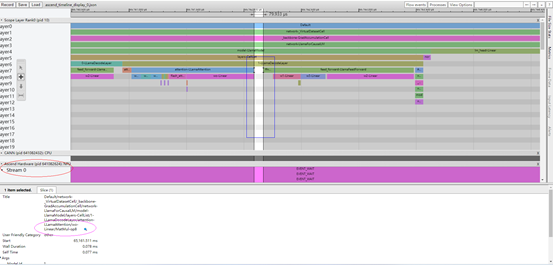

# 大模型性能调优指南

[](https://gitee.com/mindspore/docs/blob/master/docs/mindspore/source_zh_cn/mindformers/perf_optimize/perf_optimize.md)

## 性能调优概述

本文档主要介绍大语言模型的性能调优，详细介绍了性能调优相关的基础理论知识、分析思路和相关工具使用指导，以及案例分享。

性能一般讨论的是机器的模型训练性能，在指定模型和输入数据的情况下，以完成一次端到端训练所需要时间作为参考指标。端到端是指完成一个人工智能模型单步训练的过程，时间主要由以下部分构成：

* 数据加载时间：指的是模型在加载训练数据、权重等数据的时间，包括将数据从硬件存储设备读取到CPU中、CPU中数据的预处理、CPU数据放到device上。对于一些需要切分在若干张卡上的模型，数据加载还包括从数据加载卡广播到其他卡上的时间。

* 模型前向反向时间：特指深度学习模型的Forward和Backward，包含前向的数据计算和反向的数据微分求导。

* 优化器时间：通常指的是模型参数更新时间。

* 模型后处理时间：一般指的是优化器更新后的时间，包括数据的后处理或者一些必要的同步操作，通常取决于模型特有操作。

* 通信时间：概念比较宽泛，我们一般将单节点内卡与卡和多节点间的通信行为归为通信时间。通过MindSpore包含的并行技术，通信和计算通常可以并行执行，即通信被掩盖，因此我们一般考虑未被计算掩盖的通信时间。

* 调度时间：指的是模型从CPU的指令到调用NPU侧的核所需要的时间。

性能调优即通过优化模型算法、参数，优化并行策略等手段，降低上述各部分时间，一般重点针对模型前向反向时间、通信时间进行优化。

## 性能调优基础简介

### 性能指标

性能通常通过吞吐率、算力利用率（MFU和HFU）等指标进行评估。

#### 吞吐量

对于大语言模型来说，吞吐量主要是看每秒钟每张卡消耗的token数量；计算公式如下：

$$
Throughput = SeqLength * (sample/s/p)
$$

(sample/s/p)的计算结果可以直接从日志中获取，也可以从日志中分别获取对应字段再进行计算。

各字段含义如下：

* SeqLength：指的是序列的长度，进行文本处理的时候，我们需要将输入的文本转换成数字序列，然后将这些数字序列作为模型的输入。SeqLength就是指这些数字序列的长度，也就是文本的长度。在模型训练和预测的过程中，我们需要指定一个固定的SeqLength，以便进行批处理和计算。较长的SeqLength可以提高模型的准确性，但会增加计算量和内存消耗；而较短的SeqLength则会减少计算量和内存消耗，但可能会降低模型的准确性。

* sample：其值等于global_batch_size。在分布式训练中，数据被分成多个部分，每个部分被送到不同的设备上进行计算。这些设备上的batch size加起来就是全局批量大小。 全局批量大小的选择是一个重要的决策，因为它会直接影响模型的训练速度和性能。如果全局批量大小太小，每个设备上的batch size可能会太小，导致模型的收敛速度变慢。如果全局批量大小太大，每个设备上的batch size可能会太大，导致显存不足或者模型的精度下降。要找到最佳Batch Size大小值，一个好的经验法则是达到处理器对给定数据类型的内存限制，即Batch Size占满内存。

* s：即per_step_time，指在训练过程中，每一步所花费的时间。

* p：即parallel_num，数据并行维度大小。

#### 算力利用率

MFU是衡量当前算力利用率的情况，不考虑重计算的情况，MFU越高说明当前的计算效率越好，统计的主要是GEMM的计算量。计算公式如下：

$$
MFU = \frac{FLOPs}{StepTime * HardwareCapacity}
$$

HFU是在MFU的基础上，将反向传播中的重计算计算量考虑在内：

$$
MFU = \frac{FLOPs_{recompute}}{StepTime * HardwareCapacity}
$$

FLOPs（floating point operations）表示浮点数运算次数，衡量了计算量的大小。如计算矩阵A(m,n)\*B(n,p)，需要进行 m\*n\*p 次乘法运算和 m\*n\*p 次加法运算，共计 2\*m\*n\*p 次浮点数运算，即FLOPs为2mnp。

StepTime指在训练过程中每一步所花费的时间，HardwareCapacity则为集群中芯片的标称算力。

在统计transformer layer的计算量时，根据链式法则，反向传播中，MatMul需要对 $d_x$ 和 $d_w$ 分别求导，因此反向过程的计算量大约是正向的2倍。我们只需要计算出正向传播过程的计算量，然后估算出反向传播的计算量。

这里以GPT结构为例，理论估计的结果为：

|                          | 激活的内存占用Byte                             |
| ------------------------ | ---------------------------------------------- |
| 无重计算model flops      | 72 *  bLs$h^2$ * [1*corr +  s/(6h) + v/(12hL)]    |
| 选择重计算hardware flops | 72 *  bLs$h^2$ * [1*corr + 4/3s/(6h) + v/(12hL)]  |
| 完全重计算hardware flops | 72 *  bLs$h^2$ * [4/3*corr+ 4/3s/(6h) + v/(12hL)] |

其中corr = (60+12/q)/72，q为GQA的倍数，q=n_heads/n_kv_heads。重计算带来的增加2倍，原因是Attention中的Q、K、V的前向需要重计算。如果只有前向需要重计算，应该在非重计算 4b$s^2$h(正向) + 8b$s^2$h(反向) = 12b$s^2$h 的基础上变成 4b$s^2$h(正向) + 8b$s^2$h(反向) + 4b$s^2$h(正向)= 16b$s^2$h。重计算增加的开销为16/12=4/3倍。

详细计算步骤为：

| 模块                      | 规格                               | FLOPS                                  |
|-------------------------|----------------------------------|----------------------------------------|
| attention               |                                  |                                        |
| Query, key, Value  MatMul | [b, s, h] * [h, h]               | (2+4/q)*bs$h^2$   q=n_heads/n_kv_heads |
| QK BatchMatMul          | [b, a, s, h/a] *  [b, a, h/a, s] | 2b$s^2$h                               |
| score \* V              | [b, a, s, s] * [b, a, s, h/a]    | 2b$s^2$h                                  |
| attention projection    | [b, s, h] * [h,h]                | 2bs$h^2$                               |
| MLP                     |                                  |                                        |
| MLP mapping             | [b, s, h] * [h, 4h]              | 8bs$h^2$                               |
| MLP projection          | [b, s, 4h] * [4h, h]             | 8bs$h^2$                               |
| LmHead                  |                                  |                                        |
| lmHead projection       | [b, s, h] * [v, h]               | 2bshv                                  |
| Total                   |                                  | 2bshv                                  |
| GPTlayer-Total          |                                  | (20+4/q)bs$h^2$ + 4b$s^2$h+2bshv          |

各字符含义如下：

* b：micro batch size
* h：hidden size
* s：seq length
* v：vocab size
* L：layers

Llama结构(gated FFN，8路GQA)稍有不同，和GPT的差别主要在于mlp层存在差异，在Llama系列中使用的GatedMLP，具体的flops计算如下：

| MLP mapping      | [b, s, h] * [h, $\hat{h}$]           | 2bsh$\hat{h}$                                |
| ---------------- | ------------------------------------ |----------------------------------------------|
| MLP gate         | [b, s, h] * [h, $\hat{h}$]           | 2bsh$\hat{h}$                                |
| MLP projection   | [b, s, $\hat{h}$]  * [$\hat{h}$,  h] | 2bsh$\hat{h}$                                |
| Total            |                                      | 6bsh$\hat{h}$                                |
| Llamalayer-Total |                                      | (4+4/q)bs$h^2$ + 4b$s^2$h+6bsh$\hat{h}$ + 2bshv |

注：$\hat{h}$ 为 ffn hidden size

Llama系列完整的MFU估计值如下：


HFU/MFU可以用于对于训练性能tokens/s/p的评价。一般HFU>50%属于比较优秀的硬件利用，比如Llama2-7B为4695tokens/s/p，对应的MFU=57%, HFU=65%，属于比较理想的效果。对于大参数模型如Llama2-70B, MFU/HFU会随着并行尺度扩大而线性比衰减。[PaLM](https://arxiv.org/pdf/2204.02311.pdf)统计了几个常见大模型的MFU。


### 并行特性简介

在大模型训练中，由于数据量和模型复杂度的增加，单个计算节点的计算能力难以满足训练的需求。为了提高训练效率和加速训练过程，通常采用并行策略来将计算任务分配给多个计算节点进行计算。

并行策略通常分为数据并行（Data Parallelism，简称DP）、模型并行（一般指张量并行Tensor Parallelism，简称TP）、流水并行（Pipeline Parallelism，简称PP）、序列并行（Sequence Paralleism，简称SP）等多种并行模式。在实际应用中，通常会采用同时使用多种并行的混合并行策略，以及多种优化手段，例如使用优化器并行、重计算等方式，以减少模型对内存的使用，提高训练的效率和加速训练的过程。并行策略设计与模型的效率息息相关，在模型调优之前先确定一组或多组较优的并行策略，是至关重要的。

详细介绍参考文档并行策略指南。

### 内存分析

大模型的主流结构都是transformer decoder only的结构，该结构由self attention和ffn两个子层构成。典型的模型Llama2如下图所示：


#### 静态内存

参数量定义：模型参数量是指一个神经网络或机器学习模型中可以进行学习和调整的参数的数量。这些参数包括权重（weights）和偏置（biases），它们在训练过程中会不断地更新以优化模型的性能。

以GPT结构为例，一层transfomer layer的参数量如下图所示：


静态内存主要是包含模型的参数和优化器的状态，若使能了梯度累积或者流水线并行则会多一份梯度；设定N为模型参数量，t为优化器并行的规模（默认等于DP），则各个场景下的内存占用如下：

|                     | 静态内存占用       | 说明                                                          |
| ------------------- | ------------------ |-------------------------------------------------------------|
| 无并行              | 2N + 4N + 4N = 10N | FP16 weight (2N)  FP32 AdamVar (4N)  FP32 AdamMomentum (4N) |
| 优化器并行          | 10N / t            | 权重和优化器状态切分                                                  |
| 优化器并行+梯度累计 | 10N / t + 2N       | 权重切分和优化器状态切分, 梯度累积不切分。                                      |

例如一个7B的模型，若t=8，则上述三种场景下的静态内存理论预估值分别为70GB、8.75GB、22.75GB。

#### 动态内存

以GPT为例，考虑pp、tp等情况，理论计算值如下：

|                              | 激活内存[Byte]          | 说明                                    |
| ---------------------------- | ----------------------- |---------------------------------------|
| 无并行                       | sbh * [34+5as/h]        | 总内存                                   |
| 模型并行                     | sbh * [10+(24+5as/h)/t] | attn/ffn输入、2*ln输入，2dropout mask没有被并行。 |
| 模型并行+序列并行            | sbh * [34+5as/h]/t      | 进一步在t维度降低激活                           |
| 模型并行+选择重计算          | sbh * [10+24/t]         | 重计算 $s^2$ 的激活                         |
| 模型并行+序列并行+选择从计算 | sbh * [34/t]            | 重计算 $s^2$ 的激活                         |
| 完全重计算                   | sbh * [2]               | 仅保存每层的输入                              |

详细计算步骤为：

| 模块                       | BP需要保存的变量      | 内存大小[Byte] |
|--------------------------| --------------------- | -------------- |
| Attention部分              |                       |                |
| Query, key, Value MatMul | x                     | 2sbh           |
| QK BatchedMatMul         | Q, K                  | 4sbh           |
| softmax                  | softmax  result       | 2a$s^2$b          |
| softmax dropout          | dropout  mask         | a$s^2$b           |
| prob-value BatchedMatMul | dropout  result and V | 2a$s^2$b + 2sbh   |
| attenton projection      | dropout  mask+output  | sbh + 2sbh     |
| Totoal                   |                       | 11sbh + 5a$s^2$   |
| FFN部分                    |                       |                |
| MLP  mapping             | x                     | 2sbh           |
| MLP  activation          | hidden                | 8sbh           |
| MLP  projection          | activated  hidden     | 8sbh           |
| MLP  dropout             | dropout  mask         | sbh            |
| Totoal                   |                       | 19sbh          |
| LayerNorm部分              |                       |                |
| two lanyernorm           | input                 | 2sbh + 2sbh    |

各字符含义如下：

* a：number of attention heads
* b：micro batch size
* h：hidden size
* L：number of transformer layers
* p：pipeline parallel size
* s：seq length
* t：tensor parallel size
* v：vocab size

#### 混合精度

浮点数据类型主要分为双精度（FP64）、单精度（FP32）、半精度（FP16）。在神经网络模型的训练过程中，一般默认采用单精度（FP32）浮点数据类型，来表示网络模型权重和其他参数。

与FP32相比，FP16的存储空间是FP32的一半。类似地，FP32则是FP64的一半。因此使用FP16进行运算具备减少内存占用、计算效率更高、加快通讯效率等优势，但是使用FP16同样会带来数据溢出、舍入误差等问题。

在使用混合精度获得训练加速和内存节省的同时，需要考虑FP16引入问题的解决。Loss Scale损失缩放，FP16类型数据下溢问题的解决方案，主要思想是在计算损失值loss的时候，将loss扩大一定的倍数。根据链式法则，梯度也会相应扩大，然后在优化器更新权重时再缩小相应的倍数，从而避免了数据下溢。

详细介绍参考文档[自动混合精度](https://www.mindspore.cn/tutorials/zh-CN/master/beginner/mixed_precision.html)。

### 工具介绍

#### profiler工具

MindFormers本身集成了profiling数据采集的功能，使用步骤如下：

1. 修改配置文件

   在模型的配置文件中（例如run_llama2_7b.yaml）开启profiling开关，需修改的参数如下：

   ```yaml
   profile: True  #是否开启性能分析工具
   profile_start_step: 1  #性能分析开始的step
   profile_stop_step: 10  #性能分析结束的step
   init_start_profile: False  #Profiler初始化的时候开启，开启后profile_start_step将不生效。
   profile_communication: True #是否在多设备训练中收集通信性能数据
   profile_memory: True  #收集Tensor内存数据
   ```

2. 简化模型

   建议将模型的层数（num_layers）改为2层，方便快速采集数据。

3. 查看数据

   采集的性能数据文件会保存到模型配置文件output_dir（默认“./output”）下创建一个profile的文件夹，按照rank id生成当前机器的每一张卡的性能数据。以rank_0为例，目录为output/profile/rank_0/profiler。

   生成的文件及介绍参考[profile文件介绍](https://www.mindspore.cn/mindinsight/docs/zh-CN/master/performance_profiling_ascend.html#目录结构)，主要收集算子、任务等运行耗时，CPU利用率，内存消耗等信息，用于性能调优分析需要的各项数据。

#### MindStudio Insight

MindStudio Insight提供了性能数据的多种呈现形式，包括Timeline视图、通信分析、计算耗时等的可视化呈现，以便用户分析潜在的性能瓶颈，并指导如何采取措施消除或减少这些瓶颈。MindStudio Insight支持在Timeline查看集群场景下Profiling导出的数据，并以单卡为维度进行展示，可以支持20GB以上的集群性能文件分析。

点击[MindStudio Insight下载链接](https://www.hiascend.com/zh/developer/download/commercial/result?module=sto)，选择合适的版本安装。

打开MindStudio Insight工具，单击界面左上方工具栏中的“加号”，在弹窗中选择解析并导出的文件或目录，然后单击“确认”导入。

MindStudio Insight工具以时间线（Timeline）的呈现方式为用户提供全流程在线推理、训练过程中的运行情况，并按照调度流程来呈现整体的运行状况，并且MindStudio Insight支持集群Timeline展示。通过分析时间线，用户可以对在线推理/训练过程进行细粒度的分析，如迭代间隙是否过长、算子执行时间等，并提供一些易用性功能辅助用户快速定位出性能瓶颈。

时间线（Timeline）界面包含工具栏（区域一）、时间线树状图（区域二）、图形化窗格（区域三）和数据窗格（区域四）四个部分组成，如图所示。


* 区域一

  工具栏，包含常用快捷按钮，从左至右依次为列表标记、过滤（支持按卡或按专项层过滤展示）、算子搜索、算子连线、页面自适应和缩放按钮。

* 区域二

  时间线树状图，显示集群场景下各“Card”的分层信息，一层级为“Card”，二层级为进程或专项分层，三层级为线程等名称。包括上层应用数据（包含上层应用算子的耗时信息）、CANN层数据（包含AscendCL、GE和Runtime组件的耗时数据）、底层NPU数据（包含Ascend Hardware下各个Stream任务流的耗时数据和迭代轨迹数据、HCCL和Overlap Analysis通信数据以及其他昇腾AI处理器系统数据）、打点数据和AI Core Freq层级。

* 区域三

  图形化窗格，展示的数据是迭代内的数据，图形化窗格对应时间线树状图，逐行对时间线进行图形化展现，包括上层应用算子、各组件及接口的执行序列和执行时长。

* 区域四

  数据窗格，统计信息或算子详情信息展示区，选中详情（Slice Detail）为选中单个算子的详细信息、选中列表（Slice List）为某一泳道选中区域的算子列表信息、以及系统视图（System View）为某类算子的汇总信息。

单击时间线页面树状图或者图形化窗格任意位置，可以使用键盘中的W（放大）、A（左移）、S（缩小）、D（右移）键进行操作，支持放大的最大精度为1ns。本工具可以提供概览、内存、算子、通信等多个维度的分析，辅助进行性能调优。详细使用方法参考[MindStudio Insight用户指南](https://www.hiascend.com/document/detail/zh/mindstudio/70RC2/msinsightug/msascendinsightug/AscendInsight_0002.html)。

#### IR 图

在MindFormers配置文件中，只需要将save_graphs的开关设置为True，运行时会输出一些图编译过程中生成的ir后缀结尾的中间文件，我们称为IR文件。默认会在当前任务执行目录下生成一个graph的目录，所有的IR图都会保存在这其中。是一种比较直观易懂的以文本格式描述模型结构的文件，可以直接用文本编辑软件查看。

节选部分IR图，如下：

```text
  %13(equiv_180_CNode_16165) = Load(%para6_model.layers.0.attention.wq.weight, UMonad[U]) cnode_attrs: {checkpoint: Bool(1)} cnode_primal_attrs: {unique_id: "782039"}
      : (<Ref[Tensor[Float16]], (512, 4096), ref_key=model.layers.0.attention.wq.weight>, <UMonad, NoShape>) -> (<Tensor[Float16], (512, 4096)>)
      # Fullname with scope: (Default/network-MFPipelineWithLossScaleCell/network-_VirtualDatasetCell/_backbone-GradAccumulationCell/network-LlamaForCausalLM/model-LlamaModel/layers-CellList/0-LLamaDecodeLayer/attention-LLamaAttention/Load-op0)
  %14(equiv_16877_x) = PrimFunc_MatMul(%12, %13, Bool(0), Bool(1)) {instance name: matmul} primitive_attrs: {in_strategy: ((1, 1), (8, 1))} cnode_attrs: {checkpoint: Bool(1)} cnode_primal_attrs: {unique_id: "782146", origin_output_shape: (4096, 4096), micro: I64(0), origin_input_shapes: ((4096, 4096), (4096, 4096))} {in_strategy: ((1, 1), (8, 1))}
      : (<Tensor[Float16], (4096, 4096)>, <Tensor[Float16], (512, 4096)>, <Bool, NoShape>, <Bool, NoShape>) -> (<Tensor[Float16], (4096, 512)>)
      # Fullname with scope: (Default/network-MFPipelineWithLossScaleCell/network-_VirtualDatasetCell/_backbone-GradAccumulationCell/network-LlamaForCausalLM/model-LlamaModel/layers-CellList/0-LLamaDecodeLayer/attention-LLamaAttention/wq-Linear/MatMul-op0)
  %15(equiv_16876_CNode_30913) = PrimFunc_Reshape(%14, (I64(1), I64(4096), I64(4), I64(128))) {instance name: reshape} cnode_attrs: {checkpoint: Bool(1)} cnode_primal_attrs: {unique_id: "817859", forward_comm_node_unique_id: "729440", micro: I64(0)}
      : (<Tensor[Float16], (4096, 512)>, <Tuple[Int64*4], TupleShape(NoShape, NoShape, NoShape, NoShape), elements_use_flags={[const vector]{1, 1, 1, 1}}>) -> (<Tensor[Float16], (1, 4096, 4, 128)>)
      # Fullname with scope: (Default/network-MFPipelineWithLossScaleCell/network-_VirtualDatasetCell/_backbone-GradAccumulationCell/network-LlamaForCausalLM/model-LlamaModel/layers-CellList/0-LLamaDecodeLayer/attention-LLamaAttention/Reshape-op0)
  %16(equiv_16875_query) = PrimFunc_Transpose(%15, (I64(0), I64(2), I64(1), I64(3))) {instance name: transpose} primitive_attrs: {in_strategy: ((1, 1, 8, 1))} cnode_attrs: {checkpoint: Bool(1)} cnode_primal_attrs: {unique_id: "782042", micro: I64(0)} {in_strategy: ((1, 1, 8, 1))}
      : (<Tensor[Float16], (1, 4096, 4, 128)>, <Tuple[Int64*4], TupleShape(NoShape, NoShape, NoShape, NoShape), elements_use_flags={[const vector]{1, 1, 1, 1}}>) -> (<Tensor[Float16], (1, 4, 4096, 128)>)
      # Fullname with scope: (Default/network-MFPipelineWithLossScaleCell/network-_VirtualDatasetCell/_backbone-GradAccumulationCell/network-LlamaForCausalLM/model-LlamaModel/layers-CellList/0-LLamaDecodeLayer/attention-LLamaAttention/Transpose-op0)
```

`%XX` 表示步骤，后面对应算子名称，括号里面则包含了入参及输出。Fullname with scope则包含了完成的class，方法名等信息。

* `%13`

  此步直接加载wq.weight，得到<Tensor[Float16], (512, 4096)>。

* `%14`

  跟前面的%12输出和上述%13输出进行MatMul，得到<Tensor[Float16], (4096, 512)>。

* `%15`

  上述14%的输出，Reshape得到<Tensor[Float16], (1, 4096, 4, 128)>。

* `%16`

  上述15%的输出，Transpose得到<Tensor[Float16], (1, 4, 4096, 128)>。

在保存IR图时建议将模型的层数改小，减少编译存图的时间，方便快速调试。详细内容参考[IR文件介绍](https://www.mindspore.cn/docs/zh-CN/master/model_train/debug/error_analysis/mindir.html#ir文件介绍)和[分析示例](https://www.mindspore.cn/docs/zh-CN/master/model_train/debug/error_analysis/mindir.html#如何根据analyze-failir文件分析图推导失败的原因)。

## 性能调优指南

### 整体思路

大模型的性能优化主要依赖于profiling数据分析以及内存分析，分析当前性能的瓶颈以及与竞品的差距；MindSpore框架上的耗时主要是算子耗时以及通信耗时两部分，其中算子耗时主要是拆解出核心算子与竞品的差距，通信分析查看是否存在不合理的重排布等。

完成性能数据以及内存数据采集后，整体优化的流程如下：

* 分析算子性能，尽量使用融合算子替换中小算子。

* 分析通信耗时，查看是否存在更优的分布式策略，分析是否存在不合理的重排布问题，提高整个集群的效率。

* 分析内存，查看是否存在异常大内存Tensor，是否存在可融合的算子降低激活值内存；在有内存富裕的情况就可以探讨选择重计算的设置，或者是降低模型切分的份数，减少模型切分带来的通信开销。

性能优化是一个循环往复的过程，正如下图所示，算子优化完毕后，就需要对集群分布式策略进行实验分析，分析通信耗时是否合理，是否存在额外的重排布开销；然后进行内存优化分析，完成内存优化后，是否可以重新调整集群策略设置，从而获取更优的策略设定。循环往复的去优化，进而一步步达到设定的性能目标。


完成一轮性能优化后，还需要确保模型精度对齐，对齐则应用该优化策略。

### 算子性能优化

#### GPU与NPU数据对比

* 基本思路

  NPU与GPU算子耗时统计，通过profiling获取数据。

  对比GPU和NPU数据，找到单算子耗时差异点。

  性能详细分析，根据算子PMU数据分析单case性能，精确识别待优化算子。

* 算子耗时统计

  NPU的算子耗时统计可直接从profiling中获取，分析出当前主要的耗时算子以及低效算子，从而找出需要优化的算子。参考[profiler工具使用介绍](#profiler工具)。

  GPU 算子耗时统计，参考MindStudio提供的[PyTorch训练Profiling分析方法](https://www.hiascend.com/document/detail/zh/mindstudio/60RC1/quickstart/systemprofilerpt_000001.html)。

* 数据拆解关注点

  上述[profiler工具](#profiler工具)产生的性能数据中，分析生成数据中的如下文件：rank-*_ascend_ms/ASCEND_PROFILER_OUTPUT/kernel_details.csv。该文件按照算子类型统计某一类型的算子整体占比，可以从中得到需要优化哪一类算子从而带来性能提升。如下图所示，可以看到当前网络TOP耗时的算子是MatMulV2、FA等相关算子。

  

  NPU和GPU待优化算子数据比对，输出分析结果表格。 以MatMul为例，比对NPU与GPU相同shape下的算子性能差异，重点关注算子耗时占比较高且算力利用率低的shape。

  

#### 融合算子

算子融合是通过将多个独立的算子组合成一个更大、更复杂的算子，从而减少运行时内存访问、提高计算效率。可以减少中间结果的存储和传输，有效的减少访存的开销；另外，合并多个算子可以减少计算的次数，在NPU等并行计算设备上，可以有效提高计算效率。

当前MindFormers默认会自动进行融合算子优化，将模型中符合条件的多个连续小算子自动合并成一个融合算子。

### 通信优化

在半自动并行开发模式下，需要开发者配置每一个Op算子的输入输出Tensor的并行切分策略，如果存在算子配置不匹配的情况，则会导致MindSpore框架在编译时插入通信算子，对Tensor的进行重排布来适配后续算子的切分方式。常见的通信算子主要是关注AllGather、AllReduce等。

分析通信重排布是否合理是利用存IR图加Profiling采集的timeline.json进行分析，通过timeline.json进行可视化查看当前的通信空档，然后更加OP编号去IR图进行通信算子的上下文分析，从而来检查此处的通信算子是否是符合预期（与自己配置的切分策略匹配）。

使用[profiler工具](#profiler工具)生成文件ascend_timeline_display_0.json，然后在Chrome浏览器中输入"chrome://tracing"打开文件，也可以使用[MindStudio Insight](#mindstudio-insight)打开，解析出对应的计算通信任务流的时序图。如下：



wo-linear之后存在一个计算空档，结合IR图，可以看到在wo-linear之后存在一个AllReduce通信算子，AllReduce接收的是wo-linear的MatMul的输出。IR图如下所示：

```text
%100(equiv_loss)) = MatMul(%98, %99) {instance name: matmul) primitive_attrs: {IsFeatureMapInputList: (0), input names: [x1, x2], transpose_x2: Bool(1), transpose_b: Bool(1), in strategy: ((1, 4), (1,4)), output names: [output], transpose_a: Bool(0), IsFeatureMapOutput: Bool(1), transpose_x1: Bool(0)} cnode_attrs: (checkpoint: Bool(1), is dynamic_len: Bool(0)} cnode_primal_attrs: (unique id: "230416", micro: I64(0))}
    : (<Tensor[Float16], (2048, 1024)>, <Tensor[Float16], (4096, 1024)>) -> (<Tensor[Float16], (2048, 4096)>)
    # Fullname with scope:
    (Default/network-_VirtualDatasetCell/_backbone-GradAccumulationCell/network-LlamaForCausalLM/model-LlamaModel/lavers-Celllist/1-LLamaDecodeLaver/attention-LhamaAttention/wo-Linear/MatMul-op8)
%101(equiv_CNode_3914) = AllReduce(%100) {instance name: forward_op_6937918150211178578} primitive_attrs: {IaFeatureMapInputList: (0), comm_reuse: Bool(1), group: "hcel_world_group", fusion: 164(0), op: "sum", rank_list: (0, 1, 2, 3), group_ranks: "WORLD_GROUP", index: 164(0), group_rank ids: (0, 1, 2, 3), IsFeatureMapOutput: Bool(1), _parallel_group: "hcel_world_group", no_eliminate: Bool(1)} cnode_attrs: {checkpoint: Bool(1), is_dynamic_len: Bool(0)} cnode_primal_attrs: {unique_id: "231701", forward_comm_node_unique_id: "224263", micro: I64(0)}
    : (<Tensor[Float16], (2048, 4096)>) -> (<Tensor[Float16], (2048, 4096)>)
    # Fullname with scope:
    (Default/network- VirtualDatasetCell/ backbone-GradAccumulationCell/network-LlamaForCausalLM/model-LlamaModel/layers-CellList/1-LLamaDecodeLayer/attention-LLamaAttention/wo-Linear/AllReduce-op0)
```

可以发现MatMul算子对于两个输入都进行了切分，对第一个输入进行了列切分，第二个输入进行了行切分，此时符合TensorParallel中的Row Parallel Linear的切分方式，此时若要保持MatMul的数学等价则需要对计算结果做AllReduce操作，则此时插入的AllReduce是符合预期。

### 并行策略

#### 并行策略特点

不同的并行策略特点总结如下：

* 数据并行

  多路数据同时训练，仅在梯度更新进行一次通信，性能最优，但内存不会减少；

* 模型并行

  将整个模型切分到不同Device中，网络并行计算各自部分并在LayerNorm等位置进行通信，最省内存，但通信量很大；

* 流水线并行

  将模型的不同阶段(stage)切分到不同Device中，网络串行计算各个阶段并在转换阶段时进行通信，通过重计算节省部分内存，通信量较小，但会存在计算闲置(bubble)；

* 优化器并行

  将优化器权重、模型权重按DP切分（DP能整除权重shape的第0维），梯度更新时进行通信，可以明显节省内存，通信量较小；

* 序列并行

  短序列并行在LayerNorm处对序列维按MP进行切分，通信量不变，减少激活内存与Norm的部分计算量；

* 多副本并行

  在模型并行中，MatMul等算子切分为多份，不同副本之间计算通信交错进行，实现通信掩盖；

#### 使用建议

实际应用中，通常是多种并行策略组合使用。根据模型规模，机器数量确定适当的并行策略。本节介绍不同规模模型的推荐配置，示例配置中各配置项含义参考[配置说明](https://gitee.com/mindspore/mindformers/blob/dev/configs/README.md)。

* 小参数模型

  模型规模较小时（如7B），可使用纯数据并行+优化器并行，如果内存富裕可进一步开启梯度累积。使用8卡训练，[Llama2-7B并行策略推荐配置](https://gitee.com/mindspore/mindformers/blob/dev/configs/llama2/pretrain_llama2_7b.yaml)。

* 中等参数模型

  模型规模适中时（如13B），可进一步使用流水线并行，并调整重计算。使用8卡训练，[Llama2-13B并行策略推荐配置](https://gitee.com/mindspore/mindformers/blob/dev/configs/llama2/pretrain_llama2_13b.yaml)。

* 大参数模型

  模型规模较大时（如70B），需开启模型并行，同时序列并行与多副本并行也建议开启。使用64卡训练，[Llama2-70B并行策略推荐配置](https://gitee.com/mindspore/mindformers/blob/dev/configs/llama2/predict_llama2_70b.yaml)。

### 重计算

#### cast重计算

RmsNorm一般使用float32计算，计算之前需要将输入从fp16或bf16 Cast成fp32；RmsNorm需要存下输入用于反向计算。因此，对fp16至fp32的Cast进行重计算，可以将激活内存从RmsNorm的输入变为Cast的输入，Cast的输入的大小为RmsNorm输入大小的一半，从而达到节省内存的效果。


从高精度到低精度的Cast算子做重计算，会导致后面的算子原本只需要存cast之后的低精度激活内存，Cast算子重计算后，需要存高精度激活内存，反而会导致激活内存变大。

#### Silu-Mul重计算

在FeedForward中，中间部分激活内存往往会很大；Silu和Mul重计算代价小。对Silu和Mul算子重计算，可以省下w2的MatMul和Mul的第一个输入的激活内存。


#### 通信重计算

在开启序列并行后，RmsNorm会在序列维度切分，之后通过AllGather将不同卡的Tensor进行汇聚以供后面MatMul计算。如果将AllGather重计算，那么每张卡只需要存一份AllGather之前的激活内存，以达到减小内存的效果。


### 内存优化

#### Host侧内存分析

借助[profiler工具](#profiler工具)，profile_memory设置为True，可以收集内存信息。分析方法可以参考[Host侧内存使用情况](https://www.mindspore.cn/mindinsight/docs/zh-CN/master/performance_profiling_ascend.html#host侧内存使用情况)。

在训练时遇到host侧宕机挂掉，常常是由于OOM导致，对于此类问题目前主要有以下三种场景：

* 模型初始化时使用了numpy初始化了超大的Tensor

  模型脚本初始化时常常会用到numpy初始化的数组来初始化一个MindSpore的Tensor，如果这个Tensor的大小很大则会导致host侧内存OOM，例如下面的代码中会申请一个seq_len*seq_len形状的Tensor，对于序列长度达到128K以上时，则会容易导致Host内存OOM。

  ```python
  class LowerTriangularMaskWithDynamic(Cell):
      @_LogActionOnce(m_logger=logger, key='AttentionMask',
                      no_warning=_get_parallel_mode() in (ParallelMode.STAND_ALONE,))
      def __init__(self, seq_length, compute_type=mstype.float16,
                   is_dynamic=False, pad_token_id=0, use_flash_attention=False,
                   use_prompt_flash_attention=False, use_incre_flash_attention=False, use_attn_mask_compression=False):
          super().__init__()
          # 省略部分代码
          self.multiply_data = Tensor([-10000.0], dtype=compute_type)
          self.one = Tensor([1.0], dtype=compute_type)
          self.lower_triangle_mask = Tensor(np.tril(np.ones(shape=(seq_length, seq_length), dtype=np.int8)), dtype=compute_type)
  ```

  针对此类场景，主要规避方法是在construct中根据输入进行生成，可以进行切分并行以及内存复用，从而降低host内存开销，也降低了host静态内存的开销。

* 数据预处理内存优化

  对于数据预处理中生成数据不宜出现seq_len*seq_len的数据项，在LLM中不建议将mask之类的数据在数据预处理阶段进行生成，MindFormers在训练时采用的是full batch方式，每张卡的进程都会处理global batch size的数据集，由于预处理是流水线模式，会导致host内存逐渐被消耗。

* 权重加载时使用的是完整的权重

  目前MindFormers中进行分布式训练时，加载权重时每个训练进程都会加载一份权重，例如对于参数为13B的模型，若均是半精度存储则需要2\*13=26GB的内存，若是8卡分布式训练则加载权重至少需要8\*26=208GB的内存；因此加载完整的权重时会消耗较多的Host内存。为此需要开启配置文件的中auto_trans_ckpt的开关，使能权重自动切分，进行切片加载，以此来降低host内存开销。

  在Mindformers的配置文件中，开启如下开关：

  ```yaml
  auto_trans_ckpt: True
  ```

#### 峰值显存存分析

内存分析时，峰值内存是一个重要的关注点，执行训练时，设置如下环境变量，可以统计内存基本情况。

  ```shell
export MS_MEMORY_STATISTIC=1
  ```

训练完成后，会在日志文件的末尾输出如下信息：

```text
Device HBM memory size: 62432M
MindSpore Used memory size: 59392M
MindSpore memory base address: 0
Used peak memory usage (without fragments): 48874M
Actual peak memory usage (with fragments): 48874M
```

Used peak memory usage (without fragments)表示不包含碎片的显存使用峰值。

Actual peak memory usage (with fragments)表示包含碎片的显存使用峰值。

在正式训练前，可以使用dryrun的方式模拟训练，只需要一张卡即可模拟整体的显存峰值。dryrun脚本如下：

```shell
export ENABLE_CELL_REUSE=1
export MS_MEMORY_STATISTIC=1
export MS_SIMULATION_LEVEL=1
export RANK_SIZE=16
export RANK_ID=0
python run_mindformer.py --config ${CONFIG} --run_mode train > dry_run.log 2>&1 &
```

其中RANK_SIZE表示要模拟的卡数，RANK_ID表示进行模拟的卡，ENABLE_CELL_REUSE、MS_MEMORY_STATISTIC、MS_SIMULATION_LEVEL三个环境变量用于设置dryrun模式。

### 典型案例

#### Silu-Mul重计算未生效

在开细粒度多副本时，对Silu和Mul做重计算可以节省内存，但关细粒度多副本时，对Silu和Mul做重计算不能节省内存。定位过程如下：

* 确认配置了重计算

  在IR图中检查Cast、Silu和Mul算子是否有“recompute: Bool(1)”的标签，有标签说明算子配了重计算。

* 检查重计算生效算子

  在IR图中检查是否有Cast、Silu和Mul的duplicated标签的算子，没有带标签的算子说明实际计算图没有重计算这部分算子。这里只有Cast算子带了duplicated标签。

  ```text
  %1834(CNode_108839) = PrimFunc_Cast(%1833, I64(43)) {instance name: cast} primitive_attrs: {output_names: [output], input_names: [x, dst_type], recompute: Bool(1)} cnode_attrs: {recompute_sub_graph: U64(64), recompute_id: I64(65), duplicated: Bool(1), need_cse_after_recompute: Bool(1)} cnode_primal_attrs: {micro: I64(0)}
      : (<Tensor[Float16], (1, 4096, 4096)>, <Int64, NoShape>) -> (<Tensor[Float32], (1, 4096, 4096)>)
  ```

* 检查反向计算输入

  在IR图中检查Silu和Mul的反向算子的输入是否符合预期，在关细粒度多副本时，Silu和Mul之间、 Mul和MatMul之间均有Reshape算子，而开启细粒度多副本时，Silu、Mul和MatMul是相连的。绘制相关流程如下：


由此可知跟因在于，细粒度多副本场景中Linear的输入shape是二维的，而非细粒度多副本中Linear的输入shape是三维的，导致Linear和Mul之间有Reshape算子，没对这个Reshape重计算导致单纯对Silu的重计算没有用而被优化掉。额外对Reshape重计算后内存可以正常减小。参考配置如下：

```yaml
recompute_config:
  recompute: False
  select_recompute: ['feed_forward\.mul', 'feed_forward\.w1\.activation', 'feed_forward\.w1\.reshape', 'feed_forward\.w2\.reshape']
```

#### Llama2-13B极致性能优化

13B默认用单机DP: 8, MP: 1, PP: 1，开完全重计算，性能在1860tokens/s/p左右，MFU40%，相较于7B（MFU53%）与70B（MFU47%），性能明显偏低。

经分析，13B性能瓶颈主要在于内存，无论是单机还是多机，如果不切MP，则需要开完全重计算，对Silu和Mul做选择重计算内存依然不够；完全重计算会额外多20%到25%的计算量，导致性能偏低；对MP切分可以关闭重计算，但性能比纯DP还要低些。

用双机调整切分策略为DP: 8, MP: 1, PP: 2, micro: 128，开完全重计算，性能提升至2136tokens/s/p。将完全重计算改为选择重计算，并精细选择算子，使每层的激活内存尽可能减少，性能提升至2189tokens/s/p。

```yaml
select_recompute: ['feed_forward\.mul', 'feed_forward\.w1\.activation', 'feed_forward\.w1\.reshape', 'feed_forward\.w1\.matmul', 'feed_forward\.w3\.matmul', 'feed_forward\.W3\.reshape', 'feed_forward\.w2\.matmul', 'feed_forward\.w2\.reshape', 'ffn_norm\.norm', 'ffn_norm\.rcast', 'attention_norm\.norm', 'attention_norm\.rcast', 'attention\.wq\.reshape', 'attention\.wk\.reshape', 'attention\.wv\.reshape', 'attention\.wo\.matmul', 'attention\.wo\.reshape', 'attention\.merger_head_transpose', 'add', 'attention\.flash attention']
```

调整不同stage的重计算层数，使stage1的重计算量减少，性能提升至2210tokens/s/p。

```yaml
select_recompute:
  'feed_forward\.mul': [20, 8]
  'feed_forward\.w1\.activation': [20, 8]
  'feed_forward\.w1\.matmul': [20, 0]
  'feed_forward\.w1\.reshape': [20, 8]
  'feed_forward\.w3\.matmul': [20, 0]
  'feed_forward\.w3\.reshape': [20, 0]
  'feed_forward\.w2\.matmul': [20, 0]
  'feed_forward\.w2\.reshape': [20, 0]
  'ffn_norm\.norm': [20, 0]
  'ffn_norm\.rcast': [20, 0]
  'attention_norm\.norm': [20, 0]
  'attention_normi.rcast': [20, 0]
  'attention\.wq\.reshape': [20, 0]e
  'attention\.wk\.reshape': [20, 0]e
  'attention\.w\.reshape': [20, 0]e
  'attention\.wol.matmul': [20, 0]
  'attention\.wo\.reshape': [20, 0]e
  'attention\.merger head transpose': [20, 0]
  'add': [20, 0]
  'attention\.flash_attention': [20, 0]
```

使用O0/O1和dvm图算融合，内存有进一步优化，将大部分算子的选择重计算改为部分层的完全重计算，其余层配置Silu和Mul的选择重计算， stage0、stage1分别完全重计算13层、5层，性能提升至2353tokens/s/p。逐步减少stage0、stage1完全重计算至4层、0层，性能提升至2562tokens/s/p(max_device_memory: 57.2GB)。参考配置如下：

```yaml
recompute_config:
  recompute: [4, 0]
  select_recompute: ['feed_forward\.mul', 'feed_forward\.w1\.activation', 'feed_forward\.w1\.reshape', 'feed_forward\.w2\.reshape']
```

最终经过调优后，Llama2-13B性能优化至2562tokens/s/p，MFU55.4%，HFU60.4%，总计提升提升37%。