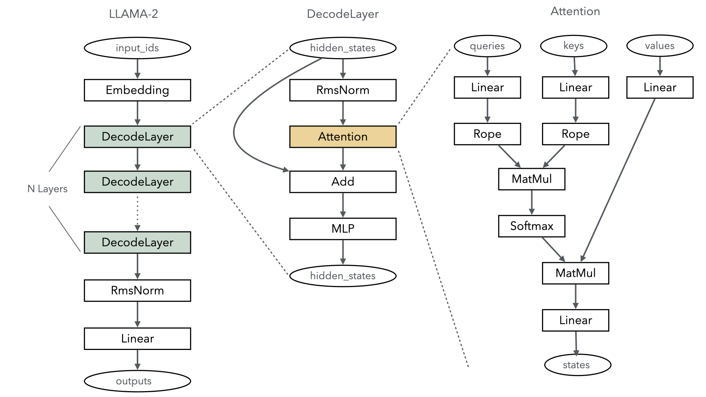

# 从零构建大语言模型推理网络

[](https://gitee.com/mindspore/docs/blob/master/docs/mindspore/source_zh_cn/model_infer/ms_infer/model_dev.md)

## 大语言模型主干网络

当前主流的大语言模型主干网络都以基于transformer结构为主的，其中最为重要的就是Self-Attention机制的计算，以Llama2大语言模型为例，下图简单描述了其主干网络结构：



由此可见，Llama2的核心层主要分为以下几部分：

- **Embedding**：将每个token对应的索引转换成一个向量，实现特征分散效果，类似onehot向量化，embedding的权重会参与训练过程，可以更好的适配语言模型中上下文语义，其实现就是一个Embedding算子既可完成。

- **DecodeLayer**：即Transformer结构，是大语言模型关键计算，通常根据配置不同，会重复多层计算，每一层实际就是一个Transformers结构，是大语言模型核心之一。

- **RmsNorm&Linear**：输出线性归一层，在Transformer结构计算完后，将结果归一成和模型词表一样的维度，最终输出成每个token的概率分布返回。

使用Mindspore大语言模型推理构建网络，可以根据MindSpore提供的算子自己拼装，下面以一个典型的Transformer模型为例，简单描述如何构建模型过程。

## TransformerModel

在典型的Transformer大语言模型中，每一层layer都由Normalization、Attention模块、残差链接、MLP(MuliLayer Perception)组成。其中Attention和MLP都符合两个连续矩阵乘的要求。

1. Attention

    当前主流Attention都采用了MHA(Muli-Head Attention)多头注意力结构，下图是MHA的具体形式，我们可以根据这个结构来构建Attention的网络。

    

    Attention模块编码示例如下：

    ```python
    class Attention(nn.Cell):
        def __init__(self, config):
            super().__init__()
            self.num_heads_per_partition = config.num_heads
            self.head_dim = config.hidden_size // config.num_heads
            self.norm_factor = math.sqrt(self.head_dim)
            self.q = nn.Linear(in_channels=config.hidden_size,
                                          out_channels=config.hidden_size,
                                          weight_init='normal',
                                          has_bias=config.has_bias)
            self.k = nn.Linear(in_channels=config.hidden_size,
                                          out_channels=config.hidden_size,
                                          weight_init='normal',
                                          dtype=config.dtype,
                                          has_bias=config.has_bias)
            self.v = nn.Linear(in_channels=config.hidden_size,
                                          out_channels=config.hidden_size,
                                          weight_init='normal',
                                          dtype=config.dtype,
                                          has_bias=config.has_bias)
            self.flash_attention = ops.operations.nn_ops.FlashAttentionScore(head_num=self.num_heads_per_partition,
                                                                            scale_value=1.0/self.norm_factor,
                                                                            next_tokens=0)
            self.out = nn.Linear(in_channels=config.hidden_size,
                                         out_channels=config.hidden_size,
                                         weight_init='normal',
                                         dtype=config.dtype,
                                         has_bias=config.has_bias)

        def construct(self, x, mask):
            query = self.q(x)
            key = self.k(x)
            value = self.v(x)
            _, _, _, context_layer = self.flash_attention(query, key, value, attn_mask=mask)
            output = self.out(context_layer)
            return output
    ```

    可以通过下面的代码来执行Attention计算：

    ```python
    mask = np.ones(shape=(config.seq_length, config.seq_length), dtype=np.uint8)
    mask = np.triu(mask, 1)
    mask = Tensor(mask)
    attention = Attention(config=config)
    attention_output = attention(embedding_output, mask)
    print(attention_output.shape)
    ```

2. MLP

   MLP模块由2个连续的全连接层构成，示例代码如下：

    ```python
    class MLP(nn.Cell):
        def __init__(self, config):
            super().__init__()
            self.w1 = nn.Linear(in_channels=config.hidden_size,
                                           out_channels=config.ffn_hidden_size,
                                           weight_init='normal',
                                           dtype=config.dtype,
                                           has_bias=config.has_bias)
            self.w2 = nn.Linear(in_channels=config.ffn_hidden_size,
                                        out_channels=config.hidden_size,
                                        weight_init='normal',
                                        dtype=config.dtype,
                                        has_bias=config.has_bias)
            self.act_func = nn.SiLU()
            self.mul = ops.Mul()

        def construct(self, x):
            x = self.w1(x)
            x = self.act_func(x)
            output = self.w2(x)
            return output
    ```

   可以通过下面的代码来执行Attention计算：

    ```python
    mlp = ParallelMLP(config=config)
    mlp_output = mlp(attention_output)
    print(mlp_output.shape)
    ```

3. TransformerLayer

    通过的Attention模块和MLP模块，可以构建TransformerLayer，即DecodeLaye，具体如下：

    ```python
    class TransformerLayer(nn.Cell):
        def __init__(self, config):
            super().__init__()
            self.attention = Attention(config=config)
            self.feed_forward = MLP(config=config)
            self.attention_norm = RMSNorm(dim=config.hidden_size, dtype=config.dtype)
            self.ffn_norm = RMSNorm(dim=config.hidden_size, dtype=config.dtype)
            self.add = ops.Add()

        def construct(self, x, mask):
            norm_output = self.attention_norm(x)
            attention_output = self.attention(norm_output, mask)
            norm_input = self.add(x, attention_output)
            norm_output = self.ffn_norm(norm_input)
            mlp_output = self.feed_forward(norm_output)
            output = self.add(norm_input, mlp_output)
            return output
    ```

    可以通过下面的代码来执行TransformerLayer计算：

    ```python
    transformerlayer = TransformerLayer(config=config)
    transformerlayer_output = transformerlayer(embedding_output, mask)
    print(transformerlayer_output.shape)
    ```

4. TransformerModel

    通过堆叠TransformLayer，构建TransformerModel.

    ```python
    class TransformerModel(nn.Cell):
        def __init__(self, config):
            super().__init__()
            self.embedding = VocabEmbedding(num_embeddings=config.vocab_size,
                                                    embedding_dim=config.hidden_size,
                                                    init_method='normal',
                                                    init_type=config.dtype)
            self.layers = nn.CellList()
            self.num_layers = config.num_layers
            for _ in range(config.num_layers):
                layer = TransformerLayer(config=config)
                self.layers.append(layer)
            self.norm_out = RMSNorm(dim=config.hidden_size, dtype=config.dtype)

        def construct(self, x, mask):
            hidden_state = self.embedding(x)
            for i in range(self.num_layers):
                hidden_state = self.layers[i](hidden_state, mask)
            hidden_state = self.norm_out(hidden_state)
            return hidden_state
    ```

   可以通过下面的代码来执行TransformerModel计算：

    ```python
    transformer = TransformerModel(config=config)
    transformer_output = transformer(input_ids, mask)
    print(transformer_output.shape)
    ```

具体端到端的大语言模型代码工程可以参考[大语言模型示例](待补充)，（设置并行度为1）。
