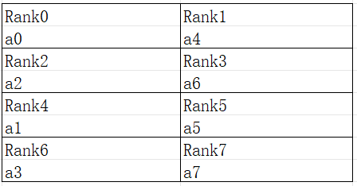
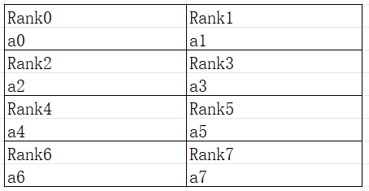

# 高阶算子级并行

[](https://gitee.com/mindspore/docs/blob/master/docs/mindspore/source_zh_cn/model_train/parallel/advanced_operator_parallel.md)

## 概述

[算子级并行](https://www.mindspore.cn/docs/zh-CN/master/model_train/parallel/operator_parallel.html) 是大模型训练推理中常用的并行技术，它可以将张量切分到多卡上，有效降低单卡上的显存。

在MindSpore中，算子级并行的配置是通过mindspore.ops.Primitive.shard()接口实现的。该接口通过tuple描述每个输入张量的切分方式，适用于大多数场景，配置过程较为简单。然而，这种切分方式仅描述了张量的切分逻辑，却隐藏了张量在设备rank上的具体排布。因此，它在表达张量切分与设备排布之间的映射关系时存在局限性，无法满足一些复杂场景的需求。

为了应对这些复杂场景，本教程将介绍一种开放设备排布描述的高阶算子级并行配置方法。

> 高阶算子级并行模型支持的硬件平台包括Ascend、GPU，需要在Graph模式下运行。

## 背景

[算子级并行](https://www.mindspore.cn/docs/zh-CN/master/model_train/parallel/operator_parallel.html) 章节中介绍了MindSpore对张量的基本切分逻辑，但不能表达出所有的切分场景。例如，对于一个二维张量 "[[a0, a1, a2, a3], [a4, a5, a6, a7]]"，其张量排布如下图所示：



*图：二维张量排布示意*

由图可知，张量的0轴，如"[a0, a1, a2, a3]"切分到了不连续的卡"[Rank0, Rank4, Rank2, Rank6]"上，而该张量按照strategy=(2, 4)切分，排布应该如下图所示：



*图：二维张量按照切分策略排布示意*

因此，直接对算子的输入/输出张量按照切分数目进行切分，无法表达出一些有特殊诉求的切分场景。

## 接口配置

为了表达出如上述场景下的切分，[shard](https://www.mindspore.cn/docs/zh-CN/master/api_python/mindspore/mindspore.shard.html) 接口进行了功能扩展。

入参in_strategy和out_strategy都额外接收新的数量类型——tuple(Layout)。其中[Layout](https://www.mindspore.cn/docs/zh-CN/master/api_python/mindspore/mindspore.Layout.html) 通过设备矩阵进行初始化，并同时要求给设备矩阵的每个轴取一个别名。例如："layout = Layout((8, 4, 4), name = ("dp", "sp", "mp"))"表示该设备共有128张卡，按照(8, 4, 4)的形状进行排列，并为每个轴分别取了别名"dp"、"sp"、"mp"。

在调用Layout时，通过传入这些轴的别名，每个张量根据其形状（shape）决定每个维度映射到设备矩阵的哪个轴，以及对应的切分份数。例如：

- "dp"表示在设备排布的最高维度的8个设备内切分为8份；
- "sp"表示在设备排布的中间维度的4个设备内切分为4份；
- "mp"表示在设备排布的最低维度的4个设备内切分为4份。

特别地，张量的一个维度可以映射到设备的多个维度，以表达在一个维度进行多次切分。

针对上述例子中"[[a0, a1, a2, a3], [a4, a5, a6, a7]]"切分到不连续卡上的情况，可以通过如下Layout表达：

```python
from mindspore import Layout
a = [[a0, a1, a2, a3], [a4, a5, a6, a7]]
layout = Layout((2, 2, 2), name = ("dp", "sp", "mp"))
a_strategy = layout("mp", ("sp", "dp"))
```

可以看到，在张量a的"[a0, a1, a2, a3]"上进行了两次切分，从而切分到了设备的"sp"与"mp"两个轴上，这样出来的结果才是：


下面，通过一个具体的例子，演示用户在8个卡上计算二维矩阵乘：`Y = (X * W)` 。其中，设备按照`2 * 2 * 2`进行组织；X的切分与上述的张量a切分一致。代码如下所示：

```python
import mindspore.nn as nn
from mindspore import ops, Layout
import mindspore as ms

ms.set_auto_parallel_context(parallel_mode=ms.ParallelMode.SEMI_AUTO_PARALLEL, device_num=8)

class DenseMatMulNet(nn.Cell):
    def __init__(self):
        super(DenseMatMulNet, self).__init__()
        layout = Layout((2, 2, 2), name = ("dp", "sp", "mp"))
        in_strategy = (layout("mp", ("sp", "dp")), layout(("sp", "dp"), "None"))
        out_strategy = (layout(("mp", "sp", "dp"), "None"), )
        self.matmul1 = ops.MatMul().shard(in_strategy, out_strategy)
    def construct(self, x, w):
        y = self.matmul1(x, w)
        return y
```

## 操作实践

下面以Ascend或者GPU单机8卡为例，进行算子级并行操作说明。

### 样例代码说明

> 下载完整的样例代码：[distributed_operator_parallel](https://gitee.com/mindspore/docs/tree/master/docs/sample_code/distributed_operator_parallel)。

目录结构如下：

```text
└─ sample_code
    ├─ distributed_operator_parallel
       ├── advanced_distributed_operator_parallel.py
       ├── run_advanced.sh
       └── ...
    ...
```

其中，`advanced_distributed_operator_parallel.py`是定义网络结构和训练过程的脚本；`run_advanced.sh`是执行脚本。

### 配置分布式环境

通过context接口，用户可以指定运行模式、运行设备、运行卡号等配置。与单卡脚本不同，并行脚本需要额外指定并行模式`parallel_mode`为半自动并行模式，并通过init初始化HCCL或NCCL通信。

此外，在Ascend硬件平台上，为确保通信有足够的设备内存，需要预留部分内存，则可通过设置`max_size`参数限制模型可使用的最大设备内存；在GPU上则不需要预留。此处，若不设置`device_target`，则会自动指定为MindSpore包对应的后端硬件设备。

配置示例如下所示：

```python
import mindspore as ms
from mindspore.communication import init

ms.set_context(mode=ms.GRAPH_MODE)
ms.runtime.set_memory(max_size="28GB")
ms.set_auto_parallel_context(parallel_mode=ms.ParallelMode.SEMI_AUTO_PARALLEL)
init()
ms.set_seed(1)
```

### 数据集加载

在算子级并行场景下，数据集加载方式与单卡加载方式一致。

代码如下所示：

```python
import os
import mindspore.dataset as ds

def create_dataset(batch_size):
    dataset_path = os.getenv("DATA_PATH")
    dataset = ds.MnistDataset(dataset_path)
    image_transforms = [
        ds.vision.Rescale(1.0 / 255.0, 0),
        ds.vision.Normalize(mean=(0.1307,), std=(0.3081,)),
        ds.vision.HWC2CHW()
    ]
    label_transform = ds.transforms.TypeCast(ms.int32)
    dataset = dataset.map(image_transforms, 'image')
    dataset = dataset.map(label_transform, 'label')
    dataset = dataset.batch(batch_size)
    return dataset

data_set = create_dataset(32)
```

### 定义网络

在当前半自动并行模式下，需要用ops算子(Primitive)定义网络。用户可以在单卡网络的基础上手动配置一些算子的切分策略。

例如，配置策略后的网络结构为：

```python
import mindspore as ms
from mindspore import nn, ops

class Network(nn.Cell):
    def __init__(self):
        super().__init__()
        self.flatten = ops.Flatten()
        self.fc1_weight = ms.Parameter(initializer("normal", [28*28, 512], ms.float32))
        self.fc2_weight = ms.Parameter(initializer("normal", [512, 512], ms.float32))
        self.fc3_weight = ms.Parameter(initializer("normal", [512, 10], ms.float32))
        self.matmul1 = ops.MatMul()
        self.relu1 = ops.ReLU()
        self.matmul2 = ops.MatMul()
        self.relu2 = ops.ReLU()
        self.matmul3 = ops.MatMul()

    def construct(self, x):
        x = self.flatten(x)
        x = self.matmul1(x, self.fc1_weight)
        x = self.relu1(x)
        x = self.matmul2(x, self.fc2_weight)
        x = self.relu2(x)
        logits = self.matmul3(x, self.fc3_weight)
        return logits

net = Network()
layout = Layout((2, 2, 2), ("dp", "sp", "mp"))
net.matmul1.shard((layout("mp", ("sp", "dp")), layout(("sp", "dp"), "None")))
net.relu1.shard(((4, 1),))
layout2 = Layout((8,), ("tp",))
net.matmul2.shard((layout2("None", "tp"), layout2("tp", "None")))
net.relu2.shard(((8, 1),))
```

以上网络的`ops.MatMul()`和`ops.ReLU()`算子都配置了切分策略，其中`net.matmul1`同样与上文中张量a的切分排布一致，`net.matmul2`在MatMul的Reduce轴切分了8份。

### 训练网络

在训练网络时，需要定义损失函数、优化器以及训练过程，这部分与单卡写法一致。

代码如下所示：

```python
import mindspore as ms
from mindspore import nn

optimizer = nn.SGD(net.trainable_params(), 1e-2)
loss_fn = nn.CrossEntropyLoss()

def forward_fn(data, target):
    logits = net(data)
    loss = loss_fn(logits, target)
    return loss, logits

grad_fn = ms.value_and_grad(forward_fn, None, net.trainable_params(), has_aux=True)

@ms.jit
def train_step(inputs, targets):
    (loss_value, _), grads = grad_fn(inputs, targets)
    optimizer(grads)
    return loss_value

for epoch in range(10):
    i = 0
    for image, label in data_set:
        loss_output = train_step(image, label)
        if i % 10 == 0:
            print("epoch: %s, step: %s, loss is %s" % (epoch, i, loss_output))
        i += 1
```

### 运行单机8卡脚本

接下来，通过命令调用对应的脚本，以`mpirun`启动方式，8卡的分布式训练脚本为例，进行分布式训练。

代码如下所示：

```bash
bash run_advanced.sh
```

训练完后，日志文件保存到`log_output`目录下。其中，部分文件目录结构如下所示：

```text
└─ log_output
    └─ 1
        ├─ rank.0
        |   └─ stdout
        ├─ rank.1
        |   └─ stdout
...
```

关于Loss部分结果保存在`log_output/1/rank.*/stdout`中，示例如下所示：

```text
epoch: 0, step: 0, loss is 2.3016002
epoch: 0, step: 10, loss is 2.2889402
epoch: 0, step: 20, loss is 2.2848126
epoch: 0, step: 30, loss is 2.248126
epoch: 0, step: 40, loss is 2.1581488
epoch: 0, step: 50, loss is 1.8051043
epoch: 0, step: 60, loss is 1.571685
epoch: 0, step: 70, loss is 1.267063
epoch: 0, step: 80, loss is 0.9873328
epoch: 0, step: 90, loss is 0.7807965
...
```

其他启动方式如动态组网、`rank table`的启动可参考[启动方式](https://www.mindspore.cn/docs/zh-CN/master/model_train/parallel/startup_method.html)。
