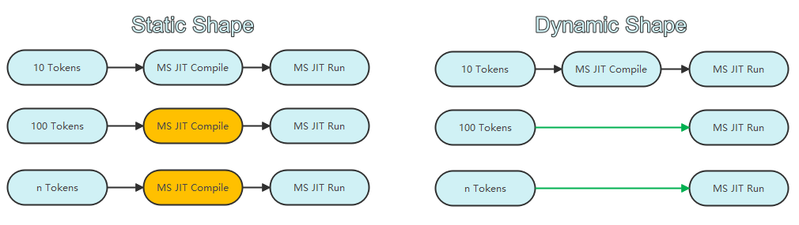
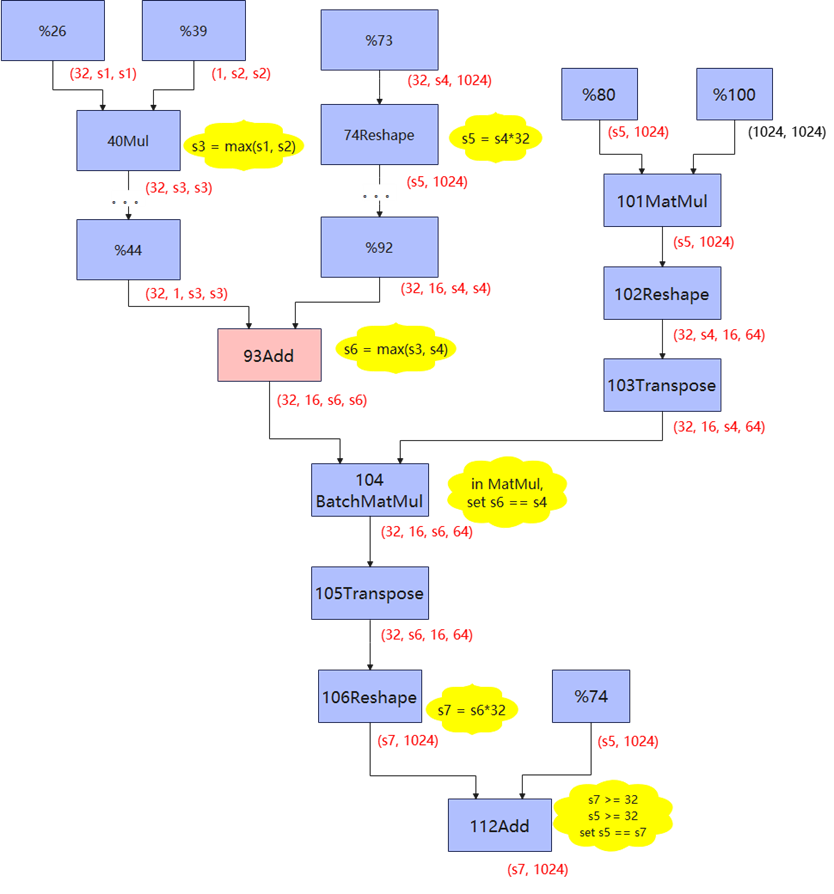

# 静态图动态shape

[](https://gitee.com/mindspore/docs/blob/master/docs/mindspore/source_zh_cn/model_train/train_process/dynamic_shape.md)

## 背景介绍

动态shape是深度学习框架领域较为常见的一个研究课题，MindSpore针对动态shape也做了大量的探索与研究，并且基于研究成果初步支持了静态图模式下的动态shape能力。

本文主要针对MindSpore静态图动态shape作说明介绍，后文中动态shape均泛指静态图动态shape。
动态shape需要解决的核心问题是输入数据尺寸变化时，如何做到一次编译多次执行。通过静态shape处理多尺寸数据与通过动态shape处理多尺寸数据的流程对比示意图如下：



如上图所示，当输入多种尺寸的数据时，静态shape会对每一种输入尺寸都进行一次编译，而动态shape只需要编译一次，因此动态shape相比静态shape节省了大量的编译耗时，因此能提升网络端到端执行性能。

## 符号引擎设计

虽然动态shape弥补了静态shape多次编译的不足，但是也带来了执行性能下降、无法进行并行切分、无法进行内存复用优化等新的挑战。MindSpore通过支持符号引擎能力，继承了静态shape
场景下的大部分并行切分能力和算子融合能力，并通过虚拟内存实现了内存的深度优化，实现动态shape执行性能和内存效率达到静态shape的90%左右。

动态shape通过符号shape来表达shape，例如存在两组输入数据为Tensor(shape=(8, 10))和Tensor(shape=(8, 100))，使用静态shape多次编译会产生Tensor(shape=(8, 10))
和Tensor(shape=(8, 100))两种IR，动态shape产生Tensor(shape=(8, Any))一种IR，Any表示axis为动态，通过符号引擎shape可进一步将动态shape IR表示
为Tensor(shape=(8, 10*s1))。符号shape通过符号运算来表达shape的推导过程，以实现在动态shape场景下用符号判断代替数值判断的能力。一次基于符号引擎推导动态shape的IR
的示例如下：



如图，符号引擎将输入结点的shape标记为`s1`, `s2`等，在算子shape推导时，将输出shape存为基于输入shape的表达式。例如：对于`40Mul`结点，它的输出shape不再是Any，而是`max(s1,s2)`；到`104BatchMatMul`结点，基于矩阵乘的约束，可以直接设定`s4 == s6`；对于`112Add`结点，因为`s5`和`s7`都是大于1的值，可以断定此结点不存在广播场景，从而判断出`s5`与`s7`相等。通过符号shape引擎，动态shape也具备了一定的shape判断能力，框架可以在此基础上完成更多计算图优化功能。

符号引擎的详细使用指导可参考[Symbol API文档](https://www.mindspore.cn/docs/zh-CN/master/api_python/mindspore/mindspore.Symbol.html)。

## 使用方法

MindSpore通过set_inputs接口设置静态图输入Tensor对应的axis为动态，使能网络动态shape编译。
例如，对两个矩阵进行相加，矩阵的大小变化的，此时我们希望矩阵相加对应的计算逻辑只编译一次，输入不同尺寸的矩阵进行计算时可以复用同一次编译过程。
设置动态shape编译，如何指定对应axis为动态，可以使用符号引擎和set_inputs接口进行设置，mindspore.jit装饰器方式请使用input_signature参数进行设置。
下述样例是一个通过动态shape实现多个不同尺寸的矩阵自身相加的示例：

```python
import numpy as np
import mindspore as ms
from mindspore import nn, Tensor, Symbol

class Net(nn.Cell):
    def construct(self, x):
        return x + x

ms.context.set_context(mode=ms.context.GRAPH_MODE)
net = Net()
width = Symbol()
height = Symbol()
dyn_t = Tensor(shape=(width, height), dtype=ms.float32)
# Set Tensor shape dynamic
net.set_inputs(dyn_t)
# Execute with shape=(2 ,3)
input_x1 = Tensor(np.random.randn(2, 3), dtype=ms.float32)
out = net(input_x1)
# Execute with shape=(4, 5)
input_x2 = Tensor(np.random.randn(4, 5), dtype=ms.float32)
out = net(input_x2)
```

set_inputs详细使用指导可参考[Cell.set_inputs API文档](https://www.mindspore.cn/docs/zh-CN/master/api_python/nn/mindspore.nn.Cell.html#mindspore.nn.Cell.set_inputs)。

input_signature详细使用指导可参考[mindspore.jit API文档](https://www.mindspore.cn/docs/zh-CN/master/api_python/mindspore/mindspore.jit.html)。

分布式并行场景如何使用动态shape可参考[分布式并行支持动态shape文档](https://www.mindspore.cn/docs/zh-CN/master/model_train/parallel/support_dynamic_shape_in_parallel.html)。

## 支持情况

MindSpore在当前版本仅有部分API可以支持动态shape编译执行，正在持续完善全量API的支持能力，当前阶段[mindspore.mint](https://www.mindspore.cn/docs/zh-CN/master/api_python/mindspore.mint.html)接口支持动态shape。
