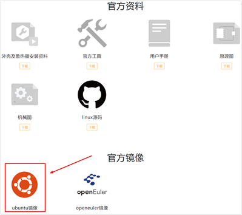
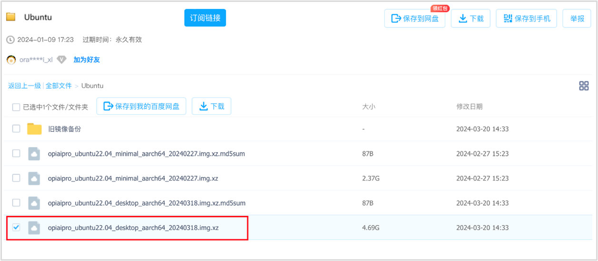
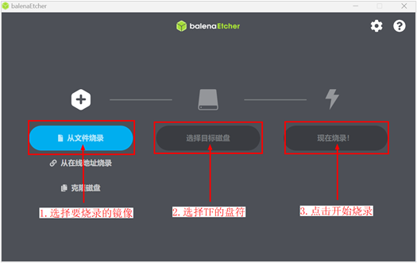
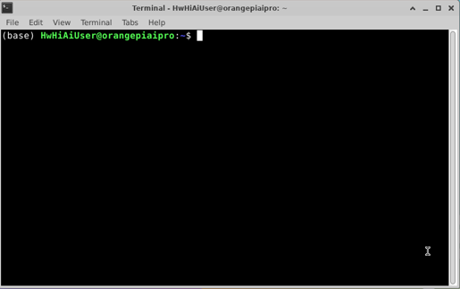
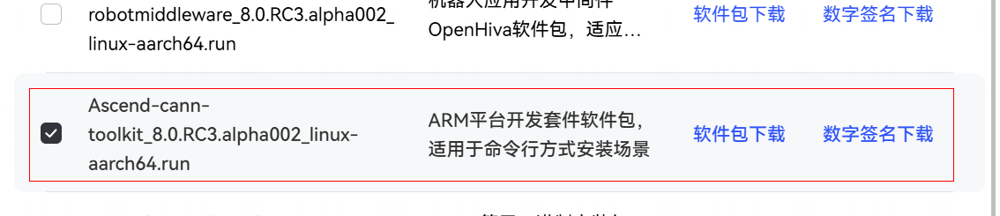
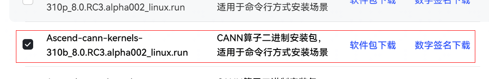
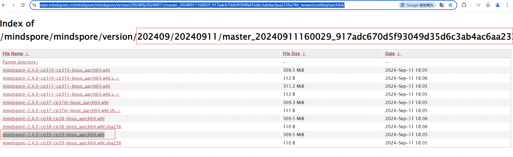

# 环境搭建指南

[](https://gitee.com/mindspore/docs/blob/master/docs/mindspore/source_zh_cn/orange_pi/environment_setup.md)

本章节将介绍如何在OrangePi AIpro上烧录镜像，自定义安装CANN和MindSpore，并配置运行环境。

## 1. 镜像烧录（以Windows系统为例）

镜像烧录可以在任何操作系统内执行，这里将以在Windows系统为例，演示使用相应版本的balenaEtcher工具，快速烧录镜像至您的Micro SD卡。

### 1.1 制卡前准备

步骤1 将Micro SD卡插入读卡器，并将读卡器插入PC。


### 1.2 下载Ubuntu镜像

步骤1 点击[此链接](http://www.orangepi.cn/html/hardWare/computerAndMicrocontrollers/service-and-support/Orange-Pi-AIpro.html)进入镜像下载页面。

> 此处仅做示意，不同算力开发板镜像下载地址不同，详细请查看[此链接](http://www.orangepi.cn/html/hardWare/computerAndMicrocontrollers/details/Orange-Pi-AIpro(20T).html)。

步骤2 点击图片中箭头图标跳转百度网盘下载页面。



步骤3 选择桌面版本下载，建议下载0318版本环境。



步骤4 备选下载方式。

如果百度网盘下载过慢，可以使用[此链接](https://obs-9be7.obs.cn-east-2.myhuaweicloud.com/OrangePi/20240318/opiaipro_ubuntu22.04_desktop_aarch64_20240318.img.xz)直接下载。

### 1.3 下载制卡工具

有两种制卡工具balenaEtcher、Rufus，可根据自己电脑情况任选一种工具进行烧录。

- balenaEtcher制卡工具：

  步骤1 下载balenaEtcher。

  点击[此链接](https://etcher.balena.io/)可跳转到软件官网，点击绿色的下载按钮会跳到软件下载的地方。

  

  步骤2 选择下载 Portable版本。

  Portable版本无需安装，双击打开即可使用。

  

  步骤3 备选下载方式。

  如果官方网站下载过慢，可以使用以[此链接](https://obs-9be7.obs.cn-east-2.myhuaweicloud.com/OrangePi/balenaEtcher/balenaEtcher-Setup-1.18.4.exe )直接下载balenaEtcher-Setup-1.18.4软件。

  步骤4 打开balenaEtcher。

  

  

- Rufus制卡工具：

  步骤1 Rufus下载。

  点击[此链接](https://github.com/pbatard/rufus/releases/download/v4.5/rufus-4.5.exe)，进行下载、安装。

### 1.4 选择和烧录镜像

这里介绍balenaEtcher、Rufus两种制卡工具烧录镜像，您可按对应工具进行烧录。

- balenaEtcher烧录镜像：

  步骤1 选择镜像、TF卡，启动烧录。

  1. 选择要烧录的镜像文件（上文1.2下载Ubuntu镜像的保存路径）。

  2. 选择TF卡的盘符。

  3. 点击开始烧录，如下图：

  

  烧录和验证大概需要20分钟左右，请耐心等待：

  

  

  步骤2 烧录完成。

  烧录完成后，balenaEtcher的显示界面如下图所示，如果显示绿色的指示图标说明镜像烧录成功，此时就可以退出balenaEtcher，拔出TF卡，插入到开发板的TF卡槽中使用：

  

- Rufus烧录镜像：

  步骤1 选择镜像、TF卡，烧录镜像。

  sd卡插入读卡器，读卡器插入电脑、选择镜像与sd卡，点击“开始”。

  

  步骤2 烧录完成。

  等待结束后直接拔出读卡器。

  

## 2. CANN升级

### 2.1 Toolkit升级

步骤1 打开终端，切换root用户。

使用`CTRL+ALT+T`快捷键或点击页面下方带有`$_`的图标打开终端。



切换root用户，root用户密码：Mind@123。

```bash

# 打开开发板的一个终端，运行如下命令

(base) HwHiAiUser@orangepiaipro:~$ su – root
 Password:
(base) root@orangepiaipro: ~#

```

步骤2 删除镜像中已安装CANN包释放磁盘空间，防止安装新的CANN包时报错磁盘空间不足。

```bash

(base) root@orangepiaipro: ~# cd /usr/local/Ascend/ascend-toolkit
(base) root@orangepiaipro: /usr/local/Ascend/ascend-toolkit # rm -rf *

```

步骤3 打开昇腾CANN官网访问社区版资源[下载地址](https://www.hiascend.com/developer/download/community/result?module=cann)，下载所需版本的toolkit包，该处以8.0.RC2.alpha003版本为例，如下图：



> 执行如下命令，根据环境实际输出信息选择aarch64或是x86_64对应的软件包。

   ```bash
   uname -a
   ```

步骤4 进入Toolkit包下载目录。

```bash
(base) root@orangepiaipro: /usr/local/Ascend/ascend-toolkit# cd /home/HwHiAiUser/Downloads
```

> Orange Pi AI Pro浏览器文件默认下载目录：/home/HwHiAiUser/Downloads，用户在更换保存路径时请同步修改上述命令中的路径。

步骤5 给CANN包添加执行权限。

```bash
(base) root@orangepiaipro: /home/HwHiAiUser/Downloads# chmod +x ./Ascend-cann-toolkit_8.0.RC2.alpha003_linux-aarch64.run
```

步骤6 执行以下命令升级软件。

```bash
(base) root@orangepiaipro: /home/HwHiAiUser/Downloads#./Ascend-cann-toolkit_8.0.RC2.alpha003_linux-aarch64.run --install
```

安装时弹出此提示后输入Y，然后按回车键继续安装。


升级完成后，若显示如下信息，则说明软件升级成功：

```bash
xxx install success

```

- xxx表示升级的实际软件包名。

- 安装升级后的路径（以root用户默认安装升级路径为例）：“/usr/local/Ascend/ ascend-toolkit/

步骤7 配置并加载环境变量。

```bash

(base) root@orangepiaipro: /home/HwHiAiUser/Downloads # echo “source /usr/local/Ascend/ascend-toolkit/set_env.sh” >> ~/.bashrc
(base) root@orangepiaipro: /home/HwHiAiUser/Downloads # source ~/.bashrc

```

### 2.2 Kernels升级

> 二进制算子包Kernels依赖CANN软件包Toolkit，执行升级时，当前环境需已安装配套版本的Toolkit，并使用同一用户安装。

步骤1 打开终端，并切换root用户。

root用户密码：Mind@123。

```bash

# 打开开发板的一个终端，运行如下命令

(base) HwHiAiUser@orangepiaipro:~$ su – root
 Password:
(base) root@orangepiaipro: ~#

```

步骤2 执行如下命令，获取开发板NPU型号。

```bash
npu-smi info
```

步骤3 打开昇腾CANN官网访问社区版资源[下载地址](https://www.hiascend.com/developer/download/community/result?module=cann)，下载与CANN包版本一致，并且匹配NPU型号的kernel包，如下图：



步骤4 进入Kernels包下载目录。

```bash
(base) root@orangepiaipro: /usr/local/Ascend/ascend-toolkit# cd /home/HwHiAiUser/Downloads
```

> Orange Pi AI Pro浏览器文件默认下载目录：/home/HwHiAiUser/Downloads

步骤5 给kernels包添加执行权限。

```bash
(base) root@orangepiaipro: /home/HwHiAiUser/Downloads# chmod +x ./Ascend-cann-kernels-310b_8.0.RC2.alpha003_linux.run
```

步骤6 执行以下命令升级软件。

```bash
(base) root@orangepiaipro: /home/HwHiAiUser/Downloads#./Ascend-cann-kernels-310b_8.0.RC2.alpha003_linux.run --install
```

升级完成后，若显示如下信息，则说明软件升级成功：

```bash
xxx install success
```

- xxx表示升级的实际软件包名。

- 安装升级后的路径（以root用户默认安装升级路径为例）：“/usr/local/Ascend/ ascend-toolkit/latest/opp/built-in/op_impl/ai_core/tbe/kernel”。

## 3. MindSpore升级

### 3.1 安装官网正式版（以MindSpore2.3.1为例）

方法一：以HwHiAiUser用户打开终端，在终端直接运行pip install命令。

```bash
pip install mindspore==2.3.1
```

方法二：参考[昇思MindSpore官网安装教程](https://www.mindspore.cn/install) 安装。

```bash

pip install https://ms-release.obs.cn-north-4.myhuaweicloud.com/2.3.1/MindSpore/unified/aarch64/mindspore-2.3.1-cp39-cp39-linux_aarch64.whl --trusted-host ms-release.obs.cn-north-4.myhuaweicloud.com -i https://pypi.tuna.tsinghua.edu.cn/simple

# 注意确认操作系统和编程语言，香橙派开发板默认环境下是linux-aarch64和python3.9

```

### 3.2 安装MindSpore daily包（以9月11日daily包为例）

香橙派开发板支持自定义安装MindSpore daily包，可从[此链接](https://repo.mindspore.cn/mindspore/mindspore/version/)获取到对应日期的软件包。

- 目标 daily whl包具体查找过程如下：

  1. 进入以master为前缀的目录。若是出现多个目录前缀是master时，推荐进入日期更靠后的目录。

  2. 进入unified目录。

  3. 根据实际操作系统信息，进入对应目录。由于香橙派开发板默认操作系统为linux-aarch64，所以进入aarch64目录。

  4. 根据实际python版本信息，找到对应daily whl包。由于香橙派开发板默认为python3.9，所以目标daily包为mindspore-2.4.0-cp39-cp39-linux_aarch64.whl。

  

> 本教程旨在让开发者体验到最新的版本特定，但由于daily包并不是正式发布版本，在运行中可能会出现一些问题，开发者可通过[社区](https://gitee.com/mindspore/mindspore)提交issue，或可自行修改并提交PR。

- 下载whl包进行安装，终端运行如下命令。

```bash

# wget下载whl包
wget https://repo.mindspore.cn/mindspore/mindspore/version/202409/20240911/master_20240911160029_917adc670d5f93049d35d6c3ab4ac6aa2339a74b_newest/unified/aarch64/mindspore-2.4.0-cp39-cp39-linux_aarch64.whl

# 在终端进入到whl包所在路径，再运行pip install命令进行安装
pip install mindspore-2.4.0-cp39-cp39-linux_aarch64.whl

```
