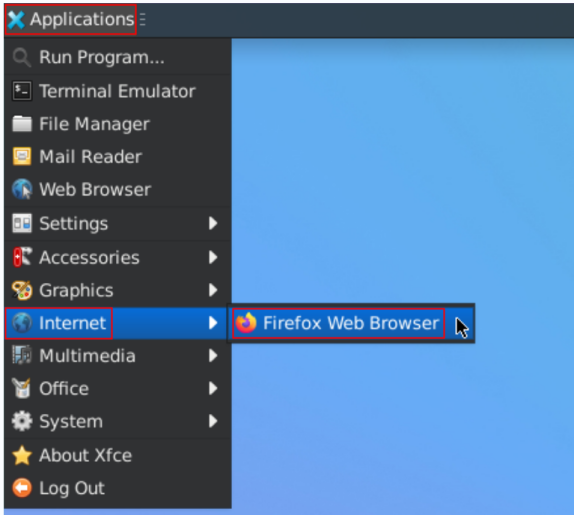
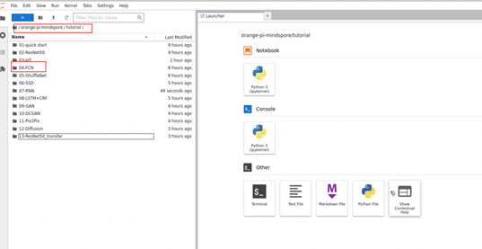
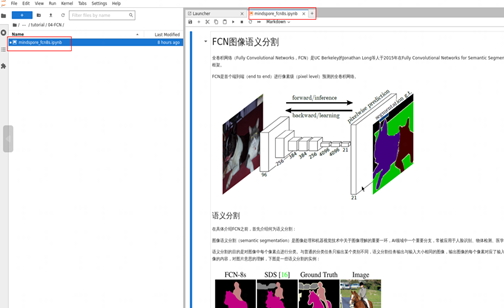
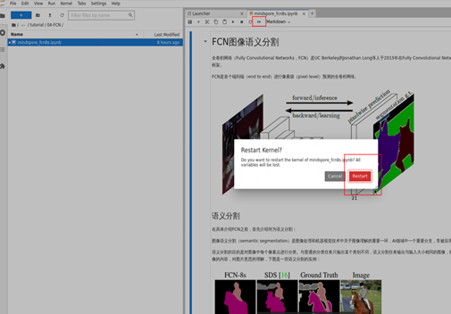

# 模型在线推理

[](https://gitee.com/mindspore/docs/blob/master/docs/mindspore/source_zh_cn/orange_pi/model_infer.md)

本章节将介绍如何在OrangePi AIpro（下称：香橙派开发板）下载昇思MindSpore在线推理案例，并启动Jupyter Lab界面执行推理。

## 1. 下载案例

步骤1 下载案例代码。

```bash
# 打开开发板的一个终端，运行如下命令
cd samples/notebooks/
git clone https://github.com/mindspore-courses/orange-pi-mindspore.git
```

步骤2 进入案例目录。

下载的代码包在香橙派开发板的如下目录中：/home/HwHiAiUser/samples/notebooks。

项目目录如下：

```bash
/home/HwHiAiUser/samples/notebooks/orange-pi-mindspore/tutorial/
01-dev_start
02-ResNet50
03-ViT
04-FCN
05-Shufflenet
06-SSD
07-RNN
08-LSTM+CRF
09-GAN
10-DCGAN
11-Pix2Pix
12-Diffusion  
13-ResNet50_transfer
```

## 2. 推理执行

步骤1 启动Jupyter Lab界面。

```bash
cd /home/HwHiAiUser/samples/notebooks/  
./start_notebook.sh
```

在执行该脚本后，终端会出现如下打印信息，在打印信息中会有登录Jupyter Lab的网址链接。


然后打开浏览器。



再在浏览器中输入上面看到的网址链接，就可以登录Jupyter Lab软件了。


步骤2 在Jupyter Lab界面双击下图所示的案例目录，此处以“04-FCN”为例，即可进入到该案例的目录中。



步骤3 在该目录下有运行该示例的所有资源，其中mindspore_fcn8s.ipynb是在Jupyter Lab中运行该样例的文件，双击打开mindspore_fcn8s.ipynb，在右侧窗口中会显示。mindspore_fcn8s.ipynb文件中的内容，如下图所示：



步骤4 单击⏩按钮运行样例，在弹出的对话框中单击“Restart”按钮，此时该样例开始运行。


