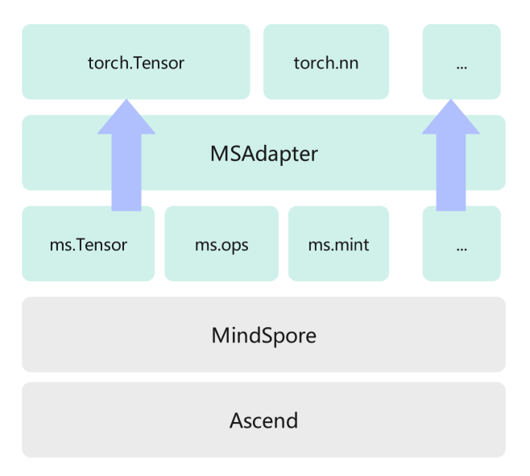

MSAdapter 文档
=========================================

本文档为MSAdapter的使用文档说明，旨在帮助用户将PyTorch适配至MSAdapter，或者直接使用MSAdapter进行开发。

MSAdapter介绍
----------------

MSAdapter是鹏城实验室开发的兼容PyTorch生态的兼容层。在不改变用户原有的使用习惯下，经过MSAdapter与MindSpore对昇腾平台的适配，现已支持在昇腾平台上使用PyTorch前端脚本在MindSpore后端上高效运行。

MSAdapter目前支持大部分PyTorch常用接口适配，参考 `API文档 <https://www.mindspore.cn/msadapter/docs/zh-CN/master/api.html>`_ 。用户代码可以在接口使用方式不变的情况下，基于MindSpore动态图模式，直接执行在昇腾算力平台上。可以在 `PyTorch接口支持列表 <https://www.mindspore.cn/msadapter/docs/zh-CN/master/note/pytorch_api_supporting_torch.html>`_ 中查看接口支持情况。

代码仓地址： <https://openi.pcl.ac.cn/OpenI/MSAdapter>

MSAdapter能提供什么能力
-----------------------------

- 与PyTorch相同的计算接口
- 与PyTorch相同数据类型
- 使用PyTorch checkpoint

MSAdapter使用核心与目标
---------------------------

用户安装MSAdapter之后，根据分析结果，修改少量代码/或不修改后，即可在NPU调用后端MindSpore运行。

用户在进行安装后，无缝运行MindSpore是我们的核心目的。目前复杂代码仍有一些限制，但功能会逐渐补齐。

使用流程
-------------------

1. `安装 <https://www.mindspore.cn/msadapter/docs/zh-CN/master/msadapter_user_guide/install.html>`_
2. `MSAdapter机制性约束 <https://www.mindspore.cn/msadapter/docs/zh-CN/master/msadapter_user_guide/constraints.html>`_
3. 运行

   - 配置环境变量 `export $PYTHONPATH=workspace/msadapter/mindtorch` 后，运行与原始方式一致。
4. 报错与修改

   1. 通过报错信息，判断是否为 `MSAdapter机制性约束 <https://www.mindspore.cn/msadapter/docs/zh-CN/master/msadapter_user_guide/constraints.html>`_。
   2. 如果不是机制性约束，查看 `API文档 <https://www.mindspore.cn/msadapter/docs/zh-CN/master/api.html>`_ 进行修改。
   3. 重复步骤3（运行）和步骤4（报错与修改）。

.. toctree::
   :glob:
   :maxdepth: 1
   :caption: 使用指南
   :titlesonly:
   :hidden:

   msadapter_user_guide/install
   msadapter_user_guide/quick_start
   msadapter_user_guide/constraints
   api
   msadapter_user_guide/llm
