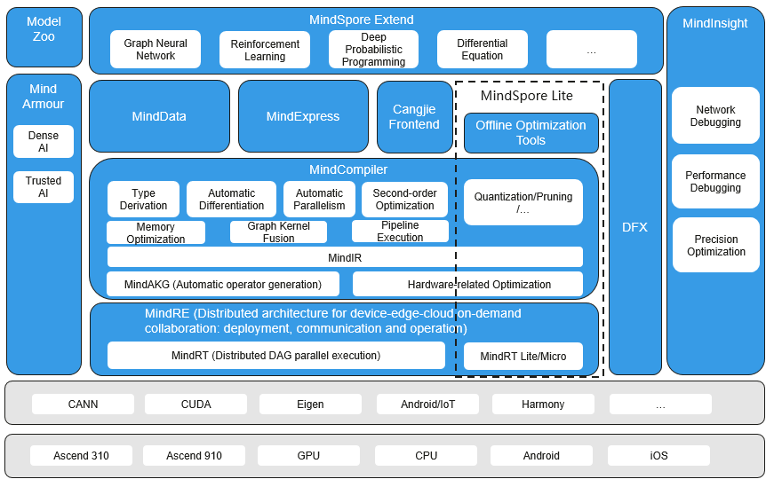

# Overall Architecture

`Linux` `Windows` `Ascend` `GPU` `CPU` `On Device` `Model Development` `Model Optimization` `Framework Development` `Intermediate` `Expert` `Contributor`

MindSpore is a deep learning framework in all scenarios, aiming to achieve easy development, efficient execution, and all-scenario coverage. Easy development features include API friendliness and low debugging difficulty. Efficient execution includes computing efficiency, data preprocessing efficiency, and distributed training efficiency. All-scenario coverage means that the framework supports cloud, edge, and device scenarios.

The overall architecture of MindSpore is shown in the figure below, The following describes the main four parts: extension layer (MindSpore Extend), Front-end expression layer (MindExpress, ME), Compile optimization layer (MindCompiler) and Full-senario runtime (MindRE).

- **MindSpore Extend (extension layer)**: MindSpore's expansion package, we look forward to more developers to contribute and build together.
- **MindExpress (expression layer)**: Based on the front-end expression of Python, we plan to provide different front-ends such as C/C++ and Java in the future; MindSpore is also considering supporting Huawei's self-developed programming language front-endCangjie, which is still in the pre-research stage; at the same time, it is also working with third parties such as Julia. The front-end docking work introduces more third-party ecosystems.
- **MindCompiler (Compile optimization layer)**: The core compiler of the layer is mainly based on the unified MindIR of the end cloud to achieve three major functions, including hardware-independent optimization (type inference, automatic differentiation, expression simplification, etc.), hardware-related optimization (automatic parallelism, memory optimization, graph kernel fusion, pipeline execution, etc.), deployment and inference-related optimizations (quantization, pruning, etc.); among them, MindAKG is MindSpore's automatic operator generation compiler, which is still being continuously improved.
- **MindRE (full-senario runtime)**: This includes cloud side, device side and smaller IoT.

