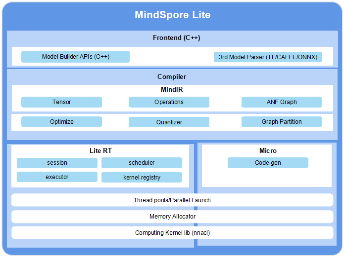

# Overall Architecture (Lite)

`Linux` `Windows` `On Device` `Inference Application` `Intermediate` `Expert` `Contributor`
 

The overall architecture of MindSpore Lite is as follows:

- **Frontend:** generates models. You can use the model building API to build models and convert third-party models and models trained by MindSpore to MindSpore Lite models. Third-party models include TensorFlow Lite, Caffe 1.0, and ONNX models.

- **IR:** defines the tensors, operators, and graphs of MindSpore.

- **Backend:** optimizes graphs based on IR, including graph high level optimization (GHLO), graph low level optimization (GLLO), and quantization. GHLO is responsible for hardware-independent optimization, such as operator fusion and constant folding. GLLO is responsible for hardware-related optimization. Quantizer supports quantization methods after training, such as weight quantization and activation value quantization.

- **Runtime:** inference runtime of intelligent devices. Sessions are responsible for session management and provide external APIs. The thread pool and parallel primitives are responsible for managing the thread pool used for graph execution. Memory allocation is responsible for memory overcommitment of each operator during graph execution. The operator library provides the CPU and GPU operators. 

- **Micro:** runtime of IoT devices, including the model generation .c file, thread pool, memory overcommitment, and operator library.

Runtime and Micro share the underlying infrastructure layers, such as the operator library, memory allocation, thread pool, and parallel primitives. 
