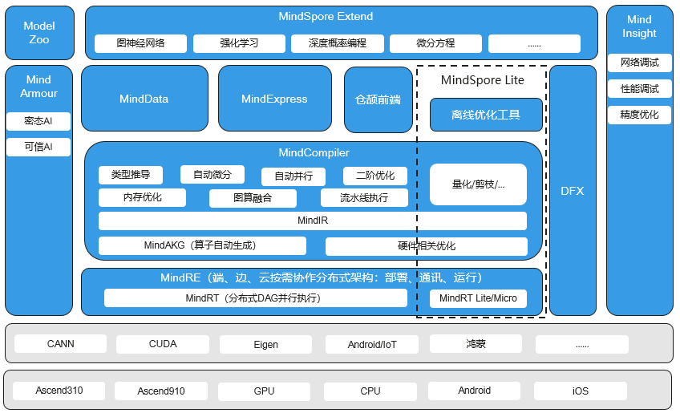

# MindSpore总体架构

`Linux` `Windows` `Ascend` `GPU` `CPU` `端侧` `模型开发` `模型调优` `框架开发` `中级` `高级` `贡献者`

MindSpore是一个全场景深度学习框架，旨在实现易开发、高效执行、全场景覆盖三大目标，其中易开发表现为API友好、调试难度低，高效执行包括计算效率、数据预处理效率和分布式训练效率，全场景则指框架同时支持云、边缘以及端侧场景。

MindSpore总体架构如下图所示，下面介绍主要的扩展层（MindSpore Extend）、前端表达层（MindExpress，ME）、编译优化层（MindCompiler）和全场景运行时（MindRE）四个部分。

- **MindSpore Extend（扩展层）**：MindSpore的扩展包，期待更多开发者来一起贡献和构建。
- **MindExpress（表达层）**：基于Python的前端表达，未来计划陆续提供C/C++、Java等不同的前端；MindSpore也在考虑支持华为自研编程语言前端-仓颉，目前还处于预研阶段；同时也在做与Julia等第三方前端的对接工作，引入更多的第三方生态。
- **MindCompiler（编译优化层）**：图层的核心编译器，主要基于端云统一的MindIR实现三大功能，包括硬件无关的优化（类型推导、自动微分、表达式化简等）、硬件相关优化（自动并行、内存优化、图算融合、流水线执行等）、部署推理相关的优化（量化、剪枝等）；其中，MindAKG是MindSpore的自动算子生成编译器，目前还在持续完善中。
- **MindRE（全场景运行时）**：这里含云侧、端侧以及更小的IoT。

