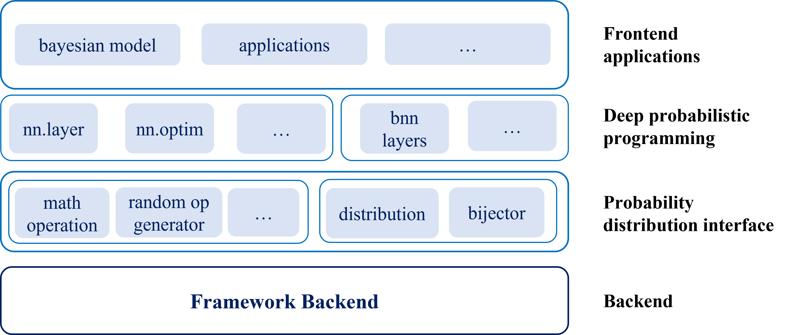

MindSpore Probability Documents
===================================

A deep learning model has a strong fitting capability, and the Bayesian theory has a good explainability. MindSpore probabilistic programming provides a framework that seamlessly integrates Bayesian learning and deep learning. It aims to provide users with a complete probability learning library for establishing probabilistic models and applying Bayesian inference.

Probabilistic programming provides the following functions:

- Abundant statistical distribution and common probabilistic inference algorithms
- Combinable probabilistic programming modules for developers to use the logic of the deep learning model to build a deep probabilistic model
- A toolbox for uncertainty estimation and anomaly detection to extend Bayesian applications

Typical MindSpore Probability Application Scenarios
----------------------------------------------------

1. `Building the Bayesian Neural Network <https://www.mindspore.cn/probability/docs/en/master/using_bnn.html>`_

   Use the Bayesian neural network to classify images.
   
2. `Building the Variational Autoencoder <https://www.mindspore.cn/probability/docs/en/master/using_the_vae.html>`_
   
   Use the variational autoencoder to compress the input data to generate new samples.
   
3. `One-click Conversion from DNN to BNN <https://www.mindspore.cn/probability/docs/en/master/one_click_conversion_from_dnn_to_bnn.html>`_
   
   Convert DNN models into BNN models with one click.
   
4. `Using the Uncertainty Evaluation Toolbox <https://www.mindspore.cn/probability/docs/en/master/using_the_uncertainty_toolbox.html>`_
   
   Use the uncertainty evaluation toolbox to obtain the accidental uncertainty and cognitive uncertainty and to better understand models and datasets.

.. toctree::
   :glob:
   :maxdepth: 1
   :caption: Installation

.. toctree::
   :glob:
   :maxdepth: 1
   :caption: Guide

   using_bnn
   using_the_vae
   one_click_conversion_from_dnn_to_bnn
   using_the_uncertainty_toolbox
   probability
