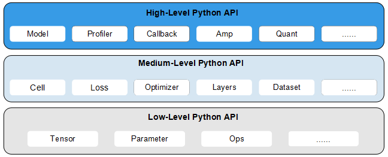

# MindSpore API概述

<a href="https://gitee.com/mindspore/docs/blob/r1.1/docs/programming_guide/source_zh_cn/api_structure.md" target="_blank"></a>
&nbsp;&nbsp;
<a href="https://obs.dualstack.cn-north-4.myhuaweicloud.com/mindspore-website/notebook/r1.1/programming_guide/mindspore_api_overview.ipynb"></a>
&nbsp;&nbsp;
<a href="https://console.huaweicloud.com/modelarts/?region=cn-north-4#/notebook/loading?share-url-b64=aHR0cHM6Ly9vYnMuZHVhbHN0YWNrLmNuLW5vcnRoLTQubXlodWF3ZWljbG91ZC5jb20vbWluZHNwb3JlLXdlYnNpdGUvbm90ZWJvb2svbW9kZWxhcnRzL3Byb2dyYW1taW5nX2d1aWRlL21pbmRzcG9yZV9hcGlfb3ZlcnZpZXcuaXB5bmI=&image_id=65f636a0-56cf-49df-b941-7d2a07ba8c8c" target="_blank"></a>

## 总体架构

MindSpore是一个全场景深度学习框架，旨在实现易开发、高效执行、全场景覆盖三大目标，其中易开发表现为API友好、调试难度低，高效执行包括计算效率、数据预处理效率和分布式训练效率，全场景则指框架同时支持云、边缘以及端侧场景。

MindSpore总体架构分为前端表示层（Mind Expression，ME）、计算图引擎（Graph Engine，GE）和后端运行时三个部分。ME提供了用户级应用软件编程接口（Application Programming Interface，API），用于科学计算以及构建和训练神经网络，并将用户的Python代码转换为数据流图。GE是算子和硬件资源的管理器，负责控制从ME接收的数据流图的执行。后端运行时包含云、边、端上不同环境中的高效运行环境，例如CPU、GPU、Ascend AI处理器、 Android/iOS等。更多总体架构的相关内容请参见[总体架构](https://www.mindspore.cn/doc/note/zh-CN/r1.1/design/mindspore/architecture.html)。

## 设计理念

MindSpore源于全产业的最佳实践，向数据科学家和算法工程师提供了统一的模型训练、推理和导出等接口，支持端、边、云等不同场景下的灵活部署，推动深度学习和科学计算等领域繁荣发展。

MindSpore目前提供了Python编程范式，用户使用Python原生控制逻辑即可构建复杂的神经网络模型，AI编程变得简单，具体示例请参见[实现一个图片分类应用](https://www.mindspore.cn/tutorial/training/zh-CN/r1.1/quick_start/quick_start.html)。

目前主流的深度学习框架的执行模式有两种，分别为静态图模式和动态图模式。静态图模式拥有较高的训练性能，但难以调试。动态图模式相较于静态图模式虽然易于调试，但难以高效执行。MindSpore提供了动态图和静态图统一的编码方式，大大增加了静态图和动态图的可兼容性，用户无需开发多套代码，仅变更一行代码便可切换动态图/静态图模式，例如设置`context.set_context(mode=context.PYNATIVE_MODE)`切换成动态图模式，设置`context.set_context(mode=context.GRAPH_MODE)`即可切换成静态图模式，用户可拥有更轻松的开发调试及性能体验。

神经网络模型通常基于梯度下降算法进行训练，但手动求导过程复杂，结果容易出错。MindSpore的基于源码转换（Source Code Transformation，SCT）的自动微分（Automatic Differentiation）机制采用函数式可微分编程架构，在接口层提供Python编程接口，包括控制流的表达。用户可聚焦于模型算法的数学原生表达，无需手动进行求导，自动微分的样例代码如下所示。

```python
import mindspore as ms
from mindspore import ops


grad_all = ops.composite.GradOperation()


def func(x): return x * x * x


def df_func(x):
    return grad_all(func)(x)


@ms.ms_function
def df2_func(x):
    return grad_all(df_func)(x)


if __name__ == "__main__":
    print(df2_func(ms.Tensor(2, ms.float32)))

```

其中，第一步定义了一个函数（计算图），第二步利用MindSpore提供的反向接口进行自动微分，定义了一个一阶导数函数（计算图），第三步定义了一个二阶导数函数（计算图），最后给定输入就能获取第一步定义的函数在指定处的二阶导数，二阶导数求导结果为`12`。

此外，SCT能够将Python代码转换为MindSpore函数中间表达（Intermediate Representation，IR），该函数中间表达构造出能够在不同设备解析和执行的计算图，并且在执行该计算图前，应用了多种软硬件协同优化技术，端、边、云等不同场景下的性能和效率得到针对性的提升。

如何提高数据处理能力以匹配人工智能芯片的算力，是保证人工智能芯片发挥极致性能的关键。MindSpore为用户提供了多种数据处理算子，通过自动数据加速技术实现了高性能的流水线，包括数据加载、数据论证、数据转换等，支持CV/NLP/GNN等全场景的数据处理能力。MindRecord是MindSpore的自研数据格式，具有读写高效、易于分布式处理等优点，用户可将非标准的数据集和常用的数据集转换为MindRecord格式，从而获得更好的性能体验，转换详情请参见[MindSpore数据格式转换](https://www.mindspore.cn/doc/programming_guide/zh-CN/r1.1/dataset_conversion.html)。MindSpore支持加载常用的数据集和多种数据存储格式下的数据集，例如通过`dataset=dataset.Cifar10Dataset("Cifar10Data/")`即可完成CIFAR-10数据集的加载，其中`Cifar10Data/`为数据集本地所在目录，用户也可通过`GeneratorDataset`自定义数据集的加载方式。数据增强是一种基于（有限）数据生成新数据的方法，能够减少网络模型过拟合的现象，从而提高模型的泛化能力。MindSpore除了支持用户自定义数据增强外，还提供了自动数据增强方式，使得数据增强更加灵活，详情请见[自动数据增强](https://www.mindspore.cn/doc/programming_guide/zh-CN/r1.1/auto_augmentation.html)。

深度学习神经网络模型通常含有较多的隐藏层进行特征提取，但特征提取随机化、调试过程不可视限制了深度学习技术的可信和调优。MindSpore支持可视化调试调优（MindInsight），提供训练看板、溯源、性能分析和调试器等功能，帮助用户发现模型训练过程中出现的偏差，轻松进行模型调试和性能调优。例如用户可在初始化网络前，通过`profiler=Profiler()`初始化`Profiler`对象，自动收集训练过程中的算子耗时等信息并记录到文件中，在训练结束后调用`profiler.analyse()`停止收集并生成性能分析结果，以可视化形式供用户查看分析，从而更高效地调试网络性能，更多调试调优相关内容请见[训练过程可视化](https://www.mindspore.cn/tutorial/training/zh-CN/r1.1/advanced_use/visualization_tutorials.html)。

随着神经网络模型和数据集的规模不断增加，分布式并行训练成为了神经网络训练的常见做法，但分布式并行训练的策略选择和编写十分复杂，这严重制约着深度学习模型的训练效率，阻碍深度学习的发展。MindSpore统一了单机和分布式训练的编码方式，开发者无需编写复杂的分布式策略，在单机代码中添加少量代码即可实现分布式训练，例如设置`context.set_auto_parallel_context(parallel_mode=ParallelMode.AUTO_PARALLEL)`便可自动建立代价模型，为用户选择一种较优的并行模式，提高神经网络训练效率，大大降低了AI开发门槛，使用户能够快速实现模型思路，更多内容请见[分布式并行训练](https://www.mindspore.cn/tutorial/training/zh-CN/r1.1/advanced_use/distributed_training_tutorials.html)。

## 层次结构

MindSpore向用户提供了3个不同层次的API，支撑用户进行网络构建、整图执行、子图执行以及单算子执行，从低到高分别为Low-Level Python API、Medium-Level Python API以及High-Level Python API。



- Low-Level Python API

  第一层为低阶API，主要包括张量定义、基础算子、自动微分等模块，用户可使用低阶API轻松实现张量定义和求导计算，例如用户可通过`Tensor`接口自定义张量，使用`ops.composite`模块下的`GradOperation`算子计算函数在指定处的导数。

- Medium-Level Python API

  第二层为中阶API，其封装了低价API，提供网络层、优化器、损失函数等模块，用户可通过中阶API灵活构建神经网络和控制执行流程，快速实现模型算法逻辑，例如用户可调用`Cell`接口构建神经网络模型和计算逻辑，通过使用`loss`模块和`Optimizer`接口为神经网络模型添加损失函数和优化方式，利用`dataset`模块对数据进行处理以供模型的训练和推导使用。

- High-Level Python API

  第三层为高阶API，其在中阶API的基础上又提供了训练推理的管理、混合精度训练、调试调优等高级接口，方便用户控制整网的执行流程和实现神经网络的训练推理及调优，例如用户使用`Model`接口，指定要训练的神经网络模型和相关的训练设置，对神经网络模型进行训练，通过`Profiler`接口调试神经网络性能。
