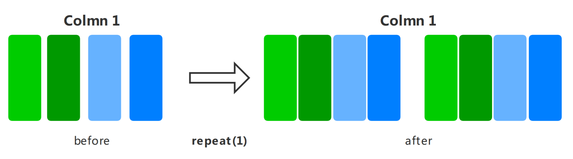
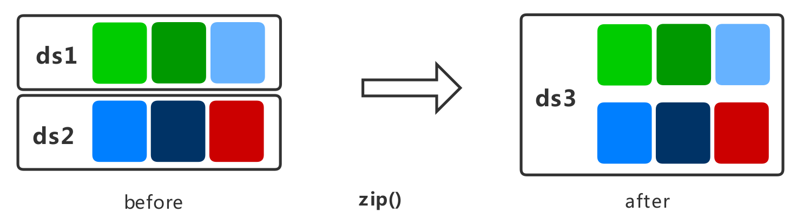
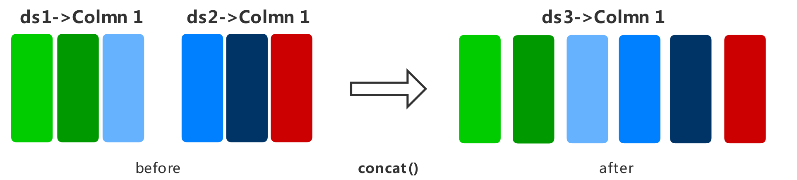

# 数据处理

<a href="https://gitee.com/mindspore/docs/blob/r1.1/docs/programming_guide/source_zh_cn/pipeline.md" target="_blank"></a>
&nbsp;&nbsp;
<a href="https://obs.dualstack.cn-north-4.myhuaweicloud.com/mindspore-website/notebook/r1.1/programming_guide/mindspore_pipeline.ipynb"></a>
&nbsp;&nbsp;
<a href="https://console.huaweicloud.com/modelarts/?region=cn-north-4#/notebook/loading?share-url-b64=aHR0cHM6Ly9vYnMuZHVhbHN0YWNrLmNuLW5vcnRoLTQubXlodWF3ZWljbG91ZC5jb20vbWluZHNwb3JlLXdlYnNpdGUvbm90ZWJvb2svbW9kZWxhcnRzL3Byb2dyYW1taW5nX2d1aWRlL21pbmRzcG9yZV9waXBlbGluZS5pcHluYg==&image_id=65f636a0-56cf-49df-b941-7d2a07ba8c8c" target="_blank"></a>

## 概述

数据是深度学习的基础，良好的数据输入可以对整个深度神经网络训练起到非常积极的作用。在训练前对已加载的数据集进行数据处理，可以解决诸如数据量过大、样本分布不均等问题，从而获得更加优化的数据输入。

MindSpore的各个数据集类都为用户提供了多种数据处理算子，用户可以构建数据处理pipeline定义需要使用的数据处理操作，数据即可在训练过程中像水一样源源不断地经过数据处理pipeline流向训练系统。

MindSpore目前支持的部分常用数据处理算子如下表所示，更多数据处理操作参见[API文档](https://www.mindspore.cn/doc/api_python/zh-CN/r1.1/mindspore/mindspore.dataset.html)。

| 数据处理算子  | 算子说明 |
| ----  | ----           |
| shuffle | 对数据集进行混洗，随机打乱数据顺序。 |
| map | 提供自定义函数或算子，作用于数据集的指定列数据。 |
| batch | 对数据集进行分批，可以减少训练轮次，加速训练过程。 |
| repeat | 对数据集进行重复，达到扩充数据量的目的。 |
| zip | 将两个数据集进行列拼接，合并为一个数据集。 |
| concat | 将两个数据集进行行拼接，合并为一个数据集。 |

## 数据处理算子

### shuffle

对数据集进行混洗，随机打乱数据顺序。

>设定的`buffer_size`越大，混洗程度越大，但时间、计算资源消耗也会更大。


下面的样例先构建了一个随机数据集，然后对其进行混洗操作，最后展示了混洗后的数据结果。

```python
import numpy as np
import mindspore.dataset as ds

ds.config.set_seed(0)

def generator_func():
    for i in range(5):
        yield (np.array([i, i+1, i+2]),)

dataset1 = ds.GeneratorDataset(generator_func, ["data"])

dataset1 = dataset1.shuffle(buffer_size=2)
for data in dataset1.create_dict_iterator():
    print(data)
```

输出结果如下：

```text
{'data': Tensor(shape=[3], dtype=Int64, value=[0, 1, 2])}
{'data': Tensor(shape=[3], dtype=Int64, value=[2, 3, 4])}
{'data': Tensor(shape=[3], dtype=Int64, value=[3, 4, 5])}
{'data': Tensor(shape=[3], dtype=Int64, value=[1, 2, 3])}
{'data': Tensor(shape=[3], dtype=Int64, value=[4, 5, 6])}
```

### map

将指定的函数或算子作用于数据集的指定列数据，实现数据映射操作。用户可以自定义映射函数，也可以直接使用c_transforms或py_transforms中的算子针对图像、文本数据进行数据增强。

>更多数据增强的使用说明，参见编程指南中[数据增强](https://www.mindspore.cn/doc/programming_guide/zh-CN/r1.1/augmentation.html)章节。


下面的样例先构建了一个随机数据集，然后定义了数据翻倍的映射函数并将其作用于数据集，最后对比展示了映射前后的数据结果。

```python
import numpy as np
import mindspore.dataset as ds

def generator_func():
    for i in range(5):
        yield (np.array([i, i+1, i+2]),)

def pyfunc(x):
    return x*2

dataset = ds.GeneratorDataset(generator_func, ["data"])

for data in dataset.create_dict_iterator():
    print(data)

print("------ after processing ------")

dataset = dataset.map(operations=pyfunc, input_columns=["data"])

for data in dataset.create_dict_iterator():
    print(data)
```

输出结果如下：

```text
{'data': Tensor(shape=[3], dtype=Int64, value=[0, 1, 2])}
{'data': Tensor(shape=[3], dtype=Int64, value=[1, 2, 3])}
{'data': Tensor(shape=[3], dtype=Int64, value=[2, 3, 4])}
{'data': Tensor(shape=[3], dtype=Int64, value=[3, 4, 5])}
{'data': Tensor(shape=[3], dtype=Int64, value=[4, 5, 6])}
------ after processing ------
{'data': Tensor(shape=[3], dtype=Int64, value=[0, 2, 4])}
{'data': Tensor(shape=[3], dtype=Int64, value=[2, 4, 6])}
{'data': Tensor(shape=[3], dtype=Int64, value=[4, 6, 8])}
{'data': Tensor(shape=[3], dtype=Int64, value=[ 6,  8, 10])}
{'data': Tensor(shape=[3], dtype=Int64, value=[ 8, 10, 12])}
```

### batch

将数据集分批，分别输入到训练系统中进行训练，可以减少训练轮次，达到加速训练过程的目的。


下面的样例先构建了一个随机数据集，然后分别展示了保留多余数据与否的数据集分批结果，其中批大小为2。

```python
import numpy as np
import mindspore.dataset as ds

def generator_func():
    for i in range(5):
        yield (np.array([i, i+1, i+2]),)

dataset1 = ds.GeneratorDataset(generator_func, ["data"])

dataset1 = dataset1.batch(batch_size=2, drop_remainder=False)
for data in dataset1.create_dict_iterator():
    print(data)

print("------ drop remainder ------")

dataset2 = ds.GeneratorDataset(generator_func, ["data"])

dataset2 = dataset2.batch(batch_size=2, drop_remainder=True)
for data in dataset2.create_dict_iterator():
    print(data)
```

输出结果如下：

```text
{'data': Tensor(shape=[2, 3], dtype=Int64, value=[[0, 1, 2], [1, 2, 3]])}
{'data': Tensor(shape=[2, 3], dtype=Int64, value=[[2, 3, 4], [3, 4, 5]])}
{'data': Tensor(shape=[1, 3], dtype=Int64, value=[[4, 5, 6]])}
------ drop remainder ------
{'data': Tensor(shape=[2, 3], dtype=Int64, value=[[0, 1, 2], [1, 2, 3]])}
{'data': Tensor(shape=[2, 3], dtype=Int64, value=[[2, 3, 4], [3, 4, 5]])}
```

### repeat

对数据集进行重复，达到扩充数据量的目的。

>`repeat`和`batch`操作的顺序会影响训练batch的数量，建议将`repeat`置于`batch`之后。



下面的样例先构建了一个随机数据集，然后将其重复2次，最后展示了重复后的数据结果。

```python
import numpy as np
import mindspore.dataset as ds

def generator_func():
    for i in range(5):
        yield (np.array([i, i+1, i+2]),)

dataset1 = ds.GeneratorDataset(generator_func, ["data"])

dataset1 = dataset1.repeat(count=2)
for data in dataset1.create_dict_iterator():
    print(data)
```

输出结果如下：

```text
{'data': Tensor(shape=[3], dtype=Int64, value=[0, 1, 2])}
{'data': Tensor(shape=[3], dtype=Int64, value=[1, 2, 3])}
{'data': Tensor(shape=[3], dtype=Int64, value=[2, 3, 4])}
{'data': Tensor(shape=[3], dtype=Int64, value=[3, 4, 5])}
{'data': Tensor(shape=[3], dtype=Int64, value=[4, 5, 6])}
{'data': Tensor(shape=[3], dtype=Int64, value=[0, 1, 2])}
{'data': Tensor(shape=[3], dtype=Int64, value=[1, 2, 3])}
{'data': Tensor(shape=[3], dtype=Int64, value=[2, 3, 4])}
{'data': Tensor(shape=[3], dtype=Int64, value=[3, 4, 5])}
{'data': Tensor(shape=[3], dtype=Int64, value=[4, 5, 6])}
```

### zip

将两个数据集进行列拼接，合并为一个数据集。

> 如果两个数据集的列名相同，则不会合并，请注意列的命名。<br>如果两个数据集的行数不同，合并后的行数将和较小行数保持一致。



下面的样例先构建了两个不同样本数的随机数据集，然后将其进行列拼接，最后展示了拼接后的数据结果。

```python
import numpy as np
import mindspore.dataset as ds

def generator_func():
    for i in range(7):
        yield (np.array([i, i+1, i+2]),)

def generator_func2():
    for i in range(4):
        yield (np.array([1, 2]),)

dataset1 = ds.GeneratorDataset(generator_func, ["data1"])
dataset2 = ds.GeneratorDataset(generator_func2, ["data2"])

dataset3 = ds.zip((dataset1, dataset2))

for data in dataset3.create_dict_iterator():
    print(data)
```

输出结果如下：

```text
{'data1': Tensor(shape=[3], dtype=Int64, value= [0, 1, 2]), 'data2': Tensor(shape=[2], dtype=Int64, value= [1, 2])}
{'data1': Tensor(shape=[3], dtype=Int64, value= [1, 2, 3]), 'data2': Tensor(shape=[2], dtype=Int64, value= [1, 2])}
{'data1': Tensor(shape=[3], dtype=Int64, value= [2, 3, 4]), 'data2': Tensor(shape=[2], dtype=Int64, value= [1, 2])}
{'data1': Tensor(shape=[3], dtype=Int64, value= [3, 4, 5]), 'data2': Tensor(shape=[2], dtype=Int64, value= [1, 2])}
```

### concat

将两个数据集进行行拼接，合并为一个数据集。

>输入数据集中的列名，列数据类型和列数据的排列应相同。



下面的样例先构建了两个随机数据集，然后将其进行行拼接，最后展示了拼接后的数据结果。值得一提的是，使用`+`运算符也能达到同样的效果。

```python
import numpy as np
import mindspore.dataset as ds

def generator_func():
    for i in range(2):
        yield (np.array([0, 0, 0]),)

def generator_func2():
    for i in range(2):
        yield (np.array([1, 2, 3]),)

dataset1 = ds.GeneratorDataset(generator_func, ["data1"])
dataset2 = ds.GeneratorDataset(generator_func2, ["data1"])

dataset3 = dataset1.concat(dataset2)

for data in dataset3.create_dict_iterator():
    print(data)
```

输出结果如下：

```text
{'data1': Tensor(shape=[3], dtype=Int64, value= [0, 0, 0])}
{'data1': Tensor(shape=[3], dtype=Int64, value= [0, 0, 0])}
{'data1': Tensor(shape=[3], dtype=Int64, value= [1, 2, 3])}
{'data1': Tensor(shape=[3], dtype=Int64, value= [1, 2, 3])}
```
